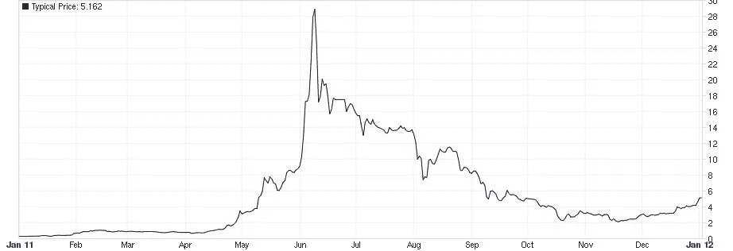
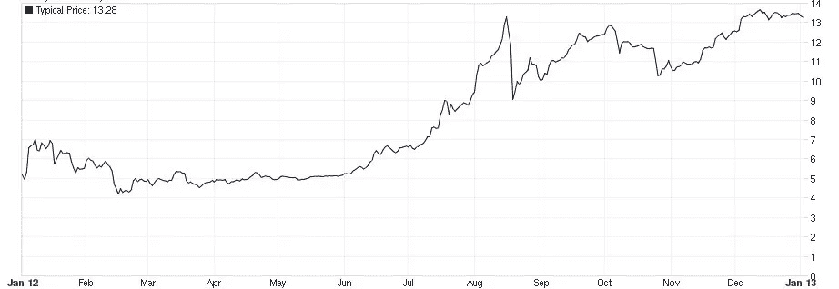
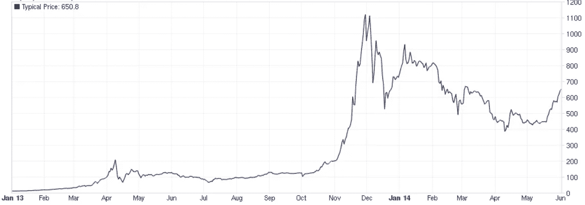
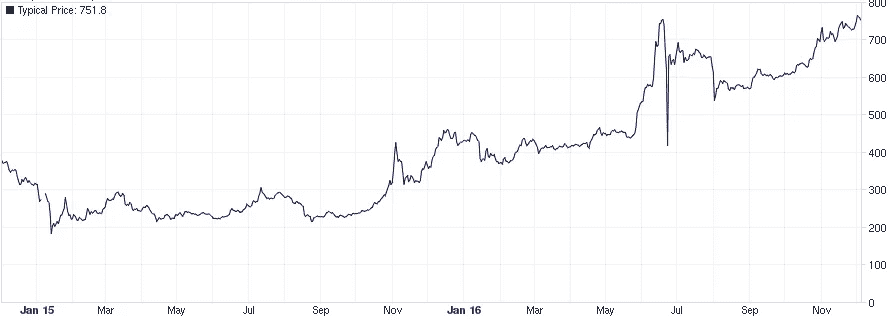
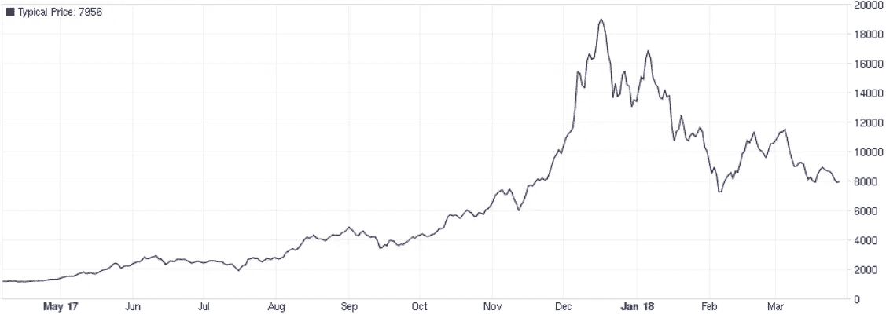

# 比特币历史上的重要事件精选

> 原文：<https://medium.com/coinmonks/a-selection-of-key-events-in-bitcoins-history-65a982c76ebf?source=collection_archive---------1----------------------->

下面列出了在比特币最初发展和表现中发挥作用的一些关键事件。由于大量重要事件的发生，该列表不完整，没有涵盖所有相关或有影响的事件。请理解为我个人对比特币世界发生的事情的看法，直到我的书[比特币简介](https://www.amazon.com/brief-introduction-Bitcoin-Educational-valuable/dp/1706937768?tag=fundation-21)出版。为了清楚起见，按时间顺序的发展被分成几个小节。

# 2008–2010

中本聪于 2008 年 10 月 31 日发布比特币白皮书。

在 2009 年 1 月 3 日，创世纪区块被创建。

五天后，2009 年 1 月 8 日，比特币代码发布。

2009 年 1 月 12 日，两个人之间的第一次比特币交易发生了，当时中本聪向密码学家哈尔·芬尼发送了 50 个比特币。这是已知的唯一一笔由比特币创造者发出的交易。

2010 年 5 月，程序员拉斯洛·汉耶茨(Laszlo Hanyecz)用 10，000 个比特币购买了两个披萨，这是第一笔真实世界的商品交易。比萨饼的价格是在“Bitcointalk”论坛上商定的。

2010 年 10 月，第一次托管交易在[比特币](https://blog.coincodecap.com/tag/bitcoin/)论坛上进行。

2010 年 11 月 6 日，[比特币](https://blog.coincodecap.com/tag/bitcoin/)经济规模超过 100 万美元。

2010 年 12 月 16 日，第一个比特币池 Slush 验证了它的第一个区块。

2011 年 2 月 9 日，比特币价格触及美元平价。这一事件促使多家 IT 期刊(Slashdot、Hacker News)对比特币进行报道。

2011 年 3 月和 4 月，交易所对新货币(英镑、巴西雷亚尔、波兰兹罗提)开放，时代杂志发表了一篇关于比特币的文章。

由于这些和其他事件，交易所 MtGox(当时领先的比特币交易所)的[比特币](https://blog.coincodecap.com/tag/bitcoin/)价值在 2011 年 6 月 8 日创下 31.91 美元的历史新高，市值约为 2.06 亿美元。

# 2011–2012

Price Development of Bitcoin in 2011 [**[1]**](#_ftn1)

从 6 月份开始到 2011 年末，[比特币](https://blog.coincodecap.com/tag/bitcoin/)的价值在 2011 年 11 月 17 日达到 1.99 美元的低点后出现了首次大幅下跌。对这种消极发展的一种可能的解释是一系列盗窃。

2011 年 6 月 19 日，MtGox 的数据库中有 60，000 个用户帐户被盗。一名身份不明的黑客能够以管理员身份登录 MtGox，并在系统中设置数十万个比特币的销售订单。因此，MtGox 冻结交易七天，并撤销销售订单。

2011 年 6 月 20 日，EFF(电子前沿基金会)宣布他们不再接受比特币[支付](https://blog.coincodecap.com/tag/payment/)捐款。

这些事件发生后，媒体对[比特币](https://blog.coincodecap.com/tag/bitcoin/)的看法大多是负面的。在线杂志“Wired”发表了一篇题为“比特币的兴衰”的文章，其中包含了数字货币已经无法使用的声明。

与预期相反，货币在接下来的几周稳定下来。在跌至略低于 2 美元的低点后，价格迅速回升至 7.22 美元的高点，当时这种货币在一部拥有 1000 多万观众的美国法律剧中出现。价格调整使价格再次下降到 5 美元左右，并在三个多月内保持相对稳定。

直到 2012 年 5 月，价格才开始再次上涨。

Price Development of Bitcoin in 2012 [**[2]**](#_ftn2)

到 2012 年 8 月底，由于新媒体的关注和欺诈性比特币庞氏骗局带来的人为繁荣，价格已升至 15.4 美元。当庞氏骗局被揭露并崩溃时，价格会在十到十四美元之间波动几个月。

2013 年，价格几乎呈指数级上涨，从 2 月初的不到 20 美元涨到 4 月份的 220 美元以上。对这一增长的普遍解释是塞浦路斯的金融危机。经济学家的另一种解释是，在金融犯罪执法网络(FinCEN)于 2013 年 3 月就分散货币的法律地位和法律义务做出明确声明后，新的投资者进入了比特币市场。此外，越来越多的公司开始接受比特币作为一种[支付方式](https://blog.coincodecap.com/tag/payment/)，这也引起了媒体和公众的兴趣。2012 年 10 月，比特币被列为凯捷第八份年度《世界支付报告》中的一种货币。

# 2013–2014

Price Development of Bitcoin in 2013–2014 [**[3]**](#_ftn3)

2013 年 4 月，[支付处理器](https://blog.coincodecap.com/best-bitcoin-payment-processors/)“bit instant”和最大的交易平台 MtGox 的销售订单出现长达半个小时的严重延迟，原因是高需求使它们的容量不堪重负。如上图所示，比特币价格在 2013 年 4 月 10 日从 266 美元跌至 76 美元，并在 6 小时内回到 160 美元。

在 2013 年 4 月崩溃后，比特币经历了长期的高波动性和低流动性。丝绸之路是使用比特币作为支付方式的最大黑市之一，由于 DDoS 攻击，它被迫在短时间内关闭服务。这促使交易商离开比特币市场。

公开宣布敏感数据存储在区块链，包括维基解密泄露的 2.5 MB 美国外交电报以及儿童色情链接。这些数据一旦提交到区块链，就无法删除，这意味着区块链的每个所有者都可以访问这些数据。这损害了区块链的形象。

当时最大的两家比特币公司 CoinLab 和 MtGox 就其合同安排提起诉讼。在交易所未能注册为汇款机构后，美国国土安全部封锁了 MtGox Mutuum Sigillum LLC 子公司的一个账户。

# 2015–2016

Price Development of Bitcoin in 2015–2016 [**[4]**](#_ftn4)

在此期间，多家交易所遭遇重大黑客攻击，并受到更严格的监管审查。交易所 Bitstamp 遭受重大黑客攻击，损失了 1.9 万比特币，当时约合 500 万美元，Bitfinex 损失了 6000 多万美元。美国国税局要求所有交易所提供用户信息。

尽管如此，大玩家对比特币产生了浓厚的兴趣。钱包和交易提供商比特币基地从投资者那里筹集资金，包括纽约证券交易所(NYSE)、财富 500 强金融服务集团 USAA、西班牙大型银行 BBVA 和日本电信巨头 DoCoMo。后来，全球股票市场纳斯达克、英国银行和 IBM 等多家大型机构开始尝试区块链技术。多个区块链项目，如以太坊和 ZCash 起飞。

在加密领域的权贵与法律之间的一系列冲突中，网上黑市“丝绸之路”的创始人罗斯·乌布里希特被判终身监禁。MtGox 创始人 Mark Karpeles 被指控为个人利益篡改用户余额，导致 MtGox 的崩溃。

当比特币开发者 Mike Hearn 分叉比特币 XT 以允许增加块大小限制时，人们试图解决缩放问题，这一尝试引起了争议。

# 2017–2018

Price Development of Bitcoin in 2017–2018 [**[5]**](#_ftn5)

越来越多的硬币和代币开始出现在[加密](https://blog.coincodecap.com/tag/crypto/)空间。“ICOs”(首次发行硬币)开始流行，随之而来的是一个新的交易所——币安交易所。

2017 年，中国已经成为[加密](https://blog.coincodecap.com/tag/crypto/)世界的最大力量，10 笔交易中有 8 笔是用人民币进行的，中国宣布将禁止[加密货币](https://blog.coincodecap.com/tag/cryptocurrency)交易所。除了短暂的恐慌之外，这没有任何明显的、持久的影响。

来自比特币区块链的比特币现金和比特币金叉。比特币现金声称通过增加块大小来解决缩放问题，并在比特币社区中引起了很大的意识形态分歧。

2018 年 1 月，在经历了整整一年的稳健增长后，比特币价格从近 20，000 美元的高位跌至 3 月份的 8，000 美元以下，并在 2019 年底之前保持在 10，000 美元以下或附近。

2019 年 3 月 22 日，媒体用户 [PlanB](https://medium.com/u/bcb63a182704?source=post_page-----65a982c76ebf--------------------------------) 发布[一篇广受好评的文章](/@100trillionUSD/modeling-bitcoins-value-with-scarcity-91fa0fc03e25)，试图使用股票到流量宏观经济模型描述比特币价格的历史演变。

[【1】](#_ftnref1)[【2】](#_ftnref2)[【3】](#_ftnref3)[【4】](#_ftnref4)[【5】](#_ftnref5)(Bitcoincharts，2019)

本文摘自我的书[比特币简介](https://www.amazon.com/brief-introduction-Bitcoin-Educational-valuable/dp/1706937768?tag=fundation-21)。

> [直接在您的收件箱中获得最佳软件交易](https://coincodecap.com/?utm_source=coinmonks)

