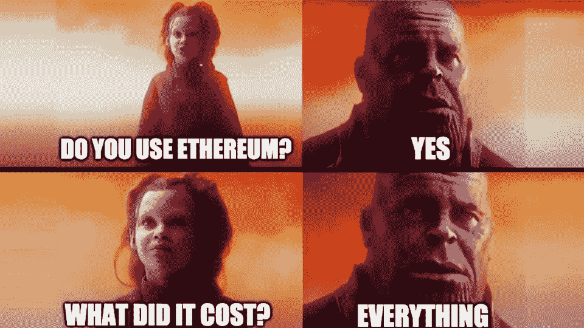
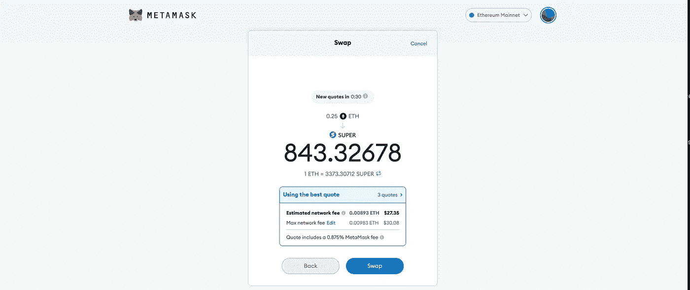
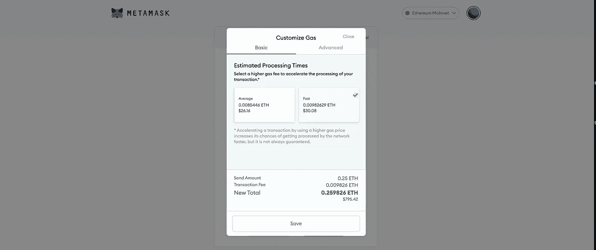
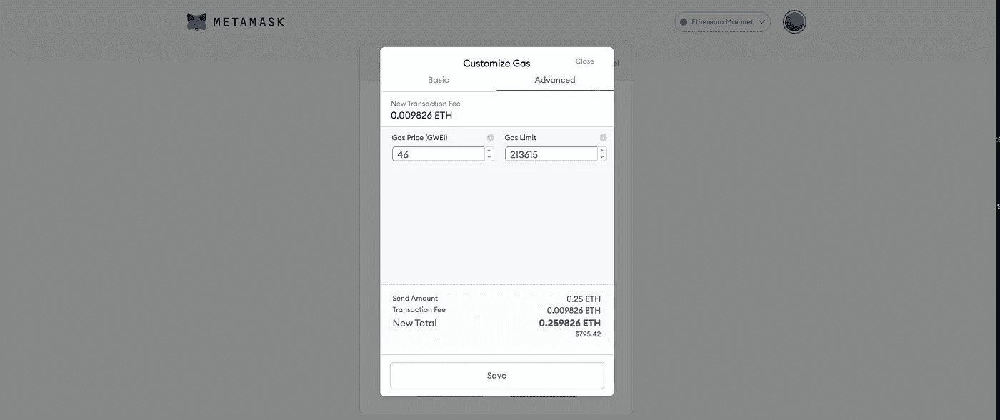
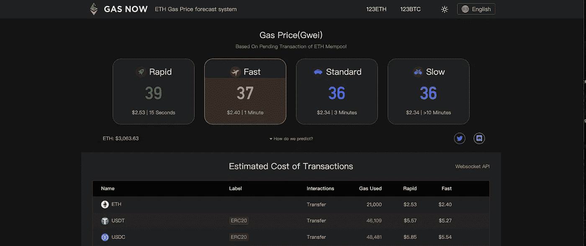

# 以太坊燃气费简明指南

> 原文：<https://medium.com/coinmonks/a-short-guide-to-ethereum-gas-fees-5c4c53a05feb?source=collection_archive---------0----------------------->

在本文中，我将详细介绍以太坊燃气费。对于那些刚接触加密的人，我还提供了一个如何在 MetaMask 中调整煤气费的实际例子。

## 什么是气体？

(以太坊)燃气是在以太坊区块链上执行交易所支付的费用。想在不同地址之间移动 ETH 吗？那笔交易需要汽油。想制造一些 NFT 吗？那也需要汽油。把 ETH 换成不同的代币怎么样？你猜对了，更气！

任何涉及 ERC-20 代币(基于以太坊的代币)的事情都需要花费少量的以太币来加油。换句话说，即使你不想持有任何 ETH，例如，因为你只想交易小面值的 altcoins，你仍然需要在你的钱包里随时有 ETH，以支付未来的汽油费。忘记它会让你损失很多钱！我记得当我出售我的 UMX 代币时(价格已经上涨了)，我去掏钱包，却发现我没有任何 ETH 来“刺激”交易。当我拿到一些 ETH 的时候，UMX 的价格已经明显下跌了。这不是一个很大的数目，但足以花费我几百美元。

## 为什么要收油费？

在以太网上处理交易需要计算能力，而天然气是支付给提供计算能力的矿工的费用。

汽油费也有助于保持以太坊网络的安全。将成本附加到每个交易中可以防止垃圾邮件或意外的无限循环。

## 燃气是怎么计算的？

下面是老的燃气费计算方法。自从 2021 年 8 月初伦敦硬分叉和实施 EIP-1559 以来，有了一种新的方法，我将在后面描述，但显然目前以太坊网络上的所有交易中只有 1%使用它。

天然气的价格以吉为单位。卫是一个乙醚的最小分数，即 1 个乙醚等于 1，000，000，000，000，000 个卫，因此 1 gwei 是 1，000，000，000(10 亿)个卫或 0.000000001 个乙醚。这听起来不算太糟，对吧？那么，为什么人们会抱怨燃气费的成本呢？

有两个因素会影响任何特定交易的成本:

*   交易时的天然气价格
*   和特定交易所需的汽油。

以太气的价格不断变化，你可以在很多网站上查看当前价格。CoinGecko 是其中之一，但价格并不总是准确的，所以我更喜欢使用 [ETH Gas Station](https://ethgasstation.info/) 或 [Gas Now](https://www.gasnow.org/) (我的最爱)，你也可以将它们安装为浏览器扩展。

在不同的时间点，我见过低至 6 gwei、高至 2,000 gwei 的油价。为什么他们能改变这么多？这仅仅取决于以太坊网络在特定时刻的繁忙程度。网络越繁忙，价格越高。

当检查汽油价格时，你经常会看到基于交易速度的 3 或 4 种不同的价格:快速、快速、标准和慢速(或其他类似的名称)。不出所料，交易越快，你支付的费用就越多，价格差异可能相当大。一般来说，当买卖代币时，你希望使用最快的选择，尤其是当它们的价格快速波动时。另一方面，如果你只是在钱包之间移动代币，或者在市场平静时购买代币，你可以选择标准速度或慢速速度，因为如果交易需要更长时间完成，这并不重要。

第二个因素是任何给定交易所需的天然气量。以太坊网络上最简单的交易(例如在两个地址之间移动以太网)所需的最小数量是 21，000 个单位。涉及智能合约的更复杂的交易，如购买其他代币或下注代币，需要更多的汽油。

还值得一提的是，一些交易需要多个步骤，每个步骤都需要一定量的汽油。比如:用 Tether (USDT)换 Chainlink(链接)，实际上需要两个交易:USDT > ETH 和 ETH > LINK。如果你想在(比如说)Uniswap 上处理这样的交易，你只会看到第一个“步骤”(本例中是 USDT 到瑞士联邦理工学院)的估计燃气费，所以不要对第二个“步骤”的额外成本感到惊讶。

## 气体极限

汽油限额是您在任何交易中愿意使用的最大汽油量。如果实际使用的汽油量低于您指定的限制，剩余的汽油将退还给您。但是如果你的限额太低，你要么不能处理交易，要么交易会失败，你会失去这笔钱。当您试图在网络繁忙且价格快速变化时购买代币时，这尤其危险(例如，当影响者发布了关于您试图购买的代币的视频后，价格立即上涨)。

## 例子

上面的解释可能有点混乱，所以让我们通过一个在两个地址之间移动 ETH 的简单事务的例子来看看这是如何工作的。

我们知道这笔交易需要 21，000 个单位。
撰写本文时标准速度的油费为 40 gwei。
燃气单位(限额)*单位燃气价格(gwei) =燃气费
21，000 * 40 = 840，000 gwei
840，000 gwei 为 0.00084 ETH，按现价计算为 2.67 美元(1 ETH = 3179 美元)。

还不错吧。那么，为什么人们会对油价感到恐慌呢？好吧，让我们看一下同样简单的交易，但这次让我们想象一下，当网络完全拥塞时，我们正在尝试这样做。2021 年 5 月 19 日发生了大规模闪电崩盘，我记得天然气价格徘徊在 1500-2000 gwei 左右。所以…

21000 * 2000 = 4200 万 gwei

这是 0.042 ETH，此时是 133.5 美元…所有这些只是为了移动您的 ETH，我们在这里没有做任何花哨的事情。

现在想象一个更复杂的交易，比如说需要 100，000 单位的天然气…突然我们看到了大约 500 美元。这是一大笔烧钱的费用。

伦敦硬叉和 EIP-1559 解决了高汽油费问题吗？嗯，不尽然。我不会在这篇文章中深入 EIP-1559 更新的细节(我建议观看[这个视频](https://www.youtube.com/watch?v=MGemhK9t44Q)或者访问[以太坊网站](https://ethereum.org/en/developers/docs/gas/))但是这里有一些事情需要注意。

在旧的系统中，汽油费本质上是使用一种盲目的拍卖模式——如果你想确保你的交易在网络繁忙时快速通过，你必须支付比安静时间多得多的费用，因为你根本不知道其他人支付了多少汽油费。

新模式更加复杂，但它旨在更加透明和公平。

新模式的第一个要素是基本费用，它可以根据网络在特定时间点的繁忙程度而上下浮动。这种基本费用总是被烧掉，这可以使 ETH 成为久而久之的通货紧缩资产。虽然 ETH 有无限的供应，但当网络繁忙时，燃烧的令牌比开采的令牌多，因此 ETH 在流通中的数量会减少。你可以看看这个网站或者这个网站[看看有多少 ETH 被烧掉了。](https://watchtheburn.com/)

费用的第二部分是给矿工的小费。如果发送方希望更快地处理交易，可以调整它，所以在某种程度上，它的工作方式类似于旧系统中发送方选择交易速度。

EIP-1559 还允许在网络拥塞时将块大小加倍，以使费用更可预测。

> 最重要的一点是:新的天然气收费系统不是为了降低天然气费用，而是为了使它们更加透明和可预测。

天然气价格的波动性将会降低，突如其来的价格上涨也会比以前少，但不一定会更低。为了降低天然气费用，我们必须等待以太坊 2.0 或第 2 层扩展解决方案(例如[多边形](https://polygon.technology/))。

## 使用 MetaMask 钱包的实际示例

在这个例子中，我用一些以太网交换 SuperFarm 令牌 SUPER。虽然我用的是 MetaMask 钱包，但同样的原理也适用于其他钱包。

现在我可以看到报价了，上面显示了预计网费(27.35 美元)和最大网费(30.08 美元)。然后，我单击编辑(在最大网络费用旁边的蓝色文本中)。

这将我带到一个新窗口，其中有平均和快速交易选项。我可以选择其中一个选项，或者转到顶部的“高级”选项卡。

在高级选项卡中，我可以看到 GWEI 的汽油价格和汽油限额。后者是根据交易类型自动填充的。要查看准确的当前油价，我可以去一个网站，如 [Gas Now](https://www.gasnow.org/) 并相应地调整我的油价。然后，我单击保存并处理事务。

我希望这篇文章对你有用。如果你对密码教程和更多密码市场评论感兴趣，请查看[我的 YouTube 频道](https://www.youtube.com/channel/UCyg8fnd8xctdTL3eyPHFraA)和[在 Twitter 上关注我](https://twitter.com/iamcryptobadger)。

*免责声明*

*本文涵盖的内容不被视为投资建议。*

*我不是财务顾问。这些只是我自己的推测性观点、想法和理论。*

*不要纯粹根据本文提供的信息进行交易或投资。*

在投资或交易之前，一定要做好自己的研究和尽职调查。我永远不会告诉你如何处理你的资本、交易或投资。我也永远不会建议你购买、出售、做多或做空任何资产、商品、证券、衍生品或加密货币相关工具，因为风险极高！

*在交易或投资任何加密货币相关产品之前，您应始终咨询专业/持牌金融顾问。*

> 加入 Coinmonks [电报频道](https://t.me/coincodecap)和 [Youtube 频道](https://www.youtube.com/c/coinmonks/videos)获取每日[加密新闻](http://coincodecap.com/)

## 另外，阅读

*   [密码电报信号](http://Top 4 Telegram Channels for Crypto Traders) | [密码交易机器人](/coinmonks/crypto-trading-bot-c2ffce8acb2a)
*   [复制交易](/coinmonks/top-10-crypto-copy-trading-platforms-for-beginners-d0c37c7d698c) | [加密税务软件](/coinmonks/crypto-tax-software-ed4b4810e338)
*   [电网交易](https://coincodecap.com/grid-trading) | [加密硬件钱包](/coinmonks/the-best-cryptocurrency-hardware-wallets-of-2020-e28b1c124069)
*   [最佳加密交易所](/coinmonks/crypto-exchange-dd2f9d6f3769) | [印度最佳加密交易所](/coinmonks/bitcoin-exchange-in-india-7f1fe79715c9)
*   [面向开发人员的最佳加密 API](/coinmonks/best-crypto-apis-for-developers-5efe3a597a9f)
*   最佳[密码借贷平台](/coinmonks/top-5-crypto-lending-platforms-in-2020-that-you-need-to-know-a1b675cec3fa)
*   杠杆代币的终极指南
*   [加密交易的最佳 VPN](https://coincodecap.com/best-vpns-for-crypto-trading)
*   [最佳加密分析或链上数据](https://coincodecap.com/blockchain-analytics) | [Bexplus 评论](https://coincodecap.com/bexplus-review)
*   [NFT 十大市场造币集锦](https://coincodecap.com/nft-marketplaces)
*   [AscendEx Staking](https://coincodecap.com/ascendex-staking)|[Bot Ocean Review](https://coincodecap.com/bot-ocean-review)|[最佳比特币钱包](https://coincodecap.com/bitcoin-wallets-india)
*   [Bitget 回顾](https://coincodecap.com/bitget-review)|[Gemini vs block fi](https://coincodecap.com/gemini-vs-blockfi)|[OKEx 期货交易](https://coincodecap.com/okex-futures-trading)