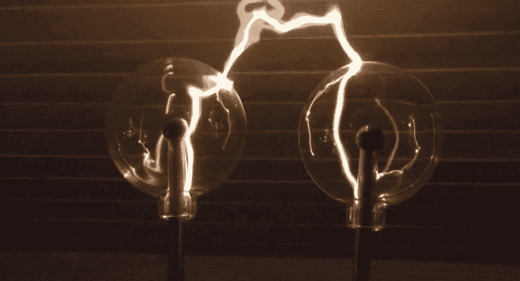

# 等离子体框架的简史，它是什么，它将走向何方…

> 原文：<https://medium.com/coinmonks/a-short-history-of-plasma-framework-what-it-is-where-its-going-16920d0376a?source=collection_archive---------0----------------------->

公开发表的科学论文显示，前苏联的科学家对“UFO 现象”特别感兴趣。他们已经确定了与等离子体技术的密切联系，并正在将相关技术用于潜在的军事目的。

—英国的不明航空现象

… scaling Ethereum out of this World?

2017 年 8 月 11 日，Vitalik Buterin 和 Joseph Poon 发布了一份描述*等离子*的白皮书，这是一个“智能合同的激励和强制执行”的拟议框架，可扩展到每秒潜在的数百万次交易，并将服务于大量的分散式金融应用。

在其核心，等离子体寻求解决所谓的[可扩展性三难困境](https://github.com/ethereum/wiki/wiki/Sharding-FAQs#this-sounds-like-theres-some-kind-of-scalability-trilemma-at-play-what-is-this-trilemma-and-can-we-break-through-it)的紧张局势，并通过智能合同和加密验证的结合，在不牺牲安全性的情况下提供可扩展的区块链应用。

作为一个提议的“第 2 层”扩展解决方案(*，即*，不是对基本区块链层的升级)，它针对的是那些不需要或者甚至不希望将每笔交易记录到区块链的应用，比如每天购买咖啡。

以太坊研究社区的普遍直觉是，这些更普通的区块链交易可能更好地记录到特定于应用程序的“侧链”，其中资产被锁定在主链上，在平行的区块链上复制，然后在更有效的共识机制(如 dpo)下交易；然后，回退到具有效率较低的共识规则(但安全性更高)的根链，仅用于高价值交易或在某些检查点之后建立终结性。

[http://plasma.io/plasma.pdf](http://plasma.io/plasma.pdf)

Plasma 框架的目标是获得侧链如此巨大的可伸缩性优势，同时在侧链共识失败或被压制(有窃取用户资金的风险)的情况下，优化锁定在根链中的资产的“回退”安全性。

[https://plasma.io/plasma.pdf](https://plasma.io/plasma.pdf)

使用交互式退出机制来检测恶意行为，等离子体链并不完全是侧链，在失败的情况下会失去它们的状态。当等离子体链断裂时，状态被激发但保持完整；作为基本保证，根链利用数学上可验证的方法来处理争议，并以其资金奖励正确的一方。因此，强大的安全保证是等离子设计的一个关键和显著的特征:数字资产不能被重复花费、扣留，并且在根链上总是可赎回的。

Image from [https://www.learnplasma.org/](https://www.learnplasma.org/)

通过这种方式，在等离子体框架下开发的解决方案寻求为更多主流用例提供区块链安全性和终结性。例如，跨境支付网络或游戏平台可能在以太坊根链上以 *ERC721s* (不可替换的令牌)的形式发行数字资产，以利用其网络安全性，但随后在运行于*下的等离子“子链”上获得这些资产更大的日常交易吞吐量，例如*、【股权证明】或【权威证明】[共识](https://ethresear.ch/t/what-consensus-algorithms-are-possible-to-use-in-plasma-chains/1026)。

以太坊的研究人员详细阐述了这个框架，以构建更多可扩展的区块链应用程序，他们已经将等离子体分为各种规格，以满足不同的应用程序和项目需求。如前所述，该框架的本质是*等离子链必须和根链一样安全。*除此之外，等离子体设计通常涉及*退出*(用户提交交易历史，证明有担保资产的所有权)和随后的*质疑期，*在此期间，其他人受到激励，要求退出担保品作为奖励，可以通过提交相反的证明来质疑此类退出。

Check out Karl Floersch’s Plasma MVP overview: [https://www.youtube.com/watch?v=jTc_2tyT_lY](https://www.youtube.com/watch?v=jTc_2tyT_lY)

2018 年 1 月 3 日，维塔利克·布特林、约瑟夫·潘和大卫·克诺特[发布了“最小可行等离子体实施”(通常称为“等离子体 MVP”)的规范](https://ethresear.ch/t/minimal-viable-plasma/426)。本质上，Plasma MVP 规范旨在“以非常简单的方式”提供 Plasma 的基本安全属性，例如实现可扩展的支付，“尽管它严重依赖于用户在发现任何类型的不法行为后愿意立即退出。”虽然等离子 MVP 是为令牌传输而设计的，但它可以适用于 ERC721s 和一般状态转换，并有可能扩展到超过 1，000 tps(以太坊研究员 Karl Floersch 指出，MVP 设计的“后续版本”可能扩展到“数百万”tps)。

2018 年 3 月 9 日，Vitalik Buterin 在[以太坊社区大会](https://www.youtube.com/watch?v=uyuA11PDDHE)上推出了“血浆现金”，该规范旨在通过对存放在血浆链上的资金的唯一标识符来提高血浆的安全性和可用性，本质上是将每笔存款变成一种不可替代的“硬币”，具有独立的序列号和交易历史。换句话说，每一笔存款都被视为不可分割的钞票，就像我们熟悉的 10 美元、20 美元等面额。对于实物现金，用户只存储他们拥有的硬币的数据。

除了其他好处之外，这种结构允许更简单的资金提取，更少的每个用户数据检查，更紧凑的硬币历史证明，只需要用户验证他们拥有并积极观看的硬币(而不是所有人的整个交易链，*对比*等离子 MVP)。2018 年 3 月 14 日，以太坊研究员 Karl Floersch 发布了一个等离子现金链的[全规格](https://karl.tech/plasma-cash-simple-spec/)。等离子研究人员圣乔治·孔斯坦托普洛斯也发布了一份[综合文档](https://github.com/loomnetwork/plasma-paper/blob/master/plasma_cash.pdf)，涵盖等离子现金主题和初步实施研究(包括通过 [LOOM Network](https://github.com/loomnetwork/plasma-cash) 开发的游戏用例)。

2018 年 6 月，Kelvin Fichter 和 Ben Jones 在 ethresear.ch 上推出了“更可行的等离子体”(通常为“MoreVP”)，这一设计旨在通过删除确认签名和降低取款成本，对 MVP 设计进行安全性和 UX 改进。

MoreVP ‘exit game’ illustration, from [https://ethresear.ch/t/more-viable-plasma/2160](https://ethresear.ch/t/more-viable-plasma/2160)

2018 年 11 月 1 日，区块链安全公司 quant stamp[宣布](/quantstamp/quantstamp-partners-with-omisego-to-make-ethereum-ecosystem-safer-by-securing-plasma-mvp-859123f97851)完成了一项由区块链项目 OmiseGO 设计的等离子 MVP 实现的[安全审计](https://github.com/omisego/plasma-contracts/blob/v0.0.1/docs/quantstamp-audit-3cc6097.md)；在此响应中，还计划对 MoreVP 实施进行类似的审计。

当前的等离子体设计并非没有缺点:例如，(I)在最坏的情况下，等离子体 MVP 需要每个等离子体链用户在短时间内退出(限制了生产量，因为可以安全取出的 utxo 的数量也是可以在等离子体链上安全支持的 utxo 的数量)；此外，(ii)当用户从血浆链中提取资金时，他们需要等待一段时间才能在以太坊根链上获得这些资金。

然而，许多建议是针对这些问题设计的，包括允许数千个 UTXOs 同时退出的“大量退出”协议，以及作为用户“出售”其提款以避免等待的方式的“快速提款”协议。

等离子体上的 EVM 支持是研究和讨论的活跃领域。目前，很难创建一个可以运行更多像以太坊这样的一般智能合同的等离子链，原因如下(正如等离子研究人员 Kelvin Fichter 在 2018 年 8 月[发表的一篇帖子](/@kelvinfichter/why-is-evm-on-plasma-hard-bf2d99c48df7)中所概述的):

(1)并不总是清楚谁能够将合同从等离子链移动到根链；
②如果任何人都可以修改契约的状态，那么任何人都可以阻止退出；并且
(3)验证 EVM 内部的 EVM 状态变化是困难的。

然而，一个被称为“等离子虚拟机”的潜在(*但仍然非常初步的*)解决方案涉及到打破智能合同，使这些问题不再那么重要。

具体而言，Plasma VM 建议使用“迷你智能合同”重新构建授权，将合同从 Plasma 链移动到根链；换句话说，不用担心“谁可以将合同从等离子链移动到根链”，等离子 VM 规定，如果不是移动整个合同，而是每个人都移动自己的“迷你智能合同”，只能由各自的所有者修改，那么谁负责将东西移动到根链可能会更清楚。

在[ethreseear . ch](https://ethresear.ch/c/plasma)上有超过 100 个与等离子相关的话题正在被积极讨论，而[LearnPlasma.org](https://www.learnplasma.org/en/)提供了当前研究和实施的全面总结。

**Plasma World Map:** [https://ethresear.ch/t/plasma-world-map-the-hitchhiker-s-guide-to-the-plasma/4333](https://ethresear.ch/t/plasma-world-map-the-hitchhiker-s-guide-to-the-plasma/4333)

*这是对* [*CFTC 最近与*](https://www.cftc.gov/sites/default/files/2018-12/federalregister121118.pdf)[*legal block*](https://github.com/LegalBlockproject/LegalBlock-CFTC-Response)*和*[*The Brooklyn Project*](https://collaborate.thebkp.com/project/GEN/document/20/version/21)*就以太坊网络的各个方面征询公众意见的工作回应。具体来说，该摘录针对 CFTC 关于以太坊扩展挑战和解决方案的问题#8，并介绍了* [*等离子*](http://plasma.io/) *，这是一个提议的框架，用于将以太坊容量扩展到每秒可能数百万次交易，而不会牺牲利用区块链网络的核心安全优势。*

UFO using gravity sidechain or something

我希望得到更多真正的等离子爱好者对这份草案的关注，并欢迎反馈、评论、更正、模因等！

**Read today’s Top story**

> [在您的收件箱中直接获得最佳软件交易](https://coincodecap.com/?utm_source=coinmonks)

