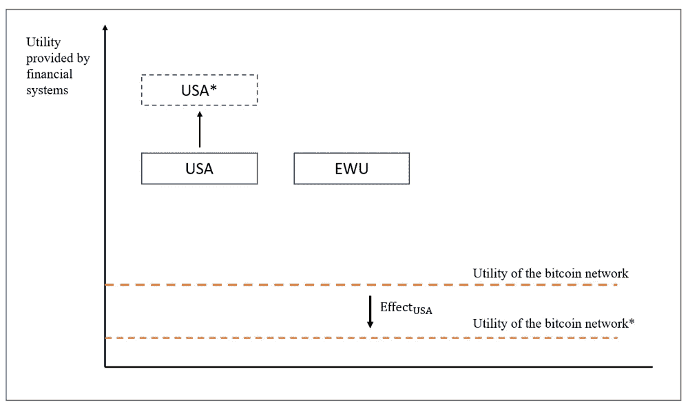
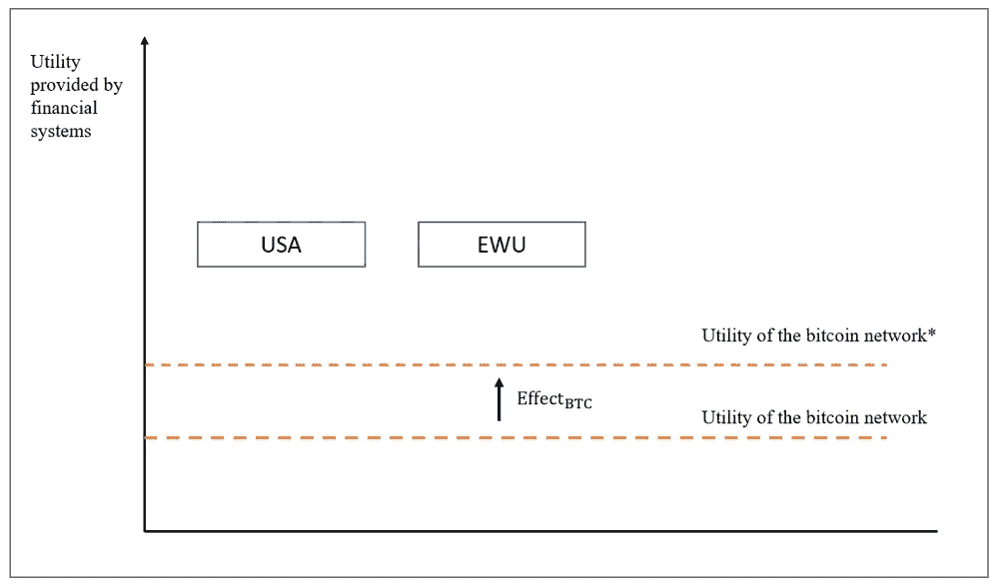
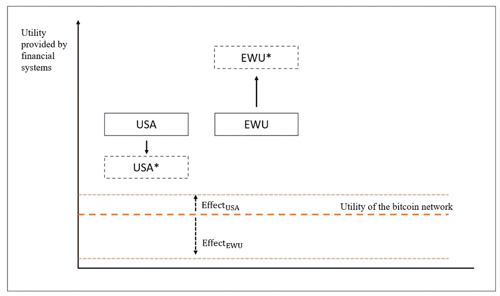
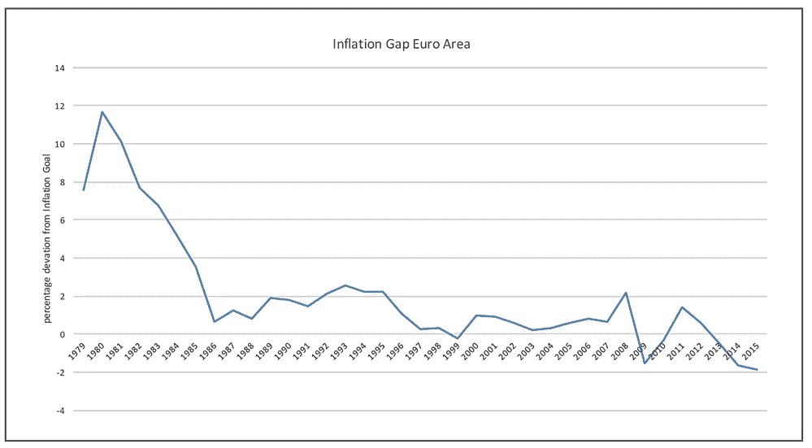

# 一个简单的比特币估值模型

> 原文：<https://medium.com/coinmonks/a-simple-bitcoin-valuation-model-bd61b4ad1e1b?source=collection_archive---------3----------------------->

菲利普·哈夫纳&托尔斯滕·克鲁格

***摘要***

加密货币，尤其是比特币，已经引起了公众和科学界更高的兴趣。然而，关于比特币价格和内在价值的普遍讨论仍在继续，并成为学术讨论的主题。在本文中，我们介绍了一个简单的模型来评估比特币网络。 *我们主张价格跟随价值，价值伴随效用而来。但是仅仅有实用性是不够的——我们正在寻找比特币相对于市场上提供的替代品的相对实用性。在我们的理解中，比特币网络的价值来自于它为用户提供的相对效用，而不是所有国家的金融系统提供的受人尊敬的效用，这是以其在世界经济中各自的经济相关性为权重的。*

**1。简介**

一项新技术允许在全球范围内进行快速、无需许可、近乎即时的价值转移，同时提供自动、透明的货币政策，并限制供给，这种新技术的价值何在？这个问题在 2017 年引起了激烈的辩论，而比特币及其继任者的价格攀升至天文数字的高位。衡量比特币等数字资产/货币的价值非常困难，因为它们不同于现有的金融工具和产品。

[https://pixabay.com/de/bitcoin-criptocoin-geld-2640692/](https://pixabay.com/de/bitcoin-criptocoin-geld-2640692/)

当前的网上购物体验是由一个成熟的、功能完善的金融支付行业支持的，该行业为其客户提供安全性和速度。在大多数情况下，比特币无法与这些系统竞争。另一方面，欧元、美元和日元似乎保证了它们的经济几十年来的稳定。那么比特币是如何提供价值的呢？

我们认为这是一个视角问题。比特币是无国界的，可以在全球范围内使用。对于来自金融基础设施发达的西方国家的人来说，年轻的比特币网络可能会显得逊色。相反，来自欠发达国家的人确实看到了比特币网络的价值，他们基本上可以接触到发达的金融基础设施和可靠的政策制定者。超过 20 亿人根本无法使用银行服务。同样数量的人进入不稳定的金融行业的机会有限，过去几十年来，这个行业没有证明其可信度。因此，应该在国际范围内构建一个完整的比特币估值模型，并区分不同的国情和发展水平。

除了比特币的国际性，它还让我们看到了其独特的资产特征。与其他金融资产不同，比特币本身不支付股息或产生收入。这使得不可能用标准工具如价格-利润比率对它们进行评级。因此，需要一种新的模式，专注于比特币网络为其用户提供的实际效用。

在我们的理解中，比特币——作为一个完整的金融系统——为现有的受监管金融系统提供了一个国际选择。因此，我们认为，与全球金融系统提供的受人尊敬的效用相比，比特币网络的价值来自于它为用户提供的相对效用。然后，每个国家由此得出的比率按该国国内生产总值占世界国内生产总值的份额进行加权。在下文中，将解释我们的方法的每一步。

# 2.1.比特币网络的简单估值模型

在本节中，我们提出一个简单的纯定性模型来确定比特币网络价值的移动。首先，我们需要弄清楚，产品的价格并不反映它的价值。这个假设可以追溯到卡尔·门格尔提供的商品理论。由于商品理论，价格本身并不反映一件商品的价值。价格和价值是由经济主体的当前阶段决定的。

为了得出比特币的价值，有必要将比特币网络提供的效用与该网络可用的每个国家的金融系统提供的效用进行比较。在这种情况下，我们需要考虑到世界上的每一个国家。考虑到每个国家不同的经济表现，我们需要权衡相对效用。潜在权重可能是全球 GDP 的份额。单个国家由 I 索引，它包含 *i，n ∈ (1，…，N)* 。比特币的价值计算如下:

其中 ***π*** *i* 是国家 *i* 在世界 GDP 上所占的份额。

*BTC 的效用 I*反映了比特币网络相对于国家 I 的金融系统提供的效用的相对效用。如上所述，应该清楚的是，相对效用在不同的国家有所不同。金融系统本身所提供的效用是由许多不同的因素决定的。重要的是，一个国家的货币履行三个基本的货币职能，以提供高效用。不同的研究表明，实现这一目标的程度显然是由一些因素决定的。例子是中央银行的独立程度(阿莱西纳和夏季，1993 年)以及机构设置和政治体系的稳定性(格里利，等 1991 年)。这又回到了稳定的通货膨胀率对于基本货币职能的相关性。

因此，公式(1)中的效用形成了比特币*效用 BTC* 的总效用与来自国家 *i* 的*效用金融系统 i* 的金融系统提供的效用的比率。

它认为，一方面，国家金融系统的效用或比特币都无法提供完美的价值。另一方面，我们假设，即使一个金融系统具有过高的高通胀率和糟糕的治理环境，至少也能提供边际效用。

和

为了提供一些解释性的例子，我们展示了三种不同的场景，并提供了金融系统和比特币网络效用的决定因素。

**情景一:**金融系统效用的增加:

零利率债券危机过后，金融体系恢复了稳定。这可以从两个方面影响实用程序。第一，央行适度加息，波动性降低。由于这种发展，金融系统可能会重新获得效用。根据我们的模型，*效用金融系统 i* 的增加意味着*效用 I*BTC 的减少，因此*价值 BTC* 的减少。图[1]说明了这种情况。

**Figure 1:** Graphical illustration of scenario one. If the overall utility of the financial system in the US is increasing, then, ceteris paribus the bitcoin network will devaluate.

**情景二:**比特币效用的增加:

在这种情况下，我们假设接受比特币作为支付方式的在线零售商数量大幅增长。这导致比特币系统作为交换媒介的货币功能增加。向上移动支撑*实用 BTC* 。这导致所有国家的*效用 I、BTC* 增加。因此，BTC 的*值也会上升。在我们的理解中，如果比特币的高波动性随着时间的推移而下降，也可以看到相同方向的运动。*

**Figure 2:** Graphical illustration of scenario two. If the Bitcoin network develops further and provides higher utility to its users, then, ceteris paribus the Bitcoin network will revaluate.

**情景三:**两种不同金融体系的特殊运动:

在这种情况下，*值 BTC* 的移动并不完全清楚，取决于两个不同的因素。各国对世界 GDP 的贡献和冲击的规模。让我们假设美国的通货膨胀强劲增长。美国金融系统的效用减少，比特币在美国的效用立即增加。让我们进一步假设，在同一时期，例如，由于一些对金融系统有积极影响的新规定，欧元系统增加了它的效用。这将导致相反方向的运动。因此，*值对 BTC* 的影响并不清楚。我们只能自信地说，最终的效果，不管我们能观察到哪个最终的运动，都将被抑制。

**Figure 3:** Graphical illustration of scenario three. If changes happen in both, the USA and EWU simultaneously, it is not possible to make a clear ceteris paribus statement. Depended on their individual weight in terms of GDP, both will affect the value of bitcoin. The utility increase in EWU reduces the value of bitcoin while the utility decrease will lead to the opposite effect.

# 2.2.结果和注释

首先，我们强调比特币的价值取决于两个因素，即周边的金融体系和自身的发展。现有金融系统提供的效用的变化将直接导致比特币网络的升值或贬值。

我们简单的定性框架表明，用估计的数字填充变量还有很多工作要做。金融体系的衡量方程应该充满一些众所周知的因素，如通货膨胀、风险溢价和其他相关的经济数字。示例性的图 4 显示了欧元区从 1979 年到 2015 年的通胀目标和实际通胀之间的差距。可以看出成就程度和对央行的信任度之间众所周知的相关性。(参见:图 5)。这两个变量都可以用作测量方程的潜在候选变量。

***Figure 4:*** *The figure shows the spread between the inflation goal and the real inflation over time within the EURO area. The inflation is based on consumer price inflation. The goal is defined by 1,9 percent. Own calculation based on World Bank Data*[***[2]***](#_ftn2)*.*

**Figure 5:** Historic trust in the ECB over time. Source: EUROBAROMETER; [https://www.businessinsider.de](https://www.businessinsider.de) /deutsche-bank-ecb-and-negative-interest-rate-impact-on-eurozone-2016–6?r=UK&IR=T

我们对比特币的估算方程应该像是经典金融体系的一面镜子。它将比特币网络提供的效用与金融系统提供的效用进行了比较。我们认为运动完全是外生的，只是为运动提供一个框架。我们把实证工作留给进一步的研究。

其次，我们可以进一步偏离这一模型，即比特币为生活在金融基础设施表现不佳的国家的人们提供了更高的效用。因此，发展中国家和新兴市场比发达国家更有可能采用比特币，因为在发达国家，比特币目前还无法与之竞争。这种模式的另一个结果是，金融系统受到的限制越多，离自由市场解决方案越远，比特币面临的竞争就越激烈。比特币将在那些不关心法律和限制，只关心调试代码的政权中发挥作用，就像一个出口或替代品。在一个完全自由货币竞争的市场中，没有任何法定货币处于垄断地位，比特币只不过是众多解决方案中的一种。相反，在一个受限制的市场中，比特币将获得越来越大的影响力。这尤其给严格的汇率制度带来了压力。事实上，那些奉行盯住美元货币政策的国家也将面临压力。人们出售本国货币换取比特币，将迫使央行出售其储备，以保持价格稳定。当分析到目前为止哪些国家已经禁止数字货币时，毫不奇怪地会发现那些国家存在永久性货币问题或固定汇率制度。然而，不仅是这些政权，发达经济体也将不得不与比特币斗争，以保住它们的特权。没有哪个垄断者喜欢竞争。当选择一个更长远的视角时，显而易见的是，外部冲击，如另一场金融危机[【4】](#_ftn4)，可能导致这一模式的巨大转变。

一个明智的比喻说，有两种方法可以获得城市中最高的建筑。是把自己的房子建得更高还是保证周围的房子倒塌。因此，比特币的价值既取决于自身的改进，也取决于周围的市场。

# 2.3.批评者

提出的方法是一个非常强大的简化，没有任何定量的背景。此外，我们将金融体系效用的变动以及比特币视为外生因素。然而，我们假设这些参数实际上是内生的，可以用计量经济学方法来衡量。预测金融系统(民族国家和比特币网络)效用的可能指标可以存在各种参数，这些参数测量人们对金融监管机构和比特币的期望和信任程度。事实上，比特币和既有货币体系所选择的公用事业成分的结合，将会给讨论提供足够的空间，而且无法明确界定。这在很大程度上取决于你如何评价普遍信任、货币稳定性、技术特征、交易成本或网络效应的重要性。我们也没有考虑全球金融市场。但是看一看世界范围内的外汇交易，就会发现它与一个国家或货币区的 GDP 高度相关。仍然有很多研究要做，以基于更多定量因素的值来填充简单的定性方法。

# 3.结论性的评论

比特币的价值比不上股票和债券。市盈率等标准估值模型毫无意义，因为比特币本身不会产生任何收入。相反，比特币的价值和价格取决于各自周围的金融体系。我们想出了一种可能的方法来衡量和比较现有金融机构和比特币网络之间金融服务的不同效用。

# 参考

Alesina，a .，萨默斯，L. (1993 年)。中央银行的独立性和宏观经济表现，载于《货币、信贷和银行杂志》，第 25 卷(2)，第 151-162 页。

格里利诉他人案(1991 年)。工业国家的政治和货币机构以及公共财政政策，载于《经济政策》，第 6 卷(13)，第 342-392 页。

霍奇森，卡米拉(2017)。世界上 20 亿没有银行账户的人出现在 6 张图表中。商业内幕。检索自[https://www . business insider . de/the-worlds-unbanked-population-in-6-charts-2017-8？r =英国& IR=T.](https://www.businessinsider.de/the-worlds-unbanked-population-in-6-charts-2017-8?r=UK&IR=T.)

威尔，马丁(2016)。德意志银行:欧洲央行正在摧毁欧元区。商业内幕。检索自[https://www . business insider . de/Deutsche-bank-ECB-and-negative-interest-on-欧元区-2016-6？r=UK & IR=T.](https://www.businessinsider.de/deutsche-bank-ecb-and-negative-interest-rate-impact-on-eurozone-2016-6?r=UK&IR=T.)

[【1】](#_ftnref1)参见:[https://www . business insider . de/the-worlds-unbanked-population-in-6-charts-2017-8？r=UK & IR=T](https://www.businessinsider.de/the-worlds-unbanked-population-in-6-charts-2017-8?r=UK&IR=T)

[【2】](#_ftnref2)通货膨胀是基于消费价格的调和指数。

[【3】](#_ftnref3)例如孟加拉国、玻利维亚和巴基斯坦。

就你所认为的外部金融危机而言。