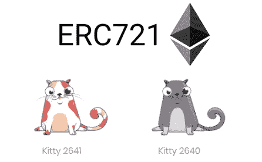
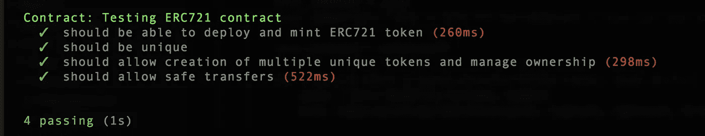

# 一个简单的 ERC 721 的例子

> 原文：<https://medium.com/coinmonks/a-simple-erc-721-example-c3f72b5aa19?source=collection_archive---------0----------------------->

## 这是什么？



ERC-721 代币是今天的热门话题，随着[加密 kitties](https://www.cryptokitties.co/) 的出现以及因其成功而产生的许多其他数字收藏品。 [ERC-721 标准](https://github.com/ethereum/EIPs/blob/master/EIPS/eip-721.md)已经经历了几次迭代，现在或多或少已经就位，所以期待越来越多的玩家进入这个领域。这些[不可替代令牌](https://en.wikipedia.org/wiki/Non-Fungible_Tokens)的基本前提是每个令牌都是唯一的，因此不能像 ERC20 令牌那样以 1:1 的基础进行交换。在许多使用案例中，独特的有形或数字资产可以由这些 ERC-721 令牌来表示，例如房地产、艺术品、宝石等。实际上，数字收藏品用例可能是所有用例中市场价值最低的用例。

> [发现并回顾最佳区块链 api 和节点产品](https://coincodecap.com/category/blockchain-node-and-api)

## **本文目的**

本文将尝试使用[ERC-721 标准](https://github.com/OpenZeppelin/openzeppelin-solidity/tree/master/contracts/token/ERC721)[的](https://github.com/ethereum/EIPs/blob/master/EIPS/eip-721.md)实现来创建一个最简单有用的 ERC-721。我建议查看上面链接的标准，以便熟悉这些需求，因为它们有时可能隐藏在优秀的 OpenZeppelin 实现中。这里还有一篇精彩的文章[深入描述了 ERC-721 的规格。](/blockchannel/walking-through-the-erc721-full-implementation-72ad72735f3c)

## 设置项目

确保您已经安装了 node、npm 和 truffle

```
mkdir erc721 && cd erc721 && truffle init
```

用以下内容替换 *truffle.js* 内容:

安装 [Ganache](http://truffleframework.com/ganache/) 并确保它在 8545 上运行

编译和迁移

```
truffle compile
truffle migrate
```

将文件夹初始化为 npm 项目

```
npm init
```

安装 zeppelin 依赖项

```
npm install zeppelin-solidity
```

## 令牌

将以下内容添加到合同中，作为 *MyERC721.sol*

将以下迁移添加到/migrations 中，作为 *2_erc721_migration.js*

运行迁移脚本，并验证其部署无误

```
Marks-MacBook-Pro:erc721 markmathis$ truffle migrate
Using network 'development'.Running migration: 2_erc721_migration.js
Deploying MyERC721...
...
0x25c26fd5b79b6328bee75bd34d78b37ff9389aad2d487600d46595adf0ee398d
MyERC721: 0x6d9b92dfaf3cc3ae2e45b37b584f52f23bc03085
Saving successful migration to network...
...
0x5c147afb3f4c2d225ef3b4cabcd7b9d3b5e4cbab88617fa150b061b85eb4cc0a
Saving artifacts...
```

## 测试一下

安装测试库

```
npm install chai --save-dev
npm install chai-as-promised --save-dev
npm install babel-preset-es2015 --save-dev
npm install babel-register --save-dev
npm install babel-polyfill --save-dev
```

添加*。babelrc* 到项目根

```
{
  "presets": ["babel-preset-es2015"]
}
```

将 *erc721.spec.js* 添加到/test

从项目根目录运行测试

```
truffle test
```



## 附录

几乎所有常规的 ERC20 功能都可以在 ERC721 合同中获得。你可以批准第三方消费你的代币，烧代币等。功能是相同的，但是输入和幕后发生的事情要复杂一些。有几个 ERC721 方法没有在本文中讨论，但也值得独立研究

*   安全转移自
*   isApprovedForAll
*   setApprovedForAll

## 摘要

让我们回顾一下我们在这篇文章中学到的内容。首先，我们用 truffle 设置项目，并导入我们的依赖项，包括世界一流的智能契约库，OpenZeppelin。接下来，我们使用 open zeppelin—*ERC721 token*模板编写了 ERC 721 令牌。我们进行了一些检查以确保我们的合同是有效的，然后我们设置了一个 mocha 测试来测试我们的断言。我们的 solidity 代码看似简单，我建议深入研究 ERC721 标准和 OpenZeppelin 实现。在本文中，我们通过创建一个简单的 ERC721 令牌实现了我们的目的，您应该可以继续学习这种新的令牌类型。尽管这个令牌不是“可替换的”——我希望你仍然觉得“有趣”:

*完整的项目源代码在这里*—

> *加入 Coinmonks* [*电报频道*](https://t.me/coincodecap) *和* [*Youtube 频道*](https://www.youtube.com/c/coinmonks/videos) *获取每日* [*加密新闻*](http://coincodecap.com/)

# 另外，阅读

*   [复制交易](/coinmonks/top-10-crypto-copy-trading-platforms-for-beginners-d0c37c7d698c) | [加密税务软件](/coinmonks/crypto-tax-software-ed4b4810e338)
*   [网格交易](https://coincodecap.com/grid-trading) | [加密硬件钱包](/coinmonks/the-best-cryptocurrency-hardware-wallets-of-2020-e28b1c124069)
*   [密码电报信号](http://top%204%20telegram%20channels%20for%20crypto%20traders/) | [密码交易机器人](/coinmonks/crypto-trading-bot-c2ffce8acb2a)
*   [最佳加密交易所](/coinmonks/crypto-exchange-dd2f9d6f3769) | [印度最佳加密交易所](/coinmonks/bitcoin-exchange-in-india-7f1fe79715c9)
*   面向开发者的最佳加密 API
*   [投资印度的最佳密码](https://coincodecap.com/best-crypto-to-invest-in-india-in-2021)|[WazirX P2P](https://coincodecap.com/wazirx-p2p)|[Hi Dollar Review](https://coincodecap.com/hi-dollar-review)
*   [加拿大最佳加密交易机器人](https://coincodecap.com/5-best-crypto-trading-bots-in-canada) | [库币评论](https://coincodecap.com/kucoin-review)
*   [火币加密交易信号](https://coincodecap.com/huobi-crypto-trading-signals) | [HitBTC 审核](/coinmonks/hitbtc-review-c5143c5d53c2)
*   [TraderWagon 回顾](https://coincodecap.com/traderwagon-review) | [北海巨妖 vs 双子 vs 比特亚德](https://coincodecap.com/kraken-vs-gemini-vs-bityard)
*   如何在 FTX 交易所交易期货
*   [OKEx vs KuCoin](https://coincodecap.com/okex-kucoin) | [摄氏替代品](https://coincodecap.com/celsius-alternatives) | [如何购买 VeChain](https://coincodecap.com/buy-vechain)
*   [ProfitFarmers 回顾](https://coincodecap.com/profitfarmers-review) | [如何使用 Cornix Trading Bot](https://coincodecap.com/cornix-trading-bot)
*   最佳[密码借贷平台](/coinmonks/top-5-crypto-lending-platforms-in-2020-that-you-need-to-know-a1b675cec3fa)
*   [杠杆代币的终极指南](/coinmonks/leveraged-token-3f5257808b22)