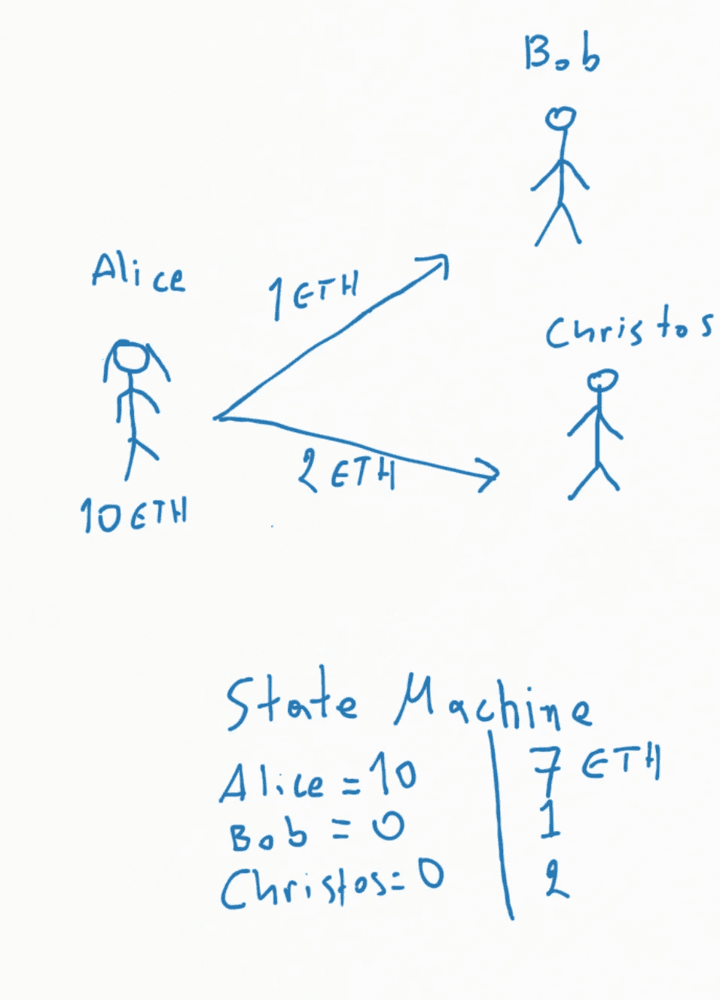
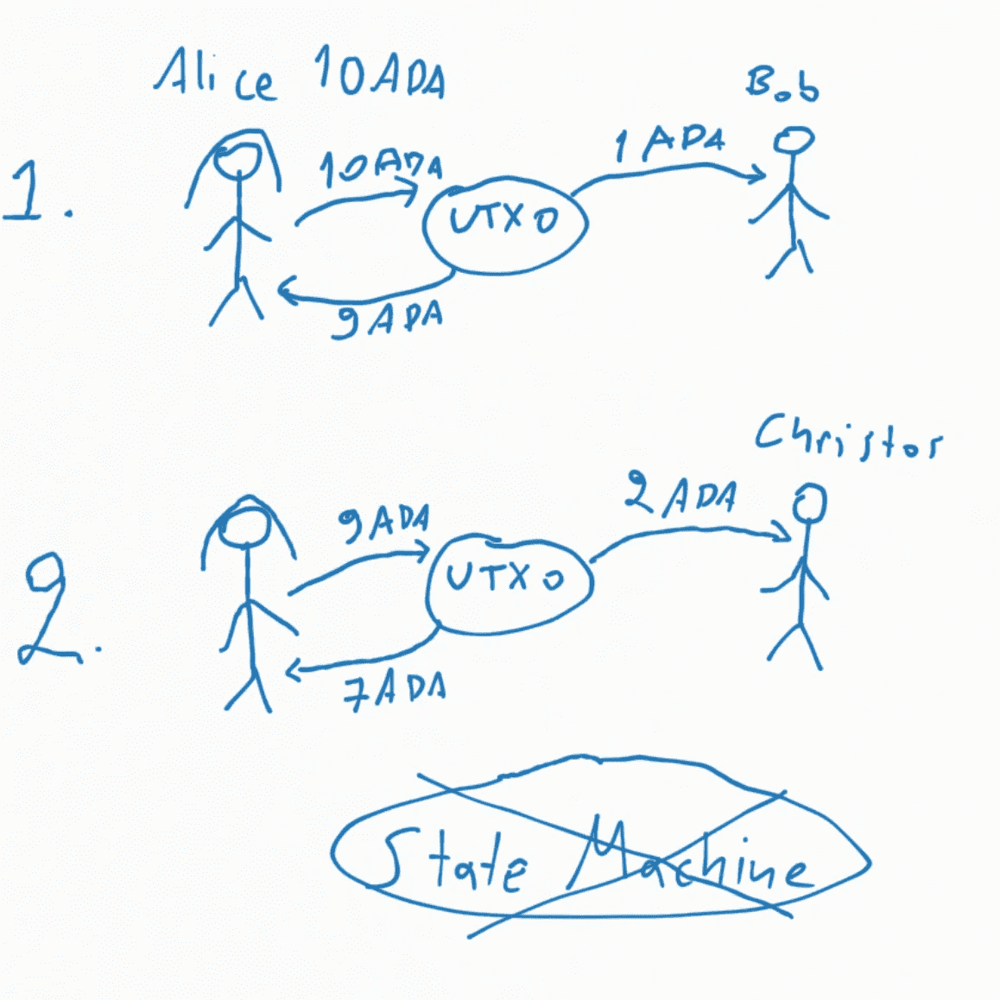

# Cardano 的 eUTXO 方法与 Ethereum 的智能合约的简单解释

> 原文：<https://medium.com/coinmonks/a-simple-explanation-of-cardanos-eutxo-approach-vs-ethereum-s-on-smart-contracts-328a1ce485ff?source=collection_archive---------0----------------------->

我总是对新闻中关于卡尔达诺延迟交货的花言巧语感到困惑。2021 年 9 月 12 日，阿隆佐时代一启动，批评家们就开始抱怨你不能在上面运行 dapps。他们的意思是，你不能像在以太坊的区块链上那样编写去中心化的应用程序，因为我们遵循一个完全不同的模型来支持[智能合约](/@chris.palaskas/what-are-smart-contracts-that-cardano-will-soon-support-a1fcf6bd5e9d)。

在以太坊的区块链上，*账户模型*是这样工作的:有一种[状态机](https://ethereum.org/en/developers/docs/evm/)，它知道一个地址在任何给定时间的状态。它会不断更新。假设爱丽丝有 10 个 ETH，发送 1 个给鲍勃，2 个给克里斯特斯，状态机可以更新为:爱丽丝的地址现在有 10–1–2 = 7 个 ETH，鲍勃的有 1 个 ETH，克里斯特斯的有 2 个 ETH。因此，在同一个块中，Alice 可以从她的地址发送多个事务，只要根据状态机它是有效的，即输出的总和不超过余额。

扩展的未用完事务输出模型( [eUTXO](https://iohk.io/en/research/library/papers/the-extended-utxo-model/) )的工作方式不同。它基于比特币的 UTXO 模型，只是为交易添加了一个数据，即特定于合同的信息。如果爱丽丝有 10 个 ADA，并想发送 1 个给鲍勃，2 个给克里斯特斯，她必须发送 1 个给鲍勃，并收到找零 10–1 = 9(就像给一张 10 美元的钞票，并收到找零 9 美元)，然后在这一点得到验证后(大约 20 秒后，下一个块被张贴)，她必须发送 2 个 ADA 给克里斯特斯，并收到找零 9–2 = 7 个 ADA。

一方面，这种方法使系统更加健壮，因为不需要状态机，没有单点故障，并且所有地址可以独立地与所有其他地址交互。另一方面，它具有在一个块期间从一个地址发送多个交易的内在能力，这是分散交易平台(dEX)所必需的特征，在分散交易平台中，流动性池是必需的，并且多人发送/接收没有时间延迟。

自从 2020 年初论文发表以来，这个限制就已经为人所知，很可能在那之前，eUTXO 的决定就已经做出了。解决方案是在 Cardano(第 1 层)上运行第 2 层应用程序，处理每个块的多个请求，与每个块上的区块链同步。sundaswap 和 [OccamFi](https://occam.fi/) 非常接近于发布他们的 dex，允许创建许多 dApps。只是需要时间。正如以太坊升级到 2.0 需要时间一样，许多其他伟大的项目都涉及到加密空间的改进，以及世界的改进。

我们必须意识到发展将会继续，越来越多的项目将会带来价值。正如以太坊在 2015 年推出并完成了比特币的能力一样，Cardano 和其他项目后来完成或取代或改善了以太坊和比特币的能力。我们应该接受并鼓励新的努力，因为停滞是衰退的开始。每一种都有不同的方法，各有利弊。Cardano 的方法是科学方法，每一个新的协议和算法都经过科学界的同行评审，并在实施和发布之前发布。这意味着它需要更多的时间，但它建立在坚实的基础上。其他项目更喜欢直接发布，让市场来塑造它的形式，或者纠正它的错误。但时间会告诉我们哪种方法更好，因为市场总体上是一个公正的法官。

如果你觉得这篇文章有用，请考虑委派一些 ADA 到我们的池中。我们把 10%的利润捐给一名对卡尔达诺协议研究最好的 NTUA 学生:
阿达·斯科普斯—ASKP
www.skepsispool.com

[https://www.youtube.com/channel/UCwsKlLDRjXNH3-DwnGU6elg](https://www.youtube.com/channel/UCwsKlLDRjXNH3-DwnGU6elg)

> 加入 Coinmonks [电报频道](https://t.me/coincodecap)和 [Youtube 频道](https://www.youtube.com/c/coinmonks/videos)了解加密交易和投资

## 另外，阅读

*   什么是融资融券交易
*   [维护卡审核](https://blog.coincodecap.com/uphold-card-review) | [信任钱包 vs MetaMask](https://blog.coincodecap.com/trust-wallet-vs-metamask)
*   [Exness 点评](https://blog.coincodecap.com/exness-review)|[moon xbt Vs bit get Vs Bingbon](https://blog.coincodecap.com/bingbon-vs-bitget-vs-moonxbt)
*   [如何开始通过加密贷款赚取被动收入](https://blog.coincodecap.com/passive-income-crypto-lending)
*   [BigONE 交易所评论](/coinmonks/bigone-exchange-review-64705d85a1d4) | [电网交易机器人](https://blog.coincodecap.com/grid-trading)
*   [新加坡十大最佳加密交易所](https://blog.coincodecap.com/crypto-exchange-in-singapore) | [购买 AXS](https://blog.coincodecap.com/buy-axs-token)
*   [投资印度的最佳加密软件](https://blog.coincodecap.com/best-crypto-to-invest-in-india-in-2021) | [WazirX P2P](https://blog.coincodecap.com/wazirx-p2p)
*   [7 个最佳零费用加密交易平台](https://blog.coincodecap.com/zero-fee-crypto-exchanges)
*   [最佳网上赌场](https://blog.coincodecap.com/best-online-casinos) | [期货交易机器人](/coinmonks/futures-trading-bots-5a282ccee3f5)
*   [分散交易所](https://blog.coincodecap.com/what-are-decentralized-exchanges) | [比特 FIP](https://blog.coincodecap.com/bitbns-fip) | [宾邦评论](https://blog.coincodecap.com/bingbon-review)
*   [用信用卡购买密码的 10 个最佳地点](https://blog.coincodecap.com/buy-crypto-with-credit-card)
*   [加拿大最佳加密交易机器人](https://blog.coincodecap.com/5-best-crypto-trading-bots-in-canada) | [Bybit vs 币安](https://blog.coincodecap.com/bybit-binance-moonxbt)
*   [火币的加密交易信号](https://blog.coincodecap.com/huobi-crypto-trading-signals) | [Swapzone 审查](/coinmonks/swapzone-review-crypto-exchange-data-aggregator-e0ad78e55ed7)