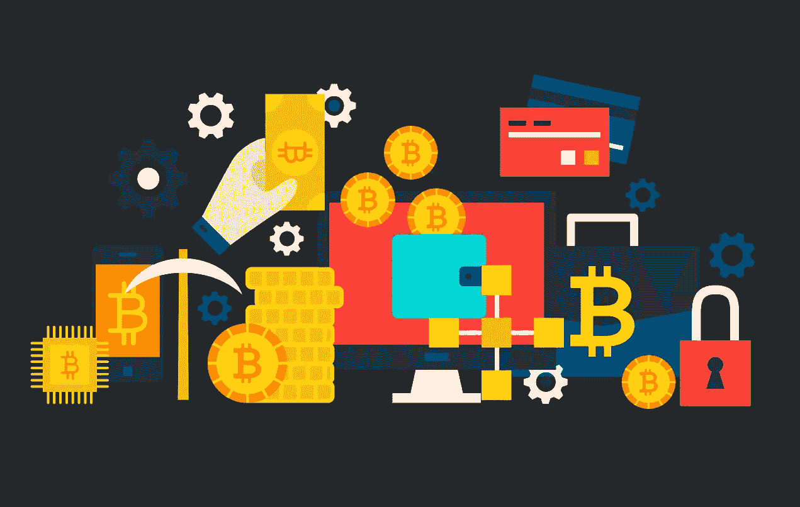
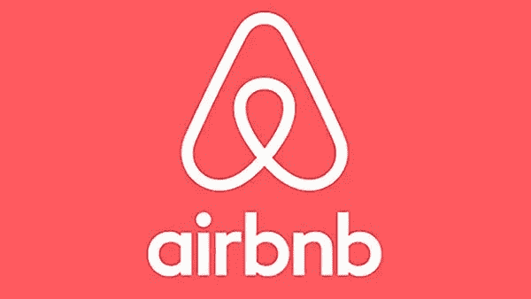
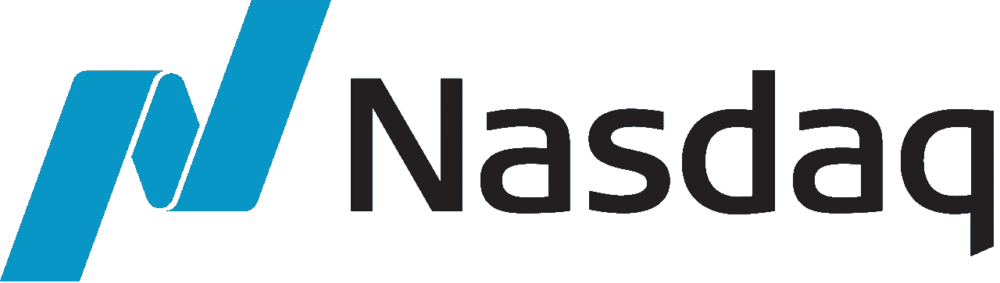
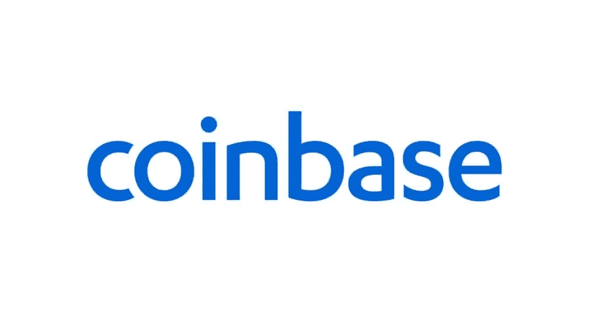
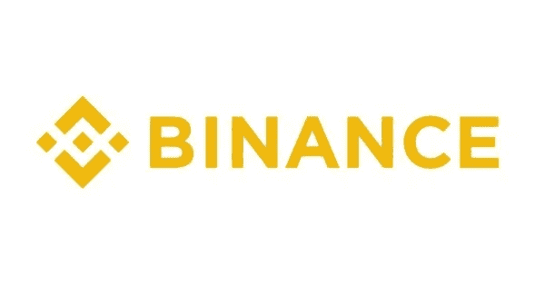
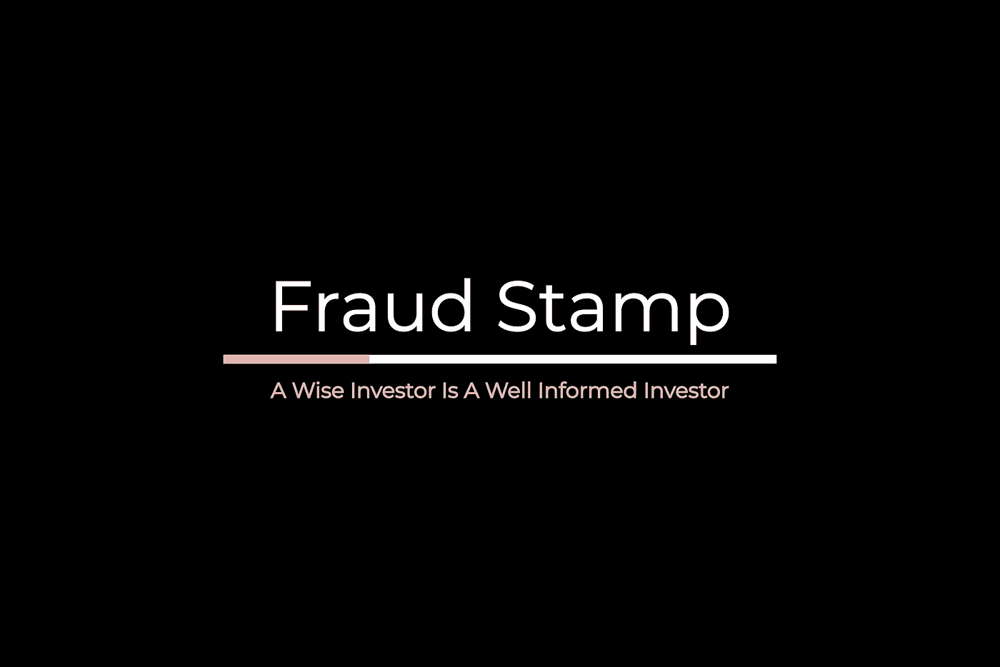

# 列出加密货币的简单指南

> 原文：<https://medium.com/coinmonks/a-simple-guide-to-listing-a-cryptocurrency-b3cc321497df?source=collection_archive---------1----------------------->

投资者和企业家的战略、陷阱和秘密做法指南

*探索加密货币发行机制的三篇系列文章中的第二篇*

**稍微介绍一下你的作者:诈骗戳**是一个小型的个人理财专家团队。你可以在推特上关注我们 [@FraudStamp](https://twitter.com/fraudstamp) 。

这篇文章是我们上一篇文章的延续:[印制自己货币的许可证——如何创造自己的加密货币。](/coinmonks/a-licence-to-print-your-own-money-7ecda561362f)如果你错过了，请在这里[阅读](/coinmonks/a-licence-to-print-your-own-money-7ecda561362f)。

Image by [Megan Rexazin](https://pixabay.com/users/megan_rexazin-6742250/?utm_source=link-attribution&utm_medium=referral&utm_campaign=image&utm_content=4851387) from [Pixabay](https://pixabay.com/?utm_source=link-attribution&utm_medium=referral&utm_campaign=image&utm_content=4851387)

在我们开始之前，我们要做一个重要的假设。假设你，读者，已经开发了一个合理的加密货币项目，满足真正的*法律*需求。而不是只对赚快钱感兴趣，然后在演出结束时跑到山里去。

**为什么在交易所上市如此重要？**

任何区块链初创公司最大的成就之一就是让你的硬币或代币在交易所上市。没有一个列表是不可能提供一个市场，从而确定你的硬币的价值。

假设投资者通过 ICO(类似于 IPO 的首次发行硬币)购买了你的代币，但代币未能在交易所上市。你认为接下来会发生什么？首先，你将会有一群极度不安的投资者对你虎视眈眈！

任何资产的关键是能够确定其价值，并有能力在合理的时间框架内以给定的价格退出投资。合理这个词是相对的，取决于资产。加密货币的市值越小，流动性就越差，投资者以给定的市场价格出售其代币的可能性也就越小。

如果你的代币没有上市，那么它实际上没有第三方做市商，因此它的价值有限或没有价值。如果有人购买你的代币在你的平台或 DApp 上使用，用户需要知道代币的价值。这就是交易所的用武之地。

## **关于交流的一点点**

根据最近的统计，有超过 390 家加密货币交易所。交易所大致分为三层。顶级或大型交易所、中小型交易所。与股票市场做个比较，会让整个系统更加清晰。

假设你正在考虑让你的新互联网创业公司上市。您对市场的选择将取决于几个因素，如预期的市值、历史和潜在的收入和用户增长以及主板的质量。让我们假设你是这家没人听说过的零收入创业公司的创始人。然而，仅仅这两个事实并不能阻止你试图筹集几百万美元来帮助你把你的想法变成你所设想的空中楼阁。然而，在纽约证券交易所上市并不合适，聘请高盛作为你的顾问也不是一个选择。你的创业可能注定要失败(公开市场的最底层)。

然而，举例来说，如果你是 Airbnb，拥有数十亿美元的估值、庞大的追随者和蓝筹股支持者，你将前往纽约证券交易所或纳斯达克，在顶级顾问的协助下管理这一过程。列出你的加密货币也不例外。一个加密货币项目有一个伟大的想法，但没有追随者，没有经过验证的团队，资本有限，很可能会寻求在一个小交易所上市，以便建立一个跟踪记录和流动性，使其能够在未来迁移到一个更大的交易所。

流动性是大型交易所感兴趣的。理想情况下，他们希望你的加密货币带来一个忠诚的客户群，他们也可以购买他们的一系列产品和服务。当然，这是一条双行道。你的硬币也将受益于其对交易所自身庞大客户群的敞口。如果你背后有一个高调的加密货币，有蓝筹风投和一个庞大的支持者和用户社区，那么你可能会寻求在一个或多个较大的交易所上市，如比特币基地、币安、Bitfinex、Bittrex、 [EToro](http://blog.coincodecap.com/go/etoro) 、北海巨妖和 Changelly。如果你是一家没有流动性或交易量的初创公司，只有一个小社区和一个尚未成型的声誉，那么像 Yobit、HotBit、IDEX、Liquid 这样的交易所。数字价格和 STEX 将在你的愿望清单上。

## **专业人士**

为你的货币获得一个列表的过程不是简单的提交一份白皮书然后坐下来数钱。那是旧时代。现在，这个过程与你的创业公司在证券交易所上市的过程相似。这一过程归结为保留专业顾问的要求，这些顾问在密码领域被称为 ICO 顾问。

专业人士将代表你收集一套信息，提交给你选择的交易所。很明显，在提交申请之前，已经进行了一些幕后的谈话，讨论了申请成功的机会以及费用这一重要因素，我们很快会谈到这个问题。没有一篇关于加密货币的文章是完整的，除非讨论费用！该信息包将包括:

1.  有关令牌发行者管理团队的信息
2.  令牌解决的问题
3.  技术背景和使用平台
4.  令牌的效用
5.  平台和令牌的当前状态
6.  关于平台上任何独立安全审计的信息
7.  关于代币和平台的法律意见，涉及代币注册和运营的司法管辖区以及代币发行的目标司法管辖区
8.  白皮书
9.  关于任何当前或潜在监管行动的信息

这一过程的关键是白皮书和法律意见书。在投资项目开发之前，获得关于项目结构的初步法律意见是至关重要的。“开火，瞄准”的日子已经一去不复返了。这种方法会让任何兴奋的项目所有者带着 IBS，当 SEC 结束他们时，他们的口袋里会有一个洞！下面列出了一些值得一看的公司。帮助那些声称已经帮助许多项目(超过 500 个)实现上市的人，IBC 集团和专业法律顾问，如区块链法律集团(这些绝不是推荐)。

**交易所在加密货币中寻找什么？**

占据大部分头条的交易所当然是大型交易所，如币安、比特币基地和 Bitfinex。币安甚至发布了一份公开文件，列出了他们在考虑项目上市前的要求。其中包括:

*   遵守反洗钱和打击资助恐怖主义的立法
*   核心团队解决现实世界问题的战略眼光
*   社区以有助于项目发展的方式进行组织的能力
*   技术可行性和安全性

币安的创始人 CZ 解释说，一般来说，我们喜欢拥有成熟团队、有用产品和庞大用户群的硬币

所以这排除了每年启动的绝大多数项目。许多其他较大的交易所也公布了它们的要求，包括比特币基地和 Bittrex，它们甚至规定了它们的退市政策。社区缺乏兴趣，表现为交易量低，沟通不畅。这说明了为什么作为一个小项目，你应该在较小的交易所设立摊位。

交易所已经意识到，将强大的受欢迎资产引入交易所，是一种比旧的商业模式好得多的商业模式，这种模式要求项目支付高昂的费用才能上市。然而，与流行的密码观察者的信念相反，那些日子并没有消失——它们只是被重新包装了…

**玩游戏的费用**

那么这一切的代价是什么呢？尽管这些文章告诉你，该系统比几年前明显更加透明，但我们在自己的调查中发现，情况远非如此。

币安表示，没有固定的费用。所有上市费用都是单独协商的，所有上市费用都将捐给慈善机构。

比特币基地声称没有申请费。

实际上，事情有些不同。币安可能会淡化其费用，但其代币在币安交易所上市的 Blockstack 透露，他们向币安支付了 25 万美元，作为“保持其代币在币安交易所上市的长期付款”对我们来说，这听起来像是上市费，但模糊的措辞避免了他们将这笔费用捐赠给慈善机构，以及进一步的类似付款，以确保该货币上市至少三年。

币安辩解说这是 Blockstack 的主意。我们确信，让人民币白白上市不是币安的主意！《区块链扩展报》声称，币安要求 260 万美元来列出其项目的令牌。因此，除非你是城里最热门的加密项目的幕后黑手，否则你必须准备好向币安等人支付一大笔钱，以获取他们庞大的客户和流动性数据库。但是谁能说那只胳膊或腿不值得付出代价呢？

除了币安之外，许多其它交易所都不羞于收取上市费用。

随机选择的交易所的一些上市成本包括:

约比特 3 BTC

BTC 硬币交易所 4

来自 20 BTC 的比特币

来自 BTC 25 区的 Coinbene

80 万美元起

50 万美元的 Bitrex

(来源:榜单。帮助)

这些费用显然不包括聘请专业顾问和法律咨询的费用。

正如我们上面提到的，如果你预算有限，一个小的交易所是个不错的选择，但是你仍然需要法律建议和防弹白皮书。从提交申请之日起，您的令牌可能需要几天到 60 天才能上市。持续时间取决于你的申请质量。

**关于 CoinMarketCap**

这是迄今为止领先的加密资产价格跟踪网站。如果你想你的硬币被认真对待，你的令牌必须在这个网站上列出。CoinMarketCap 收取 0.5 BTC 的费用来列出你的硬币。这是一个值得付出的代价，尽管他们付费的模式在一定程度上削弱了他们的独立性。

## **推销你的硬币**

下一篇文章是我们三篇系列文章中的一篇，看看一旦你成功上市，你该如何营销你的硬币。上市是容易的部分。下一个挑战是激起人们对你的项目和货币的兴趣。

## **结论**

交易所有权决定哪些硬币会兴盛，哪些会消亡。然而，项目所有者也是决定一枚硬币成功与否的重要因素。任何公司或加密货币项目的成功之路都是兑现你的承诺。

一个行之有效的技巧是少承诺多兑现。许多加密货币项目的问题是，他们做出了过于雄心勃勃的承诺，并一再错过最后期限，要么延迟交付，要么根本不交付。这意味着团队的信誉在他们开始之前就被摧毁了，这显然会对他们的代币价格产生不利影响。这就是为什么只有在项目完全开发完成后才发布和列出令牌是明智的。这使得项目团队能够在项目和令牌发布背后激发人们的热情。这一战略如果得到有效实施，不仅将吸引用户使用该平台，还将确保代币享有强劲的流动性和强劲的代币价格，这肯定会让交易所满意。

**在 Twitter 上关注我们:@** [**fraudstamp**](https://twitter.com/fraudstamp)

**没有理财建议**

本文不以任何方式构成财务建议。这篇文章应该作为补充信息添加到您现有的知识库中。

## 另外，阅读

*   最好的[加密交易机器人](/coinmonks/crypto-trading-bot-c2ffce8acb2a)
*   [密码本交易平台](/coinmonks/top-10-crypto-copy-trading-platforms-for-beginners-d0c37c7d698c)
*   最好的[加密税务软件](/coinmonks/best-crypto-tax-tool-for-my-money-72d4b430816b)
*   [最佳加密交易平台](/coinmonks/the-best-crypto-trading-platforms-in-2020-the-definitive-guide-updated-c72f8b874555)
*   最佳[加密贷款平台](/coinmonks/top-5-crypto-lending-platforms-in-2020-that-you-need-to-know-a1b675cec3fa)
*   [最佳区块链分析工具](https://bitquery.io/blog/best-blockchain-analysis-tools-and-software)
*   [加密套利](/coinmonks/crypto-arbitrage-guide-how-to-make-money-as-a-beginner-62bfe5c868f6)指南:新手如何赚钱
*   最佳[加密制图工具](/coinmonks/what-are-the-best-charting-platforms-for-cryptocurrency-trading-85aade584d80)
*   [莱杰 vs 特雷佐](/coinmonks/ledger-vs-trezor-best-hardware-wallet-to-secure-cryptocurrency-22c7a3fd391e)
*   了解比特币的[最佳书籍有哪些？](/coinmonks/what-are-the-best-books-to-learn-bitcoin-409aeb9aff4b)
*   [3 商业评论](/coinmonks/3commas-review-an-excellent-crypto-trading-bot-2020-1313a58bec92)
*   [AAX 交易所审核](/coinmonks/aax-exchange-review-2021-67c5ea09330c) |推荐代码、交易费用、利弊
*   [Deribit 审查](/coinmonks/deribit-review-options-fees-apis-and-testnet-2ca16c4bbdb2) |选项、费用、API 和 Testnet
*   [FTX 密码交易所评论](/coinmonks/ftx-crypto-exchange-review-53664ac1198f)
*   [n 零审核](/coinmonks/ngrave-zero-review-c465cf8307fc)
*   [Bybit 交换审查](/coinmonks/bybit-exchange-review-dbd570019b71)
*   [3Commas vs Cryptohopper](/coinmonks/cryptohopper-vs-3commas-vs-shrimpy-a2c16095b8fe)
*   最好的比特币[硬件钱包](/coinmonks/the-best-cryptocurrency-hardware-wallets-of-2020-e28b1c124069?source=friends_link&sk=324dd9ff8556ab578d71e7ad7658ad7c)
*   最佳 [monero 钱包](https://blog.coincodecap.com/best-monero-wallets)
*   [莱杰纳米 s vs x](https://blog.coincodecap.com/ledger-nano-s-vs-x)
*   [bits gap vs 3 commas vs quad ency](https://blog.coincodecap.com/bitsgap-3commas-quadency)
*   [莱杰纳米 S vs 特雷佐 one vs 特雷佐 T vs 莱杰纳米 X](https://blog.coincodecap.com/ledger-nano-s-vs-trezor-one-ledger-nano-x-trezor-t)
*   [block fi vs Celsius](/coinmonks/blockfi-vs-celsius-vs-hodlnaut-8a1cc8c26630)vs Hodlnaut
*   Bitsgap 评论——一个轻松赚钱的加密交易机器人
*   为专业人士设计的加密交易机器人
*   [PrimeXBT 审查](/coinmonks/primexbt-review-88e0815be858) |杠杆交易、费用和交易
*   [埃利帕尔泰坦评论](/coinmonks/ellipal-titan-review-85e9071dd029)
*   [赛克斯·斯通评论](https://blog.coincodecap.com/secux-stone-hardware-wallet-review)
*   [BlockFi 审查](/coinmonks/blockfi-review-53096053c097) |赚取高达 8.6%的加密利息