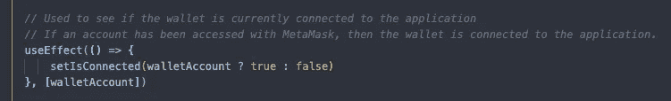

# MetaMask 简单指南— React +以太坊

> 原文：<https://medium.com/coinmonks/a-simple-guide-to-metamask-react-ethereum-efabb2f6b6fc?source=collection_archive---------0----------------------->

[https://metamask.io/](https://metamask.io/)

有时直接使用 **MetaMask** 钱包是在**以太坊**区块链进行交易的最简单方式。在本教程中，我将为您介绍一系列主题，以及让您继续使用分散式应用程序的重要主题，如登录/断开连接、使用个人签名请求授权以及通过事务发送令牌。我还会介绍一些好的实践来帮助你理解 **MetaMask** 是如何工作的。

要了解完整的开源代码库，请查看我的**GitHub repo**:[https://github.com/blakewood84/metamask-transactions](https://github.com/blakewood84/metamask-transactions)

# #1 初始化您的应用

首先也是最重要的是初始化你的应用程序来支持元掩码。下面的代码是一个很好的实践，可以在应用程序初始化的 **useEffect()** 钩子中使用。

为了给你一个以上代码所做事情的分解，我们首先检查元掩码是否实际安装在客户端使用的受支持的浏览器上。你将总是通过下面的代码访问元掩码:`**window.ethereum**` ，它是针对浏览器的插件。要查看关于此的更多细节，请查看元掩码文档中的[入门](https://docs.metamask.io/guide/getting-started.html#basic-considerations)。

除了检查是否安装了 MetaMask 之外，我还加入了两个事件监听器来监听一些重要的值(如果它们发生了变化),比如钱包当前使用的 **ChainID** ,以及如果钱包的帐户在应用程序的生命周期中确实发生了变化，那么选择的**当前帐户**。

要添加任何事件侦听器，只需添加:

`window.ethereum.on(‘message’, (value) => { // callback })`

要了解不同事件消息的概要，只需参考 MetaMask 文档的[事件](https://docs.metamask.io/guide/ethereum-provider.html#events)部分。根据文档，一个好的做法是重新加载浏览器，以防 ChainID / chain 发生变化，因为事情会变得有点复杂。我将让您决定如何处理您的应用程序。

# **继续# 2——连接你的应用**

要将 MetaMask 连接到您的站点，您需要以某种方式考虑用户帐户地址的状态。有几种方法可以做到这一点。

每次提交请求并使用元掩码进行交易时，您都将使用以下代码:

`window.ethereum.request({ method: ‘method’, params: [ ] })`

有时请求可能有也可能没有参数。有关请求的更多详细信息，请访问 [Api 运动场](https://metamask.github.io/api-playground/api-documentation/)，它对于分析每个请求非常有用。

1.  使用 **eth_requestAccounts** 连接到钱包，如果没有帐户连接到应用程序或网站地址，这将触发用户登录到他们的 MetaMask 钱包…如果 MetaMask 钱包已经连接到应用程序，那么它不会提醒你，只是抓取当前选择的帐户。

上面，我已经创建了一个按钮，如果钱包连接到应用程序，它将显示帐户的地址。再次点击按钮，我们将通过改变状态来断开钱包与应用程序的连接。

简单来说，如果你目前在你的 **useState** 变量中有一个用户的钱包地址，对我来说我使用的是 **walletAccount，**那么你的应用程序就连接到了 MetaMask。

2.你也可以创建另一个 **useState()** 名为:

可用于跟踪应用程序与元掩码钱包的连接状态，如下所示:

每当用户的帐户被提供给应用程序的状态时，我们就认为元掩码钱包“连接”到应用程序。

3.要断开应用程序，我们只需从状态中删除帐户。

4.然而，有时这还不够好。对于一些人来说，我们希望看到 MetaMask 钱包窗口重新打开，以某种方式迫使用户选择他们希望连接到应用程序的钱包。为此，您可以运行一个**wallet _ request permissions**，然后运行 **eth_requestAccounts** ，这将为您生成用户流，触发元掩码以强制用户每次选择一个新帐户进行连接。你可以这样做:

每次都会弹出以下内容:

这有助于使用所有这些连接方法为您生成用户流。

# #3 个人签名/认证

你熟悉 OpenSea 及其用户登录的认证流程吗？它看起来有点像这样:

这种方法叫做 **personal_sign** ，可以用不同的方式使用，但是强迫用户简单地签署一个请求或消息，表明他们确认或批准该请求。要处理用于身份验证目的的个人签名，只需使用以下代码即可:

签名的响应将是一个哈希签名，使用您的钱包帐户进行签名。首先，我们请求 **eth_requestAccounts** 获取 MetaMask 钱包中当前选中的账户，然后调用 **personal_sign** ，接着是**消息**和**账户**被用于参数。有关此类请求的更多信息，请访问[签名数据](https://docs.metamask.io/guide/signing-data.html#signing-data-with-metamask)文档。

# #4 获取账户的代币余额

想要获取元掩码中所选钱包的令牌余额吗？只需使用请求方法 **eth_getBalance** 并传入**account+‘latest’**作为参数，如下所示:

> `await window.ethereum.request({ method: ‘eth_getBalance’, params: [ account, ‘latest’ ]})`

在这个函数中，请求将返回以卫为单位的余额，将其转换为 Gwei(气体)将除以幂，转换为实际以太(ETH)将除以 10 幂。

对于这个请求，我正在运行一个本地 [Ganache](http://trufflesuite.com/docs/ganache/quickstart.html) 服务器，并且我已经将第一个帐户导入到我的 MetaMask 钱包中。

运行本地 [Ganache](http://trufflesuite.com/docs/ganache/quickstart.html) 节点是在本地测试事务和使用元掩码请求的最简单方法之一。除了使用 **Ropsten** 或 **Kovan** 之类的 **Testnet** 和不得不经常去水龙头补充你的 ETH 余额之外，这也是当地发展的必须。也可以使用本地的区块链浏览器如 [Ethernal](https://tryethernal.com/) 来查看交易。

# #5 简单发送交易

使用元掩码在帐户之间发送令牌可能非常简单。只要您有**发送方地址、** **接收方地址**和**金额**(转换为十六进制)，以下函数将在双方之间发送一笔交易:

> await window . ether eum . request({ method:' eth _ send transaction '，params: [tx]})

有关交易的更多信息，请访问[发送交易。](https://docs.metamask.io/guide/sending-transactions.html)

我也使用固定的汽油价格 21000，它是十六进制的格式。注意，你所有的交易信息几乎都是十六进制格式。运行此函数将生成以下请求:

为了测试事务，我设置了一个本地 Ganache 服务器，并在两个本地帐户之间发送 ETH。在本地 Ganache 服务器上导入账户非常简单，只需访问本指南[如何导入账户](https://metamask.zendesk.com/hc/en-us/articles/360015489331-How-to-import-an-Account)。您需要通过点击 Ganache GUI 中的密钥图标来导入您的帐户的私钥。

# 结论

暂时就这样吧！在你的分散式应用中使用 MetaMask 的 5 种简单方法。为了方便起见，这里是这个项目在 https://github.com/blakewood84/metamask-transactions 的 [GitHub 上的完全开源链接](https://github.com/blakewood84/metamask-transactions)

如往常一样，如果您有任何问题，请随时通过 [LinkedIn](https://www.linkedin.com/in/blakewoodjr/) 联系我:[https://www.linkedin.com/in/blakewoodjr/](https://www.linkedin.com/in/blakewoodjr/)！

祝大家有一个幸福的一天和快乐的编码！

> 加入 Coinmonks [电报频道](https://t.me/coincodecap)和 [Youtube 频道](https://www.youtube.com/c/coinmonks/videos)了解加密交易和投资

## 也阅读

 [## 杠杆代币[多头代币]终极指南

### 杠杆化令牌是具有杠杆化风险敞口的 ERC20 令牌，不考虑保证金、要求、管理…

medium.com](/coinmonks/leveraged-token-3f5257808b22)  [## 最佳加密交易所| 2021 年十大加密货币交易所

### 加密货币交易所的加密交易需要了解市场，这可以帮助你获得利润。之前…

blog.coincodecap.com](https://blog.coincodecap.com/crypto-exchange)  [## 2021 年最佳加密交换平台| CoinCodeCap

### 如果我们看看今天的场景，许多加密货币交换平台提供了广泛的功能和深度…

blog.coincodecap.com](https://blog.coincodecap.com/best-swap-platforms)  [## 2021 年最佳加密借贷平台| 6 大比特币借贷平台

### 获得比特币和其他加密货币的最佳贷款利率

medium.com](/coinmonks/top-5-crypto-lending-platforms-in-2020-that-you-need-to-know-a1b675cec3fa)  [## 2021 年最佳免费加密交易机器人

### 2021 年币安、比特币基地、库币和其他密码交易所的最佳密码交易机器人。四进制，位间隙…

medium.com](/coinmonks/crypto-trading-bot-c2ffce8acb2a)  [## 仙境提供了 83，412%的 APY 赌注:仙境是一个骗局吗？CoinCodeCap

### 仙境是雪崩网络的第一个基于时间令牌的分散储备货币协议。一篮子…

blog.coincodecap.com](https://blog.coincodecap.com/wonderland-offers-an-83412-apy-on-staking-is-wonderland-a-scam)  [## 天秤座货币——脸书的加密货币

### 自 2018 年马克·扎克伯格决定致力于改善区块链以来，关于天秤座货币的传言就一直存在…

blog.coincodecap.com](https://blog.coincodecap.com/libra-currency-a-cryptocurrency-by-facebook)