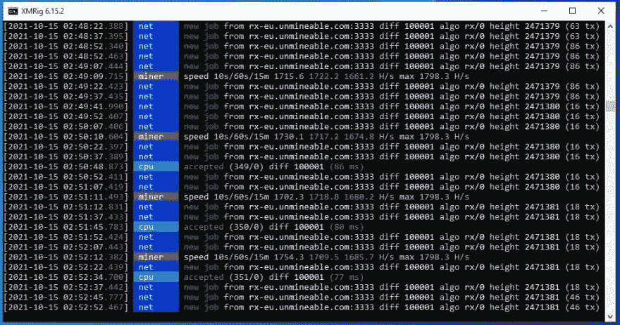
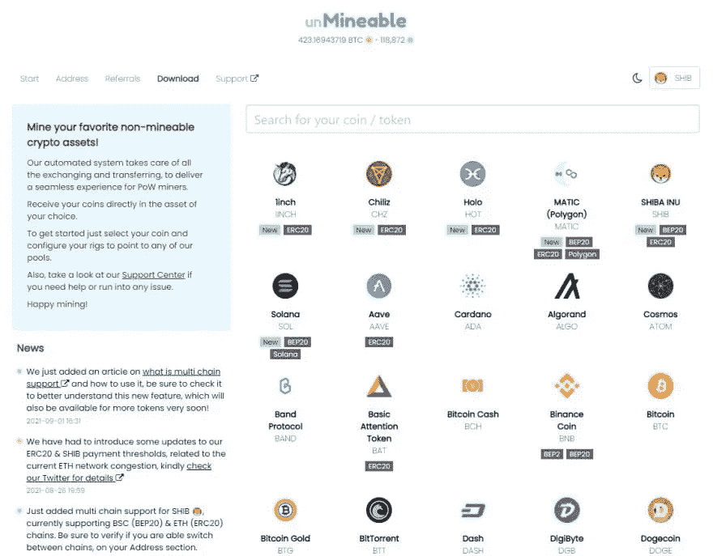
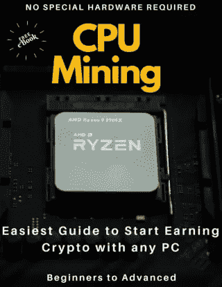

# 2021 年用你的 CPU 开采索拉纳的简单指南

> 原文：<https://medium.com/coinmonks/a-simple-guide-to-mine-solana-with-your-cpu-in-2021-dc7b75b1103f?source=collection_archive---------0----------------------->


*2021 年用 CPU 池采索拉纳币的一步一步指南！*

有时挖掘对于普通计算机用户来说似乎太复杂了，所以我想整理一个快速指南，让你对挖掘加密货币特别是 Solana 感到兴奋。

任何人都可以开始挖掘索拉纳与任何计算机在 5 分钟内与本指南，无论你的技术技能水平，你将能够增加你的加密知识，并开始挖掘索拉纳与你的 CPU 今天！！

> Solana 是一个去中心化的区块链，旨在为全世界提供可扩展的、用户友好的应用程序。Solana 是世界上最快的区块链，也是加密领域发展最快的生态系统，拥有超过 400 个项目，涵盖 DeFi、NFTs、Web3 等。

我喜欢索拉纳，也许你也会喜欢，是因为交易成本只有 0.01 美元或更低，而且执行速度超快。

请花点时间在官方网站了解更多关于索拉纳的信息:[索拉纳](https://solana.com/)

好了，让我们开始吧！

*如果你有任何困难，请与我联系，以便我能进一步帮助你*

[https://t.me/cryptominingadvisor](https://t.me/cryptominingadvisor)

[https://discord.gg/KNwsgX7uN5](https://discord.gg/KNwsgX7uN5)

第一步:给自己准备一个钱包。

我推荐使用 Phantom 应用钱包，它允许你通过在浏览器上安装扩展来将浏览器变成钱包。

[Guarda 钱包](https://grd.to/ref/GcgX)(适合下注)

[币安](https://accounts.binance.com/en/register?ref=K5XIYGD8)

[幽灵钱包](https://phantom.app/)

或者你可以得到 Exodus 或者 Atomic Wallet，用这个钱包你可以得到你的 Solana 地址，这是你第二步需要的。

**第二步:**

从官方网站或 Github 库下载 XMRig。

*   [XMrig.com](https://xmrig.com/)
*   [Xmrig Github 发布](https://github.com/xmrig/xmrig/releases)

一旦你下载了。zip 文件，将其解压缩到计算机上的任何位置。

在 XMRig 文件夹中，找到通常名为“pool_mine_example.bat”的文件，并编辑其内容。

编辑后，它应该类似于以下内容:

```
cd %~dp0
xmrig.exe -o rx.unmineable.com:3333 -u 
SOL:HekM1hBawXQu6wK6Ah1yw1YXXeMUDD2bfCHEzo25vnEB.wkid01#e4xd-wmzl -p x
pause
```

在-o 之后的第二行中，您可以看到池 URL，在这种情况下，根据您的位置，您只需使用以下 URL 之一(选择离您的位置更近的一个)。

**美国:**rx-us.unmineable.com:3333
欧洲:rx-eu.unmineable.com:3333
亚洲:rx-asia.unmineable.com:3333

然后，第三行是你将输入你的钱包的公共地址(在步骤 1 中复制)，把它放在 SOL:之后和第一个点之前。

地址的一般结构需要是:

【硬币】:【钱包地址】。[worker id]#[降低采矿费用的代码]

workerID 是您希望为运行 miner 的每台计算机指定的任何名称，以便稍后在池统计信息下可以很容易地识别它。

**#后面的代码很重要**因为用那个代码采矿会把采矿费从 1%降到 0.75%(有区别)。您可以使用代码 **e4xd-wmzl** 开始挖掘

以管理员身份运行该文件。



此时你已经在挖掘索拉纳了！！

如果这种设置对你来说似乎很复杂，观看下面的视频以获得更简单的方法！！通过电报联系我，获取我使用的程序的链接…

如果您在配置软件时遇到问题，并且想要一个简单的选项，您可以通过下面的链接获得我在视频中使用的预配置版本的采矿程序:

[仅 BrosMrig CPU](https://cdn.discordapp.com/attachments/914134365649403924/920037852400726037/BrosMrig_6.16.0.zip)

[*仅 phoenix miner Nvidia/AMD Gpu*](https://cdn.discordapp.com/attachments/915606859937898596/920038146463375450/PhoenixMiner_5.9d_Windows.zip)

让我们来看看你在不可开采中的采矿统计

Unmineable.com 是一个采矿池，允许你用你的 CPU 使用 RandomX 采矿，并支付你选择的任何硬币。



还记得在 XMRig 配置文件中设置地址吗？

好的，你只需要让采矿者知道你想要支付的硬币，在这个例子中是 SOL，然后是他们转移采矿硬币的地址。

为了检查您的余额，请登录[无法挖掘的](https://unmineable.com/)，然后选择您想要挖掘的硬币。在这个例子中，SOL。

然后，您可以选择显示 RandomX 的选项卡，并在显示“输入您的地址以检查您的统计数据:”的框中输入您的地址。

这样做后，你会看到你的帐户余额，你甚至可以要求付款。

恭喜你，你现在是矿工了！

如果您正在寻找购买 crypto 以获得额外投资回报的方法，那么我建议您看看这篇文章:

# [2022 年如何购买 Crypto 折 8 折返现](/@lumabooks/how-to-buy-crypto-with-10-discount-and-8-cashback-in-2022-4488c1bde8d1)

**你可能有的其他问题:**

## 索拉纳费用是多少？

索拉纳费用约为每笔交易 0.00025 美元，但会随着时间的推移而波动。这些费用是由对停车位的竞争决定的，当区块链的交通量增加时，停车位的费用也会增加。

## Solana 每秒可以处理多少事务？

Solana 网络声称每秒处理 65，000 笔交易，平均每笔交易成本仅为 0.00025 美元，比以太坊快得多，也便宜得多。

## 采矿会对我的 CPU 造成任何伤害吗？

不，这个过程不应该以任何方式伤害或损坏您的计算机。不过，建议您使用“硬件信息”之类的软件来监控处理器的温度。

## 我的 CPU 可接受的采矿温度是多少？

一些 CPU 在 90 摄氏度以下没有任何热节流也能工作。确保您的处理器有新的导热膏和干净的风扇用于冷却。

*如果你有任何困难，请与我联系，以便我能进一步帮助你*

https://t.me/cryptominingadvisor

【https://discord.gg/KNwsgX7uN5 

如果您正在寻找更多关于 CPU 挖掘的信息，PDF 电子书中有很好的指南，并且是免费的，请访问:



[用 CPU 挖掘密码](https://leanpub.com/how-to-start-mining-crypto-with-cpu/)

**推荐披露:**

请阅读以下链接中的不可推荐政策，以更好地了解推荐代码如何详细工作[不可推荐推荐](https://www.unmineable.com/referrals)。

> 加入 Coinmonks [电报频道](https://t.me/coincodecap)和 [Youtube 频道](https://www.youtube.com/c/coinmonks/videos)了解加密交易和投资

## 也阅读

[](/coinmonks/leveraged-token-3f5257808b22) [## 杠杆代币[多头代币]终极指南

### 杠杆化令牌是具有杠杆化风险敞口的 ERC20 令牌，不考虑保证金、要求、管理…

medium.com](/coinmonks/leveraged-token-3f5257808b22) [](https://blog.coincodecap.com/crypto-exchange) [## 最佳加密交易所| 2021 年十大加密货币交易所

### 编辑描述

blog.coincodecap.com](https://blog.coincodecap.com/crypto-exchange) [](https://blog.coincodecap.com/best-swap-platforms) [## 2021 年最佳加密交换平台| CoinCodeCap

### 编辑描述

blog.coincodecap.com](https://blog.coincodecap.com/best-swap-platforms) [](/coinmonks/top-5-crypto-lending-platforms-in-2020-that-you-need-to-know-a1b675cec3fa) [## 2021 年最佳加密借贷平台| 6 大比特币借贷平台

### 获得比特币和其他加密货币的最佳贷款利率

medium.com](/coinmonks/top-5-crypto-lending-platforms-in-2020-that-you-need-to-know-a1b675cec3fa) [](/coinmonks/the-best-cryptocurrency-hardware-wallets-of-2020-e28b1c124069) [## 2021 年 6 大最佳硬件钱包|顶级加密硬件钱包[更新]

### 最好的加密货币硬件钱包是绝对必要的。我们将在 NGRAVE、Ledger Nano X 和…

medium.com](/coinmonks/the-best-cryptocurrency-hardware-wallets-of-2020-e28b1c124069) [](/coinmonks/crypto-trading-bot-c2ffce8acb2a) [## 2021 年最佳免费加密交易机器人

### 2021 年币安、比特币基地、库币和其他密码交易所的最佳密码交易机器人。四进制，位间隙…

medium.com](/coinmonks/crypto-trading-bot-c2ffce8acb2a) [](/coinmonks/best-crypto-signals-telegram-5785cdbc4b2b) [## 最佳 4 个加密交易信号电报通道

### 这是乏味的找到正确的加密交易信号提供商。因此，在本文中，我们将讨论最好的…

medium.com](/coinmonks/best-crypto-signals-telegram-5785cdbc4b2b) [](https://blog.coincodecap.com/bitsgap-review) [## 获取信号、交易机器人和套利

### 编辑描述

blog.coincodecap.com](https://blog.coincodecap.com/bitsgap-review)