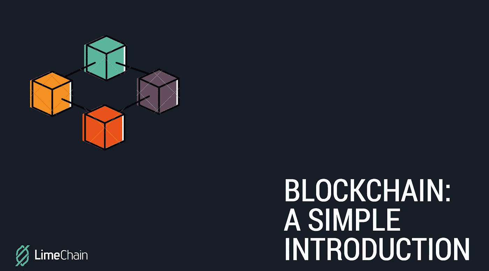

# 区块链技术简单介绍

> 原文：<https://medium.com/coinmonks/a-simple-introduction-to-blockchain-technology-90abc29f266e?source=collection_archive---------3----------------------->

在过去的一年里，世界各地的每个人都为加密货币而疯狂，特别是所谓的加密黄金——比特币。然而，尽管你的(祖父母)父母可能听说过这种数字货币，但他们可能对其背后名为**区块链**的迷人技术一无所知。

> [发现并回顾最佳区块链软件](https://coincodecap.com)

但到底是什么让区块链如此特别，以至于现在各行各业越来越多的企业都在采用它呢？这就是我要向你解释的。

> 当我们想到技术时，我们会假设你的智能手机和走在街上的人在盯着智能手机屏幕时不断发出嗡嗡的通知。然而，区块链是第一个**技术**，它实际上将我们连接起来，而不是相反。它将改变我们做决定和交换价值的方式。

我们的祖先通过使用暴力和社会反响进行交易。随着时间的推移，社会不断发展，政府机构和其他中介机构接管了我们交易和交换价值的方式。但是为了理解区块链对我们社会的诸多好处之一，让我们来看看银行系统。如果你想做一笔交易，银行是制定交易执行规则的机构——需要多长时间，他们要收你多少钱等等。如果该交易是在区块链上进行的，则有一组计算机参与网络来验证该交易。他们基本上是在没有银行作为中介的情况下，一对一的帮你操作这个交易。

**这个奇特的术语“区块链”实际上是指在一定时间内记录的数据块，它被分组并以加密方式链接到先前的一组数据，形成一个事件链。**

这些计算机就一段时间内发生的事情达成一致，然后它们中的每一个都代表这些数据，而不是有一个集中的实体来这样做。所有这些发生在区块链的事件都记录在一本公共账簿上。

这就是区块链的工作原理，它提供了一种透明、安全、可审计、抗中断的数据跟踪和传输方法。但是这些特征对我们做决定和交换价值的方式有什么好处呢？答案是:通过提供机会让*彼此信任*并**降低不确定性以更多地了解彼此。**

## **数字信任的重要性**

我们想知道你是否是你所说的那个人，你是否能够做你正在努力做的事情。当双方或多方进行价值交换时，这一点尤其有效。过去，人们能够通过有力的握手和一系列个人品质来信任对方。如今情况并非如此，相信数字世界是相当危险的。它需要证明身份(认证)和证明许可(授权)。

使用区块链技术，这两个要求通过拥有加密私钥来满足。它展示了一个强大的工具，可以满足**认证**和**所有权**需求。此外，它保护个人不必分享比他们交换所需更多的个人信息，从而将他们暴露给黑客。

> 正是这种差异使得区块链技术如此有用——代表了注册和分发信息方面的创新，消除了对可信方促进这些关系的需要。

区块链不是 app，也不是公司。它不是每个腐败组织的解决方案，几年后，当更多的人采用它时，它可能会被操纵。然而，现在认证和授权对所有数字交易都至关重要。他们为我们提供了一套规则，重建了我们曾经拥有的信任，这要感谢科技。这样，通过降低我们的不确定性，我们从根本上改变了我们的经济和生活的几乎每一个方面。

*来源:*

 [## 区块链初学者指南

### 我不明白为什么人们觉得理解区块链很难。我想知道为什么我自己没有。那是在 2013 年我第一次…

hackernoon.com](https://hackernoon.com/a-beginners-guide-to-blockchain-d04266844e7) 

**/**

*[*https://www . ted . com/talks/bettina _ Warburg _ how _ the _ 区块链 _ 威尔 _ 激进 _ 转型 _ the _ 经济*](https://www.ted.com/talks/bettina_warburg_how_the_blockchain_will_radically_transform_the_economy)*