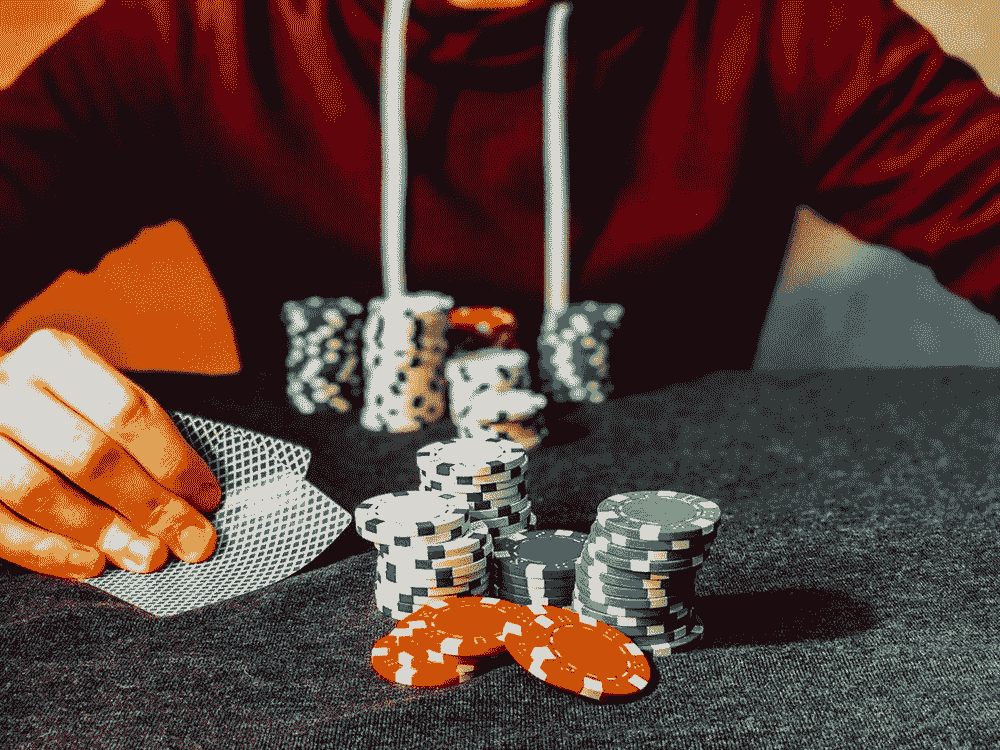
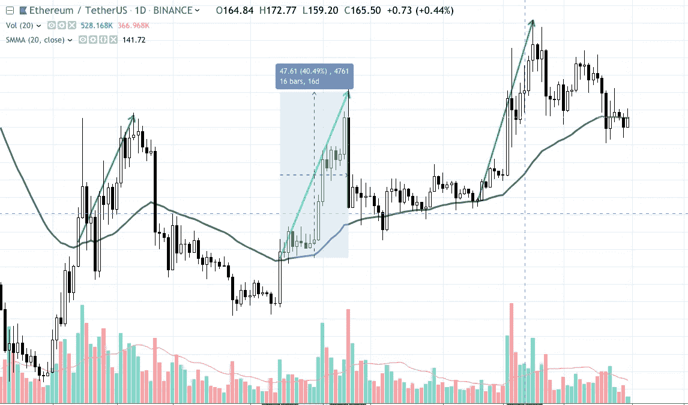

# 风险管理和指标使用

> 原文：<https://medium.com/coinmonks/a-simple-plan-to-make-simple-gains-in-any-tradable-asset-50c3a51bab3a?source=collection_archive---------0----------------------->

The odds are against you ([Credits](https://unsplash.com/photos/vBpd607jLXs))

这篇文章在我的愿望清单上已经有很长一段时间了，作为一个想分享自己想法的交易者，写作可能是一项失业技能。

这篇文章是给那些想通过交易任何资产类别获得收入的人的一条简单的建议。股票、债券、外汇或密码。这两件事是

**风险管理**和**指标使用**。先说风险管理。

它是什么意思，如何帮助你作为交易者赚钱？

天气好的时候，交易者盈利或亏损的几率是 50:50。他赚钱或赔钱的机会对他来说是一样的。当然，这需要一个像样的贸易样本。

例如，需要交易 20 笔交易以达到 50:50 的平均盈亏。前 10 笔交易可能是亏损的，或者前 10 笔交易是盈利的，只要 A 没有受到影响，在没有外部因素影响市场的平静交易日进行买卖，那么随着时间的推移，达到 50:50 是必然的。

这就是风险管理发挥作用的地方。你看，风险管理有一个更复杂、更古怪的版本，但我喜欢把它理解为风险:回报比。在上面的例子中，用户的风险:回报比率是 50:50，因为不仅赢和输的机会是 50:50，甚至预期的利润和损失也是 50:50。

如果用户将改变预期的利润和损失，那么回报的风险可以相应地改变。

例如，赢和输的变化仍然是 50:50，但每次我都会获得 2%的利润，每次我输了，我都会以 1%的亏损退出交易。因此，即使我赢了 5 笔交易，输了 5 笔交易，假设初始投资额相同，我在赢的交易中实际获利 10%,在输的交易中只损失 5%。

通过简单地将预期回报:风险比(R: R)从 1:1(50:50 的另一种说法)改为 2:1。

建议的第二部分包括使用指示器。对于这个例子，我们将使用最基本的指标，如 SMA。如果一项资产的价格收盘时高于设定的 SMA 值，买入该资产，当价格低于 1 时卖出，这是一种非常常见的方法。

SMA crossover and support

现在我不想说 SMA 是一个完美的赚钱机器，但是随着时间的推移，标记的目的是帮助你增加赚钱的机会。

如果 10 笔交易中有 6 笔是成功的，那么它已经完成了它的使命。这取决于交易者应用前面的风险回报方法，并使用 2:1 的 R: R 进一步放大最终收益。如果该计划在 5 次胜利的情况下盈利，5 次失败将比它在 6 次胜利的情况下盈利更多，使用技术指标失败。

10 个中的 6 个归功于指标，2:1 的胜算归功于风险管理。假设你的预期利润是 4%,风险是 2%,那么 10 笔交易的总收益将接近 16%。

最好的东西是简单的，只是人们不再相信它简单了:-)

上述方法仍然需要耐心和实践，即使是最简单的事情。

希望这能帮你挽回利润，减少损失。

我目前正在做一个工具贸易计划。co 是一个密码交易所技术指标的筛选工具，可以节省你寻找好的密码进行交易的时间。

或者联系我 [@Shakks](https://twitter.com/shakks)

> [在您的收件箱中直接获得最佳软件交易](https://coincodecap.com/?utm_source=coinmonks)

