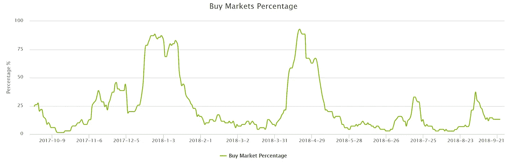
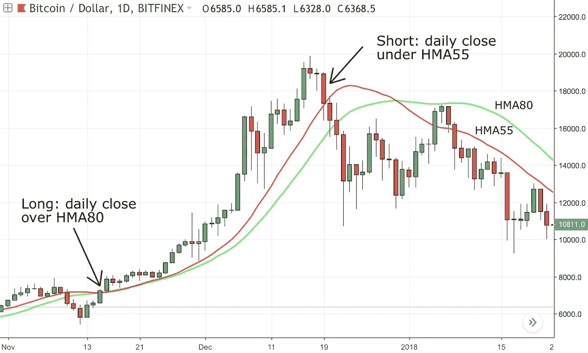
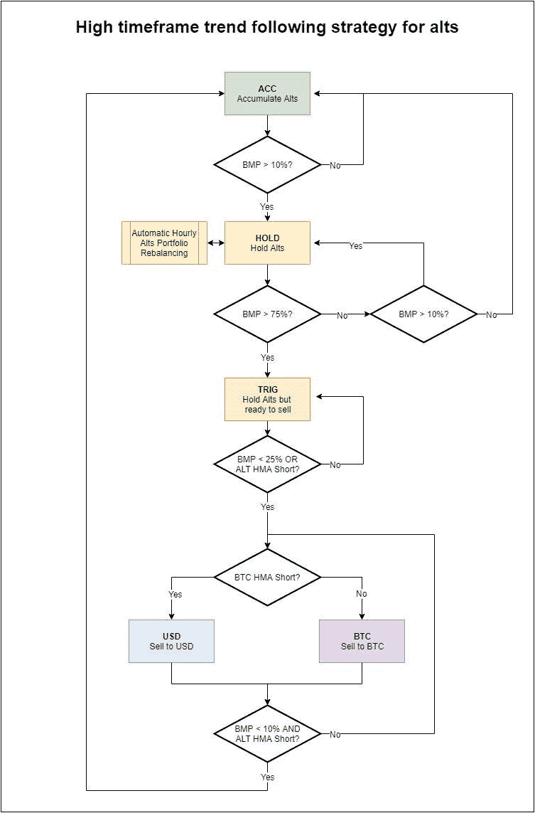
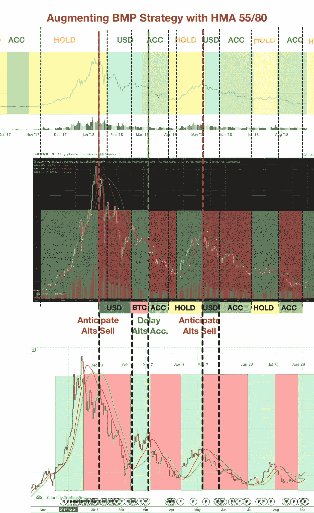
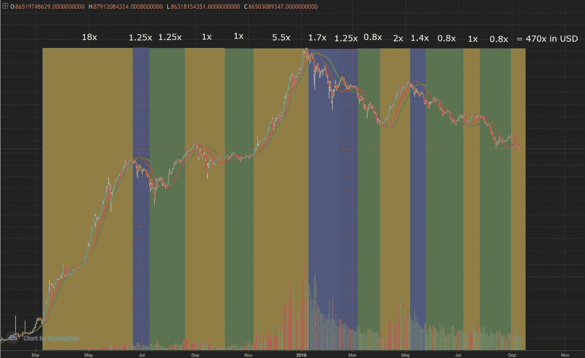
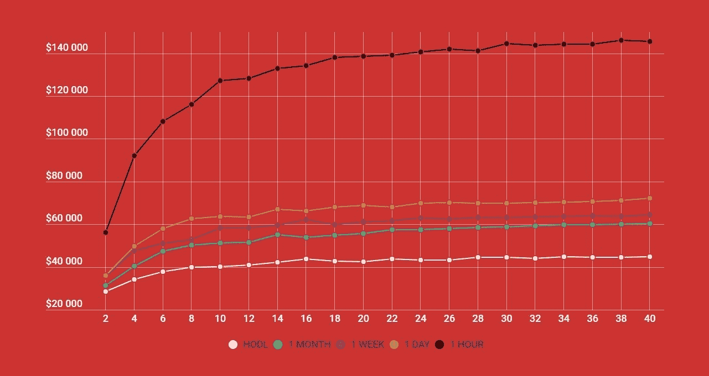

# 替代硬币头寸交易策略

> 原文：<https://medium.com/coinmonks/a-simple-strategy-for-altcoins-trading-4ef161b77a8c?source=collection_archive---------0----------------------->

# 介绍

替代硬币交易有难以置信的利润潜力。每个密码交易员都不可避免地被吸引到这一点。不幸的是，交易代用币释放了潜在的损失，无论是 BTC 还是美元。

交易替代币就像 3D 象棋。替代硬币的价格变动相互关联，也与 BTC 相关，尤其是当 BTC 倾销时。将所有这些因素结合在一起会很棘手和令人困惑，尤其是在高时间框架内，交易的情感因素非常强烈。

Crypto 3D Chess is puzzling

考虑到“历史不会重演，但往往会重演”，有必要制定一项战略来帮助探索这些未知领域。我在这里展示的策略属于仓位交易范畴，它适合生活规律的普通人。决策是在日常层面上做出的。每天 5-10 分钟应该足够检查指示器，并根据需要采取相应的行动。

让我们开始解释我们正在使用的指标。

> 交易新手？试试[加密交易机器人](/coinmonks/crypto-trading-bot-c2ffce8acb2a)或者[复制交易](/coinmonks/top-10-crypto-copy-trading-platforms-for-beginners-d0c37c7d698c)

# *购买市场百分比指标*

该策略的核心是基于 TurtleBC 开发的一个指标，即[*【BMP】*](https://www.turtlebc.com/tools/buy_percentage?period=2years)*。*

BMP graph

TurtleBC 计算每个替代硬币对的高时间框架趋势跟踪信号。该图显示了“购买”硬币的百分比。

我们会用这个图来买入恐惧(当 BMP 低的时候)，卖出贪婪(当 BMP 高的时候)。

注:有[一个备选 BMP 图](http://www.cryptowho.de/charts/buy-market-percentage.)是由 [@whocrypto](https://twitter.com/WhoCrypto) 开发的。它遵循同样的原则，但速度更快一点。

# **船体移动平均线指示器**

然后通过使用基于赫尔移动平均(HMA)的策略来增强 BMP 指示器的性能。与其他移动平均线(如 SMA 和 EMA)相比，赫尔移动平均线通过给予最新价格变动更多的权重来减少滞后。

[i̇smail](https://medium.com/u/35c0f4543fea?source=post_page-----4ef161b77a8c--------------------------------)开发了一种策略，将两种信号(HMA55 和 80)应用于日线图。它适用于 BTC 和 alts aggregate marketcap(可以在 [CoinSignals](https://www.coinsignals.trade/) 上看到)。

这个策略很简单，你只需要对照两个 HMA 信号检查每日收盘价。规则如下:

**做空信号**:如果日线蜡烛线**在 **HMA55** 趋势线**下方方便地收盘，就会产生做空信号。

**多头信号**:如果日线蜡烛线在上方 **HMA80** 趋势线附近**收盘，就会产生多头信号。**

HMA strategy example

# 战略

该战略分为五个具体阶段:

## 1.ACC —累积高度

当 **BMP 低于 10%** 时，出现 ACC 阶段。这是使用你辛苦赚来的 BTC 和美元来积累游戏币的好时机。在这个阶段，低价位被过度销售，人们绝望了，他们放弃了他们的包。这个阶段提供了最好的风险/回报。你基本上是想购买恐惧。

但是如何积累 alts 呢？

对低价竞标来说，在市场买入的情况下进行单笔全进从来都不是一个有效的策略，尤其是在订单薄如纸的情况下。

在过去三年中，ACC 阶段的平均持续时间约为 23 天。一个有效的策略应该是通过美元成本平均法(DCA)进行积累。每天你用分配资金的 5%购买 alts。这降低了购买本地陀螺的风险。

## 2.保持——保持高度

当你积累了高度后，当 **BMP 超过 10%** 时，你将开始保持阶段。在等待期间，你只需要什么都不做，等待。

似乎很容易？错了，是很难的。在持有阶段，炒作会增加，你会被诱惑进入新的袋子，更频繁地交易。不要那样做。抵制诱惑，因为在持有阶段，新箱包的风险/回报已经不如 ACC 最优。

注意:在等待阶段之后，你可以回到 ACC。在这种情况下，不要出售你的投资组合。如果您有额外的美元和 BTC，您可以尝试在第二个 ACC 阶段平均降低更有前途的低价。

## 3.TRIG——保持低价，准备出售

在保持阶段之后，当 **BMP 超过 75%** 时，您将到达触发阶段。通常 alt 上的炒作达到了最大程度，每个人都相信他的硬币会翻转 BTC，并会谈论兰博斯，月亮等。在这个阶段，你仍然不需要任何东西，但你需要在心理上准备出售你的 alt 组合。这也很难，你很有可能与你的替代硬币联系在一起。做好销售的心理准备至关重要。

## 4.美元——卖给菲亚特& 5 英镑。BTC——销售给 BTC

在这个阶段，你将把你的代用币直接卖给菲亚特或 BTC。当 **BMP 低于 25%** 或当**高位 HMA 做空时，给出卖出信号。**

迅速执行销售行动至关重要。在你心中，这些信号应该被解释为“滚出去”的信号。当低价位开始倾销通常是一个野蛮的举动。

然后，你将使用 HMA 在 BTC 的策略来决定是卖给菲亚特还是 BTC。如果 HMA·BTC 做空，你会卖给菲亚特；如果 T2·HMA·BTC 做多，你会卖给 BTC。

有时卖给菲亚特更好，因为低价倾销是由 BTC 价格下跌引发的。记住:BTC 是国王。

然后，您将在第 4 阶段和第 5 阶段之间切换，直到满足重新累积备用硬币的条件，并再次开始循环。

工作流程浓缩在下图中:

Strategy workflow

例如，适用于 2018 年市场的战略给出了以下阶段:

Strategy example on 2018 crypto market

# 回溯测试

你可能想知道这个策略是否有效。我也是。

让我们对 2017 年和 2018 年的数据进行回测。您可以看到确定的阶段和每个阶段的美元回报。从 2017 年 3 月开始，该策略的回报是初始美元分配的 470 倍**。**

****

**Alt strategy backtesting**

**为了便于比较，我添加了 HMA55/80 BTC 策略的回溯测试。根据 HMAs，只要在 BTC 和美元之间转换，你就可以得到一个公平的 19x 19x T7 美元。**

****

**BTC strategy backtesting**

**纯 BTC 策略风险较低，但 alt 策略显示出 25 倍于 USD **的性能。****

**通过了解这些事实，你就可以决定投资组合的哪一部分应该配置给高风险/高回报的低价策略，哪一部分应该配置给风险较低的 BTC 策略。**

# **红利策略:投资组合再平衡**

**在持有阶段，你可以通过利用牛市趋势波动来进一步提高你的投资组合表现。**

**我的建议是用 [Shrimpy](https://shrimpy.io/referral?r=v5gA0vy4) (推荐链接)，一个自动再平衡的工具。Shrimpy 会自动买卖你的一小部分 alt，以保持他们在一个预定的价值。根据他们的研究，通过每小时重新平衡 20+ alts 投资组合，可以实现最佳性能。在等待阶段，这种技术应该比你的 alt 的简单 HODL 快 2-3 倍。**

****

**Hourly rebalancing of a 20 coins basket gives enhanced performance. (source: Shrimpy)**

# **结论**

**这种策略使用高时间框架。你永远也抓不到底部和顶部，但是你应该可以用最少的时间投资来跟踪它。**

**为了跟踪表现，我在 2018 年 9 月初在 20 个硬币的篮子上建立了 1 BTC 的头寸，并定期在 Twitter 上发布结果。**

**我要感谢以下客户，他们的宏观思维和指标对我的工作有很大帮助:**

**[https://twitter.com/ismailtarim977](https://twitter.com/ismailtarim977)
https://twitter.com/turtle_bc
https://twitter.com/WhoCrypto
[https://twitter.com/jiucrypto](https://twitter.com/jiucrypto)
[https://twitter.com/cryptic_monk](https://twitter.com/cryptic_monk)
[https://twitter.com/cryptorae](https://twitter.com/cryptorae)
[https://twitter.com/woonomic](https://twitter.com/woonomic)**

# **更多深入的文章**

## **研究 twitter 帖子**

**[https://Twitter . com/EtherSchtroumpf/status/1034158343626088448](https://twitter.com/EtherSchtroumpf/status/1034158343626088448)**

## **HMA 战略**

** [## 使用赫尔移动平均线的简单 BTC 摆动策略

### 我想分享一个我一直在尝试的简单策略，它可以帮助你决定什么时候是正确的…

medium.com](/@ismailtarim977/a-simple-btc-swing-strategy-using-hull-moving-averages-f68d8012ef14)  [## 一个简单的 ALTxBTC 价格指数和应用 HMA 策略来检测所有 Alts 的一般趋势…

### 加密市场策略系列的这一部分是关于检测整个低价竞标市场的趋势反转。到目前为止…

medium.com](/@ismailtarim977/a-simple-altxbtc-price-index-and-application-of-hma-strategy-to-detect-general-trend-for-all-alts-b7849d9c022d) 

## 投资组合再平衡

 [## 再平衡与 HODL:技术分析

### 这项研究的目的是描绘一幅公平的画面，说明再平衡作为一种策略如何符合霍德林。为了…

hackernoon.com](https://hackernoon.com/rebalance-vs-hodl-a-technical-analysis-6f341b0db9cd)  [## 多样化的加密用户表现更好[新研究]

### 这是你投资组合的一小步，回报的一大步。

hackernoon.com](https://hackernoon.com/crypto-users-who-diversify-perform-better-new-research-ebf775d348dd) 

> 加入 Coinmonks [电报频道](https://t.me/coincodecap)和 [Youtube 频道](https://www.youtube.com/c/coinmonks/videos)获取每日[加密新闻](http://coincodecap.com/)

## 另外，阅读

*   [复制交易](/coinmonks/top-10-crypto-copy-trading-platforms-for-beginners-d0c37c7d698c) | [加密税务软件](/coinmonks/crypto-tax-software-ed4b4810e338)
*   [网格交易](https://coincodecap.com/grid-trading) | [加密硬件钱包](/coinmonks/the-best-cryptocurrency-hardware-wallets-of-2020-e28b1c124069)
*   [密码电报信号](http://Top 4 Telegram Channels for Crypto Traders) | [密码交易机器人](/coinmonks/crypto-trading-bot-c2ffce8acb2a)
*   [最佳加密交易所](/coinmonks/crypto-exchange-dd2f9d6f3769) | [印度最佳加密交易所](/coinmonks/bitcoin-exchange-in-india-7f1fe79715c9)
*   [面向开发人员的最佳加密 API](/coinmonks/best-crypto-apis-for-developers-5efe3a597a9f)
*   [如何在 Uniswap 上交换加密？](https://coincodecap.com/swap-crypto-on-uniswap) | [A-Ads 审查](https://coincodecap.com/a-ads-review)
*   [WazirX vs CoinDCX vs bit bns](/coinmonks/wazirx-vs-coindcx-vs-bitbns-149f4f19a2f1)|[block fi vs coin loan vs Nexo](/coinmonks/blockfi-vs-coinloan-vs-nexo-cb624635230d)
*   [本地比特币评论](/coinmonks/localbitcoins-review-6cc001c6ed56) | [加密货币储蓄账户](https://coincodecap.com/cryptocurrency-savings-accounts)
*   什么是融资融券交易
*   [支持卡审核](https://coincodecap.com/uphold-card-review) | [信任钱包 vs 元掩码](https://coincodecap.com/trust-wallet-vs-metamask)
*   最佳[密码借贷平台](/coinmonks/top-5-crypto-lending-platforms-in-2020-that-you-need-to-know-a1b675cec3fa)
*   [免费加密信号](/coinmonks/free-crypto-signals-48b25e61a8da) | [加密交易机器人](/coinmonks/crypto-trading-bot-c2ffce8acb2a)
*   [杠杆代币的终极指南](/coinmonks/leveraged-token-3f5257808b22)**