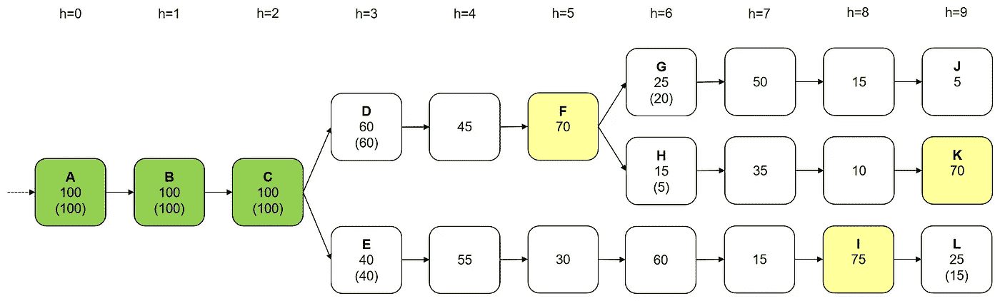

# 以太坊的卡斯帕简化版

> 原文：<https://medium.com/coinmonks/a-simplified-look-at-ethereums-casper-4fa9461b245?source=collection_archive---------5----------------------->

有多个版本的 [Casper](https://github.com/ethereum/wiki/wiki/Casper-Proof-of-Stake-compendium) ，文档是分散的，并且在不断发展，它现在被基因[和碎片](/@djrtwo/casper-️-sharding-28a90077f121)拼接在一起——即使这些都不是真的，也是沉重的东西。但是如果你把证据放在一边，我认为**在**操作中的样子——至少它的本质——是非常直观的。以下是我对 Casper 工作原理的简单理解。

> [发现并回顾最佳区块链软件](https://coincodecap.com)

(这里有各种重要的警告，我将在底部列出。他们归结为:其中一些可能是错误的；这个*有些*不对；我不是卡斯帕专家，请半信半疑。)

# 卡斯帕的投票演练

通常情况下，一次一个区块被添加到链中，利益相关者都投票支持它，它被最终确定，一切都很棒。

A Casper chain with 100 equal stakers (voters). The top number in each block is the number of ***votes*** the block received; bottom is the number who **voted to finalize** the previous block. Blocks A and B are **finalized** (green), because they received ≥2/3 votes in their own rounds (heights 0 and 1), plus ≥2/3 finalization votes in the next round (h=1 and 2). C is the current **nominee** for finalization (yellow, because it received 2/3 votes — aka **justified**), but not yet finalized: whether it receives the required 2/3 finalization votes will be tallied in the next round, at h=3.

但是有时在同一高度的竞争积木可能会使链条断裂。由于滞后，或临时网络分区，攻击，等等。

Two rounds later, C has been finalized: it received 60 finalization votes from voters for D, 40 from E. But the chain has now split between D and E, with neither winning the 67 votes needed to be nominated, a prerequisite for being finalized.

当出现分歧时，可能需要几轮投票，任何一个团体才能获得提名所需的 2/3 票数。即使某个区块被提名，它也可能无法在下一轮获得 2/3 的最终票数。(赌注者意味着每轮为一个区块投票，但包括最终投票是可选的-可以有 100 票，但没有最终投票。)

F is the first block since C to gain the 67 votes needed to be nominated. But in the next round (h=6) it gathers only 25 finalization votes (20 from G voters, 5 from H): F’s nomination failed, and voting for fresh nominees continues.

然而，至关重要的是，即使提名失败也会对选民产生影响。**投票最终确定被提名人的赌注人不能投票给冲突的被提名人**——一个不是他们投票最终确定的人的后代的人— **，直到一个新的被*其他*投票人提名。违反“不得反悔”规则的赌注者会被砍，也就是失去他们的赌注！**

The next nominees after F are I and K. I’s nomination also fails, getting only 15 finalization votes. Note here that the 25 who voted to finalize F (20 of the G voters + 5 H voters) **can only vote for descendants of F** — until I is nominated, which frees them to vote for its descendants as well.

最终，一些被提名者获得了超过 1/3 的最终票数。这是一个至关重要的转折点，因为在此之后，没有一个相互冲突的部门能够赢得 2/3 的提名而不削减一些赌注。因此，一旦某个区块超过 1/3 的最终投票，与该区块相冲突的分支可能永远不会获得提名/最终确定。

K’s nomination technically failed: with 35 finalization votes, it fell short of the 67 needed for finalization. But because it got >33, K is now **soft-finalized** (light green): assuming no staker is willing to be slashed, the eventual finalized chain is guaranteed to be one of K’s descendants. The conflicting chains J and L are doomed.

总流程是:

1.  当出现分裂时，赌注者每轮投票，直到第 N 组获得 2/3 的选票，成为当前的被提名者。
2.  在 N 获得 2/3 后的回合，赌注者有(可选)投票敲定 N 的机会，发生三种情况之一:
    a) N 获得≥2/3 敲定票数:N 敲定，链重联。
    b) N 得> 1/3，< 2/3 定案票数:未定案，但 N 的分支是软定案——最终定案的块极有可能是 N 的后代.
    c) N 得≤1/3 定案票数:未定案。投票恢复到另一个被提名人获得 2/3，可能会和 n 冲突。

Here we see M eventually getting nominated (with 80>66 votes) and then finalized (85>66 finalization votes). This also implicitly finalizes all M’s ancestors (K, H, F, D, …). The chain is reunited and continues from M.

这个状态转换图总结了这个流程:

# 恶劣的条件

正如在[卡斯珀·FFG 论文](https://arxiv.org/pdf/1710.09437)中所描述的(并被证明的)，严格的条件是为了确保理想的性能:

*   “负责任的安全”:基本上，在不削减≥1/3 的利益相关者的情况下，没有冲突区块得到最终确定
*   “似是而非的活性”:终结永远不会被“卡住”，没有哪个块能够在没有人被削减的情况下实现终结

但另一种看待苛刻条件的方式是，他们强制执行上面的提名人投票逻辑(在投票确定另一个提名人后不投票给新的提名人，等等)，并且*该*逻辑确保这些属性。特别是，虽然 FFG 论文的第一个苛刻条件是常识(你每轮只能投票一次)，但第二个条件——无跨越规则**——更令人困惑:“你的投票不能跨越另一个。”**

在卡斯帕·FFG 中，每次投票都指定一个*目标*块(您正在投票的那个)和一个*源*块(2/3 先前投票的目标的祖先)。无跨度规则意味着，例如，如果您为高度为 7、源高度为 5 的目标块投票，则不能为高度≥8、源高度≤4 的目标再投票:第二次投票跨越第一次投票。

无跨越规则与我在上面的演练中调用的无反悔规则不太一样(简而言之，“投票完成后不投票给有冲突的新提名者”):

*   **不反悔原则:**作为赌注者，如果:
    1。你投票(高度 h)敲定 A 座(高度 h-1)；和
    2。后来(即高度 h+k 时)你投了 B 块，和 A 冲突；和
    3。A 和 B 之间的 B 的祖先块(即高度≥h，< h+k)没有一个得到 2/3 票。

然而，事实证明，无生成规则意味着无反悔规则。因此，由于卡斯帕·FFG 实施了无跨越规则，所以无反悔原则也适用。尽管这两条规则并不完全相同:

An example of how FFG’s **no-spanning rule**, because it involves specifying a vote’s source, is stricter than the above **no-reneging rule**. You’ve voted for B (with source A) at height 1, C (source B) at h=2, and D (source C) at h=3\. Now, at h=4, you vote for E with source D. This is fine: none of your four votes span each other. However, if you voted instead for E with source **B**, this would span your previous vote (D with source C), and you would be slashed — despite none of these blocks conflicting with each other. For some other work on “Why is the FFG paper’s no-spanning rule unnecessarily slashing these votes?”, see [Daniel Lubarov](https://medium.com/u/85cfa7a61097?source=post_page-----4fa9461b245--------------------------------)’s [tweak](https://ethresear.ch/t/casper-ffg-leniency-tweak/2286) from June and [Justin Drake](https://medium.com/u/b51f98a74dce?source=post_page-----4fa9461b245--------------------------------)’s [further refinement](https://ethresear.ch/t/a-tight-and-intuitive-casper-slashing-condition/3359) this week.

我认为不反悔规则更直观，也更可取，因为它消除了投票中令人困惑的源参数。然而，上面的无否认定义的第 3 条(“B 的无祖先块……”)可能比无跨越规则更难实施。实现第 3 条的一个方法是多步削减协议:我对你的一对投票提出质疑(最终确定 A，投票给 B)；你有一段时间(例如，一个月)来应对高度> A 的阻挡， **I 被砍。或者有更简单的方法。**

在任何情况下，无跨越规则或无反悔规则都会导致上面演练中描述的提名人投票逻辑。

正如[帕特里克·杜根](https://medium.com/u/f67ecae5b94f?source=post_page-----4fa9461b245--------------------------------) [指出的](https://twitter.com/duganist/status/1039133243042353157)，这些规则，尤其是不可反悔规则，在之前的共识协议中有明确的先例，比如 [Jae Kwon](https://medium.com/u/c010ef5a0ddf?source=post_page-----4fa9461b245--------------------------------) 的 [Tendermint](https://tendermint.com/) 及其[锁定规则](https://tendermint.readthedocs.io/en/latest/introduction.html):“一旦验证器预提交一个块，它就被锁定在那个块上。然后，1。它必须为锁定在 2 上的块进行预防。它只能解锁，并预提交一个新的区块，如果在随后的一轮中有该区块的波尔卡[2/3 投票]。”

# 证明

根据大众的要求，这里有证据表明，不可否认规则确保了可问责的安全性和可信的活性，正如 FFG 的无跨越规则所做的那样。

**安全性:**我们想说明的是，如果两个冲突的区块都被定案，则≥1/3 的赌注会被削减。设两个块是高度为 h 的 A 和高度为 h+k 的 B .设高度为 h+j 的 B '是高度最低的 B(或 B 本身)*的祖先> h，*得到 2/3 票。(由于 B 本身获得了 2/3 的选票，因此至少有一个这样的区块:B。)从这个定义可以直接得出，A 和 B '之间的 B '的祖先没有获得 2/3 的选票，并且 B '与 A 冲突。因此，根据不可否认规则，同时投票给 A 和 B '的≥1/3 的赌注者被削减。

活性:我们想要展示，只要不断添加新的块，一些新的更高的块总是可以在没有任何人被削减的情况下完成。但这很简单:当前被提名者的后代(即获得 2/3 选票的最高身高块)总是可以被 100%的赌注者投票，然后最终确定，而不违反不得反悔的规则。(这条规则只是防止已经投了最后一票的利益相关者加入到有冲突的被提名者的*提名*中:一旦它已经获得了 2/3 的选票，就像当前的被提名者一直做的那样，他们可以自由地投票支持它。)

**无跨越意味着无反悔:**作为奖励，这里有一个证明，任何违反无反悔原则的行为也是违反无跨越原则的行为。假设你违反了无反悔原则，意思是:1。你在高度 h 投票最终确定 A 在 h-1，2。后来(即在高度 h+k)你投了冲突块 B，3。A 和 B 之间的 B 的祖先块 B '没有得到 2/3 票。由于投票的来源必须有 2/3 的选票，因此，你投票给 B 的来源必须在高度 h-1-j:即低于 A 的高度。因此，你投票给 B(高度 h+k，来源高度 h-1-j)跨越了你的投票以最终确定 A(高度 h，来源高度 h-1)。

# 警告

1.  本文档仅代表我的理解，可能包含错误——如果有，请告诉我！我不是卡斯帕专家。
2.  这是为了向已经模糊熟悉 Casper 的人阐明它的工作原理。如果你完全是绿色的，你可能会发现这些有用的辅助读物:以太坊股份有限公司的常见问题解答(FAQ)、 [Blockgeeks](https://medium.com/u/aabebde780bb?source=post_page-----4fa9461b245--------------------------------) 、 [Casper 速成班](https://blockgeeks.com/guides/ethereum-casper/)、 [jon choi](https://medium.com/u/4c28429586dd?source=post_page-----4fa9461b245--------------------------------) 的 [Casper 101](/@jonchoi/ethereum-casper-101-7a851a4f1eb0) 和 [Casper FFG 论文](https://arxiv.org/pdf/1710.09437)。
3.  我有意简化了一些重要的方面。卡斯帕·FFG 在检查点上操作，而不是在每个块上操作，因为投票决定每个块会产生很大的开销而没有什么好处。但是没有概念上的原因使算法不能在每个块上工作:一个检查点实际上是每第 100 个块。所以为了简单起见，我用块来表示一切。
4.  简化#2:我谈论“之前”和“之后”，例如，“没有投票给新的冲突被提名者 B **在**之后，你投票给最终确定的 a。”但在实践中，时间很难强制执行:仅仅因为我检测到你在 v2 之前投票 v1 并不意味着你以那个顺序发送它们。所以当我在这篇文章中使用“之后”时，我真的是指“在更高的高度”的简写。换句话说，我假设利益相关者按照身高增加的顺序投票——表现良好的利益相关者应该这样做。但是苛刻的规则并不能真正执行时间，只能执行高度。
5.  简化#3:我假设每个赌注者每轮都投票，并且赌注者的集合从不改变。我不认为移除这些假设会对上述任何论点造成致命打击，但这会让它们变得更加混乱。
6.  在部分演练中，我几乎假设没有任何利益相关者会以导致他们被砍的方式行事(投票)。当然，也有攻击者接受被砍成本的攻击，但这种情况非常罕见，我的主要目标是展示 Casper 在“大部分时间”的运行情况。
7.  我使用了一些我认为更清晰或更简洁的特殊术语——用“被提名者”而不是“正当的”，用“利益相关者”而不是“验证者”，等等。对于由此引起的任何困惑，我深表歉意。

这篇文章的大部分只是充实我最初的想法[试图](https://twitter.com/JaEsf/status/1037941155210649601) [适合](https://twitter.com/JaEsf/status/1037960095412486144) [成](https://twitter.com/JaEsf/status/1039031211660783616) [推文](https://twitter.com/JaEsf/status/1039042096932573184)。感谢[贾斯汀·德雷克](https://medium.com/u/b51f98a74dce?source=post_page-----4fa9461b245--------------------------------)、[@马修 _ d _ 格林](https://twitter.com/matthew_d_green)、[丹·罗宾逊](https://medium.com/u/10c4e6618569?source=post_page-----4fa9461b245--------------------------------)、[丹尼·瑞安](https://medium.com/u/d607259e3794?source=post_page-----4fa9461b245--------------------------------)等人极具教育意义的讨论和指正。也要感谢简对永恒的[仪式的第二部分习惯性的](https://www.youtube.com/watch?v=5VR7dGxgptw&t=20m28s)，这帮助我完成了这件事。

> [在您的收件箱中直接获得最佳软件交易](https://coincodecap.com/?utm_source=coinmonks)

