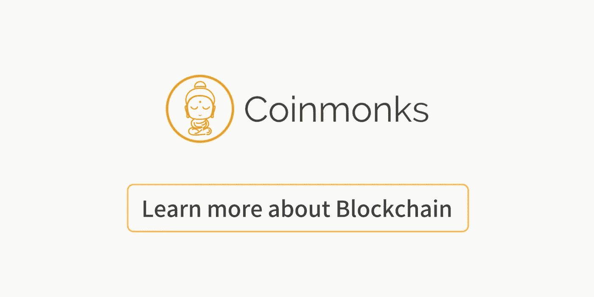

# 区块链和加密播客的小型精选列表

> 原文：<https://medium.com/coinmonks/a-small-curated-list-of-blockchain-and-crypto-podcasts-bd4e0d65119e?source=collection_archive---------3----------------------->

[source](https://www.google.co.in/search?q=podcast&newwindow=1&source=lnms&tbm=isch&sa=X&ved=0ahUKEwjEgomm_O7aAhUL4o8KHW_zC6YQ_AUICigB#imgrc=Jg_tkWOV0bl4sM:)

在过去的一年里，我一直致力于研究和开发基于区块链的解决方案。这是一种新的范式，一切都变化得非常快，就像开源世界一样，我要说，更加令人兴奋。事情很多，很难跟上。真正帮助我跟踪新技术的资源之一是播客，我在开车、排队、慢跑甚至洗澡时都会听。我认为这是更有效利用“空闲”时间的好方法。这是我最喜欢的区块链播客的一个小列表。

# 软件工程无线电

这是我所知道的最好的工程播客之一，他们的区块链分会为工程师们提供了很多很棒的内容。

软件工程广播是一个针对专业软件开发人员的播客。我们的目标是成为一个持久的教育资源，而不是一个新闻节目。每个月三到四次，他们发布新的一集，与软件工程领域的专家讨论对专业开发人员至关重要的各种话题。

[softwareengineeringdaily.com/category/blockchain](https://softwareengineeringdaily.com/category/blockchain/)

# 中心

这是另一个伟大的播客。它涵盖了去中心化技术，包括比特币、区块链、加密货币和其他分布式系统。

[央广](https://epicenter.tv/)

# 变更日志

Changelog 是一个播客和工程社区，涵盖了开源中的新鲜事物。以黑客、领导者和 OSS 世界的贡献者为特色。

【changelog.com/topic/blockchain 

# 区块链创新

每周二，Frederick Munawa 都会采访区块链和加密货币领域最聪明的人——企业家、高管和顶级学者——讨论区块链技术的当前和未来应用，了解他们如何在最初的硬币发行(ico)和代币销售、公共区块链、私人区块链、比特币、以太坊、Hyperledger、智能合约等方面突破极限

[blockchain.global/blockchain-innovation](http://blockchain.global/blockchain-innovation/)

# 区块链内幕 by 11:FS

在真正享受所有的 11FS 播客。由西蒙·泰勒和科林·G·普拉特主持的《区块链内幕》是一个专注于比特币、区块链和分布式账本技术(DLT)的播客

[blockchain.global/blockchain-innovation](http://blockchain.global/blockchain-innovation/)

# 释放

在本播客中，主持人劳拉·申(Laura Shin)是一名独立记者，负责报道所有与加密相关的事情，她与行业先锋谈论了加密资产和区块链将如何改变我们赚钱、花钱和投资的方式。

[unchainedpodcast.co](http://unchainedpodcast.co/)

# 密码经济学

Niklas 和 Fabian，两位来自瑞典的工程师/经济学家，对加密货币和区块链非常感兴趣。

他们不仅从技术角度看待加密货币，还从整体角度考虑了经济影响。

【youtube.com/channel/UCB18fYf4aoWz7Bi4PfBIvAg 号

# 区块链 360

这个播客是作为一种帮助解释和帮助其他人了解更多关于区块链的方式而创建的。它旨在成为行业领袖对区块链现状的讨论，讨论当前利用区块链的项目，以及对区块链潜力的前瞻。

【blockchain-360.com 

# 加油 EOS

增强 EOS 的能力，永远是第一位的。社区中心，媒体，永远中立 web 3.0 的未来。

[eosrad.io](http://eosrad.io/)

这些是我的推荐，我听过并喜欢的播客。在 player.fm 上你可以找到更多的 player.fm/podcasts/Blockchain

如果你有好的播客推荐，请与我分享。

**关于我:**

我是软件工程师和顾问，开源技术栈和分散应用的支持者；我担任过几个工程领导角色，并且是 BlockchainCR 的联合创始人，BlockchainCR 是一个研究和开发区块链应用程序的社区中心。EOS 爱好者和 OSS 贡献者[github.com/eoscostarica](https://github.com/eoscostarica)。

*本文原载于* [https://gaboesquivel . com/blog/2018/my-favorite-区块链-工程和加密播客/](https://gaboesquivel.com/blog/2018/my-favorite-blockchain-engineering-and-crypto-podcasts/)

Click to learn more about blockchain