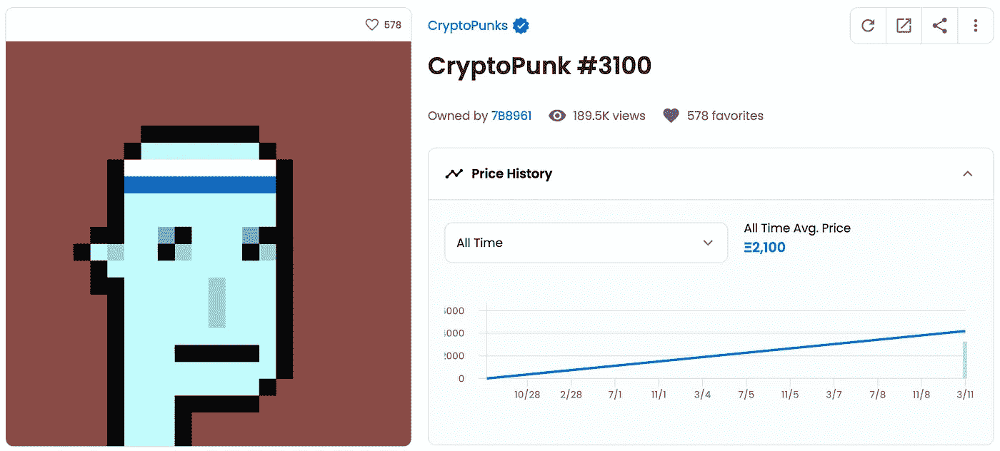
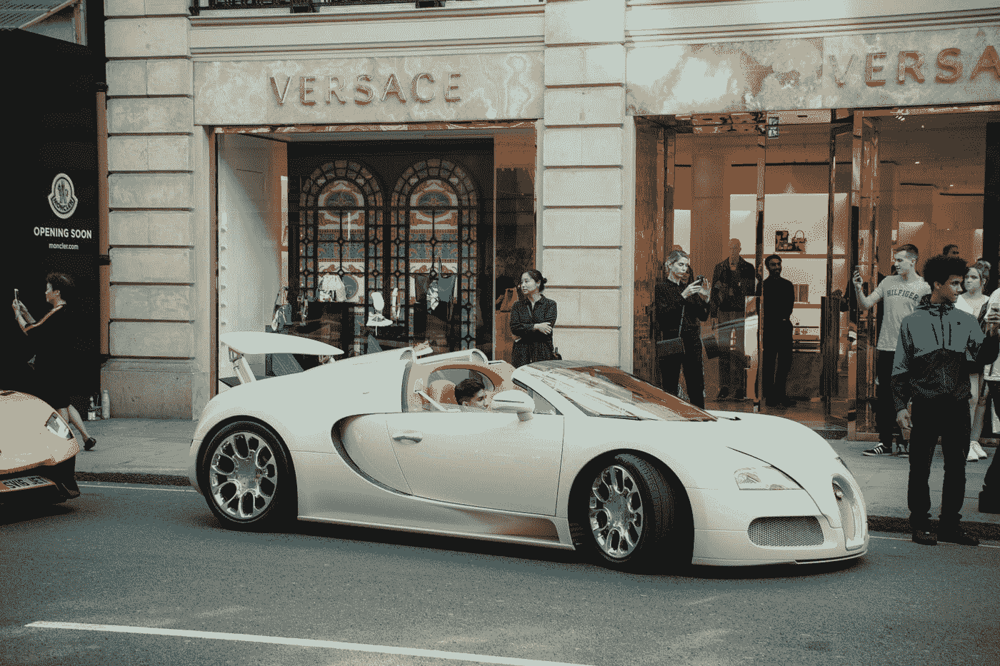
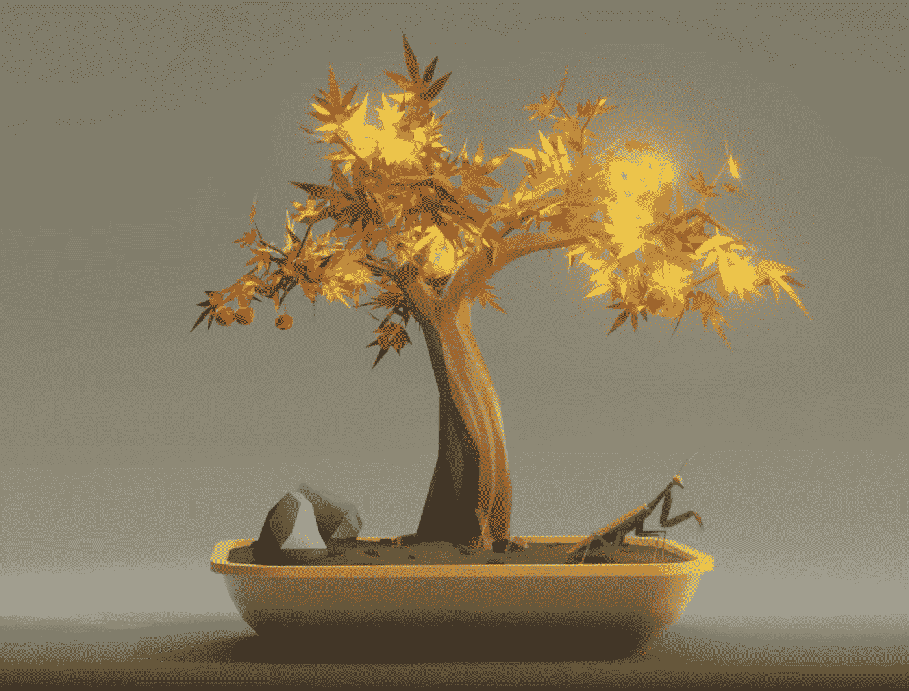

# NFT 收藏品的钢铁人

> 原文：<https://medium.com/coinmonks/a-steel-man-for-nft-collectibles-b3edec261a8a?source=collection_archive---------9----------------------->

*Let’s pretend this guy’s blue, pixelated complexion is made of* [*steel*](https://www.urbandictionary.com/define.php?term=Steel%20man)*.*

但首先，一些稻草人:

*   支付数千美元，如果不是数百万美元来“拥有”一个 JPEG。JPEG 文件甚至没有存储在区块链上，所以你实际拥有的是一个对 JPEG 文件的引用。
*   这通常是含糊不清的什么样的许可，商业，或法律权利是附属于上述参考。
*   铸造新的 NFT 非常容易，这意味着艺术家可以向市场注入新的供应来满足任何需求。
*   许多项目是明显的骗局，模仿，或抢现金。贪婪和多层次营销的味道弥漫在空气中。
*   郁金香。

我到处寻找一个合理的(不要过度宣传)解释，为什么可收藏的 NFT 不只是 ICOs 2.0，但最终一无所获。

…这让我很担心。一些聪明、可信的人似乎非常看好 NFT。他们看到了什么我看不到的？

经过大量的观察和分析，以下是我最有力的论据*支持*可收藏的 NFT。我希望读它能像写它一样帮助你。

# 为什么 NFTs *可能有价值*

如果一部经久不衰的小说围绕着一件 NFT 收藏品建立起来，那么它将会保持价值。

通过例子来说明这一点:

*   圣诞节是一个经久不衰的虚构，有两千年的先例、美好的童年记忆、忠实信徒的核心以及价值数十亿美元的经济活动作为支撑。
*   莫奈是一部经久不衰的小说，以历史先例和精英艺术策展人、历史学家和收藏家的品味为后盾。
*   美元是一个持久的虚构，由几十年的网络效应和锁定，世界上最大的经济体，以及霸权肌肉的偶尔弯曲所支撑。
*   比特币最初是一个由哲学、密码学和聪明的激励机制支持的无力的虚构。因为这种理念引起了共鸣，其应用也很合理，所以对比特币的信念传播开来，并最终获得了持久性。

用客观的、内在的价值来描述上述任何一项都不太准确。但是主观的、旁观者的偏好也不能真正抓住他们。

相反，他们的价值主要来自于其他人认为他们有价值的事实。

这种现象的时髦说法是[主体间](https://www.oxfordreference.com/view/10.1093/oi/authority.20110803100008603)。一旦你学会了，你就会发现它无处不在。

根据这一观点，NFT 收藏品与比特币、棒球卡、时尚品牌和任何其他主体间虚构物一样，利用了同样的价值机制。

As [Hook](https://youtu.be/EiAy1DteURo?t=50) taught us, Tinkerbell is an intersubjective fairy.

*美元耐久性目前正在接受压力测试。🤷

# 争论不休

这位看涨的 NFT 收藏家谈到了出处、稀有属性和赋予艺术家的权力——同时假设这种所有权代表任何实际价值，这种假设尚未持久。

悲观的 NFT 怀疑论者批评内在价值的缺乏、供给和需求，以及群体的疯狂——同时忽略了同样的论点可以适用于每一个主体间现象的事实。

随着时间的推移，NFT 价值的虚构将受到检验，就像比特币受到检验一样:

*   当前炒作周期消退后会发生什么。
*   新资金涌入(或缺乏)这个空间。
*   机构和名人的兴趣(或冷漠)。
*   到下一次密码市场 50%的修正时。
*   法律法规的改变。
*   被一些不可预见的黑天鹅。

取决于这一切如何发展，它的虚构可能会变得更强大，更广泛…或者它可能会粉碎。

以下是支持前者的几个貌似合理的说法。

# 给秘密千万富翁的纪念品？

大家都是这么想的，我们不妨从它入手。

炫耀性消费发生在一个人的社会群体中。如果你认识的最有声望的人开宾利，你也会想要一辆宾利。如果你的英雄和榜样开着特斯拉，你会莫名其妙地被吸引去拥有一辆特斯拉。

如果你的目标是在一个由密码极客、技术影响者和雪地撞击爱好者组成的松散联盟中购买[声望](https://meltingasphalt.com/social-status-down-the-rabbit-hole/)，拥有一个密码朋克比拥有一艘游艇划算得多。

Selfie with your new Bugatti? Tasteless. Rare NFT as your profile photo? Pure class. ([image source](https://unsplash.com/@jakevizek?utm_source=medium&utm_medium=referral))

因此，只要有人把他们的新财富归功于 crypto，就会有相关的、多愁善感的观众观看最早的、最具标志性的 NFT 项目。也许我们会把这种艺术风格作为这个时代的象征来回顾——极客的审美，侧面图片的长宽比，含糊不清的荒谬的讽刺拥抱。

收集这样的作品意味着你很早——你有远见。它标志着你是一个独家，技术，文化俱乐部的内部人员。极客精英。隐密*暴发户*。

即使这批收藏者只有几万人，也有可能维持一个需求底线。也没有那么多艺术品的买家。

# 下一代商业模式？

今天，我们生活在订阅的黄金时代。我们订阅软件、音乐、电影、长尾价值的内容和服务。

但是 10 年后还会是这样吗？还是订阅本身会被更好的商业模式所取代？

NFT 允许创造者和他们的顾客以迷人的方式重写规则和激励。例如:

*   艺术家可以从未来的作品销售中获得 5-10%的收入。
*   社区可以出售有限的可交易会员资格的非功能性交易。
*   策展人可以“投资”给崭露头角的创作者。
*   奖励可用于激励直接参与或长期忠诚。

总之，这些结合了 Patreon、Kickstarter、Substack、股票市场、航空积分、手机游戏等最有趣的方面。

悄悄的，他们也可以将许多购物的心理分类从“花费”推到“投资”这是强大的定价巫术:

> 奢侈品似乎是自我放纵的。投资绕过了这些警报。你没有花这笔钱；你只是把它从一种资产转移到另一种资产。
> 
> — [保罗·格拉厄姆](http://www.paulgraham.com/selfindulgence.html)

NFTs 不会取代所有订阅…但对于许多“1000 名真正的粉丝”用例来说，它已经描绘了一幅非常引人注目的画面。

# 趋势引领者的赞助？

名人是文化和模因的超级传播者。只要名人对非英语专业感兴趣，非英语专业就会分享他们的关注。这不仅是免费的广告，也是一种合法性的授予——高质量的社会证明。

在奢侈品牌、化妆品和运动服之间——我们有充分的证据表明，数十亿美元的产业可以依靠名人的影响力。

谁知道呢？也许是为了模仿他们的偶像，一代隐姓埋名的青少年会把他们的零花钱花在“设计师”非功能性测试的长尾上。

这种集中式版本已经在 MMORPGs 和虚拟世界游戏的封闭系统中发生了。很难想象未来的高中地位等级会(部分)由你的头像的稀有程度决定吗？

# 采用数字所有权规范？

乍一看，物理所有权似乎是一个防弹，显而易见的措施。有什么比实际拥有某物——比如说，拥有土地——更客观呢？

但请考虑以下情况:谁“拥有”你土地上方的天空？还是下面的分水岭？生长在你土地上的植物种子被风吹走了怎么办？

一旦你开始探索边界，你就会意识到所有的“所有权”都依赖于一个复杂的社会规范、法律、优先权和隐含假设的网络。

数字所有权也不例外——只是更抽象，更不直观，更没有先例可循。数字所有权的新生边界目前正在 DRM、合理使用、修复权、模仿 Twitter 个人资料等领域形成。

今天，除了一小部分真正的信徒之外，你控制一个 JPEG 的加密引用的事实没有什么意义。但这并不是说，未来技术、法律优先权和社会规范的某种结合不会让这个预言成真。

# 收场白

在写这篇文章的时候，我花了几个晚上浏览 OpenSea，探索收藏，接受模式，并试图把自己放在一个收藏家的位置上。

奇怪的是，我的一部分*渴望*收集并拥有这些物品——尽管我不相信这种所有权的力量。我还注意到，对于其他人也认为有价值的品质，我有一种直觉和本能的把握。

不管是运气、时机还是真正的创新，NFT 已经成功地挖掘了人性的一些深层模式。如果它的虚构被广泛相信，那么它的市场将是巨大的。

尽管我有更好的判断，但我发现自己沉迷于花一小部分钱买一棵 3D 盆景树的想法。

*我想，这个项目和其他的*不一样。

*任何厌倦了像素艺术、抽象几何和退化动物的人都会被吸引到这里……*

*这个主题和审美让我产生了共鸣……*

*最受欢迎的组合价格已经很高，但一些属性似乎被忽略了……*

亚洲有很多迷信的金钱。8888 棵树？金色枫叶？这可能有腿！

我睡觉的时候想着这件事。

第二天呢？

我买了一个。

#1020 from the [Bonsai by ZENFT](https://opensea.io/collection/bonsai-zenft) collection. Is it mine? Who knows!

它是纪念品吗？研究费用？投机投资？FOMO 引发的判断失误？

老实说，我不确定。

> 加入 Coinmonks [电报频道](https://t.me/coincodecap)和 [Youtube 频道](https://www.youtube.com/c/coinmonks/videos)了解加密交易和投资

## 另外，阅读

 [## 最佳加密交易所| 2021 年十大加密货币交易所

### ICON _ PLACEHOLDEREstimated 预计阅读时间:28 分钟加密货币交易所的加密交易需要知识…

blog.coincodecap.com](https://blog.coincodecap.com/crypto-exchange)  [## 2021 年 10 大最佳加密贷款平台| CoinCodeCap

### 当谈到加密货币贷款时，大量因素等同于良好的收入状况。此外，借款的一部分…

blog.coincodecap.com](https://blog.coincodecap.com/crypto-lending)  [## 2021 年最佳免费加密交易机器人

### 2021 年币安、比特币基地、库币和其他密码交易所的最佳密码交易机器人。四进制，位间隙…

medium.com](/coinmonks/crypto-trading-bot-c2ffce8acb2a)  [## 最佳 4 个加密交易信号电报通道

### 这是乏味的找到正确的加密交易信号提供商。因此，在本文中，我们将讨论最好的…

medium.com](/coinmonks/best-crypto-signals-telegram-5785cdbc4b2b)  [## BlockFi 评论 2021:利弊和利率| CoinCodeCap

### 今天，我们提出了一个全面的 BlockFi 评论，这是一个成立于 2017 年的加密贷款平台，拥有其…

blog.coincodecap.com](https://blog.coincodecap.com/blockfi-review)  [## 如何在印度购买比特币？2021 年购买比特币的 7 款最佳应用[手机版]

### 如何使用移动应用程序购买比特币印度

medium.com](/coinmonks/buy-bitcoin-in-india-feb50ddfef94)  [## 加密税务软件——五大最佳比特币税务计算器[2021]

### 不管你是刚接触加密还是已经在这个领域呆了一段时间，你都需要交税。

medium.com](/coinmonks/best-crypto-tax-tool-for-my-money-72d4b430816b)  [## 存储比特币的最佳加密硬件钱包[2021] | CoinCodeCap

### 保管您的数字资产很容易，但找到正确的存储方式却是一项繁琐的任务。在线钱包有一个风险…

blog.coincodecap.com](https://blog.coincodecap.com/best-hardware-wallet-bitcoin)