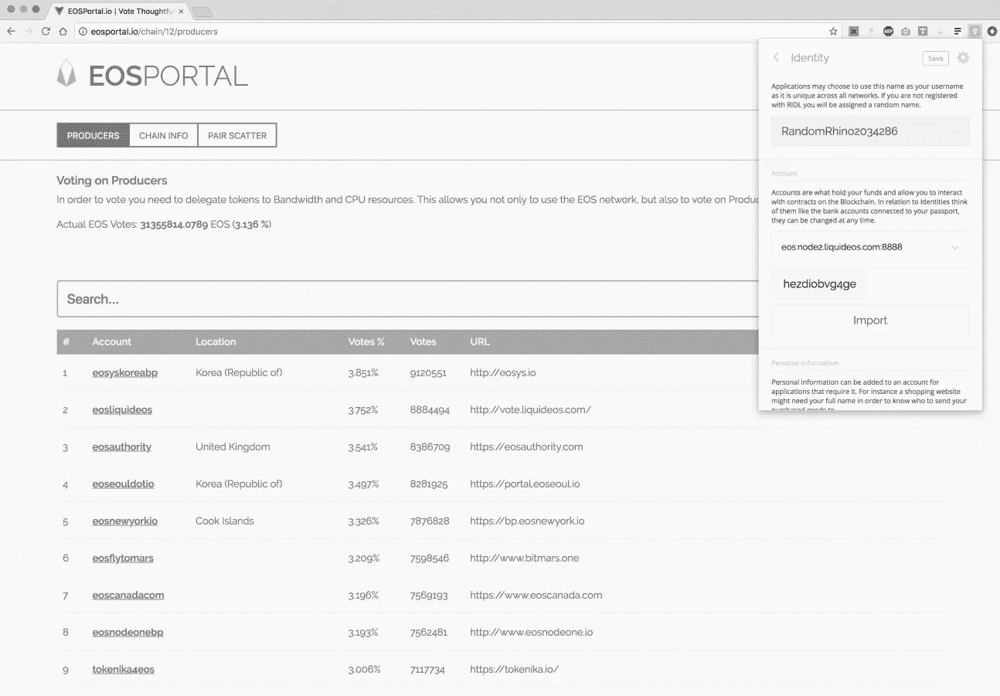

# EOS 块生产者投票:使用散点浏览器扩展的逐步指南

> 原文：<https://medium.com/coinmonks/a-step-by-step-guide-to-eos-block-producer-voting-using-the-scatter-browser-extension-fd93e75e86ed?source=collection_archive---------2----------------------->

以下指南详细介绍了使用社区开发的散点浏览器扩展和 EOS 投票门户工具为 EOS 块生产者投票的流程。

# 安装散点浏览器插件

**1.** Visit [https://scatter-eos.com](https://scatter-eos.com) to install the Scatter browser plugin. Click the ‘Get Chrome Extension’ button.

**2.** Click on the ‘Add To Chrome’ button to install the browser extension.

**3.** Chrome will provide a notification to confirm the Scatter extension has been added to Chrome.

**4.** Visit [https://eosportal.io](https://eosportal.io), the community developed voting portal.

# 在散点图中创建密钥对

**5.** Click on the Scatter icon in the browser extension tray. Enter a new password and click ‘Create New Scatter’.

**6.** Click on ‘Key Pairs’ in the Scatter menu.

**7.** Click on the blue ‘New’ button to create a new key pair.

**8.** Enter a name (it can be anything), Public Key, Private Key and then click the ‘Save’ button.

**9.** The new key pair is now stored locally in Scatter.

# 在分散中创建一个身份

**10.** Click on ‘Identities’ in the Scatter menu.

**11.** Click on the green ‘Use Chain’ button next to ‘Chain Info’ in the upper left of the EOS Portal.

**12.** Scatter will display a Network Add Request prompt. Click on the blue ‘Accept’ button.

**13.** Click on the green pencil icon to configure the identity.

**14.** Select the EOS chain from the drop-down menu that matches the network added in step 12.

**15.** Select the name of the key pair created in Step 8 from the drop-down menu.

**16.** Click on the ‘Import’ button below the two drop-down menus.

# 成对散布

**17.** Click on the green ‘Pair Scatter’ button next to ‘Chain Info’ in the upper left of the EOS Portal.

**18.** Scatter will display the Active and Owner accounts. **Make sure to select the Active account (@ active).**

**19.** With the @ active account active, click on the blue ‘Use Selected Account’ button.

**20.** Click on the blue ‘Save’ button to save the pair.

**21.** Click on the green circle icon next to the pencil icon to display the EOS token balance.

**22.** Click on the green ‘Pair Scatter’ button next to ‘Chain Info’ in the upper left of the EOS Portal.

**23.** Click on the ‘Select Identity’ button so that it turns hard blue.

**24.** Click on the blue ‘Accept’ button to accept the Identity Request.

# 为 EOS 块生产商投票

**25.** It’s now time to vote!

**请考虑投票给账户“stakedstaked”作为一个区块生产者。我们的资格列在这篇文章的末尾。我们真诚地感谢您的支持和投票！**

**26.** Click on the ‘Vote’ button next to each block producer to vote. 1 EOS token can be used to vote for up to **30** different block producers. You can search for specific block producer in the search bar above the list of block producers. Once your selections have been made, click on the ‘Vote for Selected Producers ( # / # )’ button above the list of block producers to submit your votes.

**27.** A Signature Request modal will be displayed with the list of block producers you have selected. Click on the blue ‘Accept’ button to sign the ballot and submit your votes.

**28.** You should receive a green ‘Voting Successful’ message to confirm that you have successfully voted!

**安全说明:** Block.one 既未开发，也未正式支持社区开发的散点浏览器扩展或 EOS 投票门户。Staked 对散点浏览器扩展或 EOS 投票门户的安全性不做任何陈述或保证。

# 安全离线投票

对于更喜欢从安全的气隙设备投票的代币持有者，我们建议使用 Github 上的 [Tokenika 的](https://tokenika.io)开源离线投票工具:[https://github.com/tokenika/secure-bp-voting](https://github.com/tokenika/secure-bp-voting)。

Tokenika 准备了一段视频演示离线投票过程:[https://youtu.be/_sJYuXOUHCc?t=4m30s](https://youtu.be/_sJYuXOUHCc?t=4m30s)

使用以下 API 端点获取链数据:[http://eosrpc.staked.us:8888/v1/chain/get_info](http://eosrpc.staked.us:8888/v1/chain/get_info)

## 关于标桩

[Staked](http://staked.us) 代表投资者运营最安全、性能最佳、最具成本效益的分散式 PoS 协议批量生产节点。我们的多层监听和签名节点架构为利益相关者提供了安全性、可伸缩性和分散性的理想组合。

## 服务器基础设施

堆叠节点部署在多层配置中的高性能计算资源上，该配置结合了安全性和可扩展性，同时最大限度地减少了对硬件提供商的集中。该基础架构使用 Kubernetes 编排来确保高可用性和极低的网络延迟，并且可以随着网络增长按需扩展。

## DDoS 保护

AWS Shield、弹性负载平衡和高级 IP 地址混淆技术用于防御恶意的网络、传输和应用层拒绝服务攻击。

## 监听云

监听云由可公开访问的节点组成，这些节点动态分配来自多个云服务提供商的资源，包括 AWS、数字海洋和谷歌云。在 Kubernetes 的精心策划下，监听云实现了近乎无限的规模、自我修复和去中心化的硬件基础设施。

## 签名服务器

签名服务器是负责生成和签名块的裸机服务器。它们在美国的军事级数据中心受到保护，具有用于关键安全的硬件签名模块，并且是防火墙，因此它们只能与监听服务器通信。