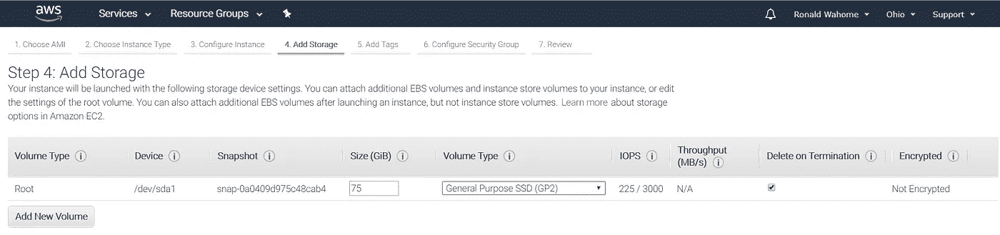
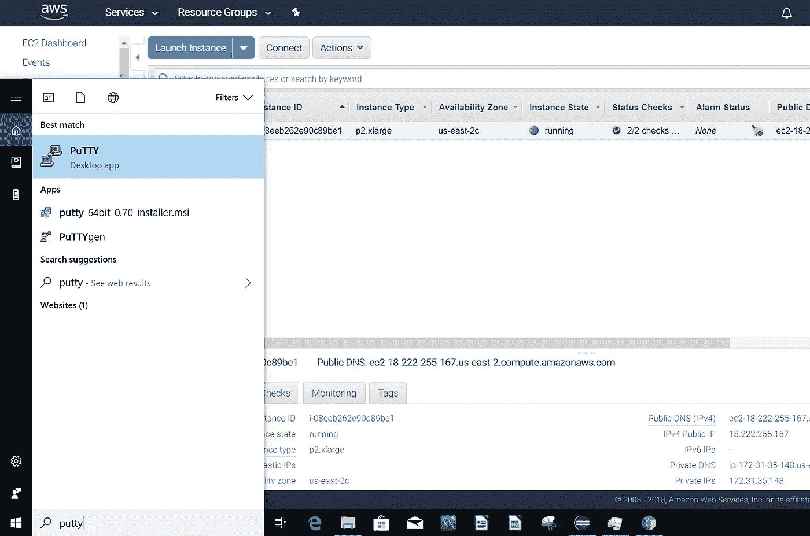
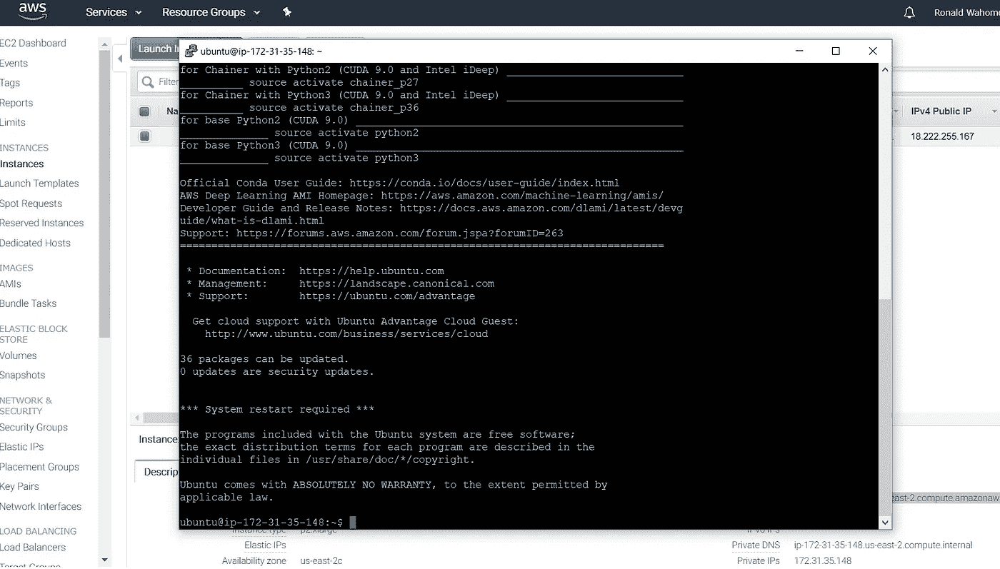

# 17 分钟设置好深度学习的 AWS EC2

> 原文：<https://medium.com/coinmonks/a-step-by-step-guide-to-set-up-an-aws-ec2-for-deep-learning-8f1b96bf7984?source=collection_archive---------0----------------------->


Photo by [Josh Riemer](https://unsplash.com/@joshriemer?utm_source=medium&utm_medium=referral) on [Unsplash](https://unsplash.com?utm_source=medium&utm_medium=referral)

在这篇文章中，我将一步一步地解释如何为深度学习设置一个 Amazon EC2 云实例。当我第一次使用 EC2 实例时，让云环境在 windows 机器上运行是一件非常痛苦的事情，在训练图像识别模型之前，我花了无数时间在互联网上搜索和修补信息。这篇文章假设你在 Windows 机器上，但是步骤几乎是一样的，尽管在 Linux 上更容易。这些步骤还通过默认设置运行，足以让您立即启动并运行。

深度学习是机器学习的一个子领域，涉及被称为人工神经网络的大脑结构和功能所启发的算法。深度学习最近一直在获得动力，特别是自从我们学会了如何利用 GPU 来代替 CPU 之后。

光有 CPU 是不够的。他们可以进行处理，但需要分析来构建和训练深度学习模型的非结构化数据的庞大数量可能会让他们连续几周都无法应对。即使是多核 CPU 也很难进行深度学习，这就是 GPU(图形处理单元)的用武之地。

GPU 是专门的处理器，最初是为了处理复杂的图像处理而开发的，但它们特别擅长处理矩阵，这是 CPU 难以解决的问题，正是这一点使它们适合深度学习等专门的应用。此外，与 CPU 相比，更多的专用 GPU 核心可以被塞进电路中。

尽管如此，购买它们是昂贵的，并且一个像样的设置将花费你一只胳膊和一条腿，这使得在没有组织支持的情况下，大多数个人都无法开发深度学习模型。这就是云开发的用武之地。截至今天，有许多供应商会让你在研究期间租用 GPU。这包括[亚马逊 EC2](https://aws.amazon.com/machine-learning/amis/) 、[微软 Azure](https://azure.microsoft.com/en-us/trial/get-started-machine-learning/) 和[谷歌](https://cloud.google.com/ml-engine/docs/tensorflow/using-gpus)云实例。

# 逐步说明

*   前往 signin.aws.amazon.com，登录或登录您的亚马逊 AWS 帐户。


*   登录后，您将进入 AWS 服务页面。然后找到“构建解决方案”部分，从顶部数第二个。


*   单击“启动虚拟机”链接


*   这会将您带到另一个页面，您可以在其中选择一个机器映像或构建您自己的映像。如果你需要一个定制的解决方案，你应该选择一个像 Linux 或者 Windows 这样的架构，然后重新安装你需要的库。如果你不需要定制的解决方案，你可以使用许多可用的图像之一，这些图像预装了来自包括亚马逊在内的不同供应商的人工智能和机器学习库。让我们来看看深度学习 AMI (Ubuntu)版本 12.0 ，你可以通过向下滚动找到它。


*   单击右侧的选择按钮，选择预配置的映像。


*   单击“选择”按钮会将您带到下一页，在该页中，您可以选择在您的设置中需要多少个 GPU 或 CPU(我们只对 GPU 感兴趣)。请记住，您选择的 GPU 越多，运行它的成本就越高。对于深度学习模型，我们至少需要**p2 . xlage**配置。要到达那里，点击下拉菜单中的**所有实例类型**并选择 **GPU 计算。**


*   接下来单击右下角并配置您的实例。在下一页上单击“下一步”接受默认设置，然后单击左下角配置您的存储选项。


*   选择默认存储或配置您自己的设置。



*   接下来配置安全组。不要跳过这一步，因为这是您允许通过 http 访问云的地方。在“安全组”页面中输入以下信息，并将您的设置保存为自定义名称。


*   接下来检查您的设置并启动您的实例。


*   接下来创建一个密钥对，当您通过 SSH 登录到实例时，它将用于对您进行身份验证。然后点击右下角启动实例。密钥对由 AWS 存储的公钥和您存储的私钥文件(作为 PEM 文件下载)组成。PEM 代表隐私增强邮件，是一种广泛用于安全证书的 X.509 编码格式。这两个密钥一起使您能够使用 SSH 安全地连接到 EC2 实例。


*   下一页是确认您的实例已经启动并正在运行。


*   现在，您可以在仪表板上查看正在运行的实例。


## 从 Windows 机器 SSH 到 EC2 云实例

Windows 在旧版本中不支持 SSH，但使用 Putty 的这种变通方法应该可以解决问题。

## [下载并安装 Putty](https://www.chiark.greenend.org.uk/~sgtatham/putty/latest.html)

*   如果您的系统上没有安装 PuTTY 软件，您需要从[www.putty.org 下载。](http://www.putty.org.)


*   从上述步骤下载 EC2 密钥对，并将您的密钥转换为 PPK 格式。PuTTY 不支持 AWS 使用的 PEM 格式，因此您需要首先将 PEM 文件转换为 PPK 文件。为此，您可以使用 PuTTYgen 实用程序。要启动该实用程序，您可以在 Windows 开始对话框中键入 puttygen:



*   在“PuTTYgen”对话框中，单击“加载”按钮，然后选择。您从 AWS 下载的 pem 文件。注意:浏览 pem 文件时，请确保选择位于文件名字段右侧的下拉列表中的所有文件。PuTTYgen 将加载并转换您的文件。


*   如消息所示，您需要点击“保存私钥”。您将收到一条警告消息，询问您是否要在没有密码的情况下保存此密钥。确保选择是。为您的 ppk 文件提供一个名称，然后单击保存。


## 启动油灰

*   现在，您已经将 pem 文件转换为 ppk 文件，可以使用 PuTTY 实用程序了。在 Windows 开始对话框中，键入 putty 以启动该实用程序。
*   请按照以下格式输入您的主机名:**用户名@公共域名。**确保使用与图像名称匹配的用户名。对于我们的 Ubuntu Linux AMI，用户名是 **ubuntu** 。
*   接下来，从仪表板获取公共 DNS，并将其附加到上面的用户名。


*   接下来，单击 SSH 字段旁边的+按钮展开这一部分。然后点击 Auth(代表 authenticate)并输入您的私钥文件(即 ppk 文件)的名称，这里写着用于身份验证的私钥文件


*   最后，单击 Open 启动 SSH 会话。注意:如果这是您第一次登录到该实例，您将收到以下警报。单击“是”继续。如果您做的一切都正确，您将会看到一个新的窗口出现，显示您的命令行 SSH 会话。



# 从 EC2 实例提供 Jupyter 笔记本

*   因为我们的映像已经预装了机器学习库，所以我们可以通过在 Shell 中键入 iPython 来访问 Jupyter 笔记本。

```
jupyter notebook --generate-configmkdir certscd certssudo openssl req -x509 -nodes -days 365 -newkey rsa:1024 -keyout mycert.pem -out mycert.pemcd ~/.jupyter/nano jupyter_notebook_config.py
```

*   这将打开 python 文件进行编辑。


*   退出。py 文件，并在终端中键入以下内容。

```
jupyter notebook
```

*   上面的命令服务于 jupyter 笔记本服务器，您现在可以从浏览器运行它来进行一些机器学习。


*   要访问您的服务器，请替换 AWS 仪表板中的 url。

```
[https://ip-address:port/](https://ip-address:port/)// for our case this will be:[https://18.222.255.167:8888/?token=8f71a160cc33cf5fcc1f17ad59698481272a3bc7655ba495](https://18.222.255.167:8888/?token=8f71a160cc33cf5fcc1f17ad59698481272a3bc7655ba495)
```


*   当你第一次访问服务器时，你会得到上面的错误，但是你可以忽略它，因为你已经服务了服务器。单击箭头所示的位置。


*   现在，您已连接到服务器，如上所示。


*   您可以看到 Anaconda 的安装，并使用您选择的库启动一个新的笔记本。
*   从 GitHub 开始一个项目，使用 *wget* 从 URL 导入，你就可以开始了。


*   现在我们可以从 Jupyter 笔记本中打开项目。


我希望这篇文章给了你足够详细的一步一步的指导来设置 AWS EC2 实例和训练一些模型。如果您有任何问题、任何补充或反馈，请在评论区发表。

> [在您的收件箱中直接获得最佳软件交易](https://coincodecap.com/?utm_source=coinmonks)

[](https://coincodecap.com/?utm_source=coinmonks)