# 一步一步的教程创建自己的完整加密网站

> 原文：<https://medium.com/coinmonks/a-step-by-step-tutorial-for-creating-your-own-full-crypto-website-1e46fddb3146?source=collection_archive---------0----------------------->

## 不需要编程技能！

Photo by [NASA](https://unsplash.com/@nasa?utm_source=medium&utm_medium=referral) on [Unsplash](https://unsplash.com?utm_source=medium&utm_medium=referral)

在开始之前，我们需要确保所有必要的工具都是可用的。我建议使用以下方法:

*   Nicepage(免费版本就足够了)
*   Metamask(或其他等效的以太坊钱包)
*   Visual Studio 代码(或类似的 HTML 环境)
*   不可阻挡的域名(免费帐户，域名从 40 美元起)
*   Opera 浏览器或 Brave 浏览器(最新版本)
*   IPFS 的 Pinata 云服务(免费帐户足够)

乍看之下，似乎要做很多准备，直到你认识到一切都很简单。我们将使用我自己的名为 **bitcoin-book.crypto** 的网站作为例子来浏览教程。如果您尝试使用普通的 web 浏览器，您会发现显示这种类型的页面还不被支持。因此，我们需要 Opera 或 Brave 随时可用。目前，它们是仅有的两种浏览器，它们本身支持带有. crypto 域的网页。

首先，我想说明在哪里可以找到以 crypto 结尾的域名。

## 获得不可阻挡的领域

如题，这些域名是所谓的不可阻挡的域名，这是你可以购买其中一个。搬到 https://unstoppabledomains.com/[找到你最喜欢的域名。在撰写本文时，你不需要很有创造力，因为在 web3 的早期阶段，大多数域名仍在出售。很多都是 40 美元一个起。](https://unstoppabledomains.com/)

就我而言，我选择了一个叫做比特币的书(我已经有了一些)。此外，他们建议相似的域名，以防你的最爱不再可用。

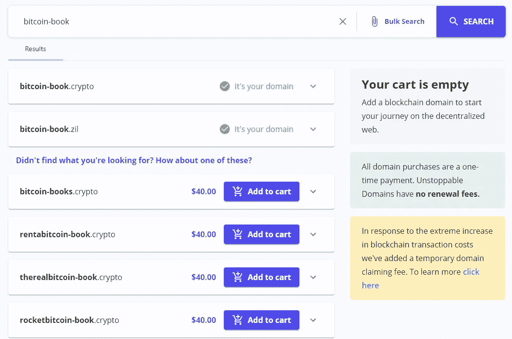

如果你关心 NFT 的炒作，你会很高兴看到每个域名都作为 NFT 直接进入你的以太坊钱包。您是唯一拥有此网站令牌的人。此外，这也是你需要以太坊钱包地址的第一个原因。

## 给自己买一个以太坊钱包(如果还没有的话)

不可阻挡的域名提供了一个叫做**的功能，在购买完成后声称**。声明意味着我们需要通过与以太坊区块链上的智能合约进行交互，将我们的域 NFT 存储在我们的钱包中。因此，我们正在执行元掩码或任何其他以太坊钱包，使您能够签署交易。一旦交易最终被区块链处理，我们就可以在我们的钱包中找到相关的 NFT。

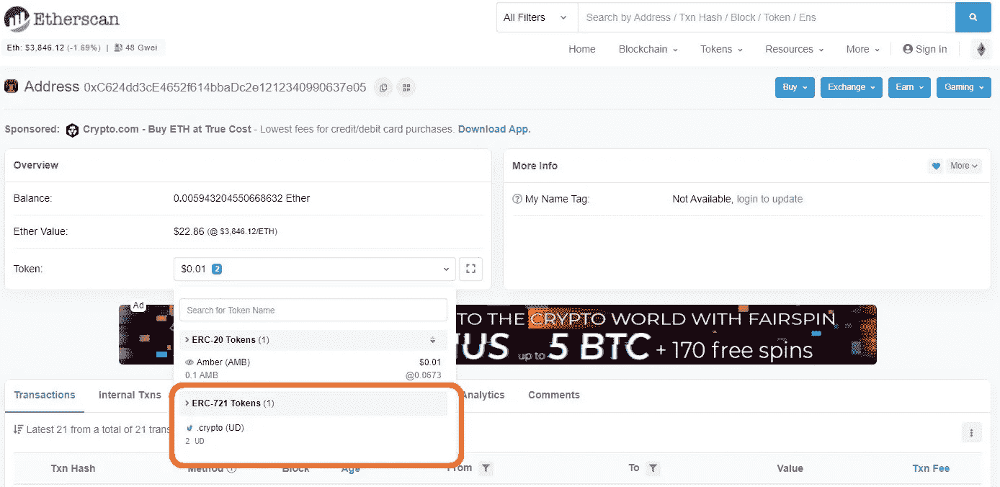

现在，您已经配备了您的第一个加密域，并准备开始准备您的网页的外观和内容。

## 用 Nicepage 设计你的个人网站

Nicepage 是一个易于使用的软件工具，通过拖放操作创建网页，但不需要理解或编写 HTML 代码。然而，HTML 的结果是我们想从 Nicepage 得到的，并上传到互联网上。

但是首先，我们将关注一些设计方面。该软件提供了许多模板，称为块，您可以使用它们轻松地开始可视化您的页面。在这些块中，您可以放置图片、按钮、文本空间等等。此外，每个元素都可以链接到其他网页或文件。你会发现在几分钟内创建一个你自己的网页概念是多么简单。下面你可以看到我是如何用 Nicepage 展示我的比特币-book.crypto 网站的。

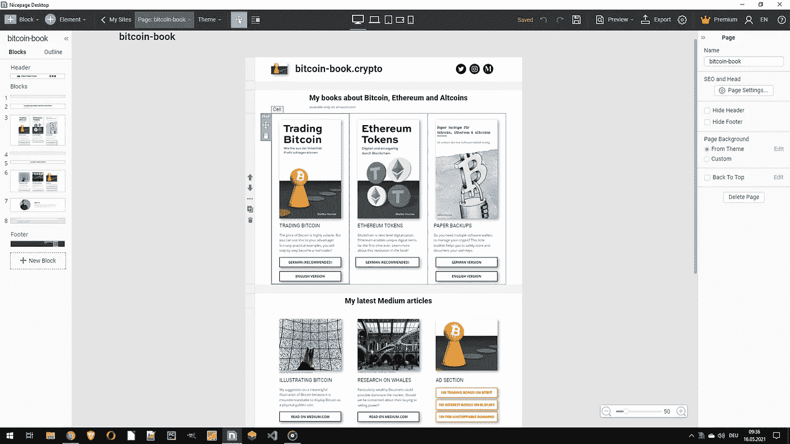

Nicepage 的最后一步是将页面输出为 HTML 代码，这可以使用 **export** 函数来完成。在标题菜单的右上角找到导出按钮。

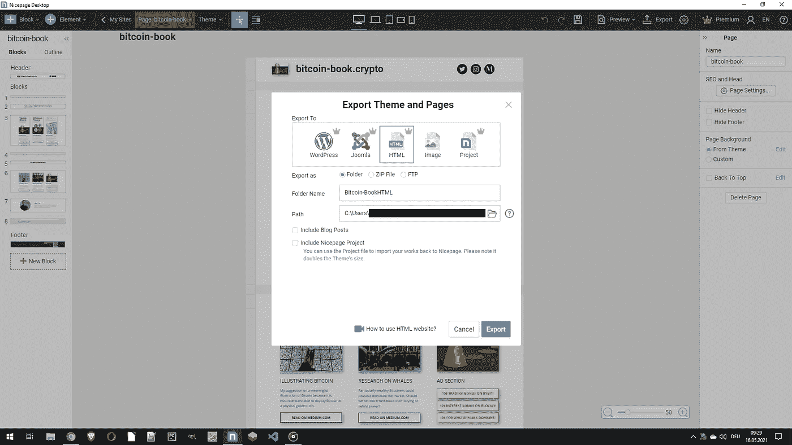

## 为以太坊广告准备 HTML 代码

*如果你不想在你的网站上做广告，你可以跳过这一部分。*

好吧，我承认，我们必须看一些 HTML 代码来实现以太坊广告。然而，这不会比复制和粘贴一些文本更难。不过，我觉得看到一个早期项目为区块链带来广告，在你的网站上出售一些空间来赚取 ETH 很有趣。

我们想用以太坊广告替换中型文章旁边的右图。

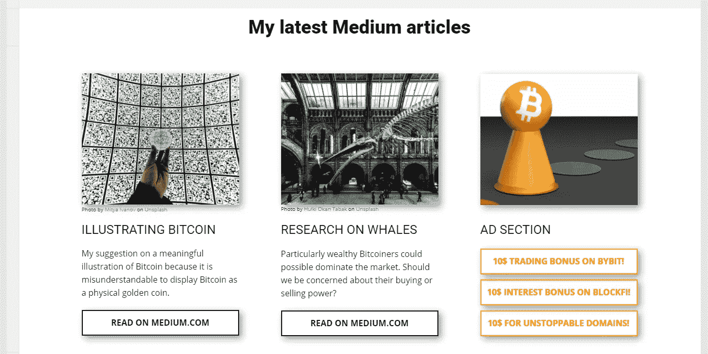

因此，我们打开从 Nicepage 创建的两个 HTML 文件，即**索引**和用 Visual Studio 代码命名为您的**主页**的文件。

唯一要做的类似编程的步骤如下:用 HTML 片段替换图片的源代码行，这是从[https://ethereumads.com/](https://ethereumads.com/)那里得到的，如下图所示。因此，你需要手头有你的以太坊地址。

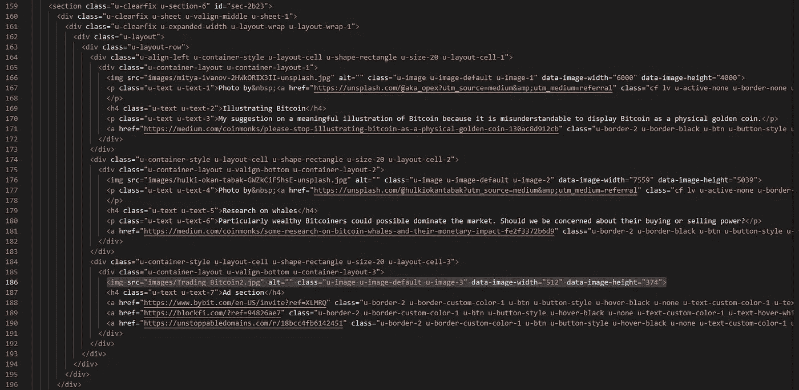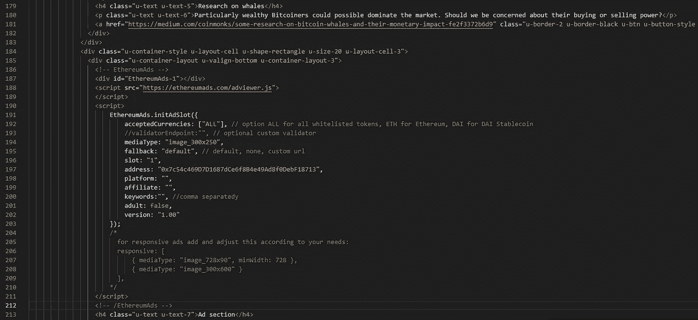

粘贴代码部分后，您可以关闭编码环境并使用 web 浏览器打开 HTML 文件。如果成功了，会是这个样子。

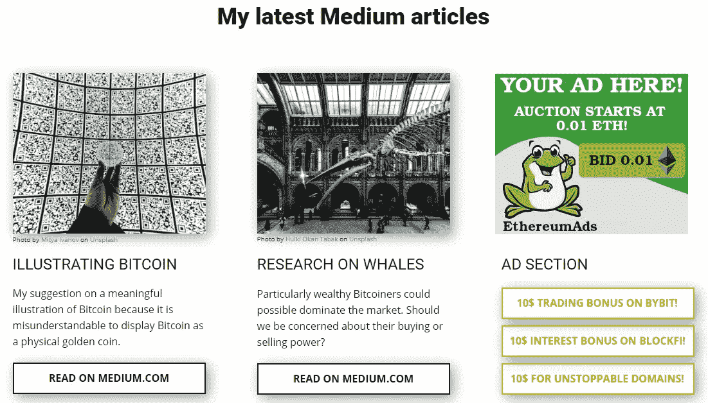

(如果你喜欢这个教程并想支持我的工作，请随意使用我的加密网站上的附属链接。)

## 上传包含 piata 和不可阻挡的域名的最终网站

当您点击 Nicepage 中的 export 按钮时，您会收到一个包含数据的文件夹存储库，其中包括 HTML 文件。我们需要这个完整的文件夹来将它固定在所谓的**星际文件系统(IPFS)** 上，这是互联网上一个新的数据存储，但却是以一种分散的方式。节点提供商[https://pinata.cloud/](https://pinata.cloud/)让每个人都能轻松访问 IPFS 节点。我们将在那里免费注册，并获得 1GB 的数据存储空间。

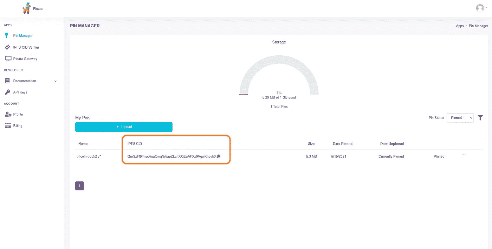

将完整的文件夹上传到 piata 会为您的数据创建一个 IPFS 散列，这是我们最后一步需要的。

## 让您的数据不可阻挡！

现在一切都准备好发布到新的分散式 web3 中了！准备好我们的 IPFS 哈希并从 piata 复制，我们回到不可阻挡的域名，并前往**管理**我们的网站。下图说明了在哪里放置 IPFS 散列。

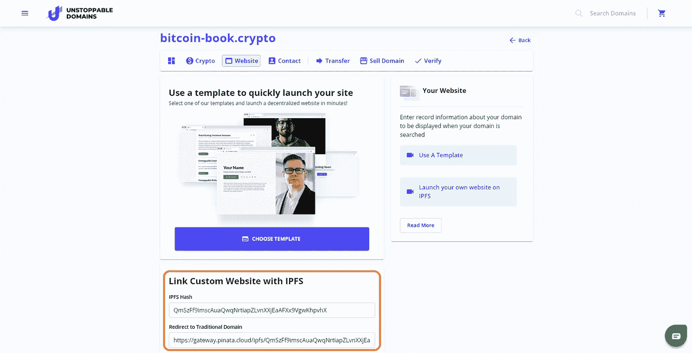

最后，我们点击网站底部的**保存所有更改**，一个新的区块链交易将被启动，就这样。

# 这是一个总结！

## 使用 Opera(推荐)或 Brave 显示您的加密网站

截至目前，只有两种网络浏览器兼容 IPFS 域名。这些是歌剧和勇敢。从你的以太坊交易完成的那一刻起，你就可以打开 Opera 浏览器，输入你的域名。对于这种情况，我们将输入 bitcoin-book.crypto，然后开始！

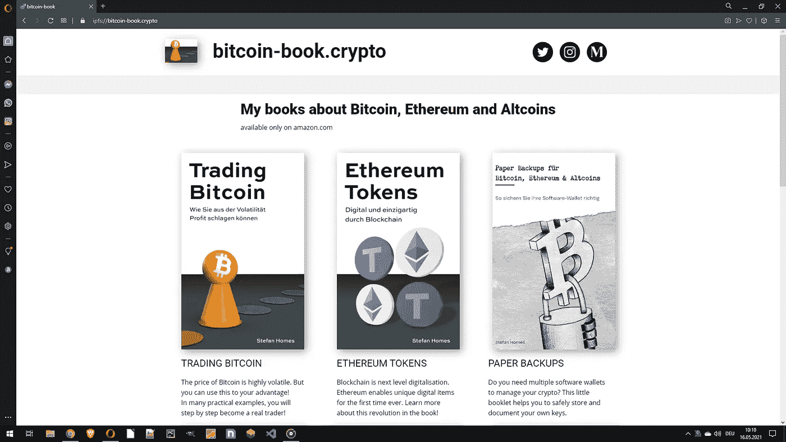

**一个小美味:永远不会有额外的提供商费用或托管费用！一旦区块链被更新，它将永远留在那里(或者直到你删除它)。**