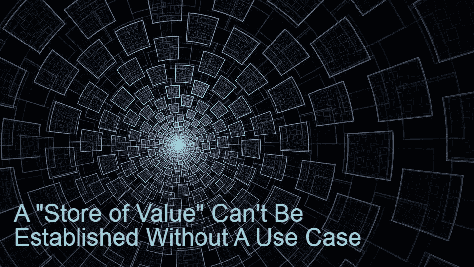
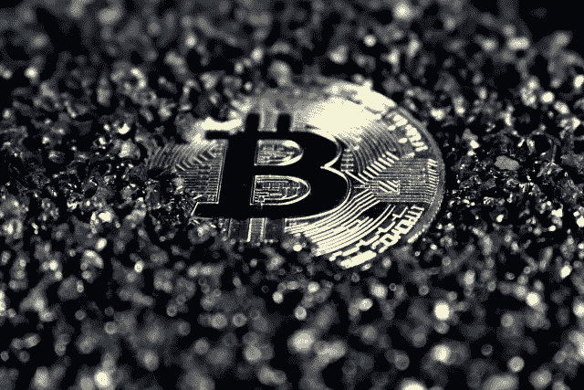

# 没有用例就不能建立“价值存储”

> 原文：<https://medium.com/coinmonks/a-store-of-value-cant-be-established-without-a-use-case-655d52aaeb39?source=collection_archive---------12----------------------->

在熊市最糟糕的时候，2019 年初，出现了一种新形式的代币，将“价值储存”作为其关键概念，并基于通缩特征。

这些代币中的每一个都代表着总供应量的减少。使用这些代币的每笔交易都将一定百分比的代币发送到“烧录地址”,从而有效地将它们从流通中移除。

通货紧缩的代币也有他们的指数(类似于 coinmarketcap)跟踪它们，因此以太坊的通货紧缩市场就产生了。

数百个令牌，每个令牌只提供不同的燃烧机制，但不包含其他功能。由于这些代币的主要目的只是购买“hodl”，并等待更多的投资者购买，因此也许有一天它们的价格会升值。

不过，所有这些代币都有一个问题。除了通货紧缩，他们别无选择。虽然其中一些泵抽了一会儿，但最终它们都降到了零。

一个失败的实验揭示了逻辑将占上风的唯一基础。

# 通货紧缩的失败实验

像炸弹，核弹，燃烧，烧尽，火山，都有不同的燃烧率，都有一个类似的模型，并运行一些空投。Bomb token 吸引了一些投资者，但以太坊区块链市场的通缩市场在吸引任何注意力之前就迅速萎缩，现在已经完全被遗忘了。

2019 年出现了数百种代币，提供通缩功能，但没有用例。

除了投机之外，没有任何东西支持的所谓“价值储存”。

让我们想起了什么？BTC 一直被宣传为“价值储存库(SoV)”，但它也抹去了交换手段(MoE)的特征。

[*Unsplash*](https://unsplash.com/photos/9pCV2MB65y8)

虽然不完全是通缩，但这也是 BTC 的宣传方式。作为一种价值储存手段，一种针对通胀的对冲手段，健全货币，硬通货以及任何其他金融流行语，比特币影响者在学术界找到了它，并将其以扭曲的版本转移到 BTC。

虽然 BTC 不是钱，因为它缺乏基本的容易被大众接受的高费用。也许是给精英的钱？这种方法没有足够的说服力。因此，它只是被宣传为一种价值储存手段，一种“买入并持有”的资产。

逻辑(效用)决定了网络的潜力。然而，BTC 开发者无视逻辑，支持开发与区块流相关的侧链 LN 和 Liquid。如今，卖的只是比特币这个品牌名称。

绝大多数新投资者甚至不会撤回非托管的钱包，而是让 BTC 和其他加密公司坐在中央交易所。机构从 gray & ETF 购买，散户从 Paypal、Robinhood、CashApp 和其他托管应用购买，其中大多数甚至没有提供退出选项。

比特币——BTC 不是货币，但也不是价值储存手段。发展停滞和缺乏任何适当的效用抛弃了“价值储存”的说法。

# 总之:要有目标，用实际的解决方案满足需求

比特币现金的主要目的是成为一种交换手段，并从 BCH 作为货币的这一实际使用案例，加上 2100 万 BCH 的固定供应，衍生出“价值储存”的特征。

比特币现金的目标不是成为通货膨胀的对冲工具，它仍然会自动演变成一种对冲工具，因为网络不断扩大，商家和数字的采用增加，用例成倍增加，更多的人了解数字现金的方面，易用性，以及使用易用、经济高效、分散的网络的优势。

通货紧缩不是一个目的，但它可以是一个特征，推动一个象征甚至一枚硬币运行其区块链。以太坊今年推出了一个燃烧过程，稳定了价格，扭转了负面趋势。SmartBCH 还燃烧了一半用于网络交易的气体。

这些机制通过减少供应来支撑资产价格。在以太坊上，它被大规模地执行，然而在 smartBCH 上，有一个适度的燃烧机制。

然而，这是这些网络中要考虑的最后一个功能，智能合同网络提供的巨大效用是吸引采用和推动需求的原因。

作为通缩硬币的实验，我们只是抱着“数字上升”的心态，没有任何目的，但自 2015 年以来，我们在比特币 BTC 观察到了同样的情况。然而，这不会持续很久。BTC 已经完成了它的使命。它没有扩大规模，比特币发展到了不同的领域。

开发一项资产或一个网络仅仅作为价值储存手段是不合理的。这毫无意义，只是类似于传销。那些在最底层努力说服财务前景的人，只是把价格作为一个论点，但除此之外别无其他。没有产品，没有开发，没有实用性，没有用例，没有价值。

相反，比特币现金正在遵循逻辑，开发、产生额外的用例，将数字现金作为法定支付方法的替代方案引入世界，价格升值的论点是一长串优点中的最后一个。

*在以下网站写作:●*[*read cash*](https://read.cash/@Pantera)*●*[*noise cash*](https://noise.cash/u/Pantera99)*●*[*Medium*](/@panterabch)*●*[*Hive*](https://hive.blog/@pantera1)*●*[*Steemit*](https://steemit.com/@pantera1)*●*[*声乐*](https://vocal.media/authors/pantera)

> **免责声明**:本内容中发布的所有材料均用于娱乐和教育目的，并符合**公平使用**的准则。无意侵犯版权。如果您是或代表本文所用材料的版权所有者，并且对所述材料的使用有疑问，请发送 [**电子邮件**](https://read.cash/@Pantera/cryptouknowns-battlegrounds-the-crypto-battle-royal-part-i-0ca762da#bad-link) 。

***支持内容创作者。***

如果你喜欢这个故事，就订阅吧！

*最初发布于*[*https://read . cash*](https://read.cash/@Pantera/a-store-of-value-cant-be-established-without-a-use-case-3aede825)*。*

> 加入 Coinmonks [电报频道](https://t.me/coincodecap)和 [Youtube 频道](https://www.youtube.com/c/coinmonks/videos)了解加密交易和投资

## 也阅读

 [## 杠杆代币[多头代币]终极指南

### 杠杆化令牌是具有杠杆化风险敞口的 ERC20 令牌，不考虑保证金、要求、管理…

medium.com](/coinmonks/leveraged-token-3f5257808b22)  [## 最佳加密交易所| 2021 年十大加密货币交易所

### 加密货币交易所的加密交易需要了解市场，这可以帮助你获得利润。之前…

blog.coincodecap.com](https://blog.coincodecap.com/crypto-exchange)  [## 2021 年最佳加密交换平台| CoinCodeCap

### 如果我们看看今天的场景，许多加密货币交换平台提供了广泛的功能和深度…

blog.coincodecap.com](https://blog.coincodecap.com/best-swap-platforms)  [## 2021 年最佳加密借贷平台| 6 大比特币借贷平台

### 获得比特币和其他加密货币的最佳贷款利率

medium.com](/coinmonks/top-5-crypto-lending-platforms-in-2020-that-you-need-to-know-a1b675cec3fa)  [## 2021 年 6 大最佳硬件钱包|顶级加密硬件钱包[更新]

### 最好的加密货币硬件钱包是绝对必要的。我们将在 NGRAVE、Ledger Nano X 和…

medium.com](/coinmonks/the-best-cryptocurrency-hardware-wallets-of-2020-e28b1c124069)  [## 2021 年最佳免费加密交易机器人

### 2021 年币安、比特币基地、库币和其他密码交易所的最佳密码交易机器人。四进制，位间隙…

medium.com](/coinmonks/crypto-trading-bot-c2ffce8acb2a)  [## 最佳 4 个加密交易信号电报通道

### 这是乏味的找到正确的加密交易信号提供商。因此，在本文中，我们将讨论最好的…

medium.com](/coinmonks/best-crypto-signals-telegram-5785cdbc4b2b)  [## 获取信号、交易机器人和套利

### 在本文中，我们将讨论 bits gap——一个满足您所有交易需求的一站式加密交易平台…

blog.coincodecap.com](https://blog.coincodecap.com/bitsgap-review)  [## 40 个最佳电报频道，用于加密、电影、表演和演讲| CoinCodeCap

### 随着我们周围无限的信息，我们很难筛选和了解有价值的信息。电报有…

blog.coincodecap.com](https://blog.coincodecap.com/best-telegram-channels)