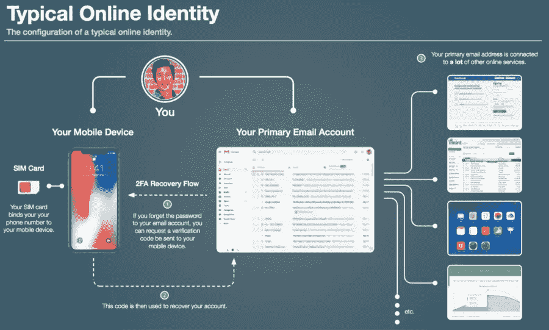

# 一个因身份盗窃损失 10 万美元的故事

> 原文：<https://medium.com/coinmonks/a-story-of-losing-100-000-in-identity-theft-6e3404fc356a?source=collection_archive---------0----------------------->

我正在全职研究 [**CryptoFi**](https://cryptofi.co) ，看看吧，请❤️给我一些反馈，如果你遇到任何问题，就给我发[电报](https://t.me/joinchat/FyuZEQ7M7YucH1FY3cVa0A)。

**本周报价-**

> 不要让别人观点的噪音淹没了自己内心的声音。—史蒂夫·乔布斯

本周故事👇 👇

## 我生命中最昂贵的一课:SIM 卡端口破解的细节

上周三我损失了 10 万多美元。它在一次“SIM 端口攻击”中蒸发了 24 小时，耗尽了我的比特币基地账户。那件事已经过去四天了，我很难过。我没有食欲；我的睡眠是不安的；我充满了焦虑、悔恨和尴尬的感觉。

这是我一生中最昂贵的一课，我想和尽可能多的人分享我的经验和教训。我的目标是提高对这类攻击的认识，并激励**你**提高你在线身份的安全性。

*这个还是很生的(我都还没跟家里人说)；请保留对这篇文章中天真的安全实践的判断。*。… [*阅读更多*](/coinmonks/the-most-expensive-lesson-of-my-life-details-of-sim-port-hack-35de11517124)

**由** [**肖恩·孔斯**](/@cooncesean) **，(帕特里克是首席工程师@BitGo，跟随他上** [**推特**](https://twitter.com/cooncesean) **)**

> [直接在您的收件箱中获得最佳软件交易](https://coincodecap.com/?utm_source=coinmonks)

发微博给我，或者发邮件给我，地址是 gaurav@coincodecap.com

> “我们是一个非宣传性和非营利性的教育出版物，如果你喜欢阅读《创造僧侣》，[你也可以捐赠给我们](https://www.patreon.com/coinmonks)”

***暂时就这样，送我❤️，下次再说😄***