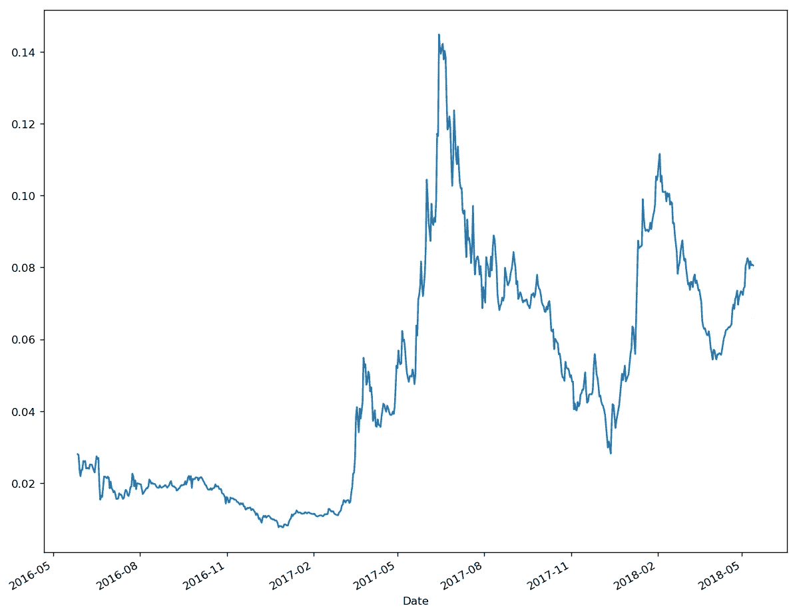
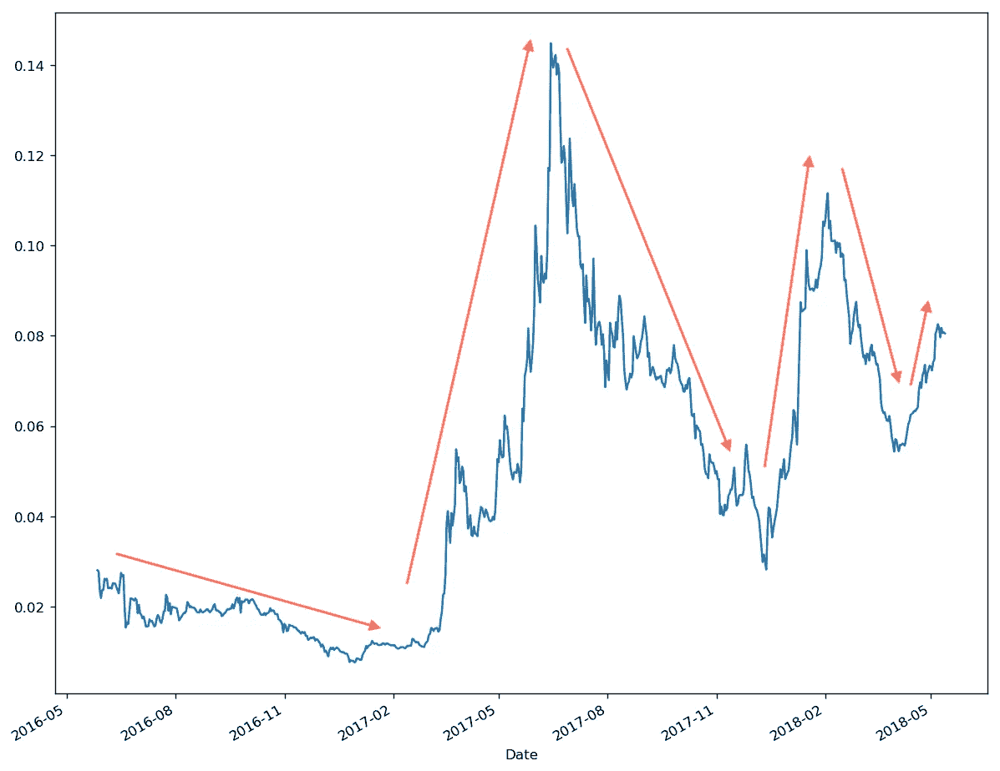
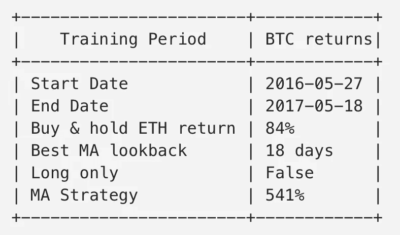
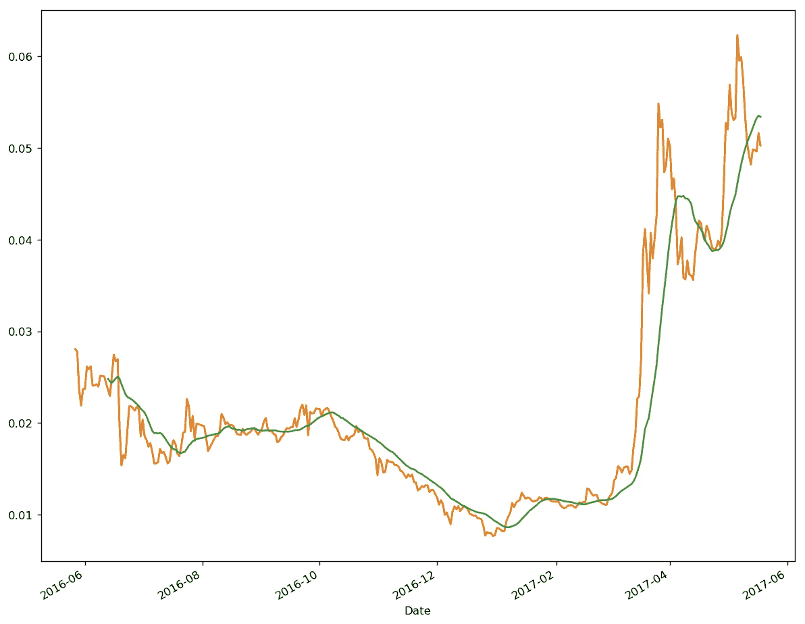
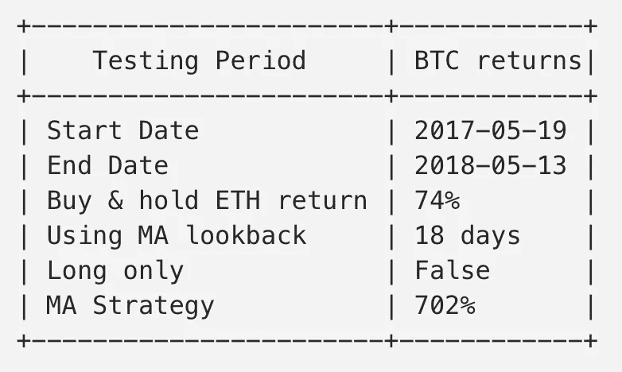
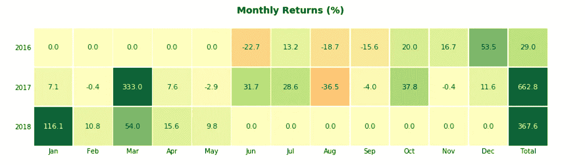
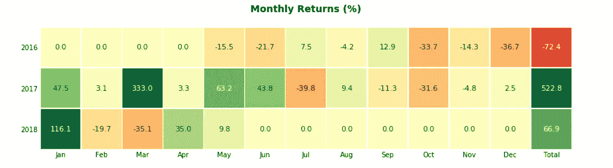
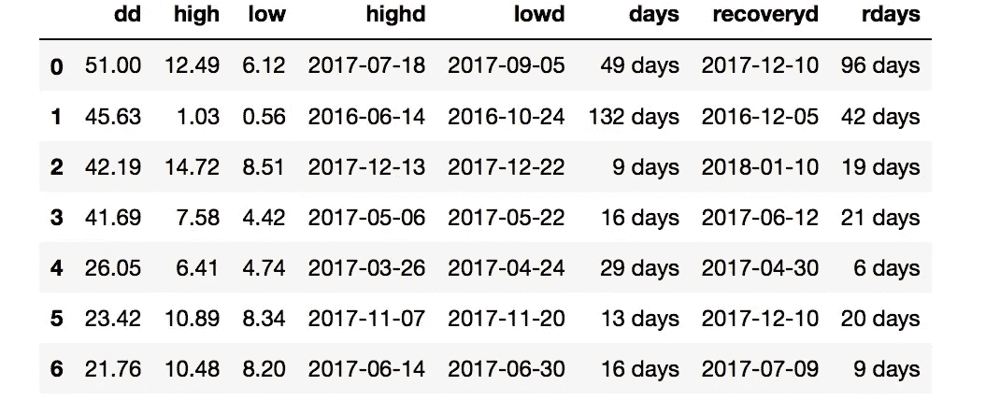
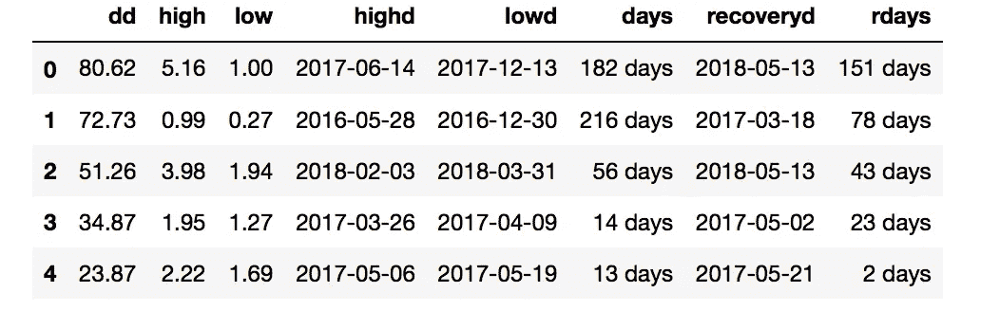
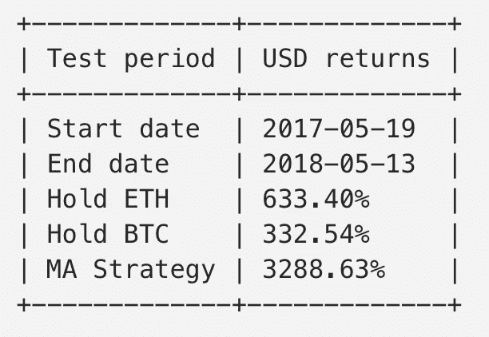

# 交易 ETH 以获取更多 BTC 的策略

> 原文：<https://medium.com/coinmonks/a-strategy-for-trading-eth-to-make-more-btc-3985c3c93c04?source=collection_archive---------0----------------------->


首先坦白。我是比特币最大化主义者。算是吧。我是一个极大主义者，因为我相信比特币具有独特的品质和独特的地位，这使得它非常适合成为一个新的全球非主权财富储存库。这里我就不一一赘述了。我是一个极大主义者，因为鉴于比特币的独特地位和完美理念，任何真正有兴趣看到一个新的非主权财富库出现的人都应该把精力集中在比特币上。我不是一个最大主义者，因为我认为加密生态系统中没有任何其他硬币的空间，我也不认为比特币的命运是不可避免的。事情会变，如果真的变了，我将不得不重新评估我的定位。

> 另请阅读:最佳加密交易机器人

对我来说，将上述对比特币的信念转变为投资策略的最简单方法是买入并长期持有(即 HODL)(比如 5 至 10 年)。这听起来很容易，但正如我以前写的那样[霍德林会让你痛苦](/@danielcimring/why-hodling-bitcoin-will-make-you-miserable-but-do-it-anyway-f0d167dd406b)。我担心我也本能地相信，如果你不积极地做某事，那么你就是在偷懒。所以很难坐以待毙。当然，我可以做一些事情来提高霍德林，毕竟我有 5 到 10 年的时间，我可以将大部分注意力集中在这项任务上。这篇文章就是这样做的一个尝试。

Twitter 是一个了解加密生态系统的好地方。事实上，我认为 Twitter 的杀手级应用是加密。Crypto 终于给了我一个使用 Twitter 的理由，在注册了几年之后，根本不用它。原来杰克·多西(Twitter 的联合创始人兼首席执行官)[也是一个比特币最大化者](https://finance.yahoo.com/news/jack-dorsey-bitcoin-currency-future-173046421.html)。因此，Twitter 和比特币之间可能存在某种宇宙联系。无论如何，如果你像我一样在 Twitter 上闲逛并关注一些加密交易者，你会很快发现许多交易者谈论交易替代币(不是比特币的硬币)以积累更多的比特币。这使得比特币成为某种储备货币，也是 cyrpto 市场的记账单位(至少对许多加密交易者来说)。顺便提一下，这是我上面提到的比特币的独特品质之一。我决定看看市值第二大的加密货币以太坊(ETH)，看看我是否能提出一个积累更多比特币(BTC)的交易系统。

首先，让我们看看 ETH 在 BTC 的定价表，看看是否有我们可以尝试和使用的模式。这个数据来自 [GDAX 交易所](https://www.gdax.com)，我是从 [Quandl](https://www.quandl.com/data/GDAX/ETH_BTC-ETH-BTC-Exchange-Rate) 下载的。我用的是每日收盘价(稍后我会讨论每日收盘价对一个 24/7 交易的资产意味着什么)。



ETH priced in BTC (data from GDAX)

它似乎在大趋势中上下波动。在每一个趋势中，都有较小的涨跌，在这些较小的涨跌中(价格模式的分形性质)，但是主趋势在每个方向上都会持续一段时间，然后才会反转。



我在想，某种趋势跟踪或动量策略可能会管用。一个非常简单的策略是计算移动平均线，当价格超过移动平均线时买入，当价格低于移动平均线时卖出。在本文的其余部分，我将称之为“并购战略”。我最初研究了对比特币本身使用这种并购策略，我将在另一个时间再写。

均线只是特定天数的平均值(可以是 10 天、20 天、200 天或其他)。天数被称为回望期，它被称为移动平均线，因为平均线每天都在重新计算，所以会“移动”。如果你在看一个 10 日均线，那么每天你都会回顾过去 10 天，计算平均价格。第二天，将有一个新的价格包含在平均值中，最早的价格将从您的计算中删除。这导致千年评估随时间平稳移动。

我从 GDAX 获取价格数据，并将其精确地分成两半。前半部分将用于确定哪一个 MA 回顾期效果最好(导致最高回报)。这部分数据被称为样本数据或**训练数据**。然后可以在数据的后半部分测试该策略，看看它的表现如何。这部分数据被称为样本外或**测试数据**。如果该策略在训练数据上表现良好，但在测试数据上表现不佳，那么我们知道它很可能在未来也不会表现良好。

为了找到 MA 的最佳回望周期，我写了一些 Python 代码来尝试一系列回望值，看看哪一个在**训练数据**周期内产生了最佳回报。下面是结果的总结。显示的回报是 BTC 的回报，而不是美元。所以 84%的回报率意味着你在 BTC 赚了 84%。“仅做多=错误”意味着策略可以做多也可以做空。



正如你在上面看到的，使用 18 日均线可以在训练期间获得很好的回报，这比简单地买入并持有 ETH 要好(ETH 在这段时间也做得很好)。这里有一个显示价格和移动平均线的图表，这样你就可以看到买卖点。绿线是均线，橙线是价格。



Chart showing ETH price in BTC and 18 day MA

现在是真正的测试。MA 策略在未优化的**测试期**内表现如何。下面是结果的总结。



所以 18 日均线在测试阶段也非常有效。这很有希望，但请记住，仍然不能保证该策略在未来会奏效。在本文的稍后部分，我将尝试确定这些结果在统计学上有多重要。

为了比较并购策略和买入并持有策略的逐月回报，我创建了一个逐月回报的热图。热图最右侧的合计列显示每年的回报，单元格显示每个月的回报。绿色阴影表示正回报(绿色越暗越好)，黄色阴影表示 0 或接近 0 回报，红色阴影表示负回报(红色越暗越差)。2017 年 8 月是最差的一个月，回报率为-36%。2017 年 3 月是最好的一个月，回报率为 333%。这三年的总体回报都是正的。



MA Strategy return heat map

作为对比，这里是买入并持有的热图。2016 年是负 72%的一年，2018 年做的比马策略差很多。



Buy and hold return heat map

比较并购策略买入和持有的另一种方法是看两者的提款情况。以下是两者 20%或以上的所有提款清单。



MA Strategy drawdowns



Buy and hold drawdowns

所以两者都经历了巨大的损失。并购策略的缩减不那么极端(最大缩减率为 51%，而买入并持有策略的缩减率为 81%)，而且恢复得稍快(rdays =恢复到前期高点的天数)。但是并购策略有超过 20%的提取(6 比 4 的买入和持有)。因此，尽管并购策略随着趋势的变化可以做多也可以做空，但这并不意味着你最终会避免大规模的撤资。

最后，这里是在**测试期**持有 BTC、持有 ETH 或使用并购策略的**美元回报**的全面比较。并购策略显然是赢家。



我上面提到的一个问题是这些结果是否具有统计学意义。也就是说，结果有多大可能真的只是由于偶然而不是由于策略。对此，我尝试了三种不同的方法。

```
**Hypothesis 1: The MA Strategy is really no different from buy and hold and we were just lucky**How to test: simulate buy the hold thousands and times and see how often buy and hold results in a return as good as the strategyProbability (p-value): 15.8%**Hypothesis 2: The MA Strategy does not capture the serial correlations (trends) in prices**How to test: simulate thousands of price series that have the same distribution as the real price series but where the returns each day are independent of each other. Apply our MA Strategy to these simulated prices and see how often it would beat the strategy return we got on the real prices.Probability (p-value): 6.3%**Hypothesis 3: We were just lucky that our buy and sell decisions happened at fortunate times**How to test: take the buy and sell decisions that the strategy made and place them instead at random dates. How often do these random buy and sells beat the results we got for the strategy.Probability (p-value): 5.7%
```

为了使我们的结果具有统计学意义，我们希望得到一个非常低的 p 值，通常小于 1%。例如，1%的 p 值意味着我们的结果只有 1%的几率是由于运气。我们的 p 值是 5%或更高，这意味着我们的好结果至少有 5%的可能性是由于运气。这不完全是“失败”,但也不是明确的“通过”。我会把它归类为非决定性的。

我不是一个真正的交易者，但我会交易这种策略。我认为这是有希望的，但还有进一步的工作要做，事情要考虑:

*   由于该战略基于 2016 年年中左右才开始的每日数据，因此没有太多数据可供使用。有限的数据量是显著性检验没有结论的一个原因。
*   这个结果适用于其他比特币交易所吗？我使用比 GDAX 更早的 Bitfinex 的数据重复了这个练习。训练期间的最佳 MA 是 22 天，并且训练和测试期间的结果都非常好(不像 GDAX 结果那样好，但是仍然足够好)。
*   同样的策略，但是是“只做多”的版本，意思是当价格低于均线时你卖出，但是你不做空。不是所有的交易所都允许你做空，这样做还有额外的风险和成本。在此基础上重新进行练习，得出的最佳 MA 回顾期为 27 天。培训阶段和测试阶段的结果仍然非常好(没有短时间的版本好，但也足够好)。
*   尝试使用日内数据(如 30 分钟分辨率而不是每日)会很有趣。在这个级别上可能会有更多的噪声，但是会有更多的数据点。
*   也许 2016-2018 年是 ETH 的稳定期，从现在开始，这些长期趋势将基本结束，价格将更趋于均值回归或横向波动，而不是趋势(即制度变化)。请记住，我们看到的是相对于 BTC 的瑞士法郎，而不是美元。如果上面所说的是真的，那么在过去有效的方法在未来可能不会有效。
*   买入并持有并不要求你将资金留在交易所。交易会。因此，通过交易，你现在承担了交易所的风险，如果交易所崩溃，你可能会失去一切。霍德勒可以保管好他们的私人钥匙，然后在海滩或高尔夫球场放松，而不用担心兑换风险。
*   加密交易全天候进行，因此每日收盘价的概念不像在营业时间交易的股票那样明确。每日收盘价格是交易所午夜前的最后交易价格，还是一天中特定时间的价格。不同的交易所如何运作[可能会有所不同](https://bitcoin.stackexchange.com/questions/41055/bitcoin-market-hours-open-close-prices)。我忽略了这是我的分析，但如果你正在运行这个策略，它将需要被考虑。
*   也许 18 日均线可以作为自由交易的指导，而不是机械交易规则。交易者已经用不同长度的均线来观察市场趋势。例如，200 日均线是确定你是处于牛市还是熊市的流行方法，用于许多不同的市场，包括股票和密码。也许在众多交易工具中找出一些硬币专用的均线是有意义的。
*   魔界策略对其他金币有效吗？对于其他大型低价竞标，数据甚至更少，但是到目前为止，这确实看起来有些希望(尽管由于数据有限，统计意义会更差)。
*   或许这里更大的教训是，在 BTC 定价的低价竞标更容易遵守机械交易规则，比如使用移动平均线。交易者经常提到低价季，也就是低价优于 BTC 的时候。在过去，这种情况会出现在开和关循环中。
*   到目前为止，我的分析不包括交易成本。该策略不经常交易(大约每月 2 次)，所以交易成本相对较小。

如果你喜欢这篇文章或者得到了什么好处，请**鼓掌**(最多 50 次)，让其他人也能发现。

我为本文编写的 Python 代码可以在 [etherium.ipynb](https://github.com/dcimring/crypto-price-analysis/blob/master/etherium.ipynb) 笔记本的 [Github](https://github.com/dcimring/crypto-price-analysis) 上找到。

*请注意，本文中的任何内容都不应被视为投资建议。比特币和以太坊的波动性极大。投资前，请做自己的研究。*

> 加入 Coinmonks [电报频道](https://t.me/coincodecap)和 [Youtube 频道](https://www.youtube.com/c/coinmonks/videos)获取每日[加密新闻](http://coincodecap.com/)

## 另外，阅读

*   [复制交易](/coinmonks/top-10-crypto-copy-trading-platforms-for-beginners-d0c37c7d698c) | [加密税务软件](/coinmonks/crypto-tax-software-ed4b4810e338)
*   [网格交易](https://coincodecap.com/grid-trading) | [加密硬件钱包](/coinmonks/the-best-cryptocurrency-hardware-wallets-of-2020-e28b1c124069)
*   [密码电报信号](http://Top 4 Telegram Channels for Crypto Traders) | [密码交易机器人](/coinmonks/crypto-trading-bot-c2ffce8acb2a)
*   [最佳加密交易所](/coinmonks/crypto-exchange-dd2f9d6f3769) | [印度最佳加密交易所](/coinmonks/bitcoin-exchange-in-india-7f1fe79715c9)
*   [开发者最佳加密 API](/coinmonks/best-crypto-apis-for-developers-5efe3a597a9f)
*   最佳[密码借贷平台](/coinmonks/top-5-crypto-lending-platforms-in-2020-that-you-need-to-know-a1b675cec3fa)
*   [杠杆代币](/coinmonks/leveraged-token-3f5257808b22)终极指南
*   [AscendEx Staking](https://coincodecap.com/ascendex-staking)|[Bot Ocean Review](https://coincodecap.com/bot-ocean-review)|[最佳比特币钱包](https://coincodecap.com/bitcoin-wallets-india)
*   [Bitget 回顾](https://coincodecap.com/bitget-review) | [双子星 vs BlockFi](https://coincodecap.com/gemini-vs-blockfi) | [OKEx 期货交易](https://coincodecap.com/okex-futures-trading)
*   [美国最佳加密交易机器人](https://coincodecap.com/crypto-trading-bots-in-the-us) | [经常性回顾](https://coincodecap.com/changelly-review)
*   [在印度利用加密套利赚取被动收入](https://coincodecap.com/crypto-arbitrage-in-india)
*   [霍比评论](https://coincodecap.com/huobi-review) | [OKEx 保证金交易](https://coincodecap.com/okex-margin-trading) | [期货交易](https://coincodecap.com/futures-trading)
*   [麻雀交换评论](https://coincodecap.com/sparrow-exchange-review) | [纳什交换评论](https://coincodecap.com/nash-exchange-review)