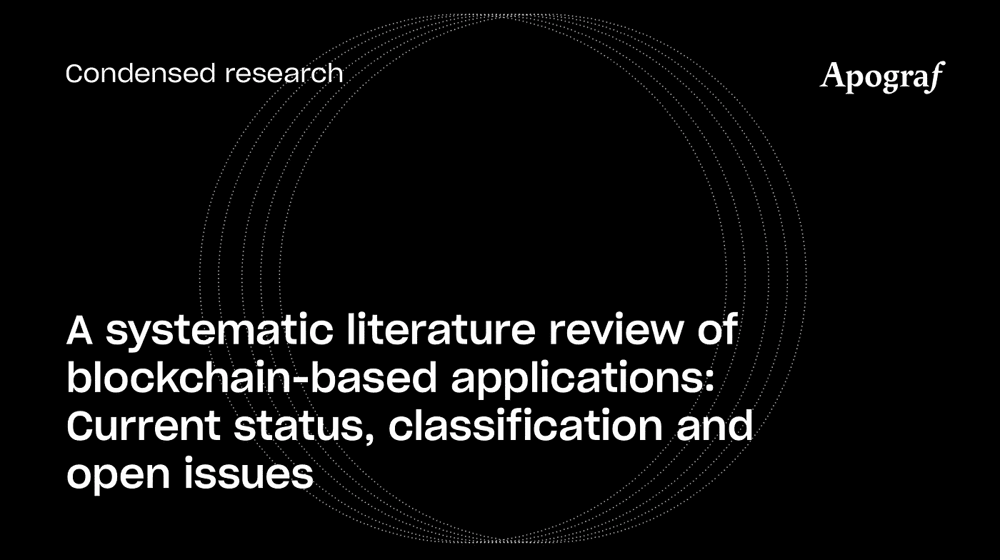

# 基于区块链应用的系统文献综述

> 原文：<https://medium.com/coinmonks/a-systematic-literature-review-of-blockchain-based-applications-c3459f0faa45?source=collection_archive---------3----------------------->

在题为“基于区块链的应用的系统文献综述:当前状态、分类和未决问题”的论文中，Casino、Dasaklis 和 Patsakis 分析了 2014 年至 2018 年 4 月期间发表的 260 篇研究论文的理论基础，以呈现不同行业中支持区块链的应用的完整分类。他们的发现还包括这些领域技术的局限性。

基于主题内容分析，该文件确定了三个研究流:

1.  对基于区块链的应用程序在众多领域的分类。
2.  考虑到区块链技术存在的各种局限性，该技术是否适合在这些行业创造价值。
3.  通过提供有前途的研究途径、挑战和需要进一步研究的机会的路线图来指导研究人员。

**区块链分类**

虽然区块链应用程序通常被分为金融类或非金融类，但可以区分三代区块链:

*   区块链 1.0——支持数字加密货币交易的应用。
*   区块链 2.0——智能合约和应用超越了加密货币交易。
*   区块链 3.0——在前两个版本之外的领域的应用，如政府、健康、科学和物联网。

第三次迭代是本文的主要焦点；其理由是，区块链启用的最新应用程序受到的关注有限，即使受到关注，也没有得到充分重视，也没有得到充分应用。

**基于区块链的应用**

本文提供了一个面向应用的分类，类似于郑等人(2016) 在[中提出的分类，但是，它使用了一个基于文献的严格的统计方法，因此，更适合当前的发展，并高度逼真地说明了的未来趋势。](https://apograf.io/articles/30526)

由此，确定了基于区块链的应用的 11 个领域:以及大量杂项应用，这些领域包括商业和工业、隐私和安全、教育、卫生、物联网、治理、完整性验证、金融和数据管理。

在所有这些领域中，对区块链支持的应用程序的关注和投资的增加主要是由该技术的固有功能推动的。正如作者所指出的，区块链对传统的[业务](https://www.sciencedirect.com/topics/social-sciences/business)流程带来了严重的破坏，因为需要集中架构或可信第三方来验证的应用程序和交易现在可以以分散的方式运行，并具有相同的确定性。区块链体系结构和设计的固有特征提供了透明性、健壮性、可审计性和安全性等特性。

**区块链适用性:一个框架**

通过对所选文献的分析，作者还能够得出一系列关于区块链技术的局限性及其在广泛领域的可用性的见解。虽然区块链被许多研究领域和商业领域采用，提供了无限的探索机会，但与任何其他新兴技术一样，问题和挑战也随之出现。

该论文强调了根据用例需求检查区块链采用的适用性的重要性，因为正如作者所发现的，在科学文献中已经开发了有限数量的框架来评估支持区块链的应用程序的适用性。他们指出 Lo 等人(2017 年)和 [Wüst 和 Gervais (2017 年)](https://apograf.io/articles/341?query=Karl%20W%C3%BCst%20and%20Arthur%20Gervais)作为例子，但提供了他们自己的框架来评估区块链解决方案的适用性。

更具体地说，该框架使用三个等级(即低、中、高)来衡量每个先决条件的相关性，并在四个主要领域评估区块链相对于传统数据库的潜力:所需的信任假设、背景要求、性能特征和所需的共识机制。该框架作为一个综合工具提供给区块链从业者，用于评估他们的系统是否真的会被区块链增强。

**结束语**

虽然区块链在各个部门和行业中的潜力已经得到很好的涵盖，但仍有许多研究空白有待填补，探索方向有待拓展。该文件的存在不仅是为了分析现有的研究领域，但提供了一个框架，以确定个人的特点，最需要在每个确定的领域。这将最终有助于选择合适的区块链和相应的机制，以根据应用程序的实际需要定制区块链。

> [在您的收件箱中直接获得最佳软件交易](https://coincodecap.com/?utm_source=coinmonks)

