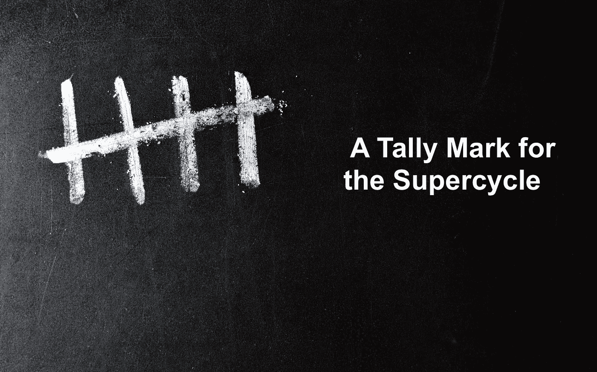
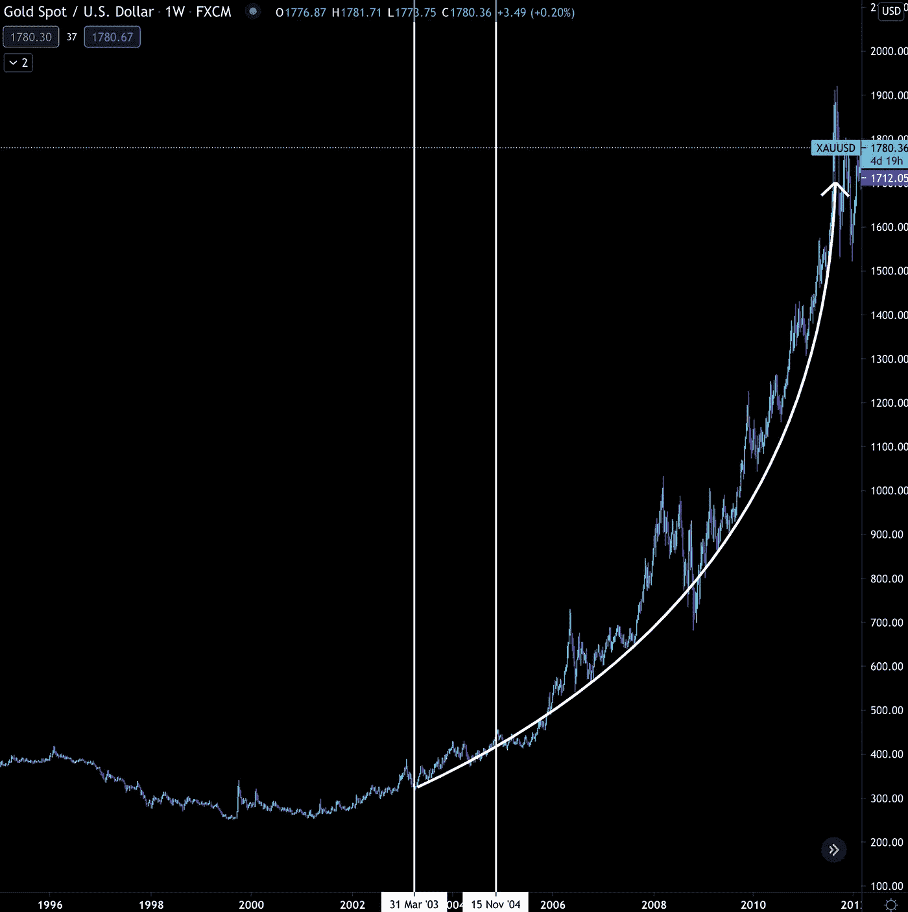
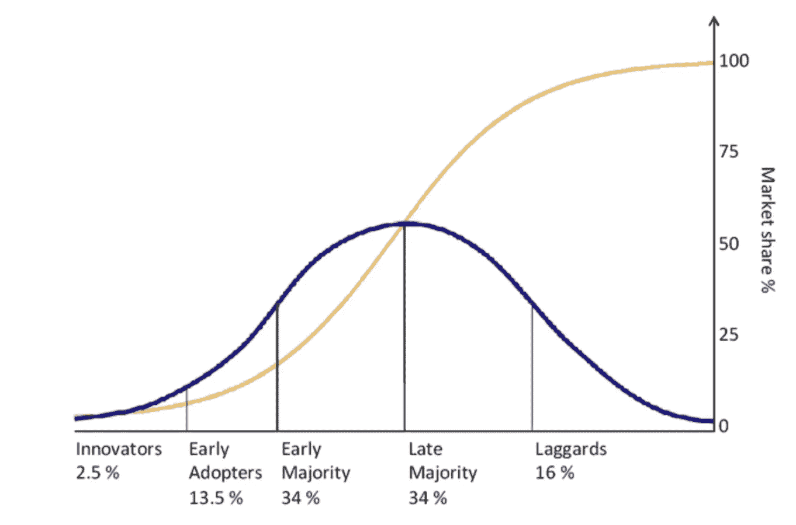
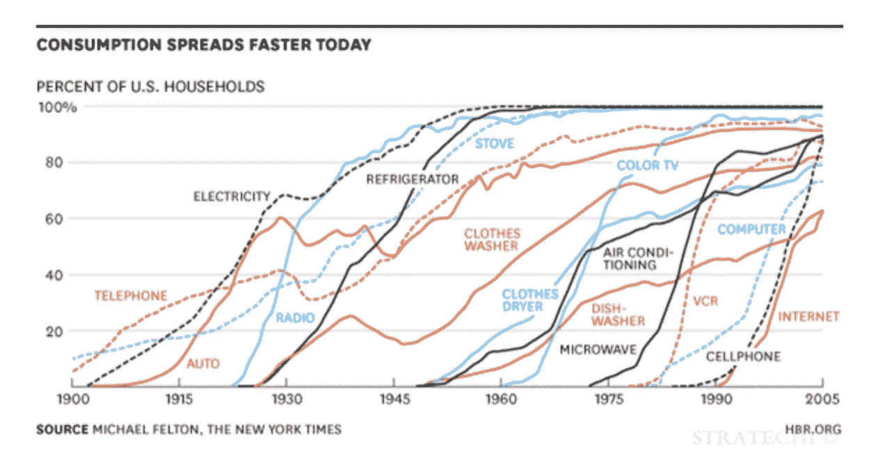
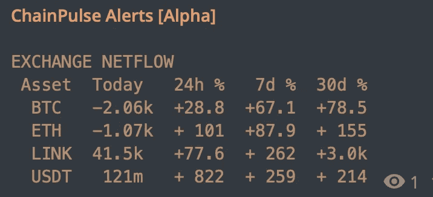

# 比特币超级周期的一个分数

> 原文：<https://medium.com/coinmonks/a-tally-mark-for-the-supercycle-2694aa8fe0a8?source=collection_archive---------4----------------------->

我在拖延…

几个基金经理和富有的客户要求我在一个特定的主题上发表意见。

我推迟的原因不是因为这是一个新话题。我只是没有花时间去正确地分析它。

有太多东西需要消化。网络效应增长率、网络参与者数量、最终用户增长率、现有互联网技术增长率、采用曲线…

对有史以来最看好比特币的观点进行彻底的分析几乎是一种削弱。

并不是说我还没开始…

我估计将近 50 个小时的实际的笔到纸的工作已经进入这一个想法。

老实说，我发现在超级自行车训练营搭帐篷非常困难。

每次我开始挖掘这个问题，我发现自己比以前更快地把它推到一边。

我只是不能强迫自己。

之所以如此，并不是因为我和我的团队不敢做出如此大胆的主张。只要我们有信念，如果我们的团队做到了，我没问题。

事实上，回到去年 6 月 29 日，当比特币交易价格为 9100 美元时，我们向媒体发布了一份声明，“[市场注销了减半:唤醒来电](https://cryptonews.com/news/jarvis-labs-says-market-wrote-off-the-halving-wakeup-call-in-6973.htm)”。

评论发表时，价格正好在 60 天内以相同的价格区间交易。市场变得非常悲观，许多人预计未来几天价格会大幅下跌。

然而，我们是在冒险。我们的交易系统显示现货市场异常强劲。这与我们在 2019 年奔向 14k 美元时看到的不同。

不到 5 个月后，比特币继续突破历史高点。

现在，我没有带着那个老评论幸灾乐祸。但是，为了表明我们毫不犹豫地做出像超级周期这样的大胆断言……只要我们有数据支持。

截至今天，我们还没有足够的证据对超级周期做出这样的断言。

但是我们所拥有的是一个你可以用来立案的最强的分数之一。

目的比特币交易所交易基金(BTCC)现在管理着价值超过 10 亿美元的比特币。这是首只针对比特币的北美上市 ETF。而且它靠近美国，这使它成为一件大事。

这是因为美国投资者和经纪商对在加拿大交易所上市的股票更加熟悉。这在一定程度上是因为大多数初级贵金属矿商都在加拿大上市。如果你想接触小盘股矿工，这就是你要去的地方。

现在，我知道许多读者可能会指出美国证券交易所提供的灰度和其他代理股票，并说它们提供比特币敞口。但我们都同意交易所交易基金给它带来了纯粹的娱乐感觉。

这正是人们想要的。管理他们的密钥，交易代币，甚至向加密货币交易所发送菲亚特并不适合所有人。人们想要一个比特币交易所交易基金。截至目前，大多数人希望投资比特币，以分散自己的投资。

ETF 是他们的答案。

基金经理、家族理财室、财务顾问、养老基金和企业也在乞求它。他们都不希望设立托管人。

看到一只 ETF 开始在美国边境以北交易，意味着一只在美国交易的 ETF 即将到来。

这是 ETF 故事中有趣的部分……就 ETF 如何作为超级周期的催化剂而言，我认为我们短期内不需要美国的 ETF。影响现在已经显现出来了。

让我解释一下…

黄金市场于 2003 年 3 月推出了第一只 ETF。它在澳大利亚上市。直到 20 个月后的 2004 年，第一只黄金 ETF 才开始在美国交易。

有趣的是，价格已经持续了多年。这是稳定的，并获得势头。ETF 一上市，价格就从每盎司 300 美元飙升至 1900 美元。这是图表。

两条白色竖线是 ETF。如你所见，黄金继续上涨。

主要原因是可及性。在 ETF 出现之前，大多数投资者通过期货合约或购买实物金属获得敞口。

这种情况类似于今天正在发生的事情。

寻求敞口的投资者大多需要购买期货或“实物”比特币。

这一点如此重要的原因是收养。比特币变得越容易获得，它就越容易在采用曲线上大步前进。下图中的黄线。

你可能见过比特币或加密货币的倡导者指着这样的图表说现在还为时过早。我同意他们的观点，但这不是采用曲线的样子…

看起来是这样的。

他们的进步比第一张图表让你相信的要快得多。尤其是最近。

这意味着未来几年，比特币将会像海啸一样被主流接受。不是几十年。

如果是这样的话，采用曲线最快的部分可能会发生在本轮牛市接近尾声的时候。

如果采用曲线通常需要 5-10 年才能从 20%的采用率达到 80%的采用率，就像手机、电脑和互联网一样，这意味着最快的增长将在 2.5-5 年后发生。

这可能会让我们在 2024 年下一次减半之前的一段时间内走上正轨。这是假设加拿大 ETF 现在在加拿大持有超过 10 亿美元的 AUM 是我们的拐点。

这就是我的看法。但对我来说，大胆地说我们正在进入一个超级周期……我需要更多的确信。

我还想从单子上划掉几个关卡。我承诺在接下来的几周内会揭露更多的检查站。

你的脉搏在加密，

B

附注— **ChainPulse /市场更新将很快发布**。现在，这里有一个快速的 200 字…

周末的连锁活动很平静。不仅仅是在昨天泵之前，我注意到一些脉冲最终通过我们的系统。特别是，5k+的 BTC 从一家交易所转移到一个对应于看涨价格行为的钱包，大量中型股令牌流出到另一个做市商钱包，以及少量 USDT 流入。

这是我在过去三天里看到的最多的活动。

此外，我们还发现 ETH 和 BTC 的净流量为负，稳定资本流入为正。两者都是看涨信号。这是近一周以来我们第一次看到这样的组合。

> 加入 Coinmonks [Telegram group](https://t.me/joinchat/PmKOYQ9NNKZlZGNl) 并了解加密交易和投资

## 另外，阅读

*   最好的[密码交易机器人](/coinmonks/crypto-trading-bot-c2ffce8acb2a) | [电网交易机器人](https://blog.coincodecap.com/grid-trading)
*   [加密复制交易平台](/coinmonks/top-10-crypto-copy-trading-platforms-for-beginners-d0c37c7d698c) | [五大 BlockFi 替代方案](https://blog.coincodecap.com/blockfi-alternatives)
*   [CoinLoan 点评](/coinmonks/coinloan-review-18128b9badc4)|[Crypto.com 点评](/coinmonks/crypto-com-review-f143dca1f74c) | [火币保证金交易](/coinmonks/huobi-margin-trading-b3b06cdc1519)
*   [尤霍德勒 vs 科恩洛 vs 霍德诺特](/coinmonks/youhodler-vs-coinloan-vs-hodlnaut-b1050acde55a) | [Cryptohopper vs 哈斯博特](https://blog.coincodecap.com/cryptohopper-vs-haasbot)
*   [杠杆代币](/coinmonks/leveraged-token-3f5257808b22) | [最佳密码交易所](/coinmonks/crypto-exchange-dd2f9d6f3769) | [Paxful 点评](/coinmonks/paxful-review-4daf2354ab70)
*   [如何在印度购买比特币？](/coinmonks/buy-bitcoin-in-india-feb50ddfef94) | [WazirX 评论](/coinmonks/wazirx-review-5c811b074f5b) | [BitMEX 评论](https://blog.coincodecap.com/bitmex-review)
*   [双子座 vs 比特币基地](https://blog.coincodecap.com/gemini-vs-coinbase) | [比特币基地 vs 北海巨妖](https://blog.coincodecap.com/kraken-vs-coinbase) | [硬币罐 vs 硬币点](https://blog.coincodecap.com/coinspot-vs-coinjar)
*   [币安 vs 北海巨妖](https://blog.coincodecap.com/binance-vs-kraken) | [美元成本平均交易机器人](https://blog.coincodecap.com/pionex-dca-bot)
*   [印度比特币交易所](/coinmonks/bitcoin-exchange-in-india-7f1fe79715c9) | [比特币储蓄账户](/coinmonks/bitcoin-savings-account-e65b13f92451)
*   [币安收费](/coinmonks/binance-fees-8588ec17965) | [Botcrypto 审查](/coinmonks/botcrypto-review-2021-build-your-own-trading-bot-coincodecap-6b8332d736c7) | [Hotbit 审查](/coinmonks/hotbit-review-cd5bec41dafb) | [KuCoin 审查](https://blog.coincodecap.com/kucoin-review)
*   [我的密码交易经验](/coinmonks/my-experience-with-crypto-copy-trading-d6feb2ce3ac5) | [购买硬币评论](https://blog.coincodecap.com/buycoins-review)
*   [加密货币储蓄账户](/coinmonks/cryptocurrency-savings-accounts-be3bc0feffbf) | [YoBit 审核](/coinmonks/yobit-review-175464162c62) | [Bitbns 审核](/coinmonks/bitbns-review-38256a07e161)
*   [最佳比特币保证金交易](/coinmonks/bitcoin-margin-trading-exchange-bcbfcbf7b8e3) | [比特币保证金交易](https://blog.coincodecap.com/bityard-margin-trading)
*   [加密保证金交易交易所](/coinmonks/crypto-margin-trading-exchanges-428b1f7ad108) | [赚取比特币](/coinmonks/earn-bitcoin-6e8bd3c592d9) | [Mudrex 投资](https://blog.coincodecap.com/mudrex-invest-review-the-best-way-to-invest-in-crypto)
*   [BlockFi 信用卡](https://blog.coincodecap.com/blockfi-credit-card) | [如何在币安购买比特币](https://blog.coincodecap.com/buy-bitcoin-binance)
*   [顶级付费加密货币和区块链课程](https://blog.coincodecap.com/blockchain-courses) | [币安评论](/coinmonks/binance-review-ee10d3bf3b6e)
*   [MXC 交易所评论](/coinmonks/mxc-exchange-review-3af0ec1cba8c) | [Pionex vs 币安](https://blog.coincodecap.com/pionex-vs-binance) | [Pionex 套利机器人](https://blog.coincodecap.com/pionex-arbitrage-bot)
*   [在美国如何使用 BitMEX？](https://blog.coincodecap.com/use-bitmex-in-usa) | [BitMEX 回顾](https://blog.coincodecap.com/bitmex-review) | [币安 vs Bittrex](https://blog.coincodecap.com/binance-vs-bittrex)