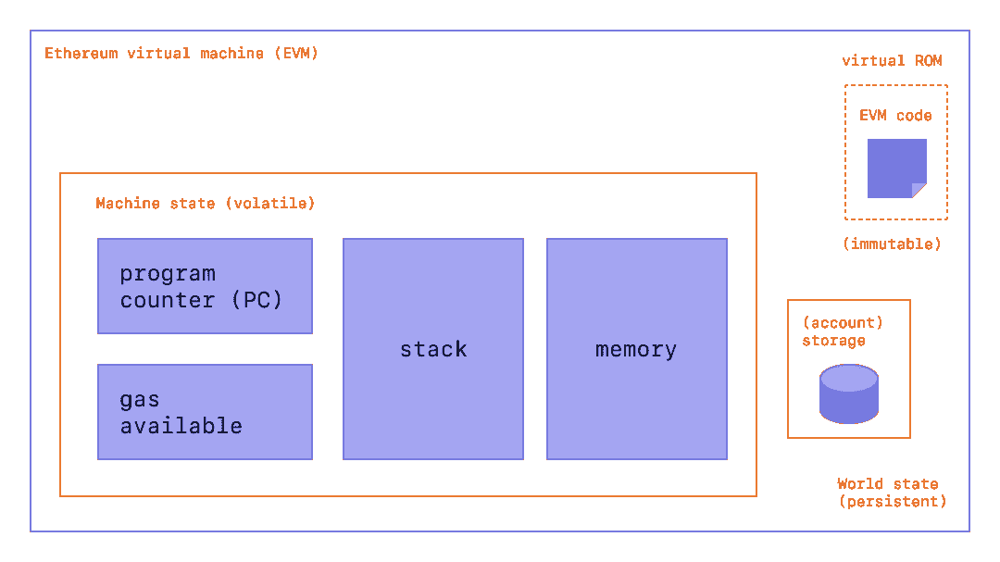
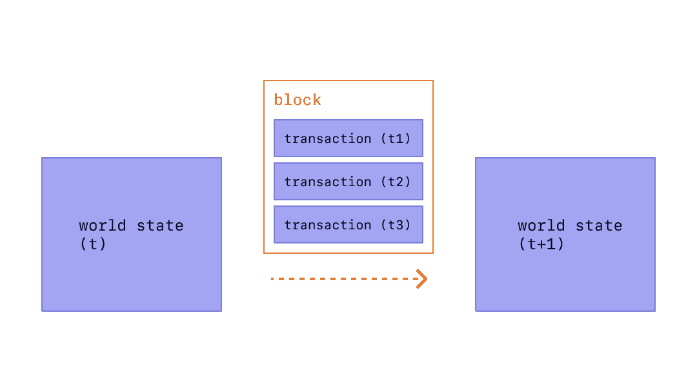

# 以太坊技术初学者入门

> 原文：<https://medium.com/coinmonks/a-technical-beginners-introduction-to-ethereum-1770d525ce80?source=collection_archive---------2----------------------->


image from: [https://depositphotos.com/vector-images/ethereum.html](https://depositphotos.com/vector-images/ethereum.html)

事实上，你在这里阅读这篇文章表明，你可能已经听说了区块链的革命潜力，以太坊是带头冲锋。互联网上有许多资源可以帮助你理解为什么或如何会这样，但它们通常不会深入到技术背后的技术细节。这篇文章将试图从技术上解释以太坊是什么以及它是如何工作的。因此，我们假设读者已经很好地掌握了计算机科学的概念，如虚拟机、哈希和区块链、数据结构等。

# 定义

我将在这一节中包括一些定义，这些定义可能有助于您理解稍后讨论的一些概念。

**字节码:**编译后在虚拟机上运行的代码。
**客户端:**以太坊虚拟机的一个实现。 **节点:**以太坊客户端的一个实例。 **工作证明:**以太坊共识协议(不久将改为利害关系证明)。它是验证块及其事务的计算工作量的支出。更多信息见此[链接](https://ethereum.org/en/developers/docs/consensus-mechanisms/pow/)。 **图灵完全**:如果一种语言理论上可以运行通用图灵机可以运行的任何程序，那么它就是图灵完全的。这需要能够执行某些功能，如加法、乘法、if-else 语句等。
**虚拟机**:计算机系统的虚拟化，模拟物理计算机的功能。

# 为什么是以太坊？

受比特币的启发，以太坊希望提供一个区块链平台，可以托管分散式应用程序(Dapps)并促进智能合约功能。它通过将图灵完全编程语言(EVM 代码)集成到区块链中来实现这一点。EVM 代码是一种基于堆栈的字节码语言。该功能使智能合约能够存在于区块链上，它可以定义自己的交易和状态转换功能。智能合约的应用是无穷无尽的。

# 区块和区块链

在抽象层次上，块是事务的集合和前一个块的散列。将每个块中的事务放在一个批处理中，允许参与者“保持同步状态，并就事务的精确历史达成一致”。一旦一个块被一个挖掘者放在一起，它就被传播到网络的其余部分，每个节点把它添加到它们的区块链拷贝的末尾。这个过程目前是由以太坊的工作证明共识模型规定的，但这将在不久的将来由 Eth 2.0 升级来改变。

区块链上的每个块由以下信息组成:

*   时间戳
*   批号
*   难度——开采区块所需的努力
*   哈希—块的唯一标识符
*   父哈希-前一个块的唯一标识符
*   交易清单的副本
*   状态根—系统的整个状态
*   Nonce —一个散列，当与 mixHash 结合时，证明该块已经通过了[工作证明](https://ethereum.org/en/developers/docs/consensus-mechanisms/pow/)。

父散列的引入是将块链接在一起的原因。每个块只能有一个父块，因此当每个块被“挖掘”时，它被链接到它的父块。

# 以太坊虚拟机

以太坊网络的主要组件是以太坊虚拟机(EVM)。EVM 是由运行以太网客户端的数千个节点维护的单一实体。这些节点中的每一个都是相互连接的，它们以对等的方式共享信息。至关重要的是，EVM 的运作必须持续和不间断。EVM 收藏了区块链和它的“州”。



image from: [https://ethereum.org/en/developers/docs/evm/](https://ethereum.org/en/developers/docs/evm/)

# 以太坊状态

EVM 随着积木的生产和加入区块链而不断变化，以太坊状态则是 EVM 在任何给定时间的“快照”。以太坊状态是一个存储所有账户和余额的大型数据结构，也是一个“机器状态”。根据 EVM 定义的一组规则，机器状态以及账户和余额随着交易的执行而逐块改变。这个状态是由状态根存储在每个块中的。在机器状态内部是一个堆栈和内存，以及两个变量；程序计数器和气体可用。这种机器状态使得代码能够在以太坊中执行。如果你想了解更多关于使用的确切数据结构，请查看这个[链接](https://eth.wiki/en/fundamentals/patricia-tree)。

# 账户、交易和消息

## 帐目

国家是由 objects⁴.的账户组成的账户有一个 20 字节的地址，是存储价值的地方。有两种类型的帐户。

1.  外部拥有的帐户—这些帐户由私钥控制
2.  合同账户-这些账户由其合同代码控制

所有以太坊账户都有四个字段:

1.  nonce——一个计数器，记录从账户发出的交易数量。它用于确保事务不会被执行超过一次。在合同账户中，该字段记录其创建的合同数量。
2.  当前乙醚平衡—存储在 wei (1e+18 wei = 1 ETH)中
3.  codeHash 仅用于合同账户。如果帐户收到消息调用，将执行此代码。
4.  存储根 Merkle Patricia Trie 的根节点的哈希，用于对帐户的存储内容进行编码。

外部拥有的账户和合同账户之间的主要区别在于账户的存储位置和管理方式。外部拥有的账户由密钥对管理，这使得所有者可以监管与该账户相关的资产。密钥对不存储在区块链上。

另一方面，合同帐户存储在区块链上，因此创建成本很高。从外部账户到合约账户的交易需要从合约账户执行交易，但这些交易不限于 ETH 的转账。

## 处理

在以太坊中，交易是由发送方验证(签名)的数据包，存储从外部拥有的帐户发送的消息。这些事务消息包含以下信息:

1.  收件人
2.  发件人的签名
3.  要转移的乙醚量
4.  可选数据字段
5.  一个`STARTGAS`值——允许执行事务的最大计算步骤数
6.  一个`GASPRICE`值——发送者将为每个计算步骤支付的费用。

交易的总费用通过乘以`GASPRICE`采取的计算步骤数来计算。虽然在标准交易中数据字段通常为空，但合同可以通过 EVM 访问它。

包含`STARTGAS`和`GASPRICE`字段是为了防止恶意攻击或计算资源的意外浪费，方法是限制交易可以采取的计算步骤的数量，并设置每个步骤的价格。

## 信息

消息与事务非常相似，但是由契约发送给其他契约。消息是从不序列化的虚拟对象，只存在于以太坊执行 environment⁵.中一条消息包含:

1.  消息的发送者(隐式)
2.  邮件的收件人
3.  与消息一起传输的以太量
4.  可选数据字段
5.  一个`STARTGAS`值

# 以太坊状态转换函数

以太坊状态转移函数就像你在计算机科学中可能遇到的任何其他函数一样；给定一个输入，它将产生一个确定的输出。状态转换函数是修改以太坊状态的过程，通常如下所示:

```
Y(S, T) = S'
```

其中`S`是旧状态，`T`是一个或多个事务的集合，`S'`是由状态转换函数`Y`产生的新状态。⁶

状态转换功能是将事务应用于当前状态，以在事务发生的地方创建新的状态。一个块包含一个事务列表，将一个块添加到区块链的过程包括将每个事务“应用”到当前状态并创建一个新的“最终状态”。一次“应用”一个事务，产生的状态成为下一个事务的新的当前状态。由此产生的“最终状态”将成为下一个 block⁷.的当前状态



image from: [https://ethereum.org/en/developers/docs/blocks/](https://ethereum.org/en/developers/docs/blocks/)

向区块链添加块被称为块验证，并且由以太坊网络中的挖掘池进行。当然，会有交易无法执行的情况，例如当发送方试图发送比他们实际拥有的更多的 ETH 时。EVM 旨在管理这些情况，以便为最终失败的交易付出劳动的矿工仍能获得回报。有关以太坊块验证过程的更详细的分步过程，请查看[以太坊白皮书](https://ethereum.org/en/whitepaper/)中的状态转移函数讨论。

# 代码执行

EVM 代码是一种低级的基于堆栈的字节码语言；其中代码是一系列字节，每个字节代表一个操作。在执行期间，代码可以访问三种结构:

1.  堆栈—后进先出法，其中可以推入和取出值
2.  内存——可以无限扩展
3.  长期保存的存储

实际执行代码的物理硬件是验证包含代码的块的硬件。代码包含在帐户中，如果帐户在交易中收到消息调用，则在状态转换功能期间执行，这是在块 validation⁸.期间完成的根据这个定义，块中的代码将由验证该块的每个节点实际执行。

当然，开发人员不希望用这种低级语言编写代码，这就是为什么 [Solidity](https://docs.soliditylang.org/en/v0.8.6/) 和 [Vyper](https://vyper.readthedocs.io/en/stable/) 存在的原因。

# 智能合同

我将把对智能合约的深入讨论留到下一次，但是你不能在不提及以太坊的情况下谈论它们。智能合约是存储在区块链上的可执行 EVM 代码，它们使得以太坊如此强大。在一个抽象的层次上，它们可以被描述为一系列的逻辑，给定一定的输入，将产生一定的输出。如果你想了解更多，网上有很多资源，但是[以太坊开发文档](https://ethereum.org/en/developers/docs/smart-contracts/)是一个很好的起点。

# 结论

我希望这些信息能帮助你更多地了解以太坊的技术层面。虽然以太坊 2.0 可能会稍微修改一些信息，但理解以太坊的工作方式仍然很重要。请关注未来的一篇文章，我将在其中详细讨论以太坊 2.0。

# 参考

https://ethereum.org/en/developers/docs/blocks/。
【2，6】[https://ethereum.org/en/developers/docs/evm/](https://ethereum.org/en/developers/docs/evm/)。
【3】见【2】。
【4，5，7，8】[https://ethereum.org/en/whitepaper/](https://ethereum.org/en/whitepaper/)

## 另外，阅读

[](https://blog.coincodecap.com/crypto-lending) [## 2021 年 9 大最佳加密借贷平台

### 当谈到加密货币贷款时，大量因素等同于良好的收入状况。此外，借款的一部分…

blog.coincodecap.com](https://blog.coincodecap.com/crypto-lending) [](/coinmonks/crypto-trading-bot-c2ffce8acb2a) [## 加密交易机器人——最佳免费加密交易机器人

### 2021 年币安、比特币基地、库币和其他密码交易所的最佳密码交易机器人。四进制，位间隙…

medium.com](/coinmonks/crypto-trading-bot-c2ffce8acb2a) [](/coinmonks/best-crypto-signals-telegram-5785cdbc4b2b) [## 最佳 6 个加密交易信号电报通道

### 这是乏味的找到正确的加密交易信号提供商。因此，在本文中，我们将讨论最好的…

medium.com](/coinmonks/best-crypto-signals-telegram-5785cdbc4b2b) [](https://blog.coincodecap.com/blockfi-review) [## BlockFi 评论 2021:利弊和利率

### 今天，我们提出了一个全面的 BlockFi 评论，这是一个成立于 2017 年的加密贷款平台，拥有其…

blog.coincodecap.com](https://blog.coincodecap.com/blockfi-review) [](/coinmonks/best-crypto-tax-tool-for-my-money-72d4b430816b) [## 加密税务软件——五大最佳比特币税务计算器[2021]

### 不管你是刚接触加密还是已经在这个领域呆了一段时间，你都需要交税。

medium.com](/coinmonks/best-crypto-tax-tool-for-my-money-72d4b430816b) [](/coinmonks/pionex-review-exchange-with-crypto-trading-bot-1e459d0191ea) [## Pionex 评论 2021 |免费加密交易机器人和交换

### Pionex 是为交易自动化提供工具的后起之秀。Pionex 上提供了 9 个加密交易机器人…

medium.com](/coinmonks/pionex-review-exchange-with-crypto-trading-bot-1e459d0191ea) [](https://blog.coincodecap.com/best-hardware-wallet-bitcoin) [## 存储比特币的最佳加密硬件钱包[2021]

### 保管您的数字资产很容易，但找到正确的存储方式却是一项繁琐的任务。在线钱包有一个风险…

blog.coincodecap.com](https://blog.coincodecap.com/best-hardware-wallet-bitcoin)