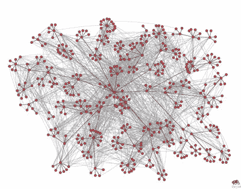
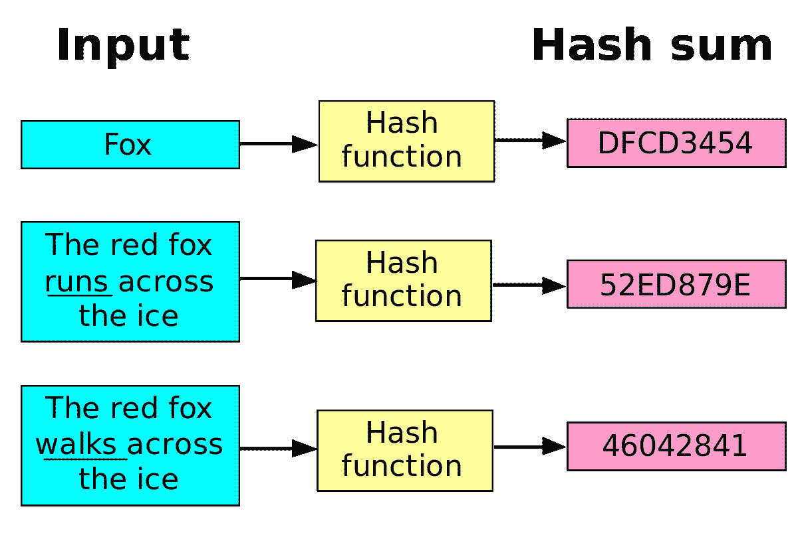
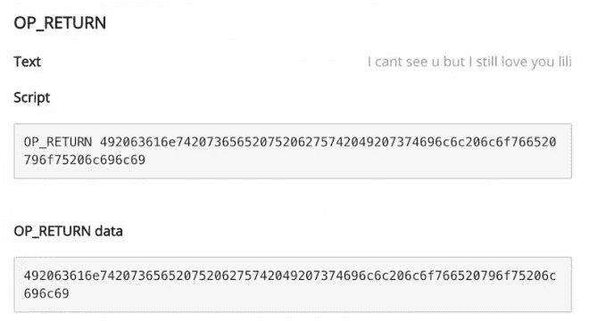

# 对比特币的技术性探究。

> 原文：<https://medium.com/coinmonks/a-technical-dive-into-bitcoin-a4fe045501b?source=collection_archive---------8----------------------->



## *连锁文件 pt。1*

> 我已经很久没有写东西了，最近一直在思考这个问题，我想我应该做一点研究，把我的想法写在数字纸上。你可以从这个旧帖子[这里](http://cponeill.posthaven.com/thoughts-on-bitcoin)了解更多。本帖最初发表于[这里](http://cponeill.posthaven.com/thoughts-on-bitcoin-hash-functions)。

比特币已经存在了近十年，自从它出现以来，已经在技术和商业界产生了不可思议的影响。当白皮书在 2009 年发布时，世界刚刚经历了 2008 年的金融崩溃，仍在应对其后果。如今，大多数文章都只关注比特币区块链将给世界带来的商业和经济变化；这些变化还没有完全实现，尽管世界各地有许多公司、政府和个人正在尽最大努力实现这一目标。然而，在整个运行过程中，比特币的安全性并没有受到影响。黑客攻击时有发生，但主要是由于交易所等第三方供应商犯了错误。支撑比特币本身的数学和技术仍然安全运行。这让我对它更加好奇，并最终引导我得出结论去了解它。我希望这篇文章能解释比特币的一些基本技术基础，但不是全部。所以让我们开始吧。

## ***哈希函数***

比特币中最常用的数据类型之一是加密哈希或[哈希函数](https://en.wikipedia.org/wiki/Cryptographic_hash_function)。哈希函数接受任意数量的数据输入(可以是任意数量)，并将其转换为固定长度的字符串或字节数组。无论输入数据有多大，输出数据的长度总是相同的。但是，每次对不同的数据进行散列时，即使使用的是同一个函数，也会创建一个全新的散列。有时你会看到加密散列简称为“散列”,因为有不具有相同安全属性的非加密散列。



下面的例子显示了如何使用散列来验证带有文本、照片或其他形式的多媒体的文档。我使用文本只是为了一个容易理解的例子。

```
## Run the following commands in a linux terminal
1) echo "this is our secret message. 'the rain in spain falls mainly in seattle'" | sha256sum
   ab9c98ed0d99f6cf8b7f2a8d2e96a1526aae7bf084fcca87edd41029e3adce9e  -2) echo "this is our secret message. 'the rain in spain falls mainly in seattle'" > hash.txt3) cat hash.txt | sha256sum
   ab9c98ed0d99f6cf8b7f2a8d2e96a1526aae7bf084fcca87edd41029e3adce9e  -
```

运行 echo 命令以及给定的文本和 sha256 算法，我们看到输出是一个 64 个字符的字符串，看起来完全随机。但是，两者最终都是相同的 64 个字符的字符串。这是哈希的一个极其重要的部分，因为它可以用于验证。在这种情况下，我们用它来表示一行简单的文本；但现在它可以用来验证其他形式的文件和身份。有相当多的公司正处于使用区块链构建识别层的第一阶段，哈希是他们如何运作的一个重要特征。

## ***工作证明***

那么哈希函数在比特币内部是如何工作的呢？为了更好地理解这一点，我们必须回到 1997 年，当时密码学家[亚当·巴克](https://en.wikipedia.org/wiki/Adam_Back)创造了一种叫做 HashCash 的技术，开创了一种叫做工作证明(PoW)的东西。HashCash 使用 PoW 来限制垃圾邮件和拒绝服务攻击，它这样做是通过要求选择一定量的工作来计算可以有效验证的证据。Hal Finney 后来为他的比特币先驱项目稍微调整了算法，作为一种挖掘硬币的方法。但是它在比特币网络中是如何工作的呢？为了理解这一点，我们需要了解目前引起最大炒作的技术，区块链。

比特币区块链是一个分类账，包含自最初的[创世区块](https://en.bitcoin.it/wiki/Genesis_block)以来发生的比特币交易的全部记录。所有这些记录都按“块”的顺序排列，这样任何用户都不能将他们的记录花掉两次。该记录也是公开的，任何人如果有特定的钱包地址或散列，就可以证实这些交易已经发生。每个块都引用前一个块的散列，并创建一个到所有前一个块的“链”,返回到源块。修改这些块在计算上也是不切实际的，因为每个进行中的块也必须重新生成，从而创建完全不同的散列。这有助于解决以前的数字货币的重复花费问题，并具有金钱以外的应用，如身份和知识产权。

哈希函数和工作证明算法使得改变区块链变得极其困难，而正是这一点让我们走到了今天，这也有助于解释为什么区块链背后的想法变成了如此热门的商业焦点。尝试这样做需要重新开采所有后续区块。然而这样做是困难的，因为任何独占网络计算能力的尝试都是昂贵的，因为需要机器来完成散列函数。

## ***OP_RETURN***

比特币协议中哈希函数的一个有趣的用例是 OP_RETURN，这是一个用于将交易输出标记为无效的脚本操作码。尽管该协议在首次宣布时引起了一些骚动，因为社区中的许多人认为这是不负责任的，因为比特币的用例是用于金融应用，并且添加这一点使其成为任意数据的记录，但该提议最终被接受。这是数字资产所有权证明的第一个用例，自其发布以来，已经创建了相当多的用例及应用，最著名的是[proofefexistence](https://proofofexistence.com/)。



Secret Message Stored on Bitcoin

虽然哈希函数通常是加密和安全软件的关键组件，但由于加密货币行业有如此多的新人，它已经开始成为更多人学习的主题。在我看来这是一件好事，原因有二；首先，越来越多的人对技术的安全基础有更好的理解，这有望导致未来对更强大的软件的需求，无论它是否基于加密货币领域。第二，有抱负的开发人员正在将他们所学的东西应用到他们的应用程序中。我知道，许多人可能会反驳说，这个想法比任何东西都更有希望，尤其是在大公司和政府间发生如此多黑客攻击的情况下，但只有时间能证明一切。我们仍处于许多公司和团队尝试将这项技术纳入主流的早期阶段，看到许多成果令人兴奋。

> 想要证明我写了这篇文章吗？把这个 [*密钥*](https://gist.github.com/cponeill/e70a975c2de4db59b07247bf801c1c2c) *和* [*用 Keybase 解密*](https://keybase.io/decrypt) *吧。*