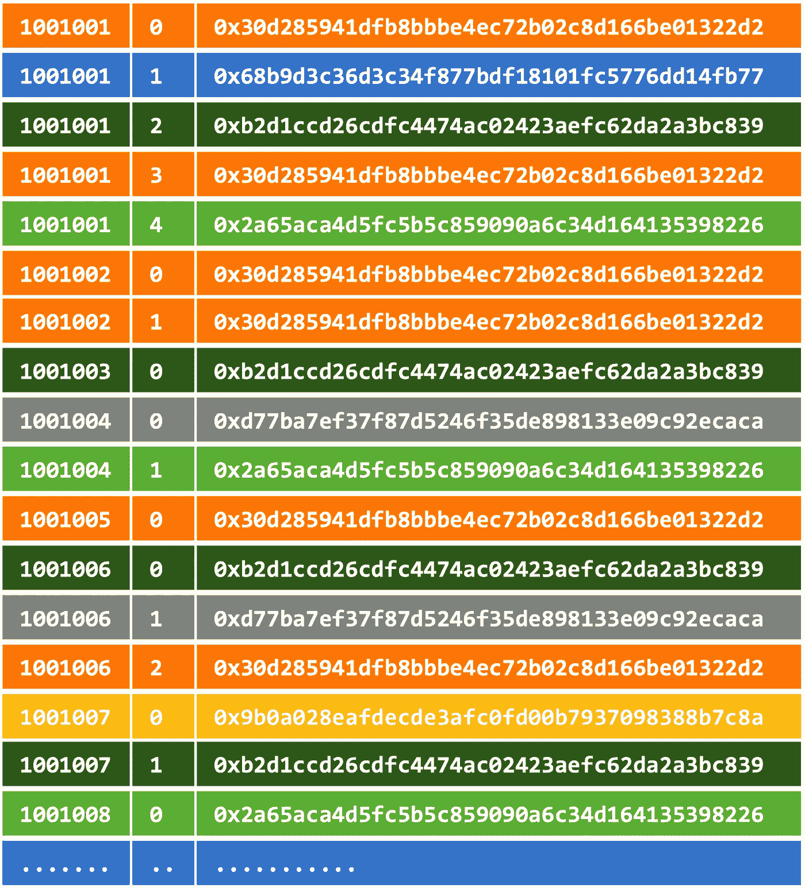
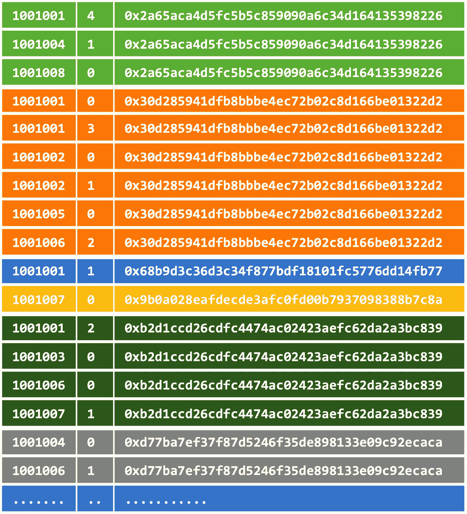
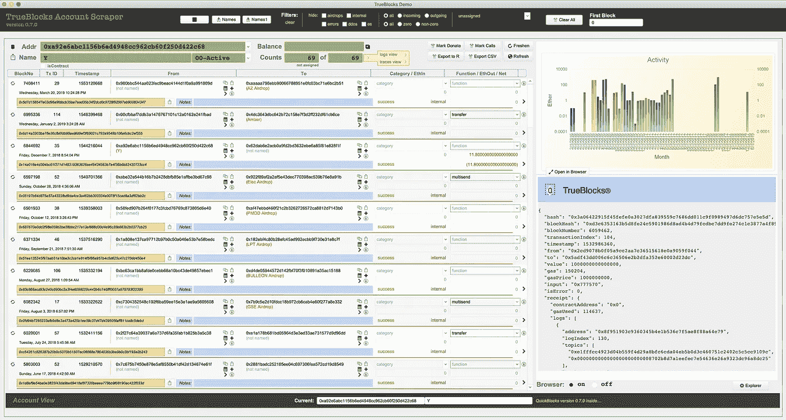

# 时序不可变数据的时序索引

> 原文：<https://medium.com/coinmonks/a-time-ordered-index-of-time-ordered-immutable-data-e28ced3417cc?source=collection_archive---------0----------------------->

## 以太坊区块链索引历险记

你有没有注意到，获得以太坊账户历史的唯一方法是访问一个完全集中的、数据库驱动的、*老式的* web-2.0 网站？

每次我使用这些网站(我一直都在使用)，我都会对自己说:*他们在监视我。他们把我的 IP 地址附在我的地址上，将来，他们会疯狂地侵犯我的隐私…但是我需要他们…*

最近，我们演示了一个基于 TrueBlocks 的完全去中心化的区块链探索者。点击这里查看。我们的浏览器(运行在商业级硬件上)的核心是 Ethrerum 地址索引。本文讨论了我们如何建立索引，我们遇到的困难，以及为什么共享它比你想象的要复杂得多——特别是如果你想避免成为一个过时的、过时的、注定要侵犯人们隐私的网站。

## 时间排序数据的问题是

A blockchain is a time-ordered, otherwise unsorted, list of transactions. Addresses appear throughout the data structure in an arbitrary, all-but-random order. Scanning this list for a particular address is slow, slow, slow, slow, slow!

众所周知，区块链不是数据库。区块链是按时间顺序排列的事务日志。每个事务在发生时都被记录在链上，并且以相同的顺序存储在磁盘上(至少在概念上是这样)。数据的时间排序特性使得用一个简短的、不可变的散列来完全表示每个块(以及该块之前的所有块的历史)成为可能。按时间排序的日志和不可变的、以哈希命名的数据就像数学和诗歌一样结合在一起。

使用以太坊节点的 RPC 接口，TrueBlocks 检索每个出现的块，请求该块中的每个事务，然后请求这些事务中的每个收据、每个日志和每个跟踪。我们解析所有这些数据，提取任何可能出现在*中的*地址——我们将在后面的帖子中介绍这个过程——并给出这个地址集合，在`address`中的`block_number`内按`transaction_index`排序，然后将排序后的列表写入磁盘。

如果我们不走得更远——简单地创建每个块的地址出现的排序列表——与单独扫描时间排序日志相比，这实际上会产生显著的加速。当然，我们希望做得比这更好。例如，我们可以生成更大的、合并的、排序的列表，这比单个块的搜索要快得多。

A sorted list is way faster to search, but if one inserts data one changes its hash

我们的铲运机正是这样做的。它跟踪它看到的外观总数，一旦有一定数量的记录(目前为 500，000)，就将它们组合起来，按地址排序，并将排序后的索引存储在一个更大的文件中。

这大大提高了后续地址搜索的速度——当然是这样——这是数据库索引的本质。

在前 8，120，000 个块中，我们的过程已经创建了大约 3，000 个这样的排序列表(我们称之为“块”)。每个块包含大约 500，000 条外观记录。一个出场记录是`<address,block_number,tx_id>`。

您可能会问，为什么我们不简单地将索引存储在老式的 web 2.0 数据库中，并使用老式的 web 2.0 API 分发查询该索引的结果呢？我会试着解释为什么这不是我们想要做的。抓紧你的帽子。

## 为什么不构建一个 Web 2.0 API 来分发索引呢？

权力下放。

## Web 2.0 有什么问题？

web 2.0 为什么很烂？让我来列举一些方式:侵犯隐私、未经验证的数据、脆弱性、单点故障、数据/用户可捕获性、用户锁定、侵犯隐私、富人越来越富的问题。名单很长。但是，最糟糕的问题——也是一个很难解释的问题——是如果我们想要建立一个去中心化的世界，web 2.0 并没有按照我们需要的方式扩展。

事实上，当前老式的 web 2.0 区块链探索者将带领我们离真正去中心化的世界越来越远。

web 2.0 区块链探索者的架构是首先从链中提取所有数据，放入 web 规模的数据库，索引数据十种方式到周日，最后交付的不是数据的索引，而是底层数据本身。这与分散数据是直接对立的。

这种服务的提供商实际上是在对用户说:

不要担心你那可爱的小脑袋会自己得到数据，我们会帮你得到的。做我们的客人。专注于构建您的应用程序。我们保证天气会好的。你可以信任我们。

但这与我们想要的方向恰恰相反。

该模型产生的提取数据的大小持续增长(可能呈指数增长)，因此，交付该数据的成本也将增长。显然，这将迫使这些数据提供商从他们的用户身上赚钱。在我看来，这将导致我上面提到的一系列问题，特别是用户锁定和隐私侵犯。

我们可以做得更好。

## 认识到不可变数据的重要性

区块链的数据是不可变的。我们不仅需要接受这个事实，而且应该接受它。没有其他办法。不可变数据不喜欢被索引。每次向不可变列表中插入新记录时，都会改变存储数据时生成的散列(例如在 IPFS)。因此，似乎不能同时拥有不可变数据和排序索引。

要解决这个问题，只需停止向列表中添加条目(TrueBlocks 通过创建按时间排序的分类帐的按帐户排序的索引的按时间排序的块来完成)。通过这种方式，我们可以在不可变数据和易于搜索的索引数据库之间找到一个平衡点。事实证明，这足以构建一个足以支持一整套应用程序的 API，包括完全分散的区块链探索者:

The TrueBlocks Decentralized Blockchain Explorer

## 那么 TrueBlocks 传递的是什么呢？

我们已经在最近的两篇文章中讨论过这个问题(这里的和这里的)，所以我不会深入讨论这个问题，但是基本上 TrueBlocks 正在构建一个系统，该系统创建整个区块链中地址出现的部分索引。这些部分索引(我们称之为块)存储在单独的文件中，每次记录数超过 500，000 时就进行分区。

我们随意地选择了这个记录数，但选择它是因为我们希望平衡磁盘上块的大小(每个大约 8MB)、生成新块所花费的时间以及生成的文件数(大约 3000 个块乘以 8120000 个块)。

产生新的组块所需的时间需要一点解释。

如果我们的索引远远落后于链的顶端，我们可以同时并行处理许多块。一旦我们赶上了小费，事情就变了。

当我们试图赶上时，我们尽可能快地行动，事实上，我们很容易地刮过整个链条，在大约一天半的时间内赶上。(过去这需要三个多星期，但最近我们在`go`中重写了 scraper，现在利用并行性大大加快了这个过程。谢谢，[内特拉什](https://medium.com/u/9accc392b07d?source=post_page-----e28ced3417cc--------------------------------)！)当我们玩 catch up 时，生成每个新的索引块大约需要 45 秒。(3000 块每块 45 秒→135000 秒→2250 分钟→ 37.5 小时→ 1.56 天。)

一旦我们赶上了，故事就完全变了。现在，该进程几乎所有的时间都在等待新的块。按照目前的使用率，以太坊链每块产生大约 450 个不同的地址。(如果一个地址出现在不同的事务中，它可以在一个块中出现多次，但每个事务只能出现一次。)为了累积 500，000 条记录来构建新的块，我们需要大约 1，111 个块。大约每 14 秒出现一个块→每分钟 4.285 个块→ 259.30 分钟产生 1111 个块→大约四个半小时产生一个新块。

非常重要的是，组块是不可变的，永远不会改变，可以发布到 IPFS，与整个社区共享，永远不变！

## 那么，说真的，TrueBlocks 传递的是什么？

我们将提供一个 API，它既可以在本地运行的节点上运行，也可以在 docker 下远程运行在 dAppNode 之类的节点上，甚至可以远程运行在一个老式的 web 2.0 数据库驱动的网站上。

在这三种情况下，当用户说，*我可以拥有账户 0x1234 上的所有交易吗…* 时，API 不会交付用户想要的 JSON 数据。相反，我们的 API 将把散列传递给用户需要直接搜索节点以获得他们想要的数据的索引块。

**用户对 TrueBlocks API:** `curl [http://endpoint/list_transactions/address](http://endpoint/list_transactions/address)`

> 一个简单的 API 查询，返回一些意外的结果。

**API 给用户:** `[ { “hash”: “QmXREJnqJ…”, “range”: “6517955–6519510” }, { “hash”: “QmQMBTt…”, “range”: “8102894–8104450” } ]`

> API 返回用户需要搜索的索引块的哈希值。在大多数情况下，这是一个非常短的列表，因为普通用户只是周期性地进行交互，然后是短时间的突发。一个普通用户，查询他自己的账户，可能会得到五六个散列。
> 
> 对于链的大量用户，如流行的 dApps 或 exchanges，列表会大得多(但不会大于 3000 个条目)。这正是我们想要的，因为普通用户不应该为重度用户承担负担。

**IPFS 用户:** `for each hash { ipfs get ${hash} -o ${range}.bin ; pin ${hash} }`

> 用户将块本地带到他们自己的机器上。从现在开始不可能抓住他们了。他们拥有查找该帐户历史记录所需的所有数据，而且这些数据永远不会改变。只要他们自己留着，就永远不会被俘虏。
> 
> 上面这条线的`*pin ${hash}*`部分实现了这一点。默认情况下，我们希望用户在本地复制索引块(这也将提高搜索速度)，然后固定他们自己的块。
> 
> 这使得在整个系统范围内对 IPFS 的相同数据块的后续查询更快，因为更容易找到该文件的更多副本。这样，每个人都按其使用比例分担携带指数的负担，系统的有效性随着用户数量的增加而增加(即网络效应)。重度使用者应该承担更多的负担。较轻的用户自然承担较少的负担，这在我看来是公平的。

**用户至 chi fra:**

> Chifra 读取本地缓存的索引块，并将记录导出到 JSON、TXT 或 CSV。它通过读取索引块、提取该地址的外观、查询节点的事务细节、 ***缓存返回的数据*** *然后将数据导出到屏幕或文件中来实现这一点。* ***缓存*** *很重要，因为查询节点和解析 JSON 结果可能会非常慢，而从本地二进制缓存中读取却非常快。*

## 结果

TrueBlock 共享以太坊区块链上地址出现索引的散列。这些索引从节点“释放”数据，使得以完全分散的方式构建有用、快速、响应迅速的应用程序成为可能。

通过共享不可变 IPFS 文件的散列，我们有目的地放弃了收回它们的能力。我们永远不能说，*我们抓住了你。如果您希望继续使用我们的数据，您必须向我们付费(否则我们将通过侵犯您的隐私来收取费用)。*

我们故意放弃这种能力**因为我们相信如果区块链上的数据不像开源软件代码那样完全自由和开放，这个系统最终会失败。**

在接下来的几个月里，我们将推出、记录和撰写大量关于我们工作的文章。我们将于八月份去柏林，所以如果你想讨论我们的工作，请联系我们。如果我们能买到票，我们也会在 DevCon。

## 支持我们的工作

我们对你的想法很感兴趣。请为我们鼓掌，发关于我们的微博，并在下面发表你的评论。考虑支持我们的工作。给我们发个小(或大)投稿到 0xb 97073 b 754660 bb 356 dfe 12 f 78 AE 366d 77 DBC 80 f。

Thomas Rush 拥有软件公司 TrueBlocks，LLC，其主要项目也称为 TrueBlocks，这是一个软件库和应用程序的集合，支持对以太坊区块链进行实时、逐块智能合约监控和分析。通过网站联系他。

> [直接在您的收件箱中获得最佳软件交易](https://coincodecap.com/?utm_source=coinmonks)

