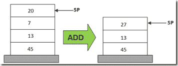

# 迈克尔逊&泰佐斯教程介绍，第一部分:你好，迈克尔逊

> 原文：<https://medium.com/coinmonks/a-tutorial-introduction-to-michelson-tezos-part-i-hello-michelson-6cc6504aae9e?source=collection_archive---------2----------------------->

迈克尔逊是特佐斯区块链人聪明的契约语言。大致来说，迈克尔逊之于 Tezos，就像以太坊虚拟机之于以太坊。两种语言都是基于堆栈的，这意味着计算是通过根据指令序列(程序)改变数据元素序列(堆栈)来完成的。

# 堆垛机

迈克尔逊和 EVM 之间最显著的区别是，迈克尔逊是以人类可读的文本格式编写的，而 EVM 运算是以字节表示的。例如，如果你查找 EVM 的操作码表，你会看到操作码`01`取了两个数字(在栈顶)并将它们相加。迈克尔逊中的等价运算写成`ADD`。

(公平地说，EVM 中的加法操作码`01`有`ADD`作为中间助记符表示)



在上图中，我们有一个堆栈，可以写成

```
20 : 7 : 13 : 45 : []
```

其中`:`是我们的元素分隔符，`[]`表示堆栈的底部。

在图示中，我们将操作`ADD`应用于堆栈，其定义如下:

```
ADD / a : b : S => (a + b) : S
```

用简单的英语来说，这个定义是“操作`ADD`移除栈顶的两个元素(定义中的`a`和`b`，然后将元素`(a + b)`放回栈顶:

```
ADD / 20 : 7 : 13 : 45 : [] => 
    (20 + 7) : 13 : 45 : [] => 
          27 : 13 : 45 : []
```

迈克尔逊的所有计算都是基于这种堆栈突变的过程进行的。我们在上面的例子中使用了`ADD`，但是我们也可以使用其他算术运算，如减法或乘法，或者逻辑运算，如`NOT`、`AND`、`OR`来改变堆栈。我们可以通过显式地将数据推送到堆栈上，或者通过交换或复制元素来直接操作堆栈。我们有像`LOOP`或`IF`这样的控制流结构。我们可以执行一些加密操作，如哈希或检查签名，我们可以通过启动令牌传输或创建帐户来与区块链进行交互。迈克尔逊有很多不同的操作。

# 类型

迈克尔逊和 EVM 的第二个主要区别是迈克尔逊数据元素是类型化的。

从广义上讲，类型是一条信息，它限制了用给定的数据值可以做的事情。

如果值`1`的类型为`int`(表示整数)，那么我们知道可以安全地对其执行数字加法，但是不能安全地执行列表索引。

对于类型为`string`的值`"foobar"`，情况正好相反。向列表中添加一个数字`1 + "foobar"`并没有很好的定义，因为加法是对整数的运算(在大多数语言中，一些语言重载了`+`操作符，当它的参数是数字时表示数字加法，当它的参数是字符串时表示连接)

类型是有用的，因为它们允许迈克尔逊解释器排除可能有问题行为的程序。例如，对于自然数类型`nat`，试图从较小的`nat`中减去较大的`nat`，如`4 - 5`，将会导致错误。然后，程序员可以在测试过程中确定这个错误是否是不希望的操作、不正确的参数或者值的类型签名是否应该被改变的结果。重要的是，这个错误在早期就发生了，并阻止了程序的运行，而不是让可能的 bug 在测试中被忽视，从而导致后来的产品问题。

一般来说，类型允许程序员向机器更详细地传达他们的意图，并允许机器在执行偏离这些意图时向程序员传达。

# 如何设置迈克尔逊环境

好了，现在我们已经介绍了一点迈克尔逊工作原理，让我们用一些代码来实践一下。

# 安装 Tezos 客户端

使用 Michelson 最简单的方法是使用 docker 安装 Tezos 客户端。在您的终端中键入以下命令:

```
$ wget https://gitlab.com/tezos/tezos/raw/alphanet/scripts/alphanet.sh $ chmod +x ./alphanet.sh $ ./alphanet.sh start
```

这应该会产生一些输出，您现在可以忽略它们。重要的是，打包在 Tezos 客户机中的是一个迈克尔逊运行时，我们可以用它来测试我们的程序。

或者，您可以按照 [Tezos 文档](http://tezos.gitlab.io/zeronet/introduction/howtoget.html)中的说明从源代码构建 Tezos

# 你好，泰佐斯

打开您最喜欢的编辑器，在您放置`alphanet.sh`脚本的同一个目录中编写下面的程序`helloTezos.tz`。

```
# helloTezos.tz
parameter unit; 
storage string; 
code {DROP; 
      PUSH string "Hello Tezos!"; 
      NIL operation; PAIR;};
```

首先，我们要检查脚本的类型是否正确:

```
$ ./alphanet.sh client typecheck script container:helloTezos.tz
```

通过添加`--details`标志，我们可以看到 typechecker 发出的更多信息:

```
$ ./alphanet.sh client typecheck script container:helloTezos.tz --details
```

这个程序应该进行类型检查，但如果没有，可能的原因是文件复制不正确，或者自该文档发布以来，迈克尔逊语义发生了重大变化。

# 运行脚本

现在我们知道了程序类型检查，我们将运行它。告诉 tezos 客户机运行 Michelson 程序(在沙箱中)的命令是:

```
$ ./alphanet.sh client run script <path> on storage <data> and input <data>
```

其中`<path>`是程序源的路径(因为我们使用 docker，所以会在前面加上`container:`),`<data>`是一些迈克尔逊值。

我们将在下面讨论`storage`和`input`的含义。现在，尝试运行:

```
$ ./alphanet.sh client run script container:helloTezos.tz on storage '""' and input Unit
```

这应该会返回:

```
storage "Hello Tezos!" emitted operations
```

恭喜你，你刚刚在迈克尔逊运行了你的第一个智能合同！

# 迈克尔逊契约召集公约

现在让我们来详细了解一下合同是如何运作的:

所有迈克尔逊智能契约都是带有两个参数的函数，一个输入参数和一个存储值，并返回一对操作列表和一个存储值。存储值实际上是一个返回值，操作列表就像是一个延续，例如，如果这个契约被另一个契约调用。

有许多不同的方法来记录类型签名，但下面是合同的迈克尔逊类型签名的样子:

```
lambda (pair 'parameter 'storage) (pair (list operation) 'storage)
```

就个人而言，我更喜欢 Haskell 的类型符号，但两种签名是等效的:

```
contract :: (Parameter p, Storage s) -> ([Operation], Storage s)
```

# helloTezos 初始和返回类型

我们再来看看`helloTezos.tz`:

```
# helloTezos.tz
parameter unit; 
storage string; 
code {DROP; 
      PUSH string "Hello Tezos!"; 
      NIL operation; PAIR;};
```

`parameter unit`和`storage string`行指定了契约的两个参数的类型。如果我们将上面的签名具体化为一般类型的迈克尔逊合同，用`'parameter`作为`unit`和`'storage`作为`string`，我们得到我们具体的`helloTezos.tz`合同的类型:

```
lambda (pair unit string) (pair (list operation) string)
```

迈克尔逊契约的初始堆栈是它的参数对`(pair 'parameter 'storage)`，所以`helloTezos.tz`从一个类型的堆栈开始:

```
:: (pair unit string) : []
```

在命令行中，我们运行

```
$ ./alphanet.sh client run script container:helloTezos.tz on storage '""' and input Unit
```

`'""'`是空字符串`""`的命令行语法，`Unit`是`unit`类型的单个居民的数据构造器。请注意，输入和参数在这里是同义词。所以我们的初始堆栈有具体的值:

```
(Pair Unit "") : []
```

它有类型

```
:: (pair unit string) : []
```

`Pair`和`pair`的区别在于`Pair`是数据构造器`pair`是类型。Michelson 中的数据构造函数以大写字母开头，而类型都是小写的。

现在我们有了初始值和返回类型，我们可以把契约的执行看作是一系列操作，把初始值转换成与返回类型匹配的返回值。

换句话说，我们从

```
(Pair Unit "") : [] :: (pair unit string) : []
```

我们想以此结束

```
??? :: (pair (list operation) string) : []
```

# helloTezos 处决

幸运的是，我们的合同很短，只有 4 个操作，所以我们可以在这里完成这个转换的步骤。操作写在`helloTezos.tz`的`code`标题之后:

```
# helloTezos.tz 
code {DROP; 
      PUSH string "Hello Tezos!"; 
      NIL operation; PAIR;};
```

如果我们记下这个操作序列以及上一节中的初始值和类型，我们就可以得到迈克尔逊堆栈机器的完整状态:

```
STATE 
code DROP; PUSH string "Hello Tezos!"; NIL operation; PAIR; 
stack (Pair Unit "") : [] 
type :: (pair unit string) : []
```

# 滴

`DROP`操作移除(或“丢弃”)堆栈的顶部元素，并具有以下定义(根据迈克尔逊规范稍微重新安排)

```
code DROP 
stack _ : S => S 
type :: _ : 'A -> 'A
```

其中`_`是匹配任何操作、值或类型的通配符

把这个应用到我们的州，我们的新州是:

```
STATE 
code PUSH string "Hello Tezos!"; NIL operation; PAIR; 
stack [] 
type :: []
```

# 推

`PUSH`操作将一个特定类型的值添加到堆栈顶部，定义如下:

```
code PUSH 'a (x :: 'a) 
stack S => x : S 
type 'A -> 'a : 'A
```

我们的具体指令是`PUSH string "Hello Tezos!"`，所以转换具体化为:

```
code PUSH string ("Hello Tezos!" :: string) 
stack S => "Hello Tezos!" : S 
type 'A -> string : 'A
```

当应用时，它给我们一个新的状态:

```
STATE 
code NIL operation; PAIR; 
stack "Hello Tezos!" : [] 
type :: string : []
```

# 无

`NIL`操作将某一类型的空列表添加到堆栈顶部，定义如下:

```
code NIL 'a 
stack S => {} : S 
type 'A -> list 'a : 'A
```

当应用时，它给我们一个新的状态:

```
STATE 
code PAIR; 
stack {} : "Hello Tezos!" : [] 
type :: list operation : string : []
```

# 一副

`PAIR`操作移除栈顶的两个元素，将它们组合成一对，并将这一对推到栈上。它有以下定义:

```
code PAIR 
stack a : b : S => (Pair a b) : S 
type 'a : 'b : 'A -> pair 'a 'b : 'A
```

当应用时，它给我们一个新的状态:

```
STATE 
code 
stack (Pair {} "Hello Tezos!") : [] 
type :: pair (list operation) string : []
```

# 结束

我们现在没有操作了，我们的栈有类型`pair (list operation) string : []`，这正是我们想要的。由于该类型与我们预期的返回类型相匹配，所以契约返回我们的`(pair 'operations 'storage)`中的值:

```
storage 
  "Hello Tezos!" 
emitted operations
```

# 结论

这结束了我们的迈克尔逊教程的第一部分。你现在应该知道了

*   堆垛机的基本工作原理
*   如何安装 Tezos 客户端
*   如何编写和执行一个简单的迈克尔逊合同
*   什么是迈克尔逊类型，值和操作，以及每一个简单的例子

在第二部分中，我们将编写更多的契约并检查它们的执行(尽管不太严格)，引入更多的操作、类型和数据构造函数。

# 读者练习

**练习 1:** 修改我们的`helloTezos.tz`文件以输出`"Hello World!"`而不是`"Hello Tezos`。调用这个文件`helloWorld.tz`

**练习 2:** 现在修改我们的`helloTezos.tz`文件，将一个字符串参数作为输入和输出`"Hello <input>".`调用这个文件`helloInput.tz`你需要知道两个额外的操作:

```
code CAR # select left-hand of pair 
stack (Pair a _) : S => a : S
type pair 'a 'b : 'A -> 'a : 'Acode CONCAT # string concatenate 
stack a : b => a ^ b : S 
type string : string : 'A -> string: 'A 
  where a ^ b concatenates the end of a to the beginning of b
```

**练习 3:** 做与练习 2 相同的事情，除了现在契约将一个单元作为其输入参数，并输出连接到其初始存储的`"Hello "`。所以跑步`$./alphanet.sh client run script container:hellotezos.tz on storage '"bar"' and input 'Unit'`

应该输出“你好吧”。把这个文件叫做`helloStorage.tz`

您需要知道一个额外的操作:

```
code CDR # select right-hand of pair 
stack (Pair _ b) : S => b : S 
type pair 'a 'b : 'A -> 'b : 'A
```

**练习 4:** 写一个连接输入字符串和存储字符串以及输出的契约`"Hello <input><storage>"`。调用这个文件`helloInputAndStorage.tz`

你需要知道:

```
code DUP # Duplicate the top of the stack
stack x : S => x : x : S
type :: 'a : 'A -> 'a : 'a : 'Acode DIP ops # Runs code protecting the top of the stack
stack x : S => x : S' 
  where ops / S => S' 
type :: 'b : 'A -> 'b : 'C 
 iff ops :: [ 'A -> 'C ]
```

你也可以用`SWAP`代替`DIP`

```
SWAP # Exchange the top two elements of the stack
stack x : y : S => y : x : S 
type :: 'a : 'b : 'A -> 'b : 'a : 'A
```

*原载于*[*https://git lab . com/caml case-dev/Michel son-tutorial/tree/master/01*](https://gitlab.com/camlcase-dev/michelson-tutorial/tree/master/01)

> [直接在您的收件箱中获得最佳软件交易](https://coincodecap.com/?utm_source=coinmonks)

[](https://coincodecap.com/?utm_source=coinmonks)[](http://bit.ly/2G71Sp7)

[**Click to read today’s top story**](http://bit.ly/2G71Sp7)