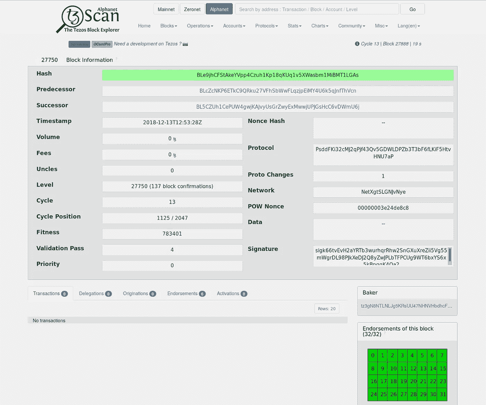

# 迈克尔逊&泰佐斯教程介绍，第二部分:你好泰佐斯

> 原文：<https://medium.com/coinmonks/a-tutorial-introduction-to-michelson-tezos-part-ii-hello-tezos-e0d247e1131f?source=collection_archive---------5----------------------->

现在我们知道了一点迈克尔逊，让我们看看特佐斯区块链，这是我们的迈克尔逊合约实际运行的“环境”。

这不会是对 Tezos 的详尽概述；我们将把重点放在从一个迈克尔逊程序员的角度来看最相关的那些方面。我们将会看到一些有用的工具，比如我们上一章安装的`alphanet` docker 容器中的`tezos-client`程序和一个在线区块链浏览器。

这些工具和 Tezos 本身一样，还不成熟，正在快速发展。在很大程度上，他们采用“信息转储”风格的用户界面，这对于 Tezos 核心开发人员来说很好，但对于新手来说可能会很难接受。出于本教程的目的，我们特别感兴趣的是如何用迈克尔逊编程，所以我们可以抽象出工具所暴露的更多细节，这些细节在其他情况下更相关，比如我们想经营一家面包店。其中一些细节将在以后的章节中更深入地讨论。

目前，我们的目标是对如何使用当前的 Tezos 工具有一个基本的了解，目标是在下一章结束时，在 Tezos alphanet 上运行一个简单的 Michelson 契约并与之交互。

# Tezos 区块链

在您的终端中，在上一章中安装 alphanet 容器的目录中，执行以下命令:

```
$ ./alphanet.sh head
```

假设节点正在运行(如果没有，用`./alphanet.sh start`启动它)，它应该会输出如下内容:

```
Warning:                    This is NOT the Tezos Mainnet. The node you are connecting to claims to be running on the 
                 Tezos Alphanet DEVELOPMENT NETWORK. 
         Do NOT use your fundraiser keys on this network. 
         Alphanet is a testing network, with free tokens.{ "protocol": "PsddFKi32cMJ2qPjf43Qv5GDWLDPZb3T3bF6fLKiF5HtvHNU7aP",    "chain_id": "NetXgtSLGNJvNye", 
"hash": "BLe9jhCFStAkeYVpp4Czuh1Kp18qKUq1v5XWasbm1MiBMT1LGAs", 
"level": 27750, "proto": 1, "predecessor": "BLcZcNKP6ETkC9QRku27VFhSbWwFLqzjpEiMY4U6k5qJnfThVcn", 
"timestamp": "2018-12-13T12:53:28Z", 
"validation_pass": 4, 
"operations_hash": "LLoaaw91Q5k48SfBL96ttQe54WcUdn32BGKyNoDZ8sCA5KAEwJGMb", 
"fitness": [ "00", "00000000000bf429" ], 
"context": "CoWNoFZFhB2hGWhXv5VqEZgL6mS4UFtdJbYKrM7VY6Yt8MgZXiEp", "priority": 0, 
"proof_of_work_nonce": "00000003e24de8c8", 
"signature":
"sigk66tvEvH2aYRTb3wurhqrRhw2SnGXuXreZii5Vg55mWgrDL98PJkXeDJ2Q8yZwJPLbTFPCUg9WT6bxYS6x5kBpqqK4Qa2" }
```

请暂时忽略其中的所有内容，除了下面一行:

```
"hash": "BLe9jhCFStAkeYVpp4Czuh1Kp18qKUq1v5XWasbm1MiBMT1LGAs",
```

请复制右边的值，因为我们一会儿会用到它。请注意，您的终端中显示的实际值几乎肯定会与我在这里写下的不同。请从您的终端复制该值。

现在在你的浏览器中打开 [tzcan.io 的 alphanet block explorer](https://alphanet.tzscan.io/) ，在搜索框中粘贴哈希值并点击回车。

您应该会看到类似这样的内容:



这是您的节点认为当前是 Tezos alphanet 区块链头的块的[哈希值](https://en.wikipedia.org/wiki/Hash_function)。

# 区块链:简要回顾

看看那些写着

```
Predecessor: BLcZcNKP6ETkC9QRku27VFhSbWwFLqzjpEiMY4U6k5qJnfThVcn Successor: BL5CZUh1CePUW4gwjKAJvyUsGrZwyExMwwjUPJGsHcC6vDWmU6j
```

简单回顾一下，区块链，顾名思义，就是一连串的区块。每个块包括其前任块的散列，而前任块又包括其前任的散列，以此类推，直到链中没有前任的第一个(或“起源”)块。(注意，块中实际上只有前一个哈希，后一个哈希是 tzScan 为了方便起见添加的带外信息)。


你可以在这里看一下 alpha net Genesis block:[https://alphanet.tzscan.io/0](https://alphanet.tzscan.io/0)

每个块都包含其前一个块的散列的原因是为了创建一个难以秘密修改的数据结构。

例如，假设我想编辑 block `BLe9jh...`的副本，并添加一个向我的一个帐户存入 10 亿技术开发区的交易，我可以这样做。但是对每个人来说，我篡改了块是显而易见的，因为块的散列不再匹配。

块中的所有信息(序列化时)只是一个数字。块的散列只是该数字上特定散列函数的输出:

```
Hash(serializedBlock) = BLe9jh...
```

因此，如果我添加一个事务并更改块信息，我会更改代表该块的序列号，这将更改该块的哈希。由于哈希函数的运行时间和成本可以忽略不计，所以如果我试图将我篡改的块副本发送给其他任何人，他们可以很容易地重新计算哈希函数，并发现哈希不匹配。

此外，因为每个块都包括其前任的散列，所以更改任何块都会更改其“下游”的所有其他块。这意味着，只要你和我对链中的最新块(头)是什么达成一致，我们就可以对链的整个历史达成一致。(就头部达成一致是由共识算法解决的问题，在 Tezos 中，这是委托利害关系证明的一种变体)。

一般来说，这种类型的数据结构被称为[散列树或 Merkle 树](https://en.wikipedia.org/wiki/Merkle_tree)。考虑到这个术语的各种滥用，需要强调的是，所有“区块链”指的是一个散列树，它的节点是事务块。它与“键值映射”或“链表”属于同一类别。

# Tezos Mainnet，Alphanet，Zeronet

返回到我们的块浏览器:


我们可以看到块`BLe9jh..`中实际上没有任何事务。(您的具体街区可能会)。这是因为 Tezos Alphanet 是为测试而设计的，所以事务相当少，阻塞也很频繁(每 30 秒一次)。Alphanet tez 的价值可以忽略不计，事实上，它是通过一个无限的水龙头(我们将在后面使用)免费送给任何想要它们的人的。Alphanet 不是分散的，每隔几周就会从 genesis 中定期重置。

Tezos 有三个并行的区块链，称为“Mainnet”、“Alphanet”和“Zeronet”

Mainnet 是技术开发中心真正有价值的地方，也是网络分散的地方。Zeronet 是一个主要由核心开发人员使用的前沿测试网络，通常每天重置几次。

要查看有实际交易的块，进入 [Mainnet 块列表](https://tzscan.io/blocks)。

在本教程中，我们将在 Alphanet 上完成大部分工作，尽管在后面的章节中，我们将通过一个新的 genesis 块来引导我们自己的测试网络。

顺便说一下，如果你重新运行:

```
$ ./alphanet.sh head
```

您会注意到，在您阅读本节时，标题已经更新。

# 与 Tezos Alphanet 互动

现在我们已经讨论了足够多的上下文，我们将在 Alphanet 上实际做一些事情。

首先，我们需要一个身份，进入您的终端并运行:

```
$ ./alphanet.sh shell
```

这将我们放在 docker 容器中，因此我们可以直接在 tezos-node 上执行命令。您的提示可能会改变，您可以运行一些命令来验证您现在是在 docker 容器中:

```
$ pwd /home/tezos ~ 
$ whoami tezos ~ 
$ ls -a . .. .ash_history .tezos-client .tezos-node
```

您可以使用`<Ctrl-D>`或

```
$ exit
```

返回到您的常规提示。

# 生成 Alphanet 身份

```
$ ./alphanet shell 
$ tezos-node identity generate
```

这将需要很短的时间，所以请继续阅读。

Tezos 身份包含以下内容:

1.  向网络唯一标识我们的`peer_id`。你可以在 [tzScan 的网络页面](https://alphanet.tzscan.io/network)上看到 alphanet 的同行列表
2.  一对`public_key, secret_key`密钥，让我们可以安全地与其他对等方通信。例如，我们可以使用我们的秘密密钥来生成交易，其他对等体可以使用我们的公共密钥来验证这些交易是否来自我们。
3.  一个`proof_of_work_stamp`表明我们在生成身份时做了一些计算工作。这就是为什么`identity generate`命令需要一些时间的原因，并且是为了防止人们通过生成无止境的身份向网络发送垃圾邮件。

您可以阅读更多关于身份生成的信息

```
$ tezos-node identity --help
```

至此，我们可以看到通过运行以下命令生成的身份文件:

```
$ cat /home/tezos/.tezos-node/identity.json 
{ "peer_id": "idtRhgUQFQcUFJLW5HXQbRcdYkaUr4", 
"public_key":"34a911ff9258d7c23b44844372a54c2a2a031d41e275e6a7d1251d1aeb95e207", 
"secret_key": xxxx 
"proof_of_work_stamp":"70e5ea8e85745a54f1a1d11b7c650e56f57f5c76243c072f"
```

(实际上这个`.tezos-node/identity.json`文件是一个虚拟文件，docker 容器将真实身份存储在`/var/run/tezos/node/data/identity.json`中，但是如果你从源代码安装 tezos，它将位于`.tezos-node`下)

记住永远不要在任何地方张贴你的秘密钥匙。如果除了你之外的任何人知道了你的秘密密钥，你的整个身份就暴露了。在 Alphanet 上，这真的无关紧要，但即使在无关紧要的时候也要实践良好的操作安全性，这是一个好主意，这样当它变得无关紧要时，它就会成为一种习惯。

# 用$$闲钱$$激活帐户

Tezos Alphanet 水龙头是由 Tezos 开发者运营的一个网站，让我们下载钱包文件。本质上，每当开发人员重置 alphanet 时，他们都会在 genesis 块中包含一系列受资助的帐户，然后将这些帐户的密钥免费提供给任何想要进行 alphanet 测试的人。

导航到[https://faucet.tzalpha.net/](https://faucet.tzalpha.net/)并下载文件。

现在退出 alphanet docker 容器，并捕获该文件的内容:

```
$ exit 
$ cat ~/Downloads/tz1M1tuK4BM53S2niKvQDn6SbACiVk6zbjx4.json 
{ "mnemonic": [ "xxxx", "xxxx", "xxxx", "xxxx", "xxxxx "xxxx", "xxxx", "xxxx", "xxxx", "xxxx", "xxxx" "xxxx", "xxxx", "xxxx", "xxxx", ], 
"secret": "xxxx", 
"amount": "7489334243", 
"pkh": "tz1M1tuK4BM53S2niKvQDn6SbACiVk6zbjx4", 
"password": "xxxx" "email": "qaqjqdvr.xlicmfia@tezos.example.org" 
}%
```

与我们相关的两条线是:

```
"amount": "7489334243", 
"pkh": "tz1M1tuK4BM53S2niKvQDn6SbACiVk6zbjx4",
```

与身份文件一样，这个钱包文件也有一个加密密钥。激活此文件中列出的帐户后，您要告诉网络您要进行转账的方式是通过点对点网络广播交易消息(用此密钥签名)，使用我们之前生成的 p2p 身份。其他同行可以通过用我们的账户公钥(即账户的“地址”)验证我们的签名，以及通过在区块链中查找我们的余额，来验证交易的正确性(我们是否有足够的 tez 来进行转账)。

现在让我们激活帐户，给它一个本地昵称`alice`:

```
$ ./alphanet client activate account alice with "container:/home/jcb/Downloads/tz1M1tuK4BM53S2niKvQDn6SbACiVk6zbjx4.json"
```

这应该会输出:

```
Node is bootstrapped, ready for injecting operations. 
Operation successfully injected in the node. 
Operation hash: onotiUDrveZX1NRt39zQmPxVbVkxS2qfpM5gucFTV8BvvfPZoRB Waiting for the operation to be included... 
Operation found in block: BM5RPwciV64Bz5nG3FbYY6xusrFt2j6EHTBrA7Hhye9fzWUhMK1 (pass: 2, offset: 0) This sequence of operations was run: 
  Genesis account activation: Account: tz1M1tuK4BM53S2niKvQDn6SbACiVk6zbjx4 
Balance updates: tz1M1tuK4BM53S2niKvQDn6SbACiVk6zbjx4 ... +ꜩ7489.334243 The operation has only been included 0 blocks ago. We recommend to wait more. Use command tezos-client wait for onotiUDrveZX1NRt39zQmPxVbVkxS2qfpM5gucFTV8BvvfPZoRB to be included --confirmations 30 and/or an external block explorer. 
Account alice (tz1M1tuK4BM53S2niKvQDn6SbACiVk6zbjx4) activated with ꜩ7489.334243.
```

让我们打开 tzScan，看看包含此激活的块`BM5RPwciV64Bz5nG3FbYY6xusrFt2j6EHTBrA7Hhye9fzWUhMK1`:


现在，如果我们单击帐户激活，我们应该会看到:


用余额！

(交易可能需要几分钟才能出现在 tzScan 上，因此如果您没有看到您的交易，请稍等片刻，等待更多块得到确认，然后重试。)

# 生成新帐户

现在让我们生成一个没有 tez 余额的名为“bob”的新帐户:

```
$ ./alphanet.sh client gen keys bob
```

这应该只是输出 Alphanet 警告，但是我们可以进入 docker 容器，查看我们生成或激活的帐户

```
$ ./alphanet.sh shell 
$ cat /var/run/tezos/client/public_key_hashs 
[ { "name": "bob", "value": "tz1QCUKL2YZuGLSdTesXtVHJB8zRcG6XTz8f" }, 
  { "name": "alice", "value": "tz1M1tuK4BM53S2niKvQDn6SbACiVk6zbjx4" } ]
```

所有内部存储的客户端数据都在 docker 容器的`/var/run/tezos/client`中，如果从源代码安装，则在`.tezos-client`中。

但是，客户端为内部存储的数据提供了更好的接口:

```
$ ./alphanet.sh client list known addresses bob: tz1QCUKL2YZuGLSdTesXtVHJB8zRcG6XTz8f (unencrypted sk known) 
alice: tz1M1tuK4BM53S2niKvQDn6SbACiVk6zbjx4 (unencrypted sk known)
```

# 将 tez 从 alice 转移到 bob

让我们检查一下`alice`和`bob`的余额:

```
$ ./alphanet.sh client get balance for alice 
7489.334243 ꜩ$ ./alphanet.sh client get balance for bob 
0 ꜩ
```

让我们从`alice`转移 420 个代币给鲍勃:

```
$ ./alphanet.sh client transfer 420.5 from alice to bob --fee 0.5 Fatal error: The operation will burn ꜩ0.257 which is higher than the configured burn cap (ꜩ0). Use `--burn-cap 0.257` to emit this operation.
```

客户端中有`burn-cap`设置，防止我们意外发送一个会消耗过多 tez 的交易:

```
Λ ➜ ./alphanet.sh client transfer 420.5 from alice to bob --fee 0.5 --burn-cap 0.257 Node is bootstrapped, ready for injecting operations. 
Estimated gas: 10100 units (will add 100 for safety) 
Estimated storage: 257 bytes added (will add 20 for safety) 
Operation successfully injected in the node. 
Operation hash: opXPyuAXx2yWoReQvWF6tra4aREqS2NgCBQNDtyo4rtZJAuizrM 
Waiting for the operation to be included... 
Operation found in block: BMRY5jRXjTtU2LeVoWFgSo9D7BU4eFqNB6UCSeZ6neWZhu5AXPt (pass: 3, offset: 0) This sequence of operations was run:Manager signed operations: 
From: tz1M1tuK4BM53S2niKvQDn6SbACiVk6zbjx4 
Fee to the baker: ꜩ0 
Expected counter: 5807 
Gas limit: 10000 
Storage limit: 0 bytes 
Revelation of manager public key: 
  Contract: tz1M1tuK4BM53S2niKvQDn6SbACiVk6zbjx4
  Key: edpkuS9a1795Cwwrstx6B6Q3Bugo3CKJ2NxtohxnjEaQGiJkWTD5YE 
  This revelation was successfully applied 
  Consumed gas: 10000 Manager signed operations: 
From: tz1M1tuK4BM53S2niKvQDn6SbACiVk6zbjx4 
Fee to the baker: ꜩ0.5 
Expected counter: 5808 
Gas limit: 10200 
Storage limit: 277 bytes Balance updates: tz1M1tuK4BM53S2niKvQDn6SbACiVk6zbjx4 ... -ꜩ0.5 
fees(tz3NdTPb3Ax2rVW2Kq9QEdzfYFkRwhrQRPhX,14) ........... +ꜩ0.5 
Transaction: 
  Amount: ꜩ420.5 
  From: tz1M1tuK4BM53S2niKvQDn6SbACiVk6zbjx4 
  To: tz1QCUKL2YZuGLSdTesXtVHJB8zRcG6XTz8f 
  This transaction was successfully applied 
  Consumed gas: 10100 Balance updates: 
tz1M1tuK4BM53S2niKvQDn6SbACiVk6zbjx4 ... -ꜩ420.5 
tz1QCUKL2YZuGLSdTesXtVHJB8zRcG6XTz8f ... +ꜩ420.5 
tz1M1tuK4BM53S2niKvQDn6SbACiVk6zbjx4 ... -ꜩ0.257 The operation has only been included 0 blocks ago. 
We recommend to wait more.
Use command tezos-client wait for opXPyuAXx2yWoReQvWF6tra4aREqS2NgCBQNDtyo4rtZJAuizrM to be included --confirmations 30 and/or an external block explorer.
```

这为我们打印了一张很好的收据，详细记录了我们的技术开发中心到底发生了什么。

让我们来看看 tzScan 上的`bob`，或者说`tz1QCUKL2YZuGLSdTesXtVHJB8zRcG6XTz8f`:


但是等等，为什么是`420.5` tez？我们不是交了`0.5` tez 的费用吗？再次查看收据的余额更新部分(我添加了地址为`alice`和`bob`的注释)

```
... Balance updates: 
      alice tz1M1tuK4BM53S2niKvQDn6SbACiVk6zbjx4 ....... -ꜩ0.5
      fees(tz3NdTPb3Ax2rVW2Kq9QEdzfYFkRwhrQRPhX,14) .... +ꜩ0.5   
      ... 
      Balance updates: 
        alice tz1M1tuK4BM53S2niKvQDn6SbACiVk6zbjx4 ... -ꜩ420.5 
        bob tz1QCUKL2YZuGLSdTesXtVHJB8zRcG6XTz8f ......+ꜩ420.5 
        alice tz1M1tuK4BM53S2niKvQDn6SbACiVk6zbjx4 ... -ꜩ0.257
```

费用来自`alices`账户，与交易分开。所以`alice`支付的总金额是`-ꜩ421.257`

# 结论

我们关于基本 Tezos 操作的章节到此结束。下一章，我们将把我们在这里学到的东西与我们在第一章学到的迈克尔逊结合起来，在泰佐斯区块链上实际运行迈克尔逊合约！

# 练习

**练习 1:**Tezos 客户端附带一份手册，您可以通过

`$ ./alphanet.sh client man`

这将默认输出带颜色格式的手册。使用手册来确定传递给`client man`命令关闭颜色的选项。

Unix 工具`grep`和`less`在这里可能有用，网上也有一份:[http://tezos.gitlab.io/alphanet/api/cli-commands.html](http://tezos.gitlab.io/alphanet/api/cli-commands.html)

**练习 2:** 进入 docker 容器外壳(如我们前面所述)并运行

`$ tezos-admin-client-p2p stat`

滚动到“已知对等方”部分。在浏览器中，打开 [tzScan 的 alphanet 网络统计页面](https://alphanet.tzscan.io/network)。

查找同时出现在两个列表中的对等 ID。

**练习 3:** 找出 Mainnet、Alphanet 和 Zeronet genesis 块的哈希值。它们有什么不同？

**练习 4:** 在客户端生成四个新地址，分别为`eenie`、`meenie`、`meinie`和`mo`。对每个地址进行传输，使`eenie`正好有`1`个 tez，`meenie`正好有 2 个 tez，`meinie`正好有`3`，`mo`正好有`4`。

*最初发布于*[*https://git lab . com/caml case-dev/Michel son-tutorial/tree/master/02*](https://gitlab.com/camlcase-dev/michelson-tutorial/tree/master/02)*。*

> [在您的收件箱中直接获得最佳软件交易](https://coincodecap.com/?utm_source=coinmonks)

[](https://coincodecap.com/?utm_source=coinmonks)[](http://bit.ly/2G71Sp7)

[**Click to read today’s top story**](http://bit.ly/2G71Sp7)