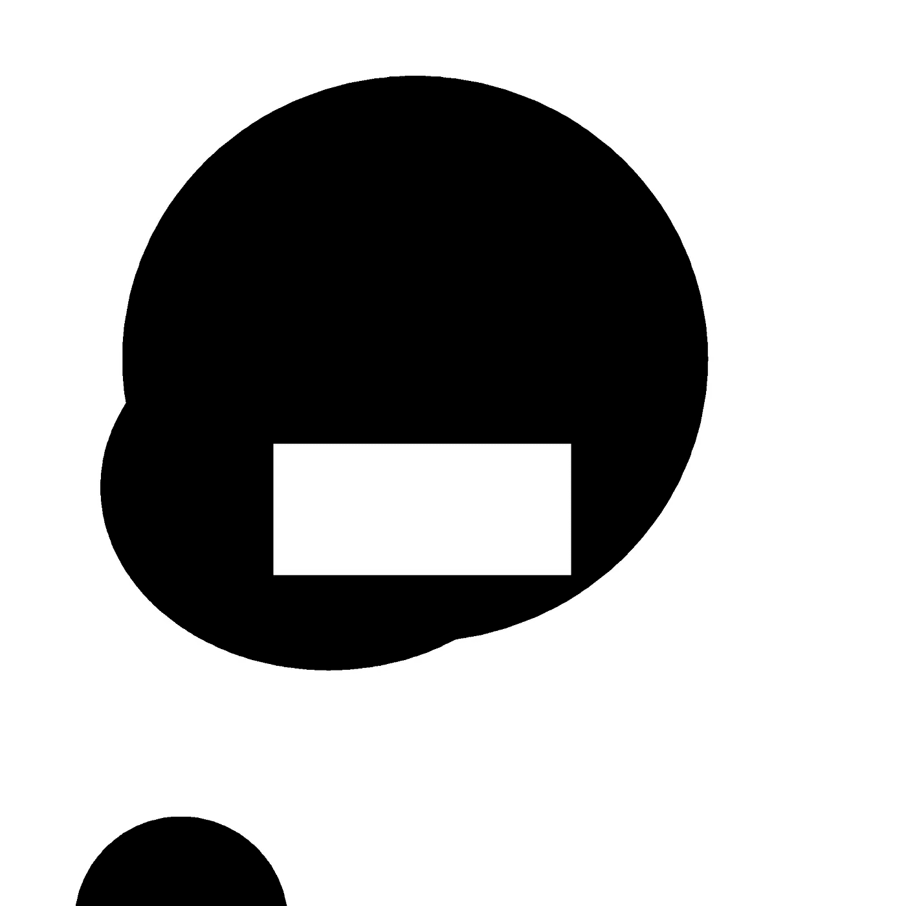

# 一个无用的推特机器人(可能)促进了我的职业生涯

> 原文：<https://medium.com/coinmonks/a-useless-twitter-bot-probably-boosted-my-career-72bb3cd91701?source=collection_archive---------1----------------------->

## 我仍然很享受那天晚上我设计的机器人让我无法入睡的结果。此外，它可能帮我找到了一份新工作。

# 这一切是如何开始的

大概是一年前，2017 年的最后几个月。我在欧洲完成硕士学位后，最近刚刚回到我的城市。那时我已经学习 Python 几个星期了，我很喜欢它。

一天晚上，经过几个小时的研究和实验，我终于决定收工睡觉。或者说我尝试过，因为我无法入睡，这个想法在我脑海中形成。

自从我学习计算机科学的第一天起，我就一直喜欢随机性。我从许多其他项目中得到了灵感，如[企业废话生成器](https://sourceforge.net/projects/cbsg/)和[自动 CS 论文](https://pdos.csail.mit.edu/archive/scigen/)。我甚至创建了一个 android 应用程序来生成视频游戏名称(另一个故事的主题)。我也喜欢遗传编程，部分原因是随机因素(还有，另一个故事)。

 [## 随机游戏名称 Google Play 上的应用程序

### 随机游戏名-享受为游戏随机命名的乐趣。为您令人惊叹的新创作寻找灵感。-那个……

play.google.com](https://play.google.com/store/apps/details?id=com.vgname.vgnamegenerator) 

# 这个想法

回到那天晚上，我开始想象一个应用程序来创建“随机艺术”。一开始我不知道这是什么意思，但很快我就明白了，最简单的方法就是生成图像(想想绘画)。我不认为这是一个原创的想法，我正在重新思考[无限猴子定理](https://en.wikipedia.org/wiki/Infinite_monkey_theorem)。一个创建无限数量图像的程序，其中的一些图像一定是好的，或者至少是有趣的，对吗？

我试着去睡觉，早上继续，但是我做不到。我终于再次从床上爬起来，在纸上开始我的设计。我没有想到像使用机器学习的[风格转换这样超级复杂的事情。我想从更基本、简单的形式、颜色、重复、偏移开始。巴尼特·纽曼领域里的东西。完全披露:我不知道这位艺术家，我只是谷歌了我正在寻找的风格。](https://arxiv.org/abs/1508.06576)

> 这个想法是选择画布的大小、颜色设置(彩色、灰度或黑白)以及要绘制的形状数量。每个形状将是某种类型(矩形、多边形等)，将具有不同颜色，且可以在 X 或 Y 轴上“重复”多次。所有这些都是在运行时随机选择的。

# 发展

我终于睡着了，第二天我开始写我已经写在纸上的东西。我也想到了这个想法的第二部分。**不仅要开发图像生成器，还要让它成为一个 Twitter 机器人**。所以我做了我的研究:一点点[枕头](https://pillow.readthedocs.io/en/latest/)用于图像处理，和 [tweepy](http://www.tweepy.org/) 用于访问 Twitter API。

几天后[git 存储库](https://github.com/enriqueav/the_artist_of_random)和 [twitter 账户](https://twitter.com/the_random_art)准备就绪。我确实在我的 facebook 和 Twitter 账户上推广了它们，但我没有这类项目的大量观众。

> 差不多就这样结束了，这个机器人一直运行到现在

Is easier to create pleasant thing in black and white

# 结论

直到今天，twitter 账户几乎没有追随者。然而，我确实喜欢每天看结果，我也确实“喜欢”我喜欢的结果，以下是一些例子:

# 转折

我有理由相信这一点和另外两个 github 项目帮助我找到了现在的工作。我知道，比如说，在他们一开始没有考虑我的个人资料之后，我参加了面试。现在每天用 Python 编程，还时不时用[枕](https://pillow.readthedocs.io/en/5.2.x/)。做自己的项目和想法是投入时间的好方法。