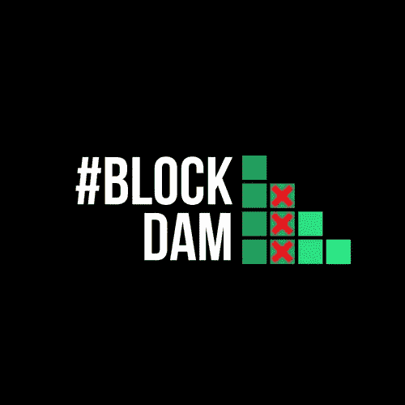
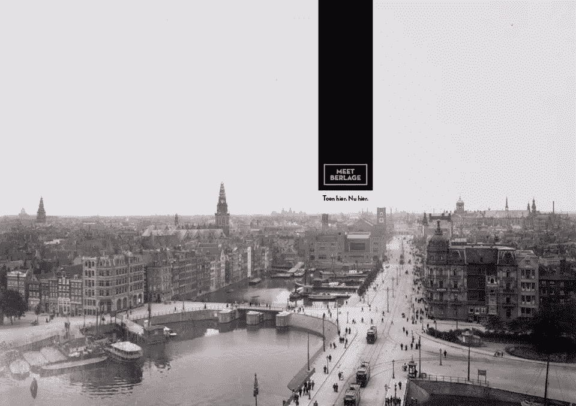

# 为拦路虎刀设想！

> 原文：<https://medium.com/coinmonks/a-vision-for-the-blockdam-dao-5a855d816d40?source=collection_archive---------2----------------------->

在这篇宣言中，我将分享我对最近建立的道的看法。然而，你应该意识到，这些只是我的想法，但我没有能力指挥这个新的分散自治组织。没人能控制。它的目标是去中心化。

道本身说了算。虽然对我们普通人来说可能不太清楚，但拦河坝道确实有它自己的一条路。

BlockDam DAO — Founded 2018

**拦河坝刀**

这是一个值得参观的地方，也是一个你可以去和志同道合的人共度时光的社区。这是一个你可以与其他加密爱好者联系的集合点，在这里你可以了解区块链和加密货币。我很自豪能成为这个社区的一员。

我意识到我们只能试着把拦河坝刀的路线引导到我们认为是“*的正确方向*”。我们可以随时随地这样做……但这不一定会产生我们想要的结果。它也不会总是创造我们非常想要的收入，但这没关系。

**出生**

2018 年 9 月 18 日，BlockDam DAO 迈出了它的第一小步，并铸造了创世纪 BCD-token。这是人类值得纪念的一天！虽然官方发布可能会紧随其后，但这还没有决定…

那个星期二有十五个人出席，他们都得到了他们参加道的第一百个公元前代币。代币可以无限铸造。社区将决定何时何地以及出于何种原因这样做。

这些 BCD 代币用[乙醚](https://ethereum.org)附着在一个罐子上。目前他们仍然在 Rinkeby 测试网上。如果你相信拦河坝刀，你可能会想得分一些。它们在未来总是有价值的。刀还是要长大的。

**治理**

[道的治理](https://gitpitch.com/Eknir/Suber-DAO/master)将以智能交易为导向。[代币由曲线结合](http://khana.io/) …

目前，一些人负责 DAO 背后的技术，但他们将努力将这种控制扩展到 DAO 运行时在场的每个社区成员。

我真的相信这个道只是想为它的社区成员做好事。它希望以最广泛的形式传播关于区块链和加密货币的知识。它想尽一切可能帮助和指导人们。它可以是人们的学校，也可以是日常工作或企业……它甚至可以是一个知识帝国。Blockdam DAO 全天候运营，但绝不会着急。

它会行动…但是何时何地如何行动？它会自己决定。我个人认为它主要是想发现新的可能性…

**我为什么会相信拦路虎刀？**

我相信拦坝道，因为它是一个**未经许可的**组织。每个人都可以进入。没有任何障碍。这是一个你可以去学习的地方...我相信应该永远都是这样。

你将有能力发展自己，你可以给项目以能量，没有任何人限制你这样做。没有人会告诉你该做什么，不该做什么。你可以自己决定，但总会有一些指导可以利用。总有一个你可以咨询的群体，这些人会一直试着帮助你。你是否接受他们的建议，由你决定。

道是学习和成长的刺激物，但是…

> *“你想什么时候来就什么时候走！”*

是的。你可以在任何时候用你的 BCD 代币换回乙醚，然后离开。没有附加条件。没有正式的离开方式，这个也不会装… *(如果是我说了算；)*

没有申请表，也没有人告诉你应该走什么样的发展道路，或者你应该选择什么样的道路。没有等级之分，也没有人会根据你的成就或失败来评判你。

DAO 喜欢尝试，它对你的输入是开放的。

当然刀应该有一定的**规则**。在拦河坝道，我们友好相待。现在，我们的社区成员试图建立一个结构，让所谓的“ [*”搭便车者*](https://en.wikipedia.org/wiki/Free-rider_problem) ”有一个明确的位置。一个能满足他们的需求并有益于我们社区的地方。

我个人并不害怕任何“免费搭车者”。我试着相信富足。我认为应该有足够的钱让这个星球上的每个人过上幸福的生活，尤其是当我们谈到能源和信息的时候。但我确实意识到，我们仍然生活在传统经济中，我们还得付房租，我们还得把食物放在餐桌上。所以拦河坝道应该提供这样做的机会..它还应该注意伴随这些限制的问题。

我相信每个人都有他或她自己的品质。在我看来，有时他们可能需要一些抛光，或者在某些情况下，这些品质只是需要发现一缕光芒来闪耀。其他人可能不这么认为。没关系。

我相信拦河坝道应该是一个**信息自由流动的地方**。一个你可以分享想法的地方，假设当社区受益时，对你也有好处。

*“先试着把所有的东西送人。告诉每个人你在做什么，并分享你的好主意。每个人都会开心，因为每个人都喜欢伟大的想法。然后试着扼杀你所有的想法…试着找出为什么这是个坏主意，为什么它行不通。在那之后……它会不断回来。你不能杀生，也不能放弃的想法……也许这就是你应该遵循的想法……因为没有人会这么做。”*

***捐款***

*如果你认为社区应该加油，那么你可以帮助我们。一个用加密货币轻松做到这一点的结构正在建立。然而，道永远没有义务偿还你的任何“钱”。拦路虎刀永远不欠债！*

*如果你认为道需要某些书籍，那么你可以捐赠它们。如果它需要某些知识，那么你可以提供。然而，你不能做的是强迫社区的人们去阅读这些书，或者跟进这些知识。这由道中的每个人自己决定。你也不能告诉道如何使用你给予的金钱和能量。那也是道自己要弄清楚的…*

*是的，将来可能会有一些欺诈，或者可能是 DAO 必须克服的其他一些挑战。我相信它会尽自己最大的能力与所有阻碍它前进的坏人做斗争。我相信它会尽力处理好所有的困难。拦路虎刀不应该是钱的问题。没有它肯定能活下来。它已经从一无所有开始...所以它总是可以后退一步，再试一次。*

*你可以给道注入能量，也可以把自己的目标放在道的地平线上。如何以及是否以及何时实现这些目标，这取决于道。如果刀认为它需要分叉，它就会这样做。所有的社区成员总是可以自由地以他们喜欢的任何方式引导道。*

*拦路虎刀会自己决定哪条路是最好的…也许会有几条路可以走..并且可以追求不止一个目标。我很好奇从这个角度来看会发生什么。*

***位置***

**

*[**https://meetberlage.com**](https://meetberlage.com/)*

*拦河坝道现在正受到祝福，因为它能够花时间在美丽的球场上。一个有着悠久历史的地方，坐落在阿姆斯特丹的中心。*

*虽然它可能不总是那样。这也不应该是个问题。BlockDam DAO 应该是位置不可知的，但这并不意味着 DAO 不能为治理“内置”的位置付费。或者甚至两个地方，或者更多..谁知道这把刀会有什么能力？它绝对应该能拓宽自己的视野。*

*为一个可以被照顾的地方付钱，不管是以什么形式，或者对它的环境有所贡献。这也是 BlockDam DAO 目前正在努力完成的任务。它希望对周围环境有很大的好处。它也需要一个建筑，但在紧急情况下，公园里的聚会也是一个很好的联系方式，尤其是在阳光明媚的日子里！；)*

*无论如何,“位置”是一个相对的概念。拦河坝道已经由几个国际成员组成。他们可能在任何特定的时刻都不在场，他们甚至可能现在都没有意识到这一点，他们中的一些人甚至可能不得不去开始他们自己的项目，但这没关系。你可以随时来来去去！！*

*社区成员将始终连接到 Blockdam DAO。即使在某些情况下他们甚至不知道。道看到了一切…从来没有对此做过永久的登记！我相信**将永远不需要在 KYC 注册**就可以参加道。*

***赏金***

*此刻，道正在建造一个赏金猎人的建筑。并不是所有的东西都已经准备好了，可能需要一段时间才能完成，但是我相信刀会完成的。它也可以为自己的实现拿出自己的奖金。它会完成任何它想完成的事情。罗马不是一日之功！’*

> *曾经有一个梦想，那就是罗马。你只能小声说。任何超过耳语，它就会消失…它是如此脆弱。”马库斯·奥勒留——角斗士*

***拜访我们吧！***

*如果你想亲自体验拦河坝道，去看看我们的工作日，并来拜访我们。用你的知识启迪我们，用你的能量给我们加油，那么道一定会回馈给你。然而，道将决定何时、何地、以何种形式给予奖赏。我很好奇到底是什么让这把刀[如此特别！；)](https://twitter.com/BlockdamM)*

*在[无道社](http://www.meetup.com/nl-NL/Permissionless-Society/)的[meetup.com](http://meetup.com/)页面可以找到拦河坝刀目前的位置和聚会。希望很快见到你！*

> *[在您的收件箱中直接获得最佳软件交易](https://coincodecap.com/?utm_source=coinmonks)*

**