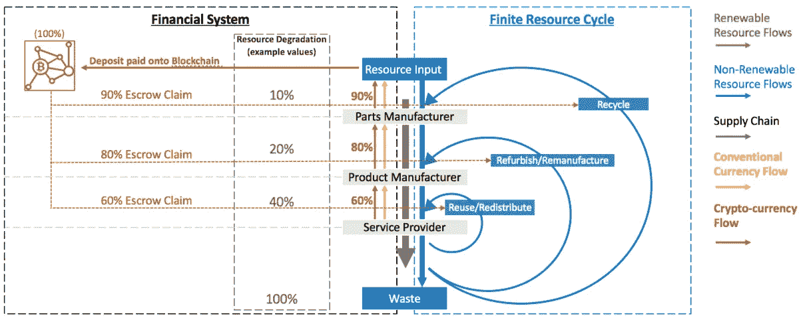

# 道德供应链的愿景

> 原文：<https://medium.com/coinmonks/a-vision-of-an-ethical-supply-chain-ec0bbafa87c9?source=collection_archive---------6----------------------->

通过物联网和区块链技术实现

在一个理想的世界里，消费者将会有关于她将要购买的产品的社会和环境影响的全部信息。她将能够考虑她所购物品的全部综合影响。

接触产品的每一方都会将他们的社会和环境影响加到供应链中已经累积的影响总和上。总的来说就是产品的足迹。

Ethical Supply chain

产品的总体社会和环境影响可以用两个数字显示(例如从 1 到 10 的简单分数),并由客户通过二维码深入到单个区块链安全输入。当然，必须有一个消费者指南，以便他们了解具体产品与这种类型的平均产品相比如何。

**1。** **挑战**

这个理想世界(还)不存在，也很难实现。主要挑战是:

1.你怎么能相信输入的数据呢？

2.收集所有数据的工作量太大

3.没有可信任的实例来存储数据

4.审计数据的成本很高

**2。** **解决方案—输入数据的 IOT 传感器**

物联网传感器可以自动记录系统输入，如汽油用量、用水量、GPS 数据、二氧化碳排放量、温度、湿度、除草剂和杀虫剂的使用情况等。

来源:[什么是物联网？](https://www.postscapes.com/what-exactly-is-the-internet-of-things-infographic/)由邮区和港湾研究

**3。** **解决方案—区块链上的不可变存储**

几年来，有一种完美的技术可以存储所有相关数据，确保数据不会被删除或篡改:区块链。

区块链上的数据是分散存储的。改变数据的唯一方法将包括对网络的攻击，这种攻击执行起来非常昂贵，非常不可行。

需要执行的“唯一”检查是输入端的检查。

**4。** **溶液—手工配料**

即使我们跟踪区块链上的一切和每一步，我们也没有完整覆盖供应链所需的所有要素:

**原始输入**

必须找到一种方法，使从泥土或海洋中获取价值的原始创造者能够容易地提交他们的作品，以便原始输入被适当地存储在区块链上。

接收可信输入数据的最简单方法是使用物联网传感器来测量化学品、水等的使用情况。或者，第一个买家必须弥补缺失的数据。这些数据最好由传感器数据支持。

**补充物联网传感器的数据**

不是所有东西都可以用传感器测量。但有些数据可以作为供应链记录的输入自动交付，尤其是当它们被传输到区块链并绑定到工人的个人 id 时:

支付工资、医疗、培训、社区项目等。

-匿名的劳动力统计数据

当然，这些输入也必须在审计过程中进行检查。

**审计**

检查测量和传输输入的物联网传感器必须是审计的一部分。自动卫星检查和图片识别可以帮助进行额外的自动检查。不为人知的全面检查和检查单一事实的补充性微观审计是确保输入数据有效性的强大组合。

人工智能可以帮助发现区块链官方数据中的违规行为，并建议或自动委托值得信任的个人执行微观审计任务。

**加入透明度倡议的意愿**

当过程足够简单时，好演员会加入，因为他们知道这样做是正确的，并且会从中获利。他们将确保他们的社会影响是积极的，他们的环境影响最小。他们将加强努力，因为他们最终显示出它的重要性:在最终产品上。不良行为者将反对透明度倡议，因为当他们的行为被揭露时，他们将会失败。

为了获得产品的完整数据，并引导整个系统走向采用，系统可能会为每个没有输入的步骤添加人工数据。当没有数据交付时，例如，您可以添加一卡车货物的平均环境消耗，然后添加+100%。这将推动采用。当没有数据传递时，您可能还会考虑添加一个“？”到“童工”和“奴隶劳动”，当各自的国家在这方面有问题。

**5。** **规范**

以下规范是值得衡量的输入的良好开端:

ISO 26000 ( [链接](https://www.iso.org/iso-26000-social-responsibility.html))

联合国跨国公司责任准则草案([链接](https://www.humanrights.ch/upload/pdf/070706_ICC_IOE_subcomm.pdf))

**6。** **偏移**

供应链中的参与者可以决定通过向[cooler earth](https://www.coolearth.org/what-we-do/our-impact/)付款或类似举措来抵消一部分，例如他的 CO2 影响。这将意味着这一参与者总体上向环境增加了更少的二氧化碳，因此对于那些旨在拥有积极产品足迹的公司来说，这将是一个更有吸引力的合作伙伴。这些参与者甚至可能为他们的供应链带来积极的社会影响。

这当然意味着必须对这些计划进行严格的监管和审计，以确保真正产生积极的抵消效果。我们有足够多的“绿色清洗”倡议，这些倡议假装具有比实际更大的影响。他们是问题的一部分，而不是解决方案的一部分。

我认为，补偿不应该出现在社会或环境总分中，而应该出现在可以通过二维码研究的细节中。在地球的一个地方对人类犯下的错误不能被在世界的另一个地方对其他人做的好事所抵消。两者都应该显示在产品审计跟踪中。

**7。** **新增:摇篮到摇篮**

但是当产品到达顾客手中时，供应链并没有结束。一个完整的供应链还必须关注产品中所含材料的资源循环及其再利用、翻新和回收。

区块链可以在资源循环中发挥至关重要的作用。

我找到了一篇关于这个主题的非常好的论文，并被好心地允许使用作者 Benedikt Christian Eikmanns 的图片。

来源:“[区块链:一个新的和可持续的宏观经济系统的命题](/@philippsandner/blockchain-proposition-of-a-new-and-sustainable-macroeconomic-system-d9c628bd56b7)”，作者菲利普·桑德纳

**8。** **新增:供应链财务**

看看供应链，还有另一个挑战需要解决:

较贫穷国家的生产商为他们的投资支付高得多的利率，等待他们的应收账款支付的时间也更长。较贫穷国家的农民每年支付 18%至 37%的利息，而大型企业支付的利息远低于 5%。此外，小公司通常要等 90 天才能拿到工资，甚至更久。

在国际贸易中，货币兑换的额外费用增加了这一点。几乎在所有情况下，当地货币都必须兑换成美元。然后，美元再次兑换成业务伙伴的当地货币。这又增加了 5-15%的成本。

我们总是谈论公平竞争。但是，对小公司收取 20-50%的财务费用，而对大公司收取 5%的相同服务费用，对我来说听起来不像是公平竞争。难怪发展中国家的出口商发现很难竞争和繁荣。当一个发展中国家向另一个发展中国家出口至关重要的粮食时，由于涉及金融服务，大米等价格几乎翻了一番，这种情况尤其令人难过。

Binkabi 提供了部分解决方案。他们提供智能易货服务，大幅降低交易成本，并提供区块链安全高效的基于数字区块链的流程，进一步降低成本。

[Sweetbridge](https://sweetbridge.com/) 将很快降低锁定在供应链中的价值的利率成本。它们提供了一种解决方案

a.将利率降至零

b.将应收账款的支付时间缩短至接近于零

c.提供高效的结算

d.降低交易对手风险

我在 Sweetbridge 上写了一篇更长的[文章](/@pmonien/sweetbridge-crowdsale-money-for-nothing-extended-version-8a68c00d3aef)。要了解他们的愿景，请观看 2018 年 3 月 5 日 Sweetbridge 首席执行官 Scott Nelson 的[演讲](https://www.youtube.com/watch?v=91j6cZhFZtQ&index=93&list=WL&t=0s)。你会对他们的远见卓识和对社会的意义印象深刻。

如果你喜欢这篇文章，请鼓掌 1 次、2 次、3 次或 50 次。

本文中使用的图标由 www.flaticon.com[的](http://www.flaticon.com/) [Freepick](https://www.flaticon.com/authors/freepik) 和 [Google](https://www.flaticon.com/authors/google) 和 [dDara](https://www.flaticon.com/authors/ddara) 制作