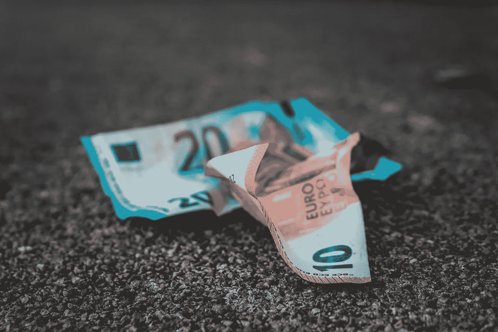

# 一个没有现金的世界:货币的未来

> 原文：<https://medium.com/coinmonks/a-world-without-cash-the-future-of-money-ca12b31ae9bf?source=collection_archive---------0----------------------->

Photo by [Sara Kurfeß](https://unsplash.com/photos/untSDM2Hihg?utm_source=unsplash&utm_medium=referral&utm_content=creditCopyText) on [Unsplash](https://unsplash.com/search/photos/mobile-payment?utm_source=unsplash&utm_medium=referral&utm_content=creditCopyText)

我们的世界越来越数字化。《金钱的终结》(The End of Money )一书的作者、 *Wired* 、的特约编辑大卫·沃尔曼认为[智能手机的发明最具影响力的贡献](https://www.fastcompany.com/1679478/the-problems-with-cash-how-to-get-paper-money-out-of-our-lives)是将设备转变为无缝钱包、汇款和支付工具的应用，为全球数十亿无银行账户的人提供了金融包容性和前所未有的便利。