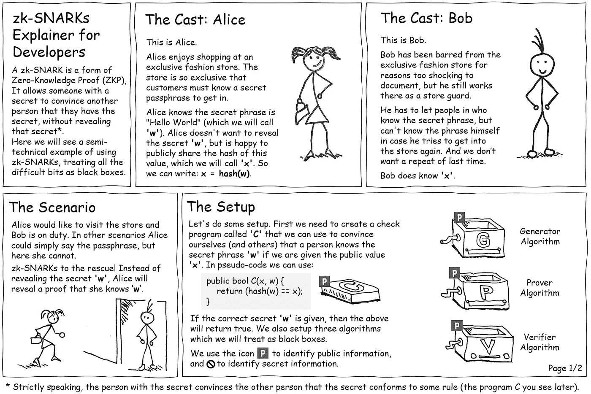
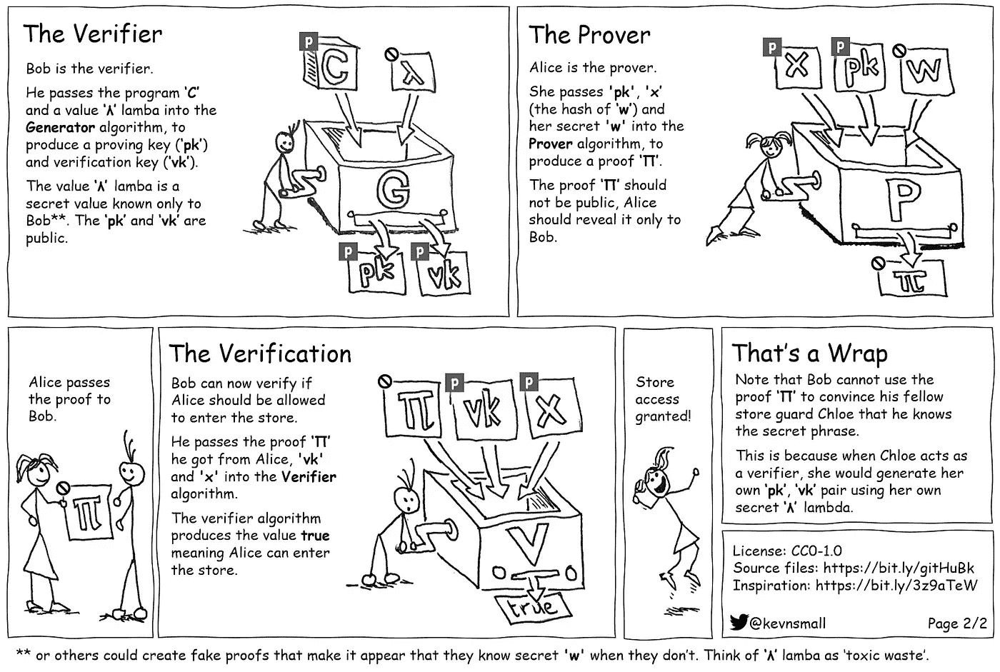

# 一个漫画中解释的零知识证明(ZKP)

> 原文：<https://medium.com/coinmonks/a-zero-knowledge-proof-zkp-explained-in-a-cartoon-df8b84cff394?source=collection_archive---------2----------------------->

这幅漫画举了一个零知识证明(ZKP)的例子。ZKP 可以让拥有秘密的人让另一个人相信他们知道这个秘密，而不泄露这个秘密。这幅漫画的灵感来自于[克里斯蒂安·伦德奎斯特](https://media.consensys.net/@ChrisLundkvist)的一篇优秀文章，展示了一种被称为 zk-SNARK 的 ZKP 人:

GitHub 上有该漫画的源文件:【https://bit.ly/gitHuBk 

> [直接在您的收件箱中获得最佳软件交易](https://coincodecap.com/?utm_source=coinmonks)

