# AAX 交易所评论 2021 |推荐代码、交易费用、利弊

> 原文：<https://medium.com/coinmonks/aax-exchange-review-2021-67c5ea09330c?source=collection_archive---------2----------------------->

在本文中，我们将回顾 [AAX 交易所](http://blog.coincodecap.com/go/aax)。原子资产交易所(AAX)是一家成立于 2018 年的加密货币交易所。他们致力于完整性、性能和安全性。该交易所是 [ATOM 国际科技私人有限公司](https://www.atomintl.com/)的一个项目，该公司是一家全球金融科技公司，在亚洲、欧洲和北美设有办事处。

[AAX 交易所](http://blog.coincodecap.com/go/aax)是世界上唯一一家由传统交易所驱动的交易所[伦敦证券交易所集团(LSEG)。由于法规宽松，他们在马耳他注册。](https://www.lseg.com/) [Quadency](https://blog.coincodecap.com/go/quadency) 和 [Stacked](https://blog.coincodecap.com/go/stackedinvest) 是它们的自动化交易伙伴。他们帮助 AAX 实现交易策略的自动化，并监控他们的持仓。它有能力每秒进行 10 万次交易。订单的执行延迟不到 90 毫秒。

> 使用推荐代码 **6x68mUMnEgwP 并获得 10%的费用折扣**

# **AAX 交易所交易期权**

## **现货交易**

AAX 交易所提供 50 对市场进行现货交易。最受欢迎的交易对是瑞士联邦理工学院/USDT、BTC/USDT、林克/USDT 和 AAB/USDT。

所有这些组合在日常活动和流动性方面都有所不同。

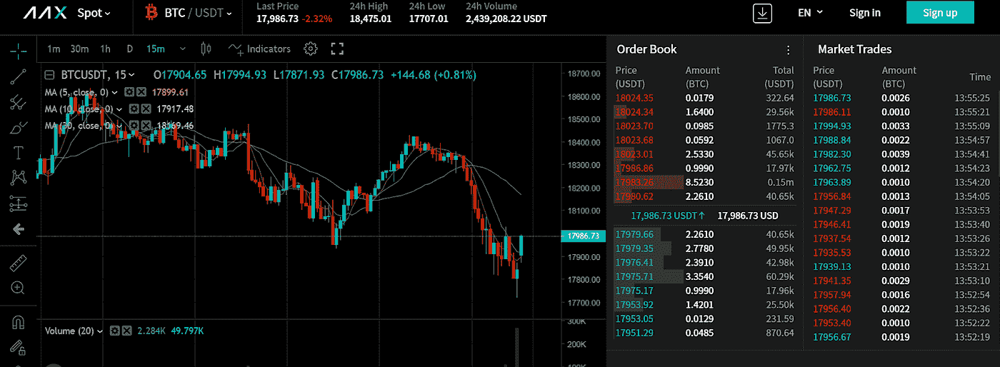

AAX Spot Trading

## **AAX 期货交易**

*   AAX 为 BTC 和 USDT 提供高达 100 倍杠杆的已结算交易。可以查看下面的交易对。
*   你可以选择做多或做空。如果你预计价格会上涨，你应该选择做多，否则做空。
*   你必须提交你想要交易的金额和杠杆。
*   你要牢记平仓价格，确保在合适的时机止损止盈。

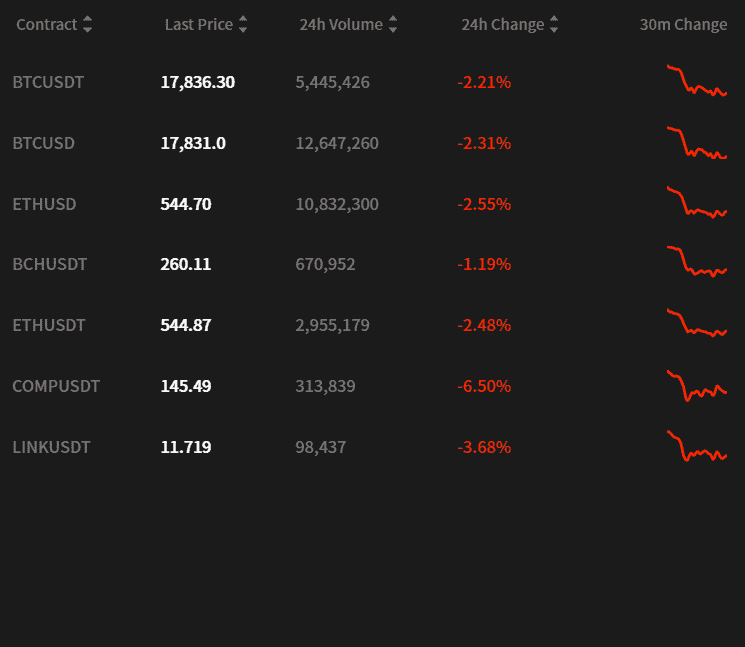

AAX Futures Trading

## **订单**

AAX 密码交易所提供三种订单

1.  **限价单** —它们用于以预先确定的价格买入或卖出资产。你可以选择你想交易的资产的百分比。可以是 25%、50%、75%、100%。
2.  市价单——当你想让你的订单立即得到执行时，可以使用它们。他们将您的订单大小与最接近的买家匹配，并执行交易。
3.  **止损单** —有“止损限价”和“止损市价”两种。止损限价单允许你设定一个价格，在这个价格上交易被激活，然后像限价单一样执行。止损市场使你能够设定一个价格，在这个价格上交易被激活，然后像市价单一样执行。

## **场外交易**

当你大量交易时，场外交易是有用的。这有助于避免打滑。

你可以直接用 USDT、BTC 和 AAB 的代币换下订单。您应该已经完成了[KYC](https://en.wikipedia.org/wiki/Know_your_customer)1 级才能使用此功能。

## **快速购买**

[快速购买](https://f2c.aax.com/en-US/)使您能够使用多个法定货币网关轻松购买 BTC、瑞士联邦理工学院和 USDT。您可以通过银行转账、信用卡、 [SEPA network](https://www.ecb.europa.eu/paym/integration/retail/sepa/html/index.en.html) 等方式付款。

购买的密码可以立即用于期货和现货市场交易。它支持 27 种法定货币。

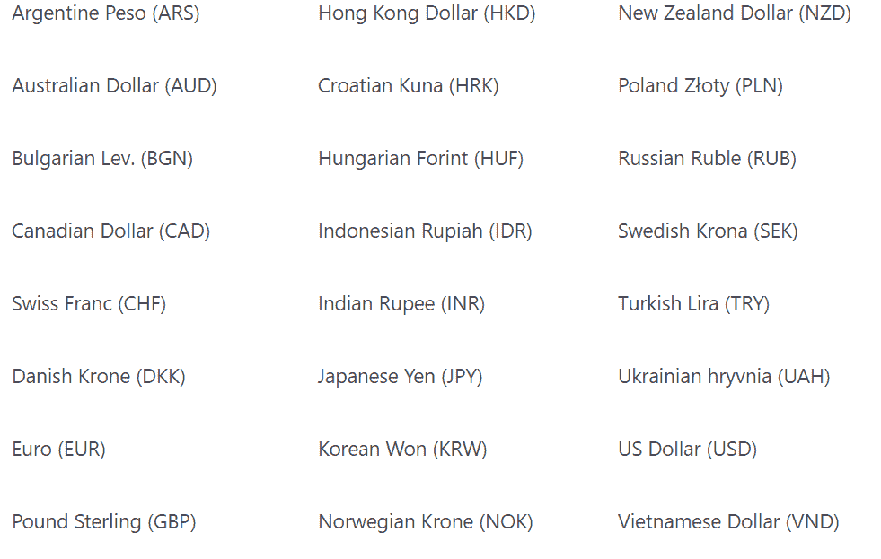

AAX Fast Buy : Supported Fiat Currencies

不同的合作伙伴有不同的政策。 [Coinify](https://www.coinify.com/) 需要几分钟，而 [Epay](https://www.epay.com/) 可能需要 24 小时。你应该已经完成第 1 关 [KYC](https://en.wikipedia.org/wiki/Know_your_customer) 。

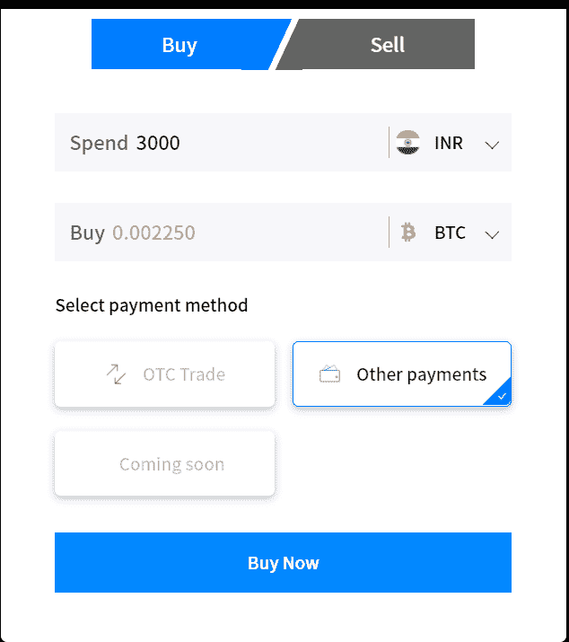

AAX Fast Buy

# **AAB 令牌**

[AAX](http://blog.coincodecap.com/go/aax) 有其本土令牌 [AAB](https://aab.aax.com/en-US/) 。这是一个 [ERC-20](https://ethereum.org/en/developers/docs/standards/tokens/erc-20/) 令牌，它给用户带来了广泛的好处，包括费用折扣、可选的交易信号、随机空投，甚至访问交易机器人。你可以守住 AAB，提升竞争排名。

他们有 5000 万的固定供应量，将在五年内发行。2020 年 10 月 23 日，总供应量的一半已经用交易费从其期货市场购买。他们提供完全的透明度，每天燃烧的数量是更新的。

您可以将 [AAB](https://aab.aax.com/en-US/) 存储在任何与以太坊兼容的钱包中，如 [Atomic wallet](https://atomicwallet.io/) 或 [Ledger Nano S](https://shop.ledger.com/) 。

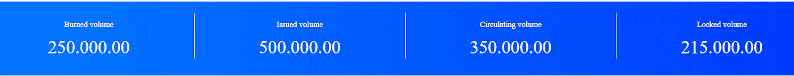

Stats of AAB Token

# **AAX 交易所交易费**

## **现货交易费**

[AAX 采用的是制造商/接受者模式。他们提供了一个 10 层模型取决于交易量。折扣取决于现货和期货的总量。](http://blog.coincodecap.com/go/aax)

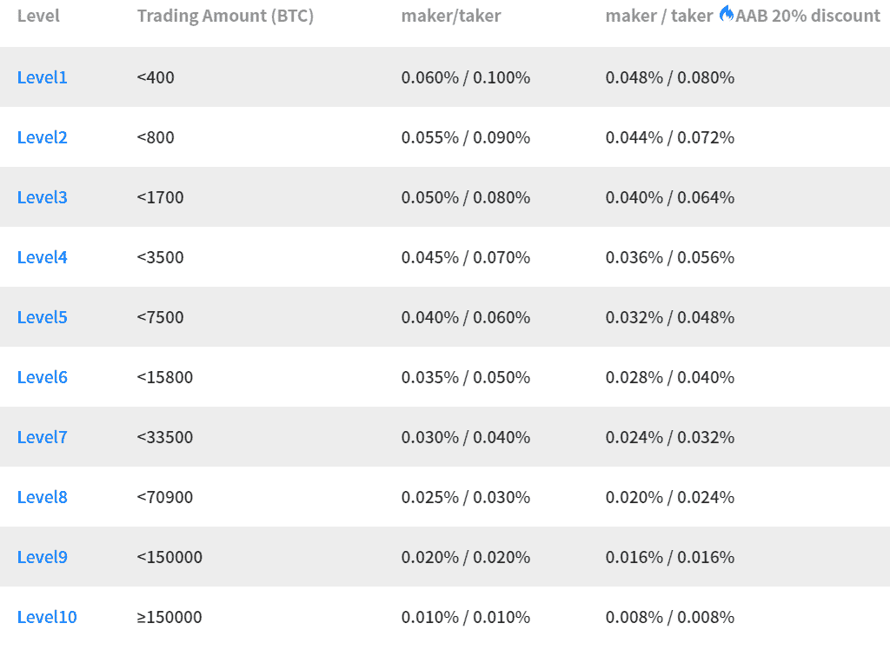

AAX Exchange Spot Trading Fee

## 期货交易费

费用视乎合约及结算方式而定。

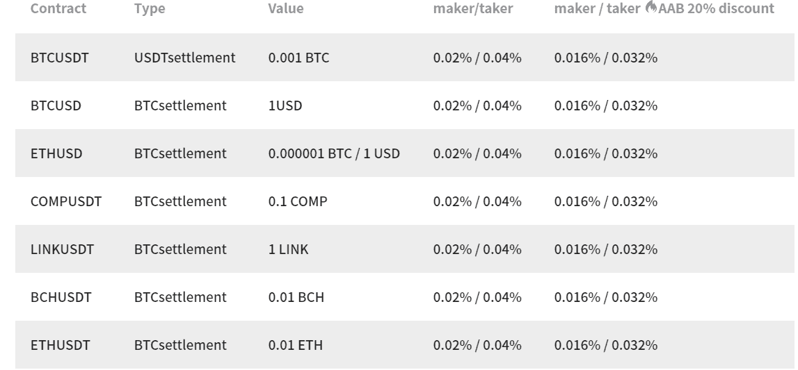

AAX Futures Trading Fee

## 场外交易费

场外交易不收取任何费用。

# **AAX 交易所点评:安全**

根据 [Mozilla 的天文台测试](https://observatory.mozilla.org/)，AAX 获得了 D+分。他们遵守[加密货币安全标准(CCSS)](https://cryptoconsortium.org/certifications/ccssa/) 并使用稳健的恢复协议。

所有账户都需要[双因素身份认证](https://en.wikipedia.org/wiki/Multi-factor_authentication)，增加了一层额外的安全性。AAX 提供符合行业标准的专有多货币钱包。多重签名钱包没有单一的失败点。

此外，[硬件安全模块(HSM)](https://en.wikipedia.org/wiki/Hardware_security_module) 保护用于签署交易的私钥。

大多数加密资产都安全地存储在脱机且安全的冷钱包中。AAX 还能够在受到全面监管的实体内提供有保险的加密保管。

[全球风险解决方案提供商 Kroll](https://www.kroll.com/en) 是 AAX 的安全顾问。他们还与 Solidus Labs 合作，后者提供了一种市场监控工具，可以帮助他们识别任何市场操纵行为。

# AAX 交易所评论:**用户体验**

[AAX 交易所](http://blog.coincodecap.com/go/aax)提供了一个界面友好、使用方便的平台。该平台支持多种语言。

AAX 提供可在安卓和 iOS 平台上使用的移动应用。它拥有网站上提供的所有功能。也可以通过网站扫描二维码下载。此外，您还可以接收通知、博客帖子和最新更新。

## **AAX 学院**

[AAX 学院](https://academy.aaxpro.com/en/)提供许多有用的资源，如交易指南、交易教程、期货指南和一般加密货币主题。

## AAX 交易所 **KYC**

您可以在此创建您的 AAX 账户[。他们提供三种不同等级的 KYC，从 0 到 2。](https://account.aax.com/en-US/login)

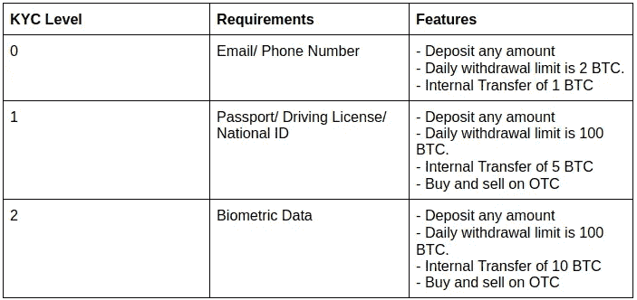

AAX Exchange KYC

# **AAX 交易所评论:提款和存款**

你可以使用借记卡、信用卡购买加密货币，或者使用四个支付网关 [Itez](https://itez.com/) 、 [Epay](https://www.epay.com/) 、 [Coinify](https://www.coinify.com/) 、 [Mercuryo](https://mercuryo.io/) 中的任何一个进行银行转账。除了 Itez 之外，所有这些都需要至少 1 级 KYC。Itez 允许您购买不含 KYC 的 300 美元。存款不收取额外费用。

不允许法定提款。每种加密货币都有最低提现和提现费用。

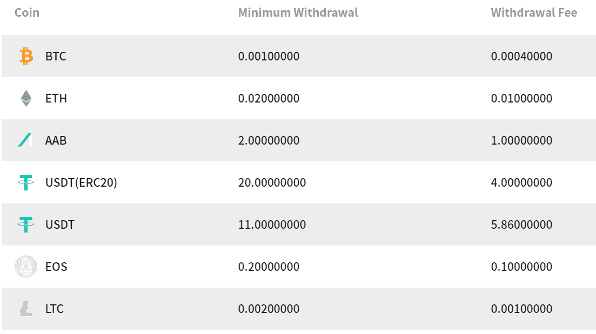

AAX Withdrawals

如果你的加密货币在上表中没有提到，你可以在这里查看。

# **AAX 储蓄**

[AAX 储蓄](https://invest.aax.com/en-US/savings/?inviteCode=6x68mUMnEgwP)提供无锁多重加密资产储蓄账户，帮助你赚取被动收入。其中一些提供高达 8%的 APY。你必须完成 KYC 1 级才能进入储蓄账户。

你必须把资金从交易账户转到储蓄账户。然后你就可以开始赚取加密货币的利息了。

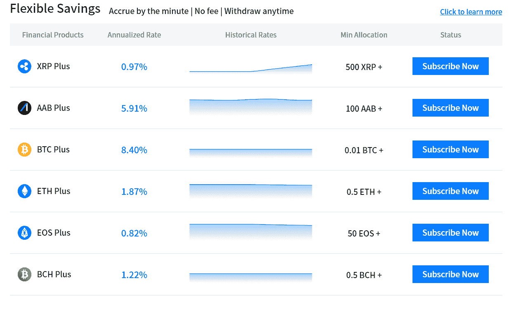

AAX Savings

## AAX 储蓄是如何运作的？

你可以通过简单的三个步骤开始你的 AAX 储蓄-

1.  把你的资产转移到你的储蓄账户。
2.  然后，您可以将您的资金分配到您选择的产品(例如，Bitcoin Plus)。
3.  现在你可以开始赚取每分钟的利息了。第一笔利息收入将在第二天记入贷方。

你可以随时把你的资金转移回你的交易钱包。

# **AAX 交易所加密货币支持**

[AAX 交易所](http://blog.coincodecap.com/go/aax)支持 40 多种数字资产。最受欢迎的是 BTC，瑞士联邦理工学院，XRP，UMA，YFI 等等。

# **AAX 计算器**

AAX 提供了一个内置的计算器，帮助你计算你的头寸的利润和损失。你可以计算你的净资产收益率百分比和清算价格。这有助于你计划交易，防止损失。

# **AAX 交易所 API**

你可以连接你的定制交易策略，应用程序可以通过他们的 API 连接到 AAX。REST 端点提供安全访问来管理您的头寸和订单。

低延迟 web socket 通道可帮助您订阅市场数据、订单状态等。

shell 和 Python 中提供了代码示例，以及帮助您的[文档](https://www.aax.com/apidoc/index.html#introduction)。

# **AAX 部落**

AAX 部落是 AAX 的附属节目。每当有人使用你的推荐链接注册，你就可以从他们的每一笔交易中获得佣金。你可以赚取高达 40%的直接佣金和 10%的二级佣金。

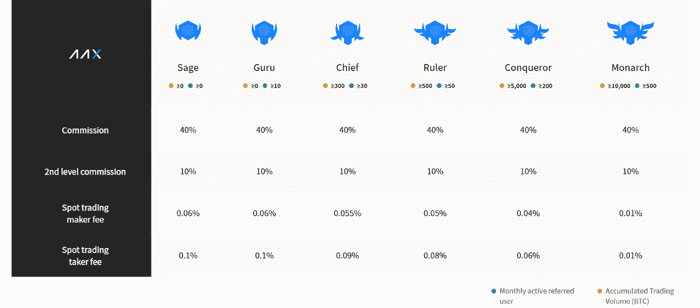

AAX Tribe

# **AAX 交易所评论:客户支持**

AAX 交易所提供全面的全天候客户支持。他们有实时聊天功能，代理会很有帮助。[电报](https://t.me/aaxcommunity)频道也相当活跃。你也可以在推特上和他们联系。Youtube 频道有许多关于如何使用该平台上各种产品的信息视频。

[AAX](http://blog.coincodecap.com/go/aax) 还提供了一个用户友好的[支持中心](https://www.aax.com/en-US/support-center)。如果你认为你有一个熟悉的疑问，你也可以看看他们的常见问题部分。

# AAX 交易所评论:**利弊**

## **优点:**

1.  多层安全架构
2.  超低延迟
3.  LSEG 匹配引擎部署在云上。
4.  用户友好的界面
5.  他们有广泛的全天候客户支持。
6.  完全受管制

## **缺点:**

1.  这是一个相对较新的平台。

# AAX 交易所评论:结论

[AAX 交易所](http://blog.coincodecap.com/go/aax)提供令人印象深刻的功能，并且发展迅速。他们得到了金融市场知名人士的支持，这有助于他们赢得人们的信任。它为初学者提供了一个易于使用的平台。他们使用优秀的匹配引擎、健壮的安全协议和各种交易选项。

# 常见问题

**问:****AAX 交易所是否安全合法？**

**答:**是的， [AAX 交易所](http://blog.coincodecap.com/go/aax)是世界上唯一一家由传统交易所驱动的交易所，[伦敦证券交易所集团(LSEG)。](https://www.lseg.com/)由于法规宽松，他们在马耳他注册。该交易所是[ATOM International Technology Private ltd .](https://www.atomintl.com/)的一个项目，ATOM International Technology Private ltd .是一家全球金融科技公司，在亚洲、欧洲和北美设有办事处。

## 另外，阅读

*   [密码交易机器人](/coinmonks/crypto-trading-bot-c2ffce8acb2a)
*   [Uniswap API](https://bitquery.io/blog/uniswap-pool-api) —如何获取 Uniswap 数据？
*   [德里比特评论](/coinmonks/deribit-review-options-fees-apis-and-testnet-2ca16c4bbdb2) |选项、费用、API 和测试网
*   [FTX 密码交易所评论](/coinmonks/ftx-crypto-exchange-review-53664ac1198f)
*   [Bybit 交换审查](/coinmonks/bybit-exchange-review-dbd570019b71)
*   最好的比特币[硬件钱包](/coinmonks/the-best-cryptocurrency-hardware-wallets-of-2020-e28b1c124069?source=friends_link&sk=324dd9ff8556ab578d71e7ad7658ad7c)
*   [密码本交易平台](/coinmonks/top-10-crypto-copy-trading-platforms-for-beginners-d0c37c7d698c)
*   [bits gap vs 3 commas vs quad ency](https://blog.coincodecap.com/bitsgap-3commas-quadency)
*   最好的[加密税务软件](/coinmonks/best-crypto-tax-tool-for-my-money-72d4b430816b)
*   [最佳加密交易平台](/coinmonks/the-best-crypto-trading-platforms-in-2020-the-definitive-guide-updated-c72f8b874555)
*   最佳[加密贷款平台](/coinmonks/top-5-crypto-lending-platforms-in-2020-that-you-need-to-know-a1b675cec3fa)
*   [莱杰纳诺 S vs 特雷佐 one vs 特雷佐 T vs 莱杰纳诺 X](https://blog.coincodecap.com/ledger-nano-s-vs-trezor-one-ledger-nano-x-trezor-t)
*   [BlockFi vs 摄氏度](/coinmonks/blockfi-vs-celsius-vs-hodlnaut-8a1cc8c26630) vs 霍德诺
*   [Bitsgap 点评](/coinmonks/bitsgap-review-a-crypto-trading-bot-that-makes-easy-money-a5d88a336df2)——一款赚钱容易的加密交易机器人
*   [货币点评](/coinmonks/quadency-review-a-crypto-trading-automation-platform-3068eaa374e1)专为专业人士打造的加密交易机器人
*   [PrimeXBT 点评](/coinmonks/primexbt-review-88e0815be858) |杠杆交易、费用和契约
*   [利他点评](https://blog.coincodecap.com/altrady-reivew)
*   [Ellipal 泰坦评论](/coinmonks/ellipal-titan-review-85e9071dd029)
*   [赛克斯石材回顾](https://blog.coincodecap.com/secux-stone-hardware-wallet-review)
*   [BlockFi 点评](/coinmonks/blockfi-review-53096053c097) |赢取高达 8.6%的加密货币利息
*   [开发者最佳加密 API](/coinmonks/best-crypto-apis-for-developers-5efe3a597a9f)
*   [最佳区块链分析工具](https://bitquery.io/blog/best-blockchain-analysis-tools-and-software)
*   [加密货币套利](/coinmonks/crypto-arbitrage-guide-how-to-make-money-as-a-beginner-62bfe5c868f6)入门指南:如何赚钱
*   顶级[比特币节点](https://blog.coincodecap.com/bitcoin-node-solutions)提供商
*   最佳[加密制图工具](/coinmonks/what-are-the-best-charting-platforms-for-cryptocurrency-trading-85aade584d80)
*   了解比特币最值得读的书是什么？

> [直接在收件箱中获得最佳软件交易](/coinmonks/newsletters/coinmonks)

