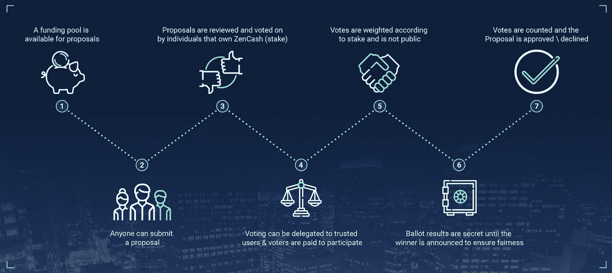
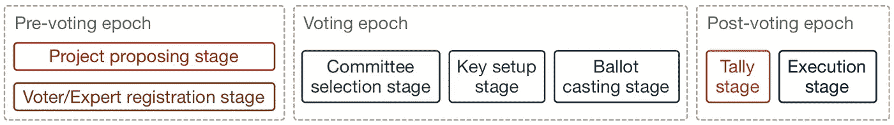
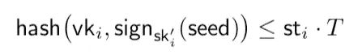
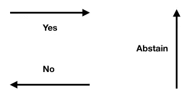
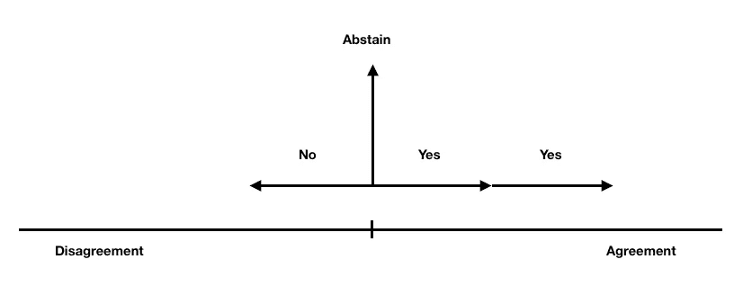
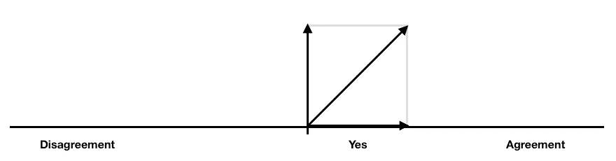
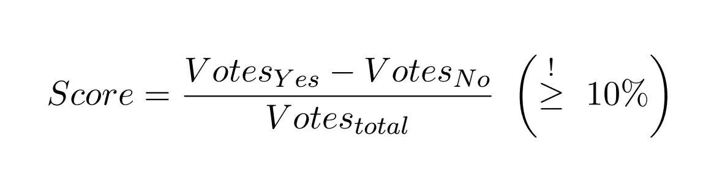

# 关于“加密货币的资金系统”

> 原文：<https://medium.com/coinmonks/about-a-treasury-system-for-cryptocurrencies-ecd9913fe0cc?source=collection_archive---------3----------------------->

最近，IOHK 的 Roman Oliynykov 与英国兰开斯特大学的张兵生和哈迈德·巴洛贡合作发表了一篇论文，描述了一个可以部署在各种加密货币上的资金系统[,而不考虑所使用的共识机制。一个原型已经在](https://iohk.io/research/library/#S7KC2KGJ) [Scala](https://www.scala-lang.org/) 中基于 [Scorex 2.0](https://github.com/ScorexFoundation/Scorex) 框架实现。你可以在这里找到详细的[介绍](https://youtu.be/OIaOe52A4A8)。Rob Viglione 在 twitter 上的一个简短的[视频中解释了其中的含义。](https://twitter.com/zencashofficial/status/1015958808462528513)

我将尝试在本文中总结这篇文章，并为那些没有时间阅读这篇有点复杂的文章的人提供一些背景。我有一种感觉，这将是一个相当长的阅读，但我会尽量不浪费你的时间！

# 介绍

建立加密货币需要很多东西。它需要开发人员愿意将他们的时间投入到项目中。现在确实需要一些营销，不仅要让你的硬币对潜在投资者有吸引力，还要吸引愿意为项目投入时间的开发者。由于监管机构正在更密切地关注加密领域，因此需要一个法律团队来确保所有努力都符合现有的法规，并将符合未来的法规。许多其他的事情可以被添加到这个列表中，其中大多数都有一个共同点:它们需要某种形式的资金。

这种资助应该是长期可持续的。文件中确定了三个主要的资金来源，即:

*   赞助组织和捐赠
*   一个 ICO
*   理发/税收/创始人奖励(矿工奖励的一部分)

其他人以前也将交易费包括在这个列表中，但是除了像比特币和以太坊这样的主要项目之外，TX 费用的总额远远不足以持续发展。

第一个选择，捐赠，从长远来看是不可靠的。第二种选择是 ICO，它不能在数年内提供可持续的资金，最近成为一种具有法律挑战性的选择。第三种选择被认为是最有希望的筹资方式。在可预见的未来，大多数 POW 货币都将获得采矿奖励，寻找新的资金来源将成为未来几代人有时间处理的问题，直到发行结束(采用比特币发行时间表的货币大约到 2140 年)。

# 权力下放是关键

去中心化是这一领域的关键因素，它不仅避免了单点故障，还有助于改善隐私。与真正的分布式系统相比，一个中心方总是能够收集更多关于给定用户的信息。除了网络架构之外，另一个应该尽可能分散的领域是开发和维护的资金以及关于手头资金用途的决策。这就是国库模式登场的地方。拟议中的财政部系统并不真正关心资金从何而来。它可以在一个通过 ICO 或捐赠筹集资金的项目中实现。只不过，从矿工报酬中提成是最可持续的融资方式。

开发财务系统的团队主要关心两个问题:I)使用什么样的投票结构或系统，以及 ii)如何设计投票过程，以便可以在许多不同的项目中实现。

# 投票结构

"*财资系统的核心组成部分是一个决策系统，它允许机构群体成员集体达成一些结论/决策。*

社区的每个成员都可以提交一份项目资助提案，社区应该合作得出资助项目的结论。这可能是为钱包开发一项新功能，一名开发人员因其工作而获得报酬，一名社区成员参加会议以提高对项目的认识或赞助一项活动。

投票方案分为两类:i) *优先*或*排序投票*和 ii) *批准投票*

通过*优先投票*投票者对给定的选项进行排名，排名最高的提案将获得资助。当比较苹果和橘子时，排序是非常耗时和困难的。很难决定哪些功能、会议和活动本身是最重要的。现在把一个会议比作一个功能并不会使它变得更容易。

*批准投票*和*是-否-弃权*方案大大简化了决策过程，这也是 Bingsheng、Roman 和 Hamed 团队为财政部系统选择的方案。在投票期结束时，根据*赞成*和*反对*投票的差异，可以很容易地计算出每个提案的得分，得分最高的提案将依次获得资助，直到该月的资金池耗尽。它还利用了*专家*的专业知识，稍后我将详细介绍。

如果您是编程专家，您可能会投票支持所有关于要实现的新代码的提议。与此同时，你可能在市场营销方面经验不足，认为其他人应该决定参加哪些会议和支持哪些活动。一个营销专家想要决定参加哪些会议，但可能对实现什么代码没有强烈的意见…你明白了。现在你如何认识到这一点？答案是*液体民主*或*委托投票*。

# 流动民主

在流动民主中，你可以选择将你的投票委托给一个你认为代表你观点的专家。这听起来可能很熟悉。基本上，这与你在政治投票中投票的行为类似。关键的区别是，你可以把你的投票委托给任何你喜欢的人，不管是你的兄弟，还是其他任何人，你可以在任何时候撤回你的委托。如果政治家在整个立法期间(主要是)4 年内被追究责任，并且你可以在任何时候撤回你的支持，如果你觉得他们不代表你的观点或不遵守他们在竞选期间做出的承诺，我认为这将导致决策实际上把选民放在心上。

# 不同的实体

为了更好地描述投票过程本身，有必要介绍一下参与投票的实体。

*   *项目负责人{O}* 是指已经提交了需要资金支持的提案的人。任何人都可以提交提案，但必须支付一点费用，以避免垃圾邮件。
*   *投票委员会{C}* 是愿意帮助投票过程的利益相关者。它们负责一起生成投票公钥，并在投票期结束时宣布投票结果。
*   投票者锁定一定数量的股份参与投票。他们的投票根据他们锁定的股份进行加权。
*   专家 T21 是一种特殊类型的选民，他们在某个领域有专长。不过，任何人都可以注册成为专家。当我们谈到如何注册成为其中一个实体时，会有更多的介绍。

简而言之:任何人都可以提交资助提案，并成为项目所有者。任何持有股份的人都可以注册成为投票人或专家。一些投票者将“随机”获得成为投票委员会成员的选项。我一会儿会解释随机。

# 国库系统时代

Treasury System epochs.

每个财政期有三个时期。在**预投票阶段**，所有项目所有者都有时间以加密形式提交他们的提案。当提议阶段结束时，所有的提议将立即公布。这增加了公平性，并防止提交提案的战术时间。在投票前时期，社区成员也有时间通过提交特殊类型的交易来注册为投票人或专家。

在**投票时段**中，选择投票委员会，设置投票键，进行投票。先说一下**委选**和我之前说的“随机”。

Inequality that determines if a voter is eligible for becoming a committee member in a given treasury period.

你可能知道一个[散列函数](https://en.wikipedia.org/wiki/Hash_function)接受一个输入并计算一个固定长度的[伪随机](https://en.wikipedia.org/wiki/Pseudorandomness)输出。在我详细说明这一点之前，让我用上面使用的符号来帮助你:

*   vk(i)…登记选民 I 的地址
*   sign(sk'i)(seed)…前一个投票周期中使用的密钥下的种子的加密(签名)，对应于 vk(i)
*   st(i)…登记选民的股份
*   T…限制委员会成员数量的阈值变量

我不完全确定这是否会导致混乱，但是我会试着用一种简单明了的方式来理解它，请耐心听我说。

假设你是投票人 *i* :这里发生的是，你的地址 vk(i)和你的一些数据的签名(上一个投票周期的种子)被散列。这将产生一个固定长度的“随机”字符串。这个字符串是为每个注册选民计算的。现在，这个不平等描述了成为委员会成员的标准。您的哈希值(数字和字母的字符串)必须小于或等于您的赌注乘以阈值。现在，如果你下了很大的赌注，你的伪随机散列小于 st(i)*T 的几率比下小赌注的几率要大。因此，你成为委员会成员的机会随着你的股份数量的增加而增加。

我希望我设法使从[论文](https://iohk.io/research/library/#S7KC2KGJ)中摘录的以下句子更有关联:“……将从愿意被考虑参加委员会选举的登记选民中随机选出一组投票委员会。被选中的概率与他们锁定的股份成正比。”

**密钥设置阶段**是生成财政时期的公共投票密钥的阶段(用作所有投票发送到的地址)。投票是私下进行的，只有最终结果会公之于众。作为所有投票方案中的一个基本概念，投票人应该有可能私下表达自己的意见，这就是为什么在“模拟”投票中有投票柜的原因。该协议确保最终结果确实代表所有投票的总和。

秘密投票是通过所有投票者和专家用公开投票密钥加密他们的投票来实现的。只有投票委员会成员可以在计票阶段解密已投出的选票。*一旦所有委员会都开了计票单，任何一方都可以阅读计票单*。

**投票台**是所有投票者和专家投票的地方。每个人的投票都被表示为一个向量。因为有三种可能的投票——赞成、反对、弃权——所以有三种可能的向量可以提交。

The three vectors that represent the possibilities Yes — No — Abstain

基本概念是这样的:在下面的例子中，总共有 4 个投票者参与。2 票*同意*该议案，1 票*反对*1 票*弃权*。

Example where 4 votes have been submitted: 2 Yes, 1 No and 1 Abstain

如果你熟悉[向量加法](http://www.physicsclassroom.com/class/vectors/Lesson-1/Vector-Addition)的概念，就很容易说出这四个向量的和。一张*是*票被*否*票抵消。剩余的*是*票加上*弃权*票产生如下所示的对角向量。对于计数，只考虑 x 轴。在**计票阶段**公布的这一提议的最终结果将是*通过*。

The resulting sum of adding the 4 vectors shown above represented by the diagonal vector. Only the x-axis is considered for the tally phase.

更具体地说，每项提案的得分将通过获得*赞成*票的数量减去*反对*票的数量来计算。由此产生的差额必须占提交的所有投票的至少 10%,才能考虑拨款。如果投了 100 票(不包括*弃权*票)，至少要有 55 张*赞成*票才能达到这个门槛。得分最高的提案将获得资助，直到国库在该月耗尽。

Score calculation, done for each proposal during the tally stage. The threshold of 10% has to be reached in order to be considered for funding.

**投票后时期**由计数阶段和执行阶段组成。请注意，每个向量都是以加密方式提交的，只有在**计票阶段**委员会才会联合披露所有投票。将计算每个提案的分数，并根据分数对提案进行排名。

在**执行阶段**，委员会共同签署为批准的提案提供资金的交易。

# 奖励

我想谈的最后一个特点是投票者、专家和委员会成员因参与协议的治理而获得奖励。有一种现象叫做*【理性无知】。维基百科说:*

**理性无知是指当在一个问题上自学的成本超过了知识所能提供的潜在收益时，不去获取知识。**

*这是当今世界民主国家的一个大问题。在一次选举中，获得所有需要的信息，做出最好的决定所花费的时间和精力超过了能够投一票的好处。为了解决这个导致选民冷漠的问题，参与论文中提议的治理的人们会因为他们的努力而得到回报。这就产生了一种被告知和参与过程的动机。选民将获得与他们的股份成比例的奖励，专家将获得与委托给他们的股份成比例的奖励，或者换句话说，是对他们和他们的决策的信任。*

# *ZenCash 如何实现所有这些*

*ZenCash 最近[发表了一篇博客文章](https://blog.zencash.com/dao-prototype/)，其中包含了对拟议中的资金系统的简短解释，并概述了如何实施该系统。最初的计划是将该系统集成到侧链中。侧链是 ZenCash 正在进行的主要协议升级之一。它将使不同的 dApps 各自在自己的侧链上运行，而不会在出现问题时影响主链。*

# *进一步思考*

*我是一个非常关注 UI/UX 的人，对我来说，可用性始终是一个非常重要的因素。如果很难参与的话，最好的财政系统也帮不上什么忙。*

*一个挑战将是提出一个结构化的、信息丰富的“治理中心”。我的意思是一个去的地方，可能是一个网站或嵌入钱包的功能，在那里进行提案，投票，专家和委员会注册。正如我们现在所知道的，注册在形式上是一个事务，因此在钱包中实现一个功能以使每个利益相关者都能轻松地参与治理是可行的。*

*接下来，需要有一个地方列出所有的专家，他们过去的决定是可见的，并以一种全面的方式显示出来。他们应该能够创建一个档案，并添加一个小的传记，这样你就可以知道你是谁委托你的股份。他们将确定自己的专业领域，所提供的全部信息将使他们对未来的决策负责。不要忘记，如果你不再同意专家的意见，你可以随时撤销你的授权。这应该就像一开始就把你的投票委托给专家一样简单。*

*我希望我已经给了你一个关于拟议中的财政系统如何运作的高层次概述。非常欢迎反馈、批评或建议。我只是在这里开始写文章，因为我相信这可能对别人有帮助，而且我喜欢这样做。如果你喜欢，请留下掌声*

**