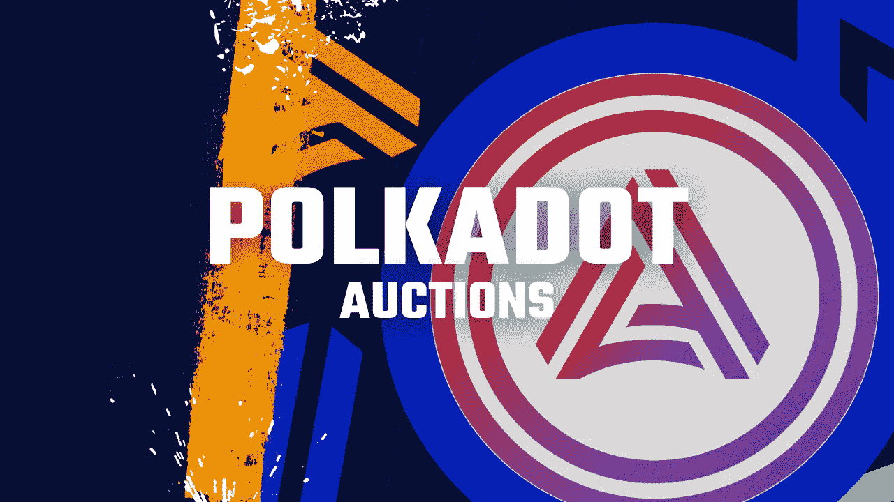

# 阿卡拉或月光:谁会赢得波尔卡多特上的第一场拍卖？

> 原文：<https://medium.com/coinmonks/acala-or-moonbeam-who-will-win-the-first-auction-on-polkadot-154822e1fc01?source=collection_archive---------6----------------------->

## 在获得大量贷款后，这两家公司看起来都有可能在 Polkadot 的 parachain 拍卖中赢得席位。

Thumbnail from [Günter Ederegger](https://medium.com/u/4f0c50d16421?source=post_page-----154822e1fc01--------------------------------)

必须在 Polkadot 的 Parachain 拍卖时更新。很有可能，这个程序将很快成为区块链世界的标准。