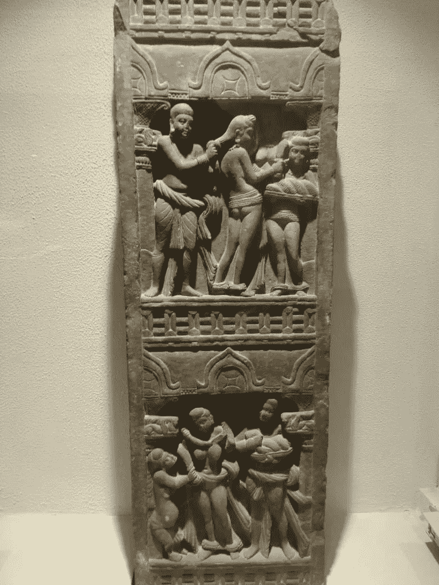

# 接受事实

> 原文：<https://medium.com/coinmonks/accepting-the-truth-77e93e16297d?source=collection_archive---------10----------------------->

## 每周快报- 03

**Coinmonks — Embracing Future Technologies**

> “教育培养自信。信心孕育希望。希望孕育和平。”——孔子

本周，我去了马图拉(印度的一座圣城)。我在最后加了一张我在博物馆拍的照片😃

***现在让我们一起来看看本周最精彩的故事。***

# [密码](https://medium.com/coinmonks/blockchain/home)

# [升级到 Web 3.0](/coinmonks/upgrading-to-web-3-0-2948f0551828)

在比特币于 2009 年首次推出后，人们的兴奋和动力重新燃起，希望建立一个真正去中心化的互联网，推动一个没有信任的世界经济。今天的互联网是最民主的地方，在许多方面，它是这个星球上最平等的机构…

## **由** [**米拉杰沙**](https://medium.com/u/3dfbdab1c198?source=post_page-----77e93e16297d--------------------------------)

# [闪电网络中与金额无关的支付路由](/coinmonks/amount-independent-payment-routing-in-lightning-networks-6409201ff5ed)

在当前的 Lightning 实现中，查找路线的过程总是针对特定的支付金额来执行。举个例子:找一条爱丽丝向查理支付 1000 satoshis 的最低成本路线…

## 由约斯特·贾格

# [闪电网络中多路径支付的特定费用路由](/coinmonks/specific-fee-routing-for-multi-path-payments-in-lightning-networks-b0e662c79819)

与金额无关的途径是将一笔付款拆分成多个部分付款，这些部分付款共同构成总额。只有当所有部分付款都已收到时，收款人才能要求全额付款。这是它的原子方面…

## 由约斯特·贾格

# 使用 Web 应用程序的智能合同:第 1 部分—开发智能合同

在本指南中，您将了解将 web 应用程序转换为 dApp 所需的全部知识。本教程非常适合有创建智能合同经验的人…..

## 作者:Priyal Walpita

# [人工智能](https://medium.com/coinmonks/artificial-intelligence/home)

# 用于深度学习的数学——我需要它吗？

数学是宇宙的语言。所以你知道的方程越多，你就越能与宇宙交流…..

## 由 [Yashvardhan Jain](https://medium.com/u/3a8d518b279d?source=post_page-----77e93e16297d--------------------------------)

# [卷积神经网络的进展第二部分:有影响力的网络架构](/coinmonks/advancements-of-convolutional-neural-networks-part-2-influential-network-architectures-261c502ce6bd)

今天，深度学习已经成为人工智能中一种强大而流行的算法。卷积神经网络(CNN)是主要的深度学习架构之一，成功地用于许多不同的应用和不断发展的研究领域。

## 由[达山卡·纳迪山](https://medium.com/u/e54018d053dd?source=post_page-----77e93e16297d--------------------------------)

# 使用深度学习简化草图

草图是表达艺术想法的基本第一步
，也是设计改进迭代过程的开始。它允许艺术家在纸上快速呈现他们的想法。*。*

## 由 [Ashish Sinha](https://medium.com/u/ed0d53392f42?source=post_page-----77e93e16297d--------------------------------)

# 机器人故事

# [黑板图案](/coinmonks/blackboard-pattern-ed3981551908)

对于我自己的机器人，我在黑板上使用我自己的旋转模式。我没有一个简单的“共享空间”来存储各种机器学习算法的结果，而是强加了一个数据如何排列的结构…

## 由[基因福克斯韦尔](https://medium.com/u/d8d75fa63c1e?source=post_page-----77e93e16297d--------------------------------)

我们感谢你们所有人的❤️和支持。一如既往，你可以通过以下方式加入我们的讨论:Reddit *，*[*Twitter*](https://twitter.com/coinmonks)*，* [*脸书*](https://www.facebook.com/coinmonks/) *，*[*insta gram*](https://www.instagram.com/coinmonks)*。*

您也可以 [***投稿***](/coinmonks/how-to-get-published-on-coinmonks-publication-bdf172add414) 给 Coinmonks 刊物，如果您喜欢阅读 Coinmonks，您也可以 [***捐赠***](/coinmonks/monks-need-your-help-7440418d67ec) 给我们。

***现在该去马图拉的博物馆拍照了。这是 2 世纪的老雕塑。***

Mathura 2nd century old sculpture

***暂时就这样吧，送我❤️，下次再说😄。***

**~高拉夫**