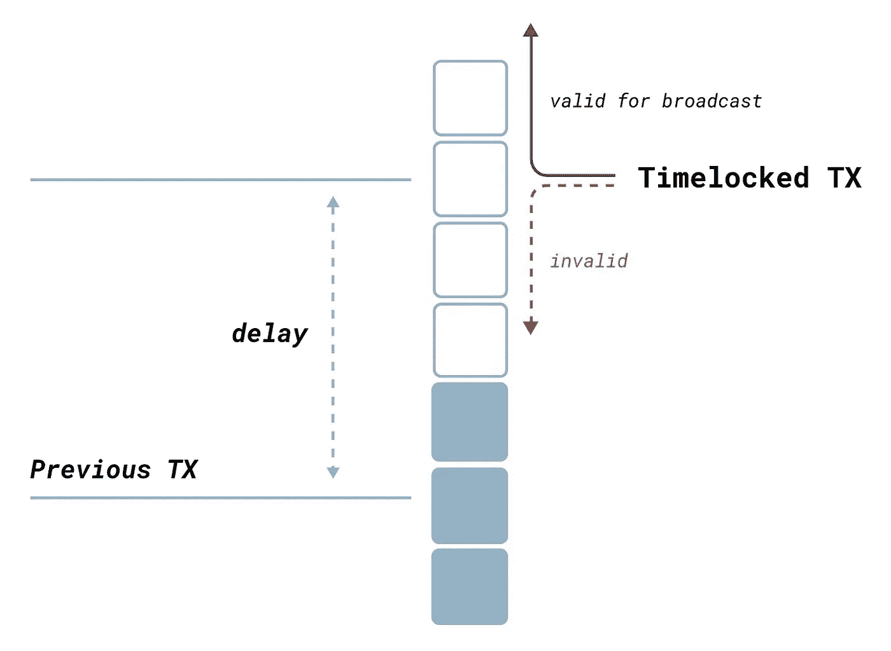

# 从比特币智能合约访问区块链数据:第 5 部分

> 原文：<https://medium.com/coinmonks/access-blockchain-data-from-bitcoin-smart-contracts-part-5-799c11e1e536?source=collection_archive---------4----------------------->

## 不带 OP_CheckSequenceVerify 的相对锁定时间

在本系列前几部分奠定的基础上，我们演示了如何在不使用新操作码 OP_CheckSequenceVerify 的情况下，在比特币中实现相对锁定时间。

# 时间锁链

一个时间锁限制一些比特币的消费，直到指定的未来时间或区块高度。有两种类型的时间锁:

1.  **绝对**:例如，一个人可以证明锁定 1，100，000 个比特币，直到区块高度 800，000，或者直到 2025 年 1 月 1 日。
2.  **相对**:比如一个人可以锁定 21 个比特币，这些比特币只能在 100 块或者 3 天后才能花掉。

为了启用绝对和相对时间锁，在 [BIP65](https://github.com/bitcoin/bips/blob/master/bip-0065.mediawiki) 和 [BIP68/112/113](https://en.bitcoin.it/wiki/Timelock#CheckSequenceVerify) 中分别引入了新的操作码*OP _ CheckLockTimeVerify/OP _ CLTV*和*OP _ CheckSequenceVerify/OP _ CSV*。

# 无 OP_CSV 的相对锁定时间

恢复原来的比特币协议，比特币 SV[还原了](https://bitcoinsv.io/2020/01/15/changes-for-the-genesis-upgrade/)前述的改动。原来 *OP_CSV* 可以用原来的协议实现。

[Relative Transaction Timelocks](https://teachbitcoin.io/presentations/transaction_timelocks.html#/3)

在第 1 部分中，我们已经展示了如何访问包含给定契约 UTXO 的块。将这个块头与指定的相对时间锁结合起来，我们可以知道 UTXO 可以使用的最早的块。我们要求截止日期之后的任何块都可以用于解锁 UTXO，本质上是像 OP_CSV 一样在其上放置一个相对时间锁。下面列出了完整的代码。

[CheckSequenceVerify Contact](https://github.com/sCrypt-Inc/boilerplate/blob/master/contracts/csv.scrypt)

第 11 行显示了基于 unix 时间(例如，以秒为单位)的解锁。第 33 行的函数 validateHelper() 验证包含 UTXO 的块和最新的块都是有效的(第 41–42 行)。它还使用与第 1 部分中的[相同的技术验证前一个块实际包含 UTXO(第 34–38 行)。第 15 行确保从开采 UTXO 开始已经过了所需的时间。](https://xiaohuiliu.medium.com/access-blockchain-data-from-bitcoin-smart-contracts-without-oracles-e13b9c911d32)

第 19 行显示了基于块高度(例如，块的数量)的解锁。第 24-25 行得到两个区块的高度，如第 3 部分中[所示。第 27 行检查在 UTXO 之后已经开采了指定数量的块。](https://xiaohuiliu.medium.com/access-blockchain-data-from-bitcoin-smart-contracts-part-3-c3b5140bf3e6)

# 摘要

除了 OP_CSV，我们之前已经实现了 [OP_CLTV](https://xiaohuiliu.medium.com/op-push-tx-3d3d279174c1) ，没有对原来的比特币协议做任何改动。有两层含义:

1.  这两个操作码对于启用 UTXO 级别的时间锁来说并不像以前认为的那样是必需的。
2.  如果需要，OP_CSV/CLTV 支持的所有用例，如闪电网络、侧链和 [CLTV 式支付通道](https://en.bitcoin.it/wiki/Payment_channels#CLTV-style_payment_channels)，都可以直接建立在原始比特币上。

> 加入 Coinmonks [电报频道](https://t.me/coincodecap)和 [Youtube 频道](https://www.youtube.com/c/coinmonks/videos)了解加密交易和投资

## 也阅读

 [## 杠杆代币[多头代币]终极指南

### 杠杆化令牌是具有杠杆化风险敞口的 ERC20 令牌，不考虑保证金、要求、管理…

medium.com](/coinmonks/leveraged-token-3f5257808b22)  [## 最佳加密交易所| 2021 年十大加密货币交易所

### 加密货币交易所的加密交易需要了解市场，这可以帮助你获得利润。之前…

blog.coincodecap.com](https://blog.coincodecap.com/crypto-exchange)  [## 2021 年最佳加密借贷平台| 6 大比特币借贷平台

### 获得比特币和其他加密货币的最佳贷款利率

medium.com](/coinmonks/top-5-crypto-lending-platforms-in-2020-that-you-need-to-know-a1b675cec3fa)  [## 2021 年最佳免费加密交易机器人

### 2021 年币安、比特币基地、库币和其他密码交易所的最佳密码交易机器人。四进制，位间隙…

medium.com](/coinmonks/crypto-trading-bot-c2ffce8acb2a)