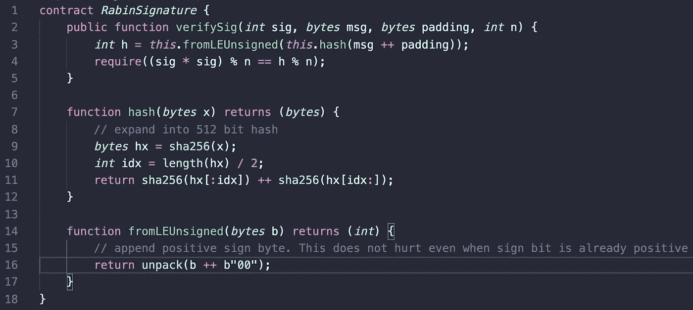

# 从比特币智能合约访问外部数据

> 原文：<https://medium.com/coinmonks/access-external-data-from-bitcoin-smart-contracts-2ecdc7448c43?source=collection_archive---------1----------------------->

## 比特币上的预言

# 神谕

对于比特币或其他区块链上的智能合约来说，为了实用，它们通常需要访问区块链以外的数据，例如保险合同的天气或博彩合同的体育结果。出于安全考虑，智能合约运行在隔离的沙箱中，禁止启动外部数据的检索。他们依靠名为 [**甲骨文**](https://en.bitcoin.it/wiki/Oracle) 的第三方数据提供商来提供这些数据。这就产生了一个被称为[甲骨文问题](https://blog.coincodecap.com/ethereum-smart-contracts-and-the-oracle-problem/)的完整性问题。需要数字签名来验证已知 oracles 提供的数据的真实性和完整性。

我们引入了一种有效的方法来验证和访问任何由 oracle inside 比特币智能合约签署的链上或链下的任意数据。

# 拉宾签名

[Rabin signature](https://nchain.com/app/uploads/2018/09/Rabin-Signatures-in-Bitcoin-Cash.pdf) 是比特币使用的 [ECDSA](https://en.wikipedia.org/wiki/Elliptic_Curve_Digital_Signature_Algorithm) 的替代数字签名算法( [DSA](https://en.wikipedia.org/wiki/Digital_Signature_Algorithm) )。Rabin 签名的安全性依赖于计算模平方根和整数分解一样困难。

## 密钥生成

与 [RSA](https://en.wikipedia.org/wiki/RSA_(cryptosystem)) 类似，通过识别两个大素数 ***p*** 和 ***q*** 来生成密钥。私钥是 ***(p，q)*** 与对应的公钥 ***n = p * q*** 的组合。

## 签署

Signing equation²

将填充符*附加到要签名的消息 ***m*** 中，使得散列值***【h(m | | U)***是模 ***n*** 的二次剩余。签名是组合***【S，U】***。*

## *确认*

**

*Signature verification*

*有了签名 ***(S，U)*** ，消息 ***m*** ，公钥 ***n*** ，我们可以通过检查上面的等式是否成立来验证签名。*

*可以看出，Rabin 签名具有漂亮的**不对称**，即**签名生成在计算上是昂贵的，但是签名验证在计算上是便宜的**。这个属性使它非常适合 onchain 实现，在 onchain 实现中只需要签名验证。原则上，我们可以使用 ECDSA 来[验证签名](https://www.yours.org/content/op_datasigverify-in-bitcoin-01-b6e44e91e7de)，但是它要贵很多个数量级。*

# *履行*

*[这里的](https://github.com/scrypt-sv/rabin)是 Rabin 签名的代码，包括密钥生成、签名生成和签名验证。我们也在[脚本](https://github.com/scrypt-sv/boilerplate/blob/master/tests/js/rabin.scrypttest.js)中实现了它。[代码](https://github.com/scrypt-sv/boilerplate/blob/master/contracts/rabin.scrypt)如下所示。注意，核心部分只有大约 10 行代码，并且只涉及基本的代数和散列运算。我们只需要实现签名验证，因为这是链上唯一要做的部分。我们还演示了一种通用技术，通过重新散列 SHA256 散列并连接它们来生成更长的散列，在本例中为 512 位。*

**

*[Rabin signature contract](https://github.com/sCrypt-Inc/boilerplate/blob/master/contracts/rabin.scrypt)*

# *结论*

*由于 Rabin 签名，我们可以在比特币交易中嵌入任意签名数据，并使用现有的比特币脚本在链上有效地验证它。此外，复杂性和成本可以根据应用程序的安全要求进行定制，这比在共识层硬编码特定 DSA 更加灵活。如果需要更强的安全性，可以简单地使用更长的密钥和散列。通过允许智能合约访问外部数据，它们变得更加强大。*

# *感谢*

*感谢欧文·沃恩和 nChain 的克雷格·赖特博士发现了拉宾签名在比特币中的用法。*

*[1]:如何最小化 Oracle 中所需的信任，例如，通过利用多个独立的 Oracle，超出了本文的范围。*

*【2】:***|*|**是串联。*

*[3]:实际上我们已经在 *sCrypt* 中实现了 ECDSA 签名验证，我们的测量显示确实是在[百万倍补贴](https://www.yours.org/content/how-to-implement-ecdsa-signature-verification-in-script-and-why-datasi-9f113344542f)的量级。*

> *[在您的收件箱中直接获得最佳软件交易](https://coincodecap.com/?utm_source=coinmonks)*

**