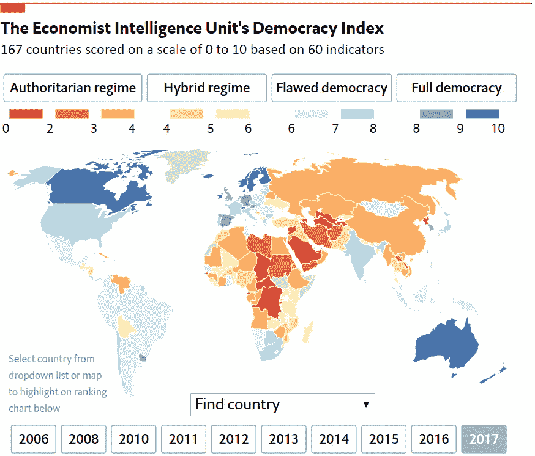
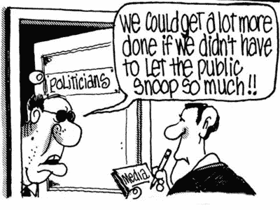
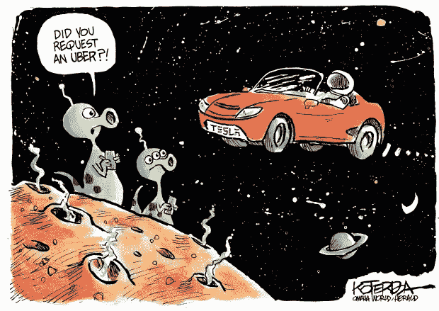

# 问责制而不是权力下放

> 原文：<https://medium.com/coinmonks/accountability-not-decentralization-417051616633?source=collection_archive---------0----------------------->

[The EIU’s Democracy Tracker](https://infographics.economist.com/2018/DemocracyIndex/)

每个人都为区块链技术感到兴奋的一个主要方面是该技术创建和维护不可信系统的能力。尤其是当《经济学人》的[民主指数 2018](https://pages.eiu.com/Jan-19-Democracy-Index_registration-page.html?) 等报告强调全球民主令人不安的倒退时，2018 年见证了自 2010 年该指数开始以来民主感知的最大跌幅。权力下放无疑是区块链的主要卖点，但在当前的环境下，如此多的人被这种主张所吸引的原因证明了更深入的探索是有道理的。在本质上，**许多人将权力下放与问责制混为一谈，导致在思考现实世界的解决方案时目光短浅**。本质上，权力下放就像一把锤子:如果你用力一击，它可以解决所有问题，但如果这是你工具箱中唯一的工具，它最终会造成更大的破坏。

分布式技术有许多承诺:

*   它承诺通过防篡改数据库实现**透明度**，而在这个世界上[巴拿马文件](https://www.icij.org/investigations/panama-papers/)已经暴露了富人和权贵系统性操纵的程度
*   在一个越来越倾向于政治极端的世界里，即使超过三分之一的人仍然生活在独裁政权下，它也通过未经审查的知识提供了一个安全的出口
*   它通过分布式数据库保证了安全，而在这个世界上，大型科技公司已经多次证明自己无力保护我们的信息安全
*   在一个经济被靠经济租金生存的中间人吞噬的世界里，它承诺通过数字合同进行无信任交易
*   在一个正被资本主义慢慢吞噬的世界里，它承诺通过分布式共识实现平等

公平地说，分布式技术确实提供了优雅的解决方案来抵消权力集中的不良倾向，但这种关注忽略了宇宙的一个基本事实:**人类是懒惰的**。

正如我在这里所说的，我们正在奔向的未来是一个以牺牲一些模糊的权利和自由为代价的便利和舒适的未来。我们哀叹我们缺乏隐私，但谷歌我们的下一个想法，我们抱怨假新闻，但从未采取额外的努力走出我们的脸书新闻泡沫，我们抱怨政治是如何被打破的，但继续就民粹主义信息投票。这在很大程度上是因为缺乏其他选择，但对于我们中的许多人来说，他们了解最新的名人八卦，这是因为最省力的选择已经成为我们的默认选择。

[Personalized media](https://www.howtogeek.com/290919/how-facebooks-news-feed-sorting-algorithm-works/) is definitely more engaging than boring facts

权力下放带来了惊人的希望，但从个人的角度来看，它也带来了更多的成本、工作和复杂性。明确地说，期望人们完全掌控自己的生活是不现实的，因为不可能跟上现代社会的复杂性。事实上，这样做会使社会完全停止，因为正是专业化和贸易使个人能够专注于根据他们所拥有的技能为社会带来最大的利益。因此，在大多数情况下，**过多的权力下放实际上会抹去我们通过集中协调获得的所有社会收益**。

鉴于 **(a)** 人类的懒惰和 **(b)** 社会变得越来越复杂，人们会很高兴地委派他们不感兴趣的责任，只要这不侵犯他们的自主能力。这就引出了本文的中心观点:

> 只要系统运行正常，没人关心集权(或不信任)的程度，在系统失灵的情况下，坏人会被追究责任。

围绕我们当前的治理体系和组织模式的不满在于****权力平衡变得如此不平衡，以至于当权者不再遵循同样的规则**。巴拿马文件暴露了冰山一角，但某些国家以避税天堂而闻名，这一事实凸显了该体系内部的矛盾。**至关重要的是，权力蔓延通常会被忽视，直到制定规则的人变成同一个人**。并非所有有钱有势的人都是纯粹自私的个人，但重要的是要注意，我们当前体系中的制衡仍远非最佳。因此，分散技术实际上是解决更深层次问题(即问责制)的更有前途的解决方案之一。**

****

**[Sad that this has become an ironic comic strip in the current climate](https://www.fragilestates.org/2012/07/15/increasing-accountability-when-democracy-cannot/)**

**区块链一直被描述为一种不可信的技术，因为加密经济激励机制将私利作为公共[商品](https://www.coininsider.com/blockchain-sidesteps-tragedy-commons/)。值得注意的是，区块链系统的集中化并非不可能，但与现有系统相比，可能性相对较小。事实上，可以说大多数加密货币实际上非常集中，但这本身并不是一个问题，只要当权者不反对大多数人的利益。因此，**区块链的权力不是通过权力下放来实现的，而是通过坏行为者的个人毁灭来实现的。****

**差异是微妙的，但它本质上迫使我们将去中心化视为创建最佳系统的拼图之一，而不是解决所有问题的银弹。无论系统是只有一个集中的超级节点，还是由没有等级划分的群体组成，只有当系统/产品为人们提供了最佳的成本效益比时，人们才会继续使用它。值得注意的是，这种成本/收益分析不仅限于货币成本，因为消费者越来越重视他们行为的伦理和道德影响。分散技术将暴露所有隐藏的业务[成本](/block-crafters/value-price-and-cost-how-blockchain-changes-business-value-b17c2aecb06f)，因此问题就变成了哪个选项为消费者提供了最佳价值主张。当试图颠覆传统行业时，向特斯拉这样的公司学习可能会有所收获:打造一款与你的竞争对手不相上下甚至更胜一筹的产品，并通过占据意识形态制高点让它变得流行起来。**

****

**[Definitely the better product](https://www.denverpost.com/2018/02/09/drawn-to-the-news-tesla-launched-into-space/)**

**尽管如此，权力下放的程度通常与基本权利的各个方面密切相关。当然，基本权利的构成因文化不同而不同，但我认为社会的某些方面不适合集权。下列因素的集中往往会使各方改变游戏规则，使之对自己有利。**

*   **[**金钱**](https://hackernoon.com/the-history-of-money-the-future-of-bitcoin-and-the-cryptocurrency-economy-5cc25e808275?source=bookmarks---------98---------------------) :它是我们如何量化我们周围的世界，因此充当了[价值](/coinmonks/why-your-token-is-likely-a-bad-investment-why-bitcoin-scalability-is-secondary-91e1f82dd2f1)的代理。由于网络效应的垄断趋势，很难找到价值储存或交换媒介的替代选择。在这里拥有控股权会大大增加系统性腐败的风险，因为掌权者可以轻易地迫使对方屈服。**
*   **身份:随着我们进入数字时代，身份是一个越来越复杂的话题，但重大科技丑闻向我们表明，拥有我们身份的公司越来越多地控制着我们生活的各个方面，而几乎不担心竞争。谁控制了身份，谁就对我们如何生活越来越有发言权。**
*   **[**媒体**](/coinmonks/unlocking-the-internets-potential-69608b6c67d4) :我们的视角是由我们接触到的媒体告知的。历史已经向我们表明，谁拥有知识管道(印刷机、广播频道或新闻提要),谁就能够操纵社会的其余部分。当然，假新闻丑闻已经表明这是一个多么复杂的话题，但显而易见的是，人们的想法很容易被拥有媒体管道及其算法的人审查。**

**从长远来看，“快速行动，打破常规”对脸书来说并不奏效。当你是一个拥有 22 亿用户的平台时，如果你走错一步，哪怕只影响到 0.1%的用户，也会影响到相当于整个巴黎的人口。与此同时，谷歌越来越难以坚持“不作恶”的座右铭。由于隐私和数据所有权之间的界限模糊，根据用户生成的内容销售广告一直是一个有风险的提议。由于资本主义对数据的控制，此类网络的自然垄断效应也引发了信任问题，鉴于此类公司的“税收优化”做法，这种情况变得更糟。**

**至关重要的是，这并不是说上述因素必须分散，而是说，在当前的模式中，权力往往会集中到一个政党手中。在当前的生态系统中，**随着网络的发展，个人之间的社会协调变得异常困难，当权者腐败的机会也越来越多**。因此，随着众议院决定越来越多的规则，个人在谈判桌上的筹码越来越少。所有这一切都是在个人没有发言权的情况下发生的，首先他们是否希望被纳入抽签。**

**作为社会契约的一部分，默认的选择是，每一个想成为社会一部分的人都必须参与这种制度，这不仅是因为缺乏选择，也是因为个人层面的利益。**

*   **脸书帮助您创建在线身份，使与他人联系变得更加容易**
*   **谷歌分析你的搜索来提供更加个性化和相关的服务**
*   **政府会记录你生活的每个阶段，这样你就不必担心社会会突然崩溃**

**因此，我们害怕的不是中央集权，而是对这种社会契约的破坏。毕竟，问责制是一个期望和实际交付的问题。我们最初为这些组织提供了我们生活不同方面的能力，因为我们会从中受益。他们提供的服务/产品最好通过集中式系统交付，因为它能够以更快的速度协调需要做的事情。这一点永远是正确的，因为不必担心获得共识的复杂性，可以节省大量资源。那么问题就变成了我们如何确保契约的精神继续得到保持。**

**人类社会的历史是一个无休止的冲突的例子，因为它在专制和社会主义之间摇摆不定。分散化技术是解决上述问题的一个有希望的方法，这不是因为分散化，而是因为它提供了一种替代方法来让各方承担责任，而不诉诸于作为王牌的全面反叛。**与其在集权本身会腐败的假设上工作，不如通过建立一个不会过度赋予一方权力而另一方权力的制度所需的制衡来了解集权的程度。****

**技术只会反映我们生活的复杂现实，因此永远不会有完美的解决方案。因此，系统设计的各个方面应该总是受到不断发展的人类概念(正义、公平或任何主导思想)的影响，而不是仅仅因为技术的理论承诺而围绕技术设计系统。在这种情况下，**问责制(以及随之而来的公正和公平)是每个人都理解的，而权力下放只是实现这一目标的一种方式**。**

***谢谢你坚持到最后。希望听到你的想法/评论，所以请留言。我在 twitter 上很活跃*[*@*AwKaiShin](https://twitter.com/awkaishin)*如果你想收到更多易消化的密码相关信息，或者访问我的* [*个人网站*](https://www.awkaishin.com/) *如果你想要我的服务:***

**

**Click to read the latest story on Coinmonks****