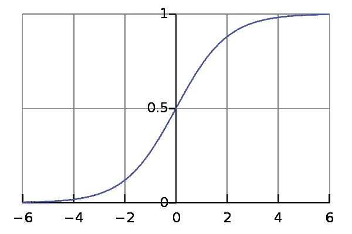

# 激活功能去神秘化！

> 原文：<https://medium.com/coinmonks/activation-functions-demystified-661d1183f5f8?source=collection_archive---------12----------------------->

Photo by [Sharon McCutcheon](https://unsplash.com/@sharonmccutcheon?utm_source=medium&utm_medium=referral) on [Unsplash](https://unsplash.com?utm_source=medium&utm_medium=referral)

> 有了伟大的深度学习资源，就有了伟大的深度学习行话。

如果你已经研究深度学习有一段时间了，你一定会遇到很多与该领域相关的术语。对于初学者来说，这可能会让人感到不知所措。所以，如果你遇到了术语“**激活功能**”，并发现自己和上面的狗一样困惑，不要担心。我掩护你。

在我们开始讨论*激活功能*之前，让我们先了解一下*激活*到底是什么。

## 那么什么是激活呢？

一个*激活*只是一个数字。这就是激活的全部。我们知道，深度学习的核心是以下等式:

> y = W * x + b

一旦我们计算了这个等式，`y`保持的值被称为*激活*。因此，计算这个方程的神经网络中的每个节点都拥有自己的值`y`，所有这些值都被称为*激活*。这就是激活的全部内容。没有魔法。没有复杂的解释。没有隐藏的概念。 ***简直就是一个数字。***

## 好吧，网上的家伙。我明白了。但是什么是激活函数呢？

一个*激活函数*仅仅是一个应用于激活的数学函数，以便在我们的网络中引入一些 ***非线性*** 。*迷茫？请继续阅读。*

一个神经网络基本上是由*多个线性*和*个非线性函数*组合而成。`y = m * x + b`是一个线性函数。但是，如果我们的网络在所有层中都只有线性函数，那么网络将简单地充当单层网络。这样的网络不可能学到很多东西。

这就是为什么我们使用激活函数来产生每一层中每个节点的输出。这在我们的网络中引入了非线性，使网络能够学习。

> 这种线性和非线性函数的结合使得神经网络能够逼近任何东西。

## 我可以使用不同的激活功能吗？

有许多不同类型的激活功能已经被使用了很多年。但是，在这篇文章中，我将解释目前在研究和行业中使用的 4 个最流行和最有用的激活函数，而不是全部。

Sigmoid():Sigmoid 激活函数将激活值转换为 0 到 1 之间的值。*对* ***二元分类问题*** *有用，多用于此类问题*的最终输出层。此外，sigmoid 激活会导致缓慢的梯度下降，因为高值和低值的斜率都很小。sigmoid 激活在数学上表示为以下等式:

> **Sigmoid(z)= 1/(1+exp(-z))**

Sigmoid activation (Source: Wikipedia)

**Tanh():**Tanh 激活函数将激活转换为-1 到+1 之间的值。在大多数情况下，该激活函数优于 sigmoid 激活函数，因为输出是归一化的。这是一个非常流行的激活函数，用于隐藏层。数学上，它表示为:

> tanh(z)=[exp(z)-exp(-z)]/[exp(z)+exp(-z)]

tanh activation (Source: Wikipedia)

**ReLU():**ReLU(整流线性单元)是一个真正*复杂且听起来很花哨的激活函数，但它所做的只是将负值变为零。这就是它的全部功能。这是**最流行和最有效的激活函数，用于隐藏层。这是最常用的激活功能。并且是大多数神经网络层的默认选择。数学上，它表示为:***

> ReLU(z) = max(0，z)

ReLU activation (Source: Wikipedia)

**漏 ReLU:**ReLU 的一个问题可能是负值的导数(斜率)为零。在某些情况下，我们可能不希望这样。为了解决这个问题，我们可以使用泄漏 ReLU。泄漏的 ReLU 确保负值的斜率不为零。但大多数情况下，ReLU 函数会做得很好。数学上，它表示为:

> Leaky_ReLU(z) = max(0.01*z，z)

Leaky ReLU activation; a=0.01 (Source: imgur)

*ReLU 和 Leaky ReLU* 的**优势**是导数(斜率)远大于零*(对于 z > 0)* ，因此，与 *sigmoid 或 tanh* 相比，算法将学习得更快。

这些是激活函数，从研究到工业，到处都在使用。

## 但是，嘿，我怎么知道用哪一个呢？

因此，选择激活函数的经验法则非常简单:

1.  如果你需要在 0 和 1 之间选择一个值，比如在二进制分类中，那么使用 Sigmoid 激活函数。否则，对于所有其他情况，不要使用这个。
2.  ReLU 是 ***默认*** 用于所有其他情况的选择。但是在某些情况下，你也可以使用 tanh。如果您不确定使用哪一个，请尝试同时使用两种。

关于激活函数就是这样。他们被用来使网络非线性，你有几个选择，你可以使用哪个激活功能。我希望我已经成功地为你揭开了激活函数的神秘面纱，你现在对它们有了更好的理解。

有任何问题、反馈或批评吗？在 [***推特***](https://twitter.com/iamJYash) **上留言或联系我！**