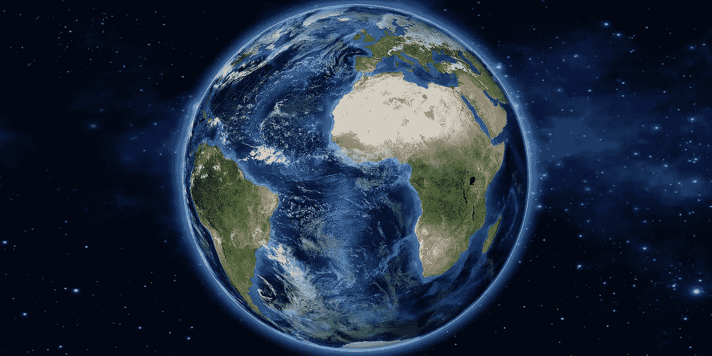

# ADA 可以成为环境友好的稀缺资源

> 原文：<https://medium.com/coinmonks/ada-can-be-an-environment-friendly-scarce-resource-873e86782eeb?source=collection_archive---------4----------------------->

经济危机期间货币和印钞的膨胀被认为是一个需要比特币来解决的问题。在负面环境影响的背景下，这是合理的吗？我们有别的选择吗？我们有。卡达诺可以成为价值的绿色储存。

# 比特币的挖掘