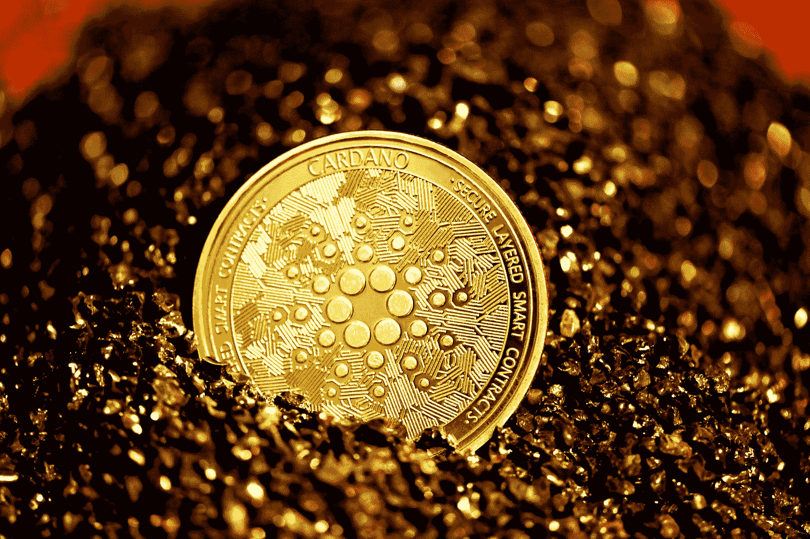
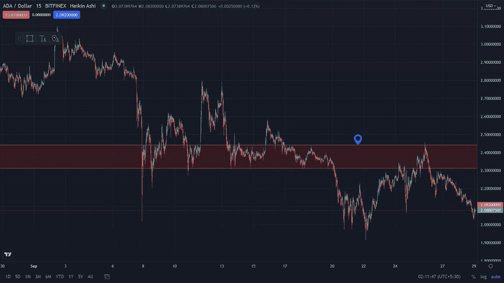

# 阿达奋力达到它的心理抵抗

> 原文：<https://medium.com/coinmonks/ada-struggling-to-reach-its-psychological-resistance-bdcde94c5981?source=collection_archive---------10----------------------->

## 我们应该持有还是出售？

Photo by [Executium](https://unsplash.com/@executium?utm_source=medium&utm_medium=referral) on [Unsplash](https://unsplash.com?utm_source=medium&utm_medium=referral)

又是一周，加密市场的又一个下跌，尽管现在我没有感觉到，它只是上涨或下跌，如果你不喜欢衍生品，那么你可能不应该太担心，因为这些只是简单的下跌。出现调整是正常的，这表明市场已经成熟。

我们只是希望 ADA 涨到 2.4 美元，只有这样我们才能在今年 3 美元看到 ADA，但根据我的分析，ADA 在今年年底可以价值超过 10 美元。尽管发生这种情况的可能性大大降低了，但可能性还是存在的。

查看这篇博客，了解更多详情:

 [## 爱达今年年底要 10 个亿

### 我的最新研究预测了熊市趋势，结果果然如此。但是现在，天堂会开始吗？

medium.com](/coinmonks/ada-to-10-at-the-end-of-this-year-be0301b50b62) 

在这篇博客中，我讨论了 ADA 在 10 美元的概率，我提到了一个图表，也许可以帮助你得到清晰，为了更好地理解，让我在这里得到这个图表。

Chart by Trading View

正如你在图表中看到的，2.4 美元是我们应该注意的范围。最近 ADA 触及 2.4 美元，但由于巨大阻力，此后下跌，所以我们应该希望 ADA 越过 2.4 美元水平，那么我们可以看到巨大的上升空间。

让我们抱最好的希望。

> 加入 Coinmonks [电报频道](https://t.me/coincodecap)和 [Youtube 频道](https://www.youtube.com/c/coinmonks/videos)了解加密交易和投资

## 另外，阅读

*   [电网交易机器人](https://blog.coincodecap.com/grid-trading) | [Cryptohopper 审查](/coinmonks/cryptohopper-review-a388ff5bae88) | [Bexplus 审查](https://blog.coincodecap.com/bexplus-review)
*   [7 个最佳零费用加密交易平台](https://blog.coincodecap.com/zero-fee-crypto-exchanges)
*   [分散交易所](https://blog.coincodecap.com/what-are-decentralized-exchanges) | [比特 FIP](https://blog.coincodecap.com/bitbns-fip) | [Pionex 审查](https://blog.coincodecap.com/pionex-review-exchange-with-crypto-trading-bot)
*   [用信用卡购买密码的 10 个最佳地点](https://blog.coincodecap.com/buy-crypto-with-credit-card)
*   [加密复制交易平台](/coinmonks/top-10-crypto-copy-trading-platforms-for-beginners-d0c37c7d698c) | [如何在 WazirX 上购买比特币](/coinmonks/buy-bitcoin-on-wazirx-2d12b7989af1)
*   [南非的加密交易所](https://blog.coincodecap.com/crypto-exchanges-in-south-africa) | [BitMEX 加密信号](https://blog.coincodecap.com/bitmex-crypto-signals)
*   [MoonXBT 副本交易](https://blog.coincodecap.com/moonxbt-copy-trading) | [阿联酋的加密钱包](https://blog.coincodecap.com/crypto-wallets-in-uae)
*   [MoonXBT vs Bybit vs 币安](https://blog.coincodecap.com/bybit-binance-moonxbt)
*   [雷米塔诺审查](https://blog.coincodecap.com/remitano-review)|[1 英寸协议指南](https://blog.coincodecap.com/1inch)
*   [买 PancakeSwap(蛋糕)](https://blog.coincodecap.com/buy-pancakeswap)|[matrix export Review](https://blog.coincodecap.com/matrixport-review)