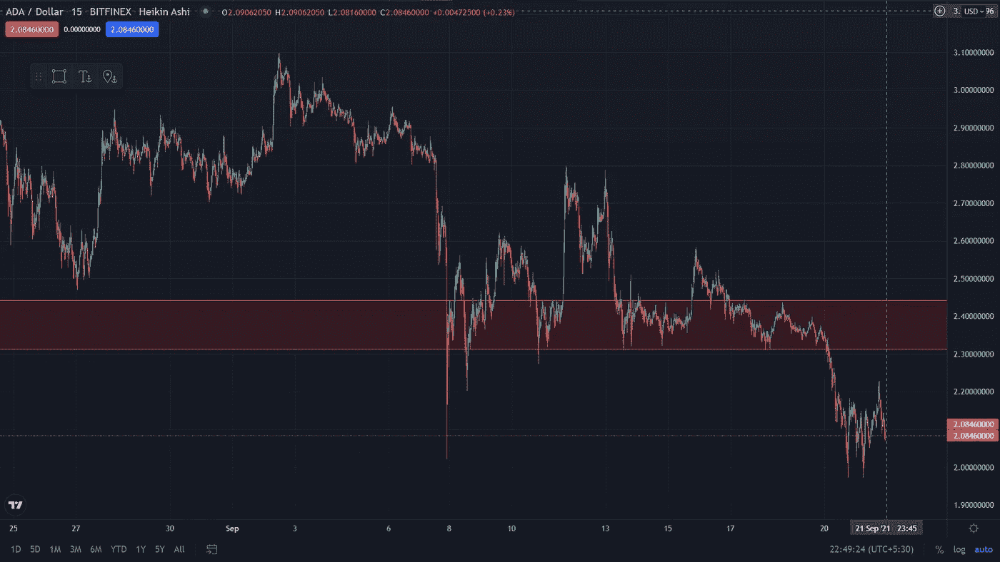

# 爱达今年年底要 10 个亿

> 原文：<https://medium.com/coinmonks/ada-to-10-at-the-end-of-this-year-be0301b50b62?source=collection_archive---------10----------------------->

## 我的最新研究预测了熊市趋势，这一趋势果然出现了。但是现在，天堂会开始吗？

Chart from Trading View

最近，我从我的分析中得到了一个信号，它给了我看跌的信号，正如我所料，它发生了。

当阿隆佐的更新发布时，所有人都预计价格将飙升至新的高度并打破历史高点，但相反，它跌破了支持价格，这就是:

> “买谣言，卖新闻”

如果你想在今年年底达到 100%，ADA 可能是一个很好的赌注，如果它达到 10 美元，可能会超过 100%。

加密货币市场变得更加不可预测和不稳定，交易也不容易。

我建议你这个时候谨慎交易，这个时候绝对可以投资，这个月底还能赚点钱。

由于 ADA 在其区块链中推出了智能合约，并且它甚至可以给以太坊智能合约带来竞争，因此 ADA 成为 10 美元的概率非常高。

我已经在 9 月 15 日发表了一篇关于 ADA 的短文，你可以进一步查看并给出你的想法。

 [## 艾达·肖特或者我称之为中立

### 这不会有好结果的。没有因为图表而产生的享受。

medium.com](/@himanshuindiaa/ada-short-or-ill-call-it-neutral-32ee35ce7e9f) 

加密货币市场现在正在蓬勃发展，也许会持续繁荣几年，但我想建议你不要投资你的钱，如果你没有任何知识，尊重你的钱，他们也会尊重你。

明智地投资，也做投机，因为这是一个秘密市场，可以给你的小额投资带来神圣的回报。

将你的投资组合多样化，并用这些钱进行投资，你可能会失去这些钱，但在你的生活中你会继续前进。冒险但不要做小丑。

> 加入 Coinmonks [电报频道](https://t.me/coincodecap)和 [Youtube 频道](https://www.youtube.com/channel/UCbyDhTbOiKh2iUMKBi4-4Zg)了解加密交易和投资

## 另外，阅读

*   [尤霍德勒 vs 科恩洛安 vs 霍德诺特](/coinmonks/youhodler-vs-coinloan-vs-hodlnaut-b1050acde55a) | [Cryptohopper vs 哈斯博特](https://blog.coincodecap.com/cryptohopper-vs-haasbot)
*   [币安 vs 北海巨妖](https://blog.coincodecap.com/binance-vs-kraken) | [美元成本平均交易机器人](https://blog.coincodecap.com/pionex-dca-bot)
*   [新加坡十大最佳加密交易所](https://blog.coincodecap.com/crypto-exchange-in-singapore) | [购买 AXS](https://blog.coincodecap.com/buy-axs-token)
*   [投资印度的最佳密码](https://blog.coincodecap.com/best-crypto-to-invest-in-india-in-2021) | [HitBTC 评论](/coinmonks/hitbtc-review-c5143c5d53c2)
*   [加拿大最好的加密交易机器人](https://blog.coincodecap.com/5-best-crypto-trading-bots-in-canada) | [赌注加密](https://blog.coincodecap.com/staking-crypto)
*   [如何在印度购买比特币？](/coinmonks/buy-bitcoin-in-india-feb50ddfef94) | [WazirX 评论](/coinmonks/wazirx-review-5c811b074f5b)
*   [比特币主根](https://blog.coincodecap.com/bitcoin-taproot) | [Bitso 评论](https://blog.coincodecap.com/bitso-review) | [排名前 6 的比特币信用卡](/coinmonks/bitcoin-credit-card-bc8ab6f377c6)
*   [最佳免费加密信号](https://blog.coincodecap.com/free-crypto-signals) | [YoBit 评论](/coinmonks/yobit-review-175464162c62) | [Bitbns 评论](/coinmonks/bitbns-review-38256a07e161)
*   [OKEx 回顾](/coinmonks/okex-review-6b369304110f) | [Kucoin 交易机器人](/coinmonks/kucoin-trading-bot-automate-your-trades-8cf0ca2138e0) | [期货交易机器人](/coinmonks/futures-trading-bots-5a282ccee3f5)
*   [AscendEx Staking](https://blog.coincodecap.com/ascendex-staking)|[Bot Ocean Review](https://blog.coincodecap.com/bot-ocean-review)|[最佳比特币钱包](https://blog.coincodecap.com/bitcoin-wallets-india)
*   [我的加密副本交易经历](/coinmonks/my-experience-with-crypto-copy-trading-d6feb2ce3ac5) | [比特币基地评论](/coinmonks/coinbase-review-6ef4e0f56064)
*   [CoinFLEX 评论](https://blog.coincodecap.com/coinflex-review) | [AEX 交易所评论](https://blog.coincodecap.com/aex-exchange-review) | [UPbit 评论](https://blog.coincodecap.com/upbit-review)
*   [AscendEx 保证金交易](https://blog.coincodecap.com/ascendex-margin-trading) | [Bitfinex 赌注](https://blog.coincodecap.com/bitfinex-staking) | [bitFlyer 点评](https://blog.coincodecap.com/bitflyer-review)
*   [麻雀交换评论](https://blog.coincodecap.com/sparrow-exchange-review) | [纳什交换评论](https://blog.coincodecap.com/nash-exchange-review)
*   [加密货币储蓄账户](/coinmonks/cryptocurrency-savings-accounts-be3bc0feffbf) | [加密交易机器人](https://blog.coincodecap.com/best-crypto-trading-bots)
*   [BigONE 交易所评论](/coinmonks/bigone-exchange-review-64705d85a1d4) | [CEX。IO 审查](https://blog.coincodecap.com/cex-io-review) | [交换区审查](/coinmonks/swapzone-review-crypto-exchange-data-aggregator-e0ad78e55ed7)
*   [最佳比特币保证金交易](/coinmonks/bitcoin-margin-trading-exchange-bcbfcbf7b8e3) | [比特币保证金交易](https://blog.coincodecap.com/bityard-margin-trading)