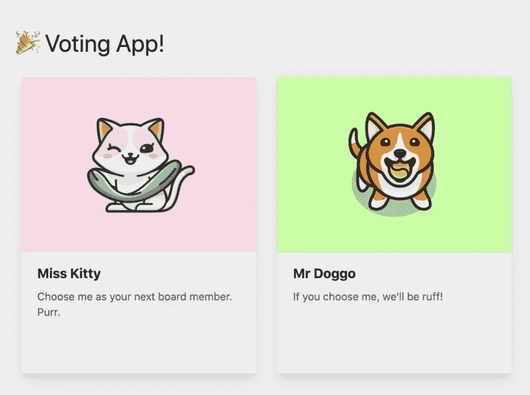
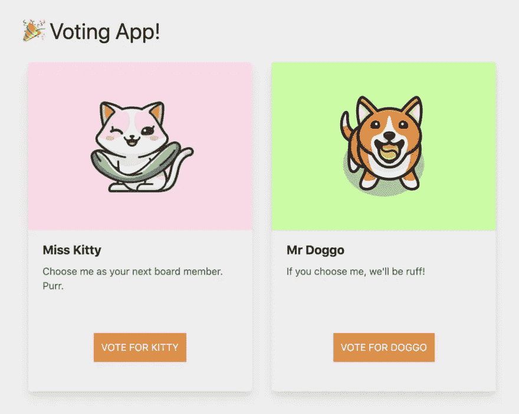
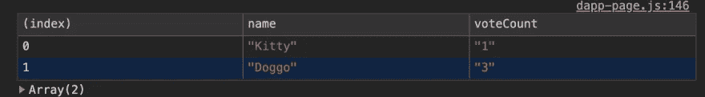
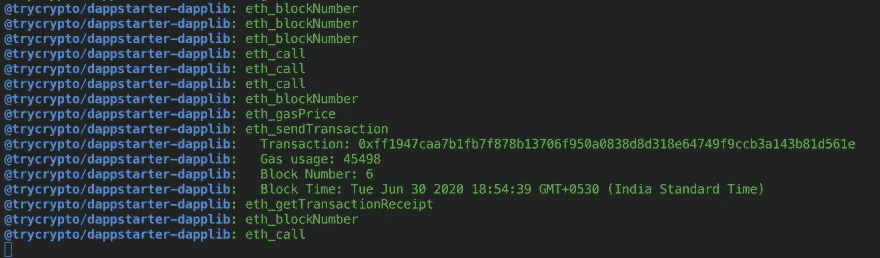

# 如何实现投票功能:从后端到用户界面

> 原文：<https://medium.com/coinmonks/add-voting-functionality-fcead1e1e56?source=collection_archive---------4----------------------->

## *本文是区块链公司治理系列文章的一部分。*


本系列的第 1 部分概述了区块链在公司治理中的潜在应用，并介绍了如何按照本系列建立您的项目。

[第 2 部分](https://www.trycrypto.com/blog/part-2-voting-smart-contract)概述了股东投票智能合同的整个业务逻辑，包括智能合同开发的最佳实践。

在第 3 部分[中，我们开始在 UI 中编织，并学习如何从区块链中读取。](https://www.trycrypto.com/guides-and-tutorials/connecting-a-smart-contract-with-a-ui-and-reading-from-the-blockchain)

在这一部分，我们将为两个候选人添加投票功能，并学习如何写区块链。

在第 3 部分结束时，我们的 dapp 看起来是这样的:



在这一部分，我们将遵循 3 个步骤来促进 dapp 中的投票。

1.  在我们的库中创建投票功能，`dapp-lib.js`。该函数将负责向区块链写入投票。(注意:写入区块链类似于调用 HTTP POST 方法，并且不是免费的。)
2.  为两个候选人添加一个动作按钮，并用我们在`dapp-lib.js`的步骤 1 中编写的投票功能连接按钮。
3.  最后，让我们验证一下我们的投票逻辑是否工作正常。我们将再次调用`getCandidates()`函数。两位候选人的`voteCount`现在应该不同了。

# 步骤 1:在我们的库 dapp-lib.js 中创建一个投票函数

DappStarter 已经为此生成了`dapp-lib.js`。您可以通过以下路径找到它:

```
packages
  - dapplib
    - src
      - lib
        -> dapp-lib.js
```

作为一个好的实践，我建议你把这个函数写在`getCandidates()`函数附近，这样可以更容易地跟踪哪些函数被添加到了`dapp-lib.js`文件中。

对于打算写入区块链的所有函数，该函数的格式将保持相似。

该函数将把`data`作为输入参数。这个输入对象将从`<action-button>`接收，我们将在下一步的`dapp-page.js`中创建它。在这个`data`对象中，将有一个名为`candidateId`的属性，该属性也将从`<action-button>`接收。

在引擎下，`dapp-page.js`在内部与`blockchain.js`通信以写入区块链。所以从`dapp-page.js`开始，我们要做的就是调用`Blockchain.post()`方法。

我们在`dapp-lib.js`的工作现在完成了。让我们转到`dapp-page.js`来为 UI 添加动作按钮。

# 步骤 2:添加一个动作按钮，并将它们连接到投票逻辑

`<action-button>`是一个自定义元素，它提供了一个与`dapp-lib.js`通信的接口，以访问我们的智能合约的功能。

一个`<action-button>`需要以下标签:

*   **源**:应该指向要提取数据的源`div`
*   **动作**:这是我们在`dapp-lib.js`中写的函数名
*   **方法** : `GET/POST`
*   **字段**:将作为`dapp-lib.js`功能输入的`data`对象下的属性
*   **文本**:这是按钮上对用户可见的文本
*   **类**:按钮的 CSS 类
*   **。点击**:点击该按钮时调用的函数。

首先，让我们为我们的第一位候选人 Kitty 小姐添加一个动作按钮。导航到`dapp-page.js`中的`render()`功能。

在上面的代码片段中，我们创建了一个隐藏的`<input>`，并预先填充了`0`的`value`，因为猫咪小姐的`candidateId`是`0`。`data-field`被设置为`candidateId`，因为`<action-button>`将从`candidateId`获取其数据。请注意，这被包装在一个名为`kitty-form`的`div`中。

让我们创建`showResults()`函数。每次点击`<action-button>`都会调用该函数。我们将在`dapp-page.js`的开头，靠近`constructor(args)`的地方创建这个函数。

该功能的名称为`showResults()`。我们将调用`dapp-lib.js`中的`getCandidates()`函数并显示结果。当我们在 UI 中显示结果时，我们将在后面的部分中修改这个函数。

同样，我们将为 Doggo 先生写一个`<action-button>`。注意`data-field`的`value`是`1`，源`div`的名称是`doggo-form`。

成功完成这些更改后，您的 dapp 应该如下所示:



# 步骤 3:验证我们的投票逻辑工作正常

我们差不多完成了。现在我们只需验证它是否正常工作。

要检查一切是否按预期运行，请单击 UI 中的按钮。你可以多次点击它们。；)

在开发人员的控制台中，您应该会看到类似这样的内容。我们看到一个干净的表，而不是嵌套的 JSON，因为我们没有做`console.log()`，而是做了`console.table()`。



终端还应反映区块链上发生的交易。您将能够看到交易 id、气体使用量、阻塞号和阻塞时间。它应该是这样的:



在本文中，我们学习了如何为候选人添加投票功能。如第 1 部分所述，除了为候选人投票，您还可以选择为议程投票。你可以用任何你喜欢的方式定制你的 dapp。我们还学习了如何给区块链写信。我们学会了如何使用`<action-button>`。这些定制元素是 DappStarter 的主要神奇特性之一。

我们非常接近完成这个 dapp。在下一篇文章中，我们将看到如何在 UI 中直接显示结果，让用户更容易看到每个候选人的当前分数。

> [在您的收件箱中直接获得最佳软件交易](https://coincodecap.com/?utm_source=coinmonks)

[](https://coincodecap.com/?utm_source=coinmonks)

## 用 [DappStarter](https://dappstarter.trycrypto.com/) 开始建造。

## 敬请关注。