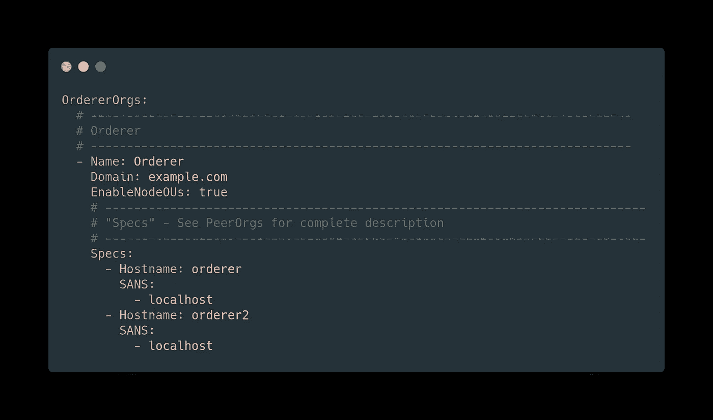
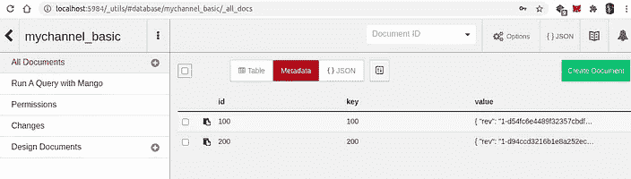

# 在运行 Hyperledger Fabric v2.2 网络中添加新订购者

> 原文：<https://medium.com/coinmonks/adding-a-new-orderer-in-running-hyperledger-fabric-v2-2-network-4c90c8315ae1?source=collection_archive---------1----------------------->


how to add new orderer in hyperledger fabric

# 1.概观

在本文中，我们将学习 Hyperledger fabric 的一个高级概念，这在生产级环境中通常是必需的。我们将在没有任何停机时间或干扰 HLF 网络的情况下，向运行中的 raft 集群添加一个新的订购者。基于 Raft 的订购服务是在 1.4.1 版本中引入的，它成为比 Kafka 更好的集群解决方案，并且最近由于其**崩溃容错** (CFT)特性而成为 v2.0 中推荐的订购服务设置。在本次演示中，我们将使用 v2.2，因为它是当前的 LTS 版本。

> **TL dr**[**源代码**](http://bit.ly/hlf-advance) **可以在这里找到。
> *同样，查看我的*** [***课程上的超帐结构部署***](http://bit.ly/hlf-multihost-deployment)

# 2.术语

1.  ***应用通道-*** 它用于应用目的，当我们构建和部署链码时，它是在**应用通道**例如 *mychannel 上完成的。*
2.  ***系统通道-*** 它也被称为 ***订购者系统通道，*** 这个通道的用途是为了订购者，它是引导或创建的第一个通道。在[布样发布中，v1.4](https://github.com/hyperledger/fabric-samples/tree/release-1.4) 被命名为`*byfn-sys-channel*`*，但在[布样发布 v2.2](https://github.com/hyperledger/fabric-samples/) 中使用了术语`*system-channel*`。*

***系统通道**和**应用通道**都包含订购者的信息。当我们向正在运行的结构网络添加新的订购者时，我们需要先将其添加到系统通道，然后添加到应用程序通道，然后新添加的订购者才能为应用程序提供服务。*

# *3.了解渠道更新流程*

*更新频道无论是`system channel`还是`Application channel`，典型的流程都是一样的。下面是这个过程中涉及的步骤。*

1.  *从通道中获取最新的配置块(PB 格式)。*
2.  *将配置块转换(解码)成 JSON，并提取感兴趣的数据部分。*
3.  *使用编辑器或 jq 工具添加/修改配置。*
4.  *将修改后的 JSON 文件转换(编码)回 PB 格式。*
5.  *将步骤 2 的输出转换(编码)为 PB 格式。*
6.  *计算步骤 4 和步骤 5 的输出之间的差值(delta)。结果也是 PB 格式的。*
7.  *将差异(步骤 6 的输出)转换(解码)为 JSON 格式。*
8.  *插入信封。*
9.  *将 JSON 文件转换(编码)回 PB 格式。*

# *4.网络:设置*

*对于这个演示，我使用示例中提供的`[test-network](http://bit.ly/hlf-advance)`。我已经添加了几个 [shell 脚本](http://bit.ly/hlf-advance)并删除了未使用的代码，用户可以使用这个库。*

*面料样品中提供的`test-network`只有一个订购者提供木筏订购服务。现在，我们将向网络中再添加一个订购者(订购者 2 ),通过这种方式，我们可以添加 n 个订购者，所有这些都将在运行的网络中完成。*

***步骤 1。**我们将以`mychannel(Application Channel)`和 CouchDB 作为状态数据库来启动网络，我正在使用标签为 2.2 的 docker 图像*

```
*cd fabric-samples-advance-topics/test-network
./network.sh up createChannel -c mychannel -s couchdb -i 2.2*
```

**

*how to add new orderer in hyperledger fabric*

***步骤 2。**部署名称为*基本*版本为 *1* 的链码。我们正在使用`asset-transfer-basic`链码的`golang`版本。*

```
*./network.sh deployCC -ccn basic -ccv 1*
```

**

*how to add new orderer in hyperledger fabric*

*现在我们的网络已经建立并运行了，我们可以通过调用一些针对我们已经部署的链代码的事务来测试它。为此，我们将启动一个 cli 容器来执行一些事务。*

```
*docker-compose -f docker/docker-compose-cli.yaml up -d*
```

**

*how to add new orderer in hyperledger fabric*

*一旦我们的 cli 容器启动并运行，我们将调用一些事务。*

```
*./scripts/transaction-ord1.sh*
```

*该脚本将使用链码创建一个资产，然后从链码中查询所有资产。*

**

*how to add new orderer in hyperledger fabric*

*现在我们的网络设置部分已经完成，我们将进入设置订购者的下一部分*

# *5.设置新订购者*

*这一步是最重要的一步。*

1.  ****调出订购者 CLI 容器*** 我们首先调出`orderer-cli`，因为脚本中的所有命令都是在这个容器上发出的。我们是**不是**要用 ***第 4 节*** 用的`cli`容器。*

```
*docker-compose -f docker-compose-orderer-cli.yaml up -d*
```

**

*how to add new orderer in hyperledger fabric*

*2. ***为订购者 2*** 创建加密材料我们将更新`crypto-config-orderer.yaml`文件并为`orderer2`添加配置，并将为订购者 2 生成证书。

*

**

*how to add new orderer in hyperledger fabric*

*3. ***将 TLS 添加到系统通道*** *我们将使用脚本* `*addTLSsys-channel.sh*` *来执行第 3 节* *中提到的所有步骤。在更新* `*system-channel*` *的这一步中，我们将添加本节第 2 步中生成的编码 base64 版本的 TLS 证书。TLS 证书将在* `ordererOrganizations/example.com/orderers/orderer2.example.com/tls/server.crt`颁发*

```
*./scripts/addTLSsys-channel.sh*
```

**

*how to add new orderer in hyperledger fabric*

*4. ***获取最新的配置块*** 更新完成后，我们需要最新的配置块。如上所述，最新的配置块`system channel`被用作订单 2 的起源块。*

```
*./scripts/fetchConfigBlock.sh*
```

**

*how to add new orderer in hyperledger fabric*

*我们在`channel-artifacts` 目录中看到了`latest_config.block`。*

**

*how to add new orderer in hyperledger fabric*

*5. ***调出订单 2 容器*** 现在我们有了包含订单 2 的 TLS 证书的最新配置块，现在我们可以调出订单 2。*

```
*docker-compose -f docker-compose-orderer.yaml up -d*
```

*在第 35 行，我们可以看到`latest_config.block`被用作 orderer2 的起源块。*

**

*how to add new orderer in hyperledger fabric*

*6. ***向系统通道添加新订购者端点*** 该脚本类似于步骤 3，不同之处在于内容被修改(第 5 行)。*

```
*./scripts/addEndPointSys-channel.sh*
```

**

*how to add new orderer in hyperledger fabric*

***7*。观察 Orderer2 日志*** 完成上一步后，系统通道准备就绪。当我们查看 orderer2 上的日志时，我们可以发现一些有趣的信息。*

*订购者 6 现在可以看到系统通道`system-channel`中的所有现有节点。此外，订购者 2 已经从集群中的其他订购者那里了解到应用程序通道 mychannel 的存在。然而，它声称“不属于渠道`mychannel`”。原因是订单 6 还没有添加到我的渠道。这将在接下来的步骤中完成。
我们还可以对比一下`orderer.example.com`和`orderer2.example.com`的内容。*

**

*how to add new orderer in hyperledger fabric*

*首先说说`system-channel`*

**

*how to add new orderer in hyperledger fabric*

*它们一样长。*

*现在谈谈`*mychannel*`*

**

*how to add new orderer in hyperledger fabric*

*它们长度不同。这是因为订单 2 还不属于`*mychannel*`。*

*7. ***将 TLS 添加到申请通道*** *这一步类似于我们在本节步骤 3 中所做的。唯一不同的是，这次我们将 TLS 证书(以 based64 编码)添加到* `*mychannel(Application channel)*` *。**

```
*./scripts/addTLSapplication-channel.sh*
```

**

*how to add new orderer in hyperledger fabric*

*8. ***添加新的订购者端点到应用程序通道*** *这个步骤类似于我们在本节的步骤 6 中所做的。唯一不同的是，这次我们将 TLS 证书(以 based64 编码)添加到* `*mychannel(Application channel)*` *。**

```
*./scripts/addEndPointapplication-channel.sh*
```

**

*how to add new orderer in hyperledger fabric*

****9。遵守秩序 2*** 解决事情需要一些时间(文件中提到的五分钟)。过了一会儿，我们在 orderer2 上看到了这个日志。*

*它告诉我们订单 2 现在可供`mychannel`使用。
同样我们也可以在`mychannel`比较`orderer.example.com`和`orderer2.example.com`的内容:*

**

*how to add new orderer in hyperledger fabric*

***10*。测试我们新添加的订单 2****

*我们可以通过新添加的订单 2 进行一些交易。*

```
*./scripts/transaction-ord2.sh*
```

****

*how to add new orderer in hyperledger fabric*

# *6.**总结***

*在本文中，我们看到了如何将订购者添加到正在运行的 Hyperledger Fabric 网络中，我知道这是一项有点乏味的任务，但在一些 shell 脚本的帮助下，我们可以在几分钟内完成这项任务。我添加了一个脚本`[addOrderer.sh](http://bit.ly/hlf-advance)`,可以完成我们在上面学到的所有工作。你可以在这里找到脚本。*

> ***在多主机** 上查看我的 [**关于 Hyperledger Fabric 部署的课程**](https://www.udemy.com/course/learn-to-deploy-hyperledger-fabric-v22-on-multihost/?referralCode=8AF12D11DDC9A3D5B636)*

*如果你觉得这篇文章很有帮助，请点击拍手按钮，并跟随我阅读更多这样的信息丰富的文章。*

*你可以在 [Linkedin](https://linkedin.com/in/adityajoshi12) 上找到我或者在 [GitHub](https://github.com/adityajoshi12) 上跟踪我？如果这对你来说太社交化了，如果你想和我讨论技术，就给 adityaprakashjoshi1@gmail.com 发封邮件。*

**

> ****还有，查看我的*** [***课程在 Hyperledger 上的架构部署在多主机上***](http://bit.ly/hlf-multihost-deployment)*