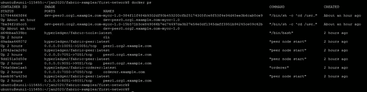
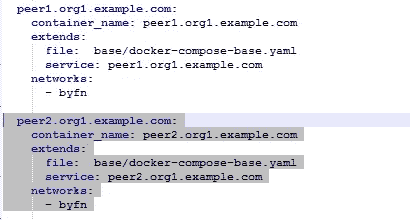

# 将对等体添加到运行中的网络

> 原文：<https://medium.com/coinmonks/adding-a-peer-to-a-running-network-3e71e16dd0a?source=collection_archive---------9----------------------->


大家好，

最近，我与大家讨论了[区块链](https://blog.coincodecap.com/tag/blockchain/)中的各种认证选项，我们详细了解了 Hyperledger fabric 认证考试的模式。

Hyperledger fabric 考试中解决问题的一个主题是**向现有网络添加新的对等点**，这是 Hyperledger fabric 网络日常实施中非常常见的要求，这就是为什么在认证考试中占有一席之地，但这个主题在 Hyperledger fabric 产品文档中没有一席之地，所以我们在这里将讨论**如何向已经是网络一部分的组织添加对等点，并详细说明所需步骤**

因此，在我们开始之前，我已经做好了基础工作，示例 BYFN 网络已经启动并运行

您可以按照 Hyperledger fabric 文档进行同样的操作。

[](https://hyperledger-fabric.readthedocs.io/en/release-1.4/build_network.html) [## 构建您的第一个网络- hyperledger-fabricdocs 主文档

### 编辑描述

hyperledger-fabric . readthedocs . io](https://hyperledger-fabric.readthedocs.io/en/release-1.4/build_network.html) 

现在，我们将开始向现有网络添加对等体的过程。

**步骤 1** :更新加密配置文件，如果你知道设置网络的步骤,“加密配置”起着重要的作用，并且是开始的第一步，所以添加对等点也是如此


加密配置文件的 count 属性定义了文件中定义的任何 org 的对等体数量，因此向 org 添加新的对等体时，首先期望计数增加所需的新对等体数量


在加密配置文件的示例 byfn 网络文件夹中，我们将把计数从 2 增加到 3，因为我们想要添加一个新的对等点


**步骤 2** :为新的对等体生成证书，现在，由于新的对等体将属于一个现有的组织，并且我们正在用一个对等体扩展该组织，我们将在同一个 cryptogen-config 文件上再次运行 cryptogen 工具，但是这一次我们将使用 cryptogen 工具的扩展标志，而不是生成


该命令将简单地更新证书的现有 crypto-config 文件夹，该文件夹最初只有两个对等体的身份证书，现在将携带我们新对等体的新创建的证书


在这里，您可以看到添加了新的对等文件夹


**步骤 3** :为新的对等体设置容器。

在下一步中，我们需要更新网络的 docker-compose 文件，以包含新的对等容器配置

为了便于输入新的对等配置，我们只需引用现有的对等容器配置，并通过更改对等名称来复制相同的配置

**docker-compose-CLI . YAML**



下一个文件是:**docker-compose-base . YAML**


复制配置时，请记住准确更新端口、卷和容器名称，而不要更新核心对等引导


**步骤 4** :接下来的步骤与启动网络非常相似

我们将运行与启动网络相同的命令，这一次 docker composer 将读取配置文件，但这一次将读取新对等体的配置，因为它不存在，composer 将使用我们添加的配置为新对等体创建容器。

```
“docker**-**compose **-**f docker**-**compose**-**cli**.**yaml up **-**d”
```


现在我们可以看到新的对等容器正在运行


**步骤 5** :接下来我们将这个新的对等体连接到通道

让我们进入 CLI 容器，在这里我们会找到我们之前为其他对等体加入而创建的通道的 genesis 块，我们将使用同一个块


设置指向新对等点的环境变量

```
CORE_PEER_MSPCONFIGPATH**=/**opt**/**gopath**/**src**/**github**.**com**/**hyperledger**/**fabric**/**peer**/**crypto**/**peerOrganizations**/**org1**.**example**.**com**/**users**/**Admin@org1**.**example**.**com**/**mspCORE_PEER_ADDRESS**=**peer2**.**org1**.**example**.**com:8151CORE_PEER_LOCALMSPID**=**"Org1MSP"CORE_PEER_TLS_ROOTCERT_FILE**=/**opt**/**gopath**/**src**/**github**.**com**/**hyperledger**/**fabric**/**peer**/**crypto**/**peerOrganizations**/**org1**.**example**.**com**/**peers**/**peer2**.**org1**.**example**.**com**/**tls**/**ca**.**crt
```

然后用下面的命令将新的对等体连接到现有的通道

```
“peer channel join **-**b mychannel**.**block”
```


如果我们试图通过这个对等体查询已经在通道上运行的 chaincode，这将会失败，因为我们没有在这个对等体上安装 chaincode


**第六步**:现在我们要在这个对等体上设置链码，完成我们的教程

我们将使用以下命令安装 chaincode，

```
“peer chaincode install **-**n mycc **-**v 1.0 **-**p github**.**com**/**chaincode**/**chaincode_example02**/**go**/”**
```


最后，我们将调用安装在新对等体上的 chaincode，这将为我们的对等体创建一个新的 chaincode 容器，并且将花费一些时间来处理第一个调用


就这样，我们将 org1 的一个新对等体添加到了现有的运行网络中。

> [直接在您的收件箱中获得最佳软件交易](https://coincodecap.com/?utm_source=coinmonks)

[](https://coincodecap.com/?utm_source=coinmonks)[](https://coincodecap.com)