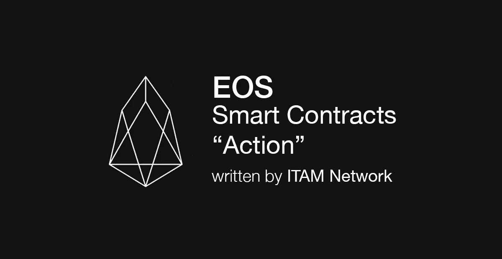

# 向 EOS 智能合同添加操作

> 原文：<https://medium.com/coinmonks/adding-action-to-eos-smart-contracts-85f6dcf2c841?source=collection_archive---------9----------------------->



在各种开发者社区中有许多人进入区块链世界，他们经常说 EOS 手册很难理解。本文将介绍如何在 Hello World 上使用智能契约操作的基础知识。

在智能合约中，动作是对智能合约的调用，它决定如何操作它。在 EOS 中，智能合同可以根据各种动作来执行。

```
#include <eosiolib/eosio.hpp>#include <eosiolib/print.hpp>using namespace eosio;class hello : public eosio::contract {
  public:
      using contract::contract;/// [@abi](http://twitter.com/abi) action 
      void hi( account_name user ) {
         print( "Hello, World", name{user} );
      }
};EOSIO_ABI( hello, (hi) )
```

首先，输入基本代码。使用上一篇文章中的*Hello . CPP*([用 EOS 智能合约打印 Hello World】)。](/coinmonks/printing-hello-world-with-eos-smart-contract-50fbe873d1b4)

```
#eosiocpp -o hello.wast hello.cpp#eosiocpp -g hello.abi hello.cpp
```

编译、上传合同并运行合同。

```
# cleos set contract usersc /root/sc/hello
Reading WAST/WASM from /root/sc/hello/hello.wasm...
Using already assembled WASM...
Publishing contract...
executed transaction: b491479802da43cd99e2a389331521b436d558d6d23398658db1368496fd65c8  1800 bytes  404 us#         eosio <= eosio::setcode               {"account":"usersc","vmtype":0,"vmversion":0,"code":"0061736d01000000013b0c60027f7e006000017e60027e7...#         eosio <= eosio::setabi                {"account":"usersc","abi":"0e656f73696f3a3a6162692f312e30000102686900010475736572046e616d65010000000...
warning: transaction executed locally, but may not be confirmed by the network yet# cleos push action usersc hi '["usera"]' -p usersc
executed transaction: 6bfbfba6e0ff1ab3179052bfdc4f7da4f6d838a2797aaa2e6ec0b6dbe8b456d0  104 bytes  204 us#        usersc <= usersc::hi                   {"user":"usera"}
warning: transaction executed locally, but may not be confirmed by the network yet
```

现在，让我们加入行动。

```
#include <eosiolib/eosio.hpp>#include <eosiolib/print.hpp>using namespace eosio;class hello : public eosio::contract {
  public:
      using contract::contract;/// [@abi](http://twitter.com/abi) action 
      void hi( account_name user ) {
         print( "Hello, World ", name{user} );
      }void bye( account_name user ) {
         print( "bye, World ", name{user} );
      }
};EOSIO_ABI( hello, (hi) (bye) )
```

修改源代码，编译并上传智能合同。

```
# cleos push action usersc hi '['hiuser']' -p userscexecuted transaction: 40a57f6ab85ad929da730409d5badfec98f6e0a854e1085f8e5d7230aa38fb57  104 bytes  268 us#        usersc <= usersc::hi                   {"user":" hiuser "}>> Hello, World! hiuser testwarning: transaction executed locally, but may not be confirmed by the network yet# cleos push action usersc bye '['hiuser']' -p usersc
executed transaction: fc22d0f414ca02a329141eff81ae596a68ba344d01ad0d74180779ce0bccb362  104 bytes  237 us#        usersc <= usersc::bye                  {"user":"hiuser"}>> bye, World hiuserwarning: transaction executed locally, but may not be confirmed by the network yet
```

检查添加的*再见*动作是否工作。

上例中使用的 *hiuser* 不存在。让我们通过使用 eosio 提供的一个单独的函数来改进这个例子。

```
#include <eosiolib/eosio.hpp>#include <eosiolib/print.hpp>using namespace eosio;class hello : public eosio::contract {
  private:
    bool ishi=false;

  public:
    using contract::contract;void hi( account_name user ) {
      ishi=true;
      chkuser(user);
    }void bye( account_name user ) {
      ishi=false;
      chkuser(user);
    }void chkuser(account_name user)
    {
      if(is_account(user))
      {
        if(ishi)
        {
          print( "Hello, World! ", name{user} , " test" );
        }
        else
        {
          print( "bye, World ", name{user} );
        }
      }
      else
      {
        print( "no user to sayhello" );
      }
    }
};EOSIO_ABI( hello, (hi) (bye) )
```

如果您编译、上传并调用合同

```
[root@test hello]# cleos push action usersc hi '['hiuser']' -p userscexecuted transaction: be2816019d0cd3b09c393acb300e763d72f17a0f33752e302359df0ec7e152e3  104 bytes  312 us#        usersc <= usersc::hi                   {"user":"hiuser"}>> no user to sayhellowarning: transaction executed locally, but may not be confirmed by the network yet[root@test hello]# cleos push action usersc hi '['usera']' -p userscexecuted transaction: 9528239c4c33c99f6277861dc94464f3166c0ab7d942936f3e0aae82a5f7fdc7  104 bytes  242 us#        usersc <= usersc::hi                   {"user":"usera"}>> Hello, World! usera testwarning: transaction executed locally, but may not be confirmed by the network yet[root@test hello]# cleos push action usersc bye '['usera']' -p userscexecuted transaction: ab3e43ea7ccd950cd64157005eb9b7e6530f3a1bed8eb35580b3cd335354e2f1  104 bytes  241 us#        usersc <= usersc::bye                  {"user":"usera"}>> bye, World userawarning: transaction executed locally, but may not be confirmed by the network yet
```

您应该会看到类似上面的内容。

另一个组件是通用的 C++语法，没什么特别的。这是 EOS DAPP 开发的诸多优势之一。

EOS 提供的 *is_account()* 函数用于验证用户是否为区块链用户。参考 EOS 提供的功能参考手册就好了。

关注 ITAM 网络获取最新信息。

如果您在 Telegram 上关注 ITAM 网络的公开聊天，您可以与 ITAM 网络分享和讨论 EOS 开发及更多内容。点击下面的链接！

网址: [http://itam.games](http://itam.games)

电报:[https://t.me/itamnetwork](https://t.me/itamnetwork)