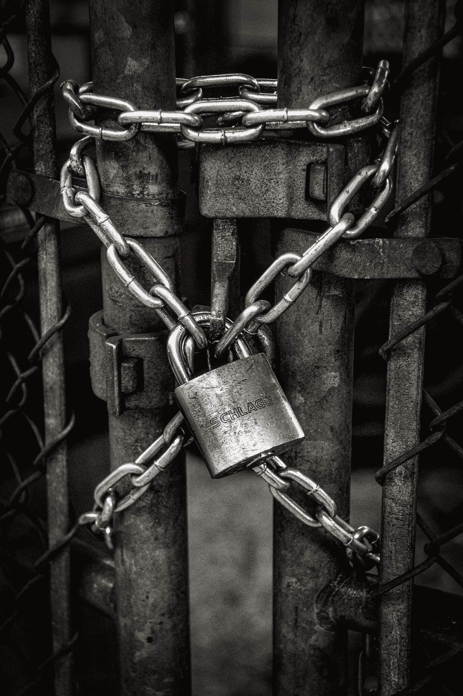
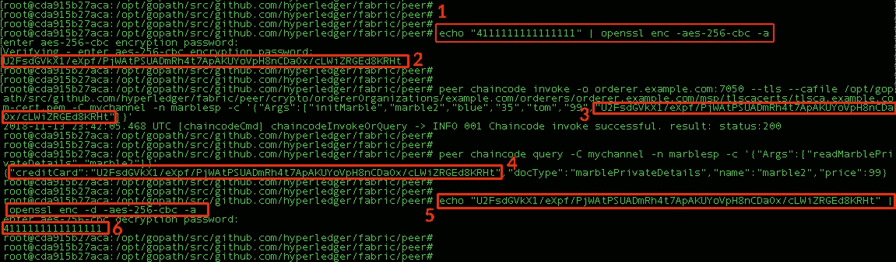

# 向 Hyperledger 专用数据添加字段级加密

> 原文：<https://medium.com/coinmonks/adding-field-level-encryption-to-hyperledger-private-data-d05b2f20244d?source=collection_archive---------0----------------------->

Photo by [John Salvino](https://unsplash.com/@jsalvino?utm_source=medium&utm_medium=referral) on [Unsplash](https://unsplash.com?utm_source=medium&utm_medium=referral)

Hyperledger 中的私有数据功能非常有助于在与其他不需要私有数据的组织(如组织 C-F)的渠道中保持组织 A 和组织 B(T4)之间的数据私有

企业级公司将需要对其授权组织内的私有数据进行更精细的控制。具体来说，这些公司需要保持个人私有数据字段可供批准的用户访问，同时让未批准的用户和具有 root 权限的管理员**无法访问这些字段。通常，这种类型的访问控制是通过 **HSM(硬件安全模块)**完成的。**

Typical external, network-connected HSM

我已经在 Hyperledger Fabric[Marbles Private Data Sample](https://hyperledger-fabric.readthedocs.io/en/release-1.3/private_data_tutorial.html)中添加了一个信用卡字段，以演示我们如何允许对私有数据进行**字段级加密**。我们的用例将允许计费查看客户的信用卡号，但其他任何人**甚至授权对等用户中的根用户**都不能访问信用卡号。

第一步是将信用卡字段添加到 Golang 链码文件[marbles _ chain code _ private . go](https://github.com/hyperledger/fabric-samples/blob/release-1.3/chaincode/marbles02_private/go/marbles_chaincode_private.go)的私有结构中。

下一步是通过将 args len 改为不等于 6 来编辑 initMarble func，这样我们就可以在价格之后传入加密的信用卡。然后加入**信用卡:=字符串。TrimSpace(args[5])**

对文件的最后一个编辑是将**信用卡**值添加到 marblePrivateDetails 指针中。

可以在 Hyperledger docker 容器中执行以下步骤。`docker exec -it cli bash`

**步骤 1** —将我们的测试信用卡字符串**411111111111111**传递给 [openssl](https://www.openssl.org/) 并在 CBC 模式下使用 256 位密钥指定 [AES](https://en.wikipedia.org/wiki/Advanced_Encryption_Standard) 密码，然后在提示时输入计费密码。`echo “4111111111111111” | openssl enc -aes-256-cbc -a`

**第二步** —复制加密的信用卡。
`U2FsdGVkX1/eXpf/PjWAtPSUADmRh4t7ApAKUYoVpH8nCDaOx/cLWiZRGEd8KRHt`

**第三步** —用加密的信用卡初始化大理石 2 的私人数据。
`peer chaincode invoke -o orderer.example.com:7050 — tls — cafile /opt/gopath/src/github.com/hyperledger/fabric/peer/crypto/ordererOrganizations/example.com/orderers/orderer.example.com/msp/tlscacerts/tlsca.example.com-cert.pem -C mychannel -n marblesp -c ‘{“Args”:[“initMarble”,”marble2",”blue”,”35",”tom”,”99",”U2FsdGVkX1/eXpf/PjWAtPSUADmRh4t7ApAKUYoVpH8nCDaOx/cLWiZRGEd8KRHt”]}’`

**第四步** —查询 marble2 的私有数据。`peer chaincode query -C mychannel -n marblesp -c ‘{“Args”:[“readMarblePrivateDetails”,”marble2"]}’` 节点上的管理员甚至 root 用户只能看到加密的信用卡字符串。这允许对等节点上的管理员和根用户完成他们的工作，同时保持信用卡数据的安全，并且在第 5 步中只对帐单部门的用户可见。

**步骤 5** —使用计费密码解密加密的信用卡。`echo “U2FsdGVkX1/eXpf/PjWAtPSUADmRh4t7ApAKUYoVpH8nCDaOx/cLWiZRGEd8KRHt” | openssl enc -d -aes-256-cbc -a`

**第 6 步** —使用解密后的密码进行计费。

前面的步骤旨在展示企业如何在 Hyperledger 或任何其他分散式区块链上为其组织的私有数据添加字段级加密。显然，这不会在生产中使用，而是使用基于此模型的 **TDE(透明数据加密)**解决方案。我一直在研究黑暗区块 TDE，它将提供对称密码(AES，RC2，RC4，RC5，CAST，DES，Triple DES)和非对称密码(RSA(1024–4096)，DSA(1024–3072)，Diffie-Hellman，KCDSA)。

你觉得这篇文章怎么样？如果你喜欢它或者学到了什么，请留下你的掌声！ [DarkBlock.io](https://darkblock.io/) 是一家区块链企业发展公司，我们一直在接纳新客户。通过 [sheffield@darkblock.io](mailto:sheffield@darkblock.io) 联系我，或者访问我们的网站 [DarkBlock.io](https://darkblock.io/) ！

> [直接在您的收件箱中获得最佳软件交易](https://coincodecap.com/?utm_source=coinmonks)

