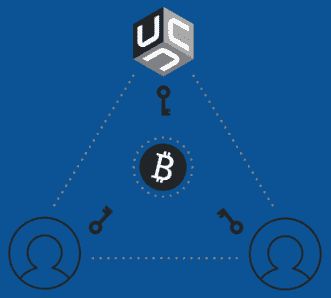

# 为未上锁的金库更改密钥时的地址验证

> 原文：<https://medium.com/coinmonks/address-verification-when-changing-keys-for-unchained-capital-vaults-268005e7563e?source=collection_archive---------1----------------------->

## 不要相信。验证。作者@ vicario sdrama 649093–649108

# 摘要

[Unchained Capital](https://unchained-capital.com/) 称自己是一家比特币本地金融服务公司，为[比特币](https://blog.coincodecap.com/a-candid-explanation-of-bitcoin)持有者提供合作托管多重签名金库和贷款。